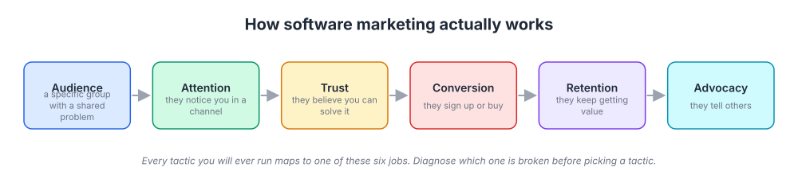
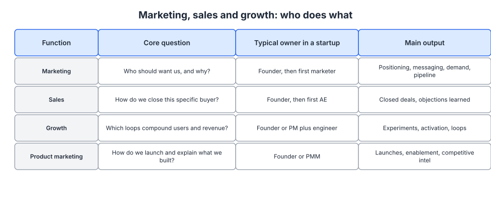
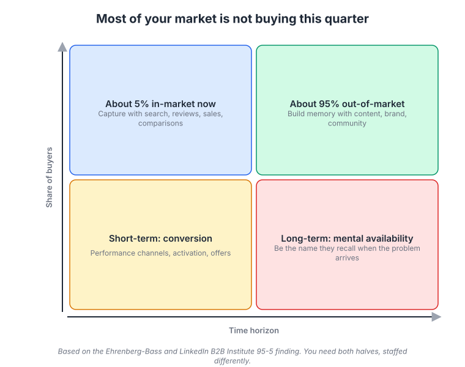

# Week 1: How marketing actually works for a software company

> By the end of this week you will be able to describe your marketing as a system with named stages, say which stage is broken today, and explain why the fix is rarely "more tactics."

**Time budget:** reading about 3 hours, videos about 2.5 hours, exercise 2 to 4 hours.

## What this week covers and why it matters for a founder

You built a platform. It works. Some people use it. And somewhere along the way you noticed that "marketing" has become a vague, slightly embarrassing word for "the part of the business I do not understand and keep postponing." This week replaces that vagueness with a mental model you can reason about the same way you reason about a system architecture.

Most technical founders make the same first mistake: they treat marketing as a bag of tactics. They try a launch on Hacker News, run a few ads, post on LinkedIn for three weeks, and conclude that "marketing does not work for us." What actually happened is that they ran disconnected experiments against a system they had never mapped, so they could not tell which part failed. A tactic that does nothing for a company with no positioning may work fine two months later once the positioning exists.

Marketing is the system that creates demand and captures it. Creating demand means making the right people aware of a problem and of your way of solving it, and building enough trust that they remember you when the moment comes. Capturing demand means being findable and convincing at the moment someone is ready to act. Both halves have stages, each stage has a measurable output, and each can break independently.

When founders get this right, three things change. They stop tactic hopping, because they can see which stage needs work. They stop obsessing over vanity metrics (followers, page views, sign-ups that never activate), because they know which numbers feed the next stage. And they start using the one advantage they have over any marketer they could hire: they hold the customer insight, and insight is the raw material for everything else in this program.

The concrete output of this week is a one-page diagnosis of where your marketing is broken today. You will fill in each stage of the system with what you actually know, mark which stages are unmeasured, and pick the single bottleneck to fix first. That page becomes the reference for everything else in the program.

## Core concepts

### 1. Marketing is a system with six stages

Here is the model you will use for the next 24 weeks. Marketing moves a specific group of people through six stages: audience, attention, trust, conversion, retention, and advocacy. Each stage has an input (people who reached it), an output (people who moved on), and a conversion rate between the two. If you have ever drawn a request pipeline with queues between services, you already know how to think about this.



*Follow the arrows left to right, then notice the loop back from advocacy to audience; that loop is what makes marketing compound instead of just costing money.*

Audience is the specific group of people who could plausibly buy. Not "developers" or "SMBs," but something like "engineering managers at 50 to 500 person companies who run their own infrastructure." Attention is the moment someone in that group notices you exist. Trust is the accumulation of reasons to believe you: content that taught them something, a colleague's recommendation, a well-written doc, a clear pricing page. Conversion is the action you wanted: a sign-up, a demo request, a paid plan. Retention is whether they keep getting value. Advocacy is when they tell someone else, which feeds the audience stage again.

The mechanism that matters most is the loop. Slack's early growth is the clearest example. Slack did very little conventional advertising in its first year; it launched in preview in 2013, and most new teams arrived because someone had used it at a previous company or a friend's startup. Product quality drove retention, retention drove advocacy, and advocacy filled the top of the system for free. Slack did run a memorable launch video ("So Yeah, We Tried Slack," made with Sandwich Video in 2014), but the video worked because the loop was already turning. Attention on a leaky system just produces churn faster.

The most common failure mode is spending money on attention when trust or retention is the broken stage. A founder buys ads, gets clicks, and watches sign-ups evaporate. The ads did not fail; the ads exposed a trust gap (the landing page did not explain who the product is for) or a retention gap (people signed up, did not reach value, and left). Fixing the wrong stage is the single most expensive mistake in early-stage marketing, and it is why the diagnosis exercise comes before any tactic in this program.

The stages are not equally expensive to fix. Audience definition is a document (week 3). Trust is mostly writing and product quality (weeks 4 to 8). Attention is where money goes (weeks 9 to 15). Start with the cheap stages.

### 2. Marketing, sales, growth, and product marketing are different jobs

Founders use these words interchangeably and then hire the wrong person or do the wrong work. They are different disciplines with different core questions, time horizons, and success metrics.



*Read the "core question" column first; if you cannot answer a function's core question for your company, that is where you are thin.*

Marketing asks: who should want this, and how do we make them aware and convinced at scale? It works on groups, not individuals, and its horizon is months to years. Sales asks: how do I move this specific account from interest to signed contract? It works one deal at a time, and its horizon is weeks to quarters. Growth asks: which measurable loop in the product or funnel can we tune to make the whole system move faster? It lives in data and experiments and has a horizon of weeks. Product marketing sits between product and market and asks: how do we describe what we built so the right people understand it? It owns positioning, messaging, launches, and sales enablement.

Stripe is a useful example of the boundaries. Stripe's early growth with developers came from what looks like product work (an API you could integrate in minutes) and documentation that read like a well-edited technical book. That was marketing in the sense that it created awareness and trust at scale among a specific audience, even though nobody would have called the docs team "marketers." Later, Stripe built a large sales organization for enterprise accounts, which is a different motion with a different cost structure. Both are needed, and they are not the same job.

The failure mode is hiring a "marketer" when you actually need one specific role. A demand generation marketer who is excellent at paid acquisition cannot fix your positioning. A product marketer cannot close enterprise deals. A growth person cannot create demand where none exists. In week 23 you will decide who to hire first, and this table is why the answer is not obvious.

At your stage, you probably do all four jobs yourself. That is fine. Naming them lets you notice which hat you are wearing and judge your work against the right standard.

### 3. The 95-5 rule: most of your market is not buying this quarter

Research from the Ehrenberg-Bass Institute, published with the LinkedIn B2B Institute, argues that at any given time roughly 95 percent of business buyers in a category are not in the market for a purchase. Only around 5 percent are actively looking. The exact ratio varies by category (companies replace laptops more often than they replace an ERP), but the structural point holds: the people you can convert this quarter are a small slice of the people who will eventually buy.



*Notice that the two groups need different marketing: capture tactics for the small slice, memory-building for the large one.*

This changes what marketing has to do. For the 5 percent, you need capture: search visibility for the queries they type, review site presence, a clear pricing page, comparison content, and fast sales follow-up. These pay off in weeks. For the 95 percent, you need memory: they should have heard of you, associated you with a specific problem, and formed a mild positive impression, so that when their trigger event arrives (a new hire, a failed audit, a tool that broke, a budget cycle), you are on the shortlist they assemble in their heads before they ever search.

HubSpot is the best software example of the memory half. In 2006 the founders coined the term "inbound marketing" and spent years publishing content, running a free website grader tool, and teaching a methodology before most of their audience needed marketing automation. When those small businesses finally decided to buy, HubSpot was already the name they associated with the category it had named. Naming a category is an advanced move (you will see it again in week 4), but the underlying mechanism is available to everyone: teach the 95 percent something useful, repeatedly, and be remembered.

The failure mode is running a business entirely on capture. It feels efficient because every dollar is measurable. Then the in-market slice is exhausted, costs per acquisition climb, and the founder concludes the market is small. The market was never small; the founder was only fishing in the 5 percent. The opposite failure exists too: thoughtful content for years with no capture mechanism, so the demand it creates gets picked up by a competitor with a better pricing page. You need both. Early on, capture gets you your first customers; then memory-building makes next year cheaper than this one.

### 4. Diffusion of innovations: early customers behave differently from the mainstream

Everett Rogers's diffusion of innovations research, and Geoffrey Moore's software-specific extension in Crossing the Chasm, describe how a new technology spreads through a population. Adopters are not uniform. Innovators and early adopters buy because something is new and gives them an edge. The early majority buys because it is proven and their peers use it. The late majority buys when not buying becomes the risk. Laggards buy when the old way is unavailable.


*The bell curve shows who adopts when; the S-curve shows cumulative share, and its steep middle is the part every founder is trying to reach. Source: [Wikimedia Commons](https://commons.wikimedia.org/wiki/File:Diffusion_of_ideas.svg)*

The practical consequence for your platform: the customers you have now are almost certainly early adopters, and they will forgive things the mainstream never will. They tolerate rough onboarding, sparse docs, and missing integrations because they want the capability and enjoy being first. If you build your marketing around what they tell you, you will describe your product in terms of novelty and capability, and the early majority will read that and hear "risk."


*The gap between early adopters and the early majority is Moore's chasm; companies fall in when they keep selling novelty to people who want proof. Source: [Wikimedia Commons](https://commons.wikimedia.org/wiki/File:Technology-Adoption-Lifecycle.png)*

Dropbox's early history shows both sides of this. In 2008 Drew Houston posted a screencast demo to Hacker News and Digg showing the product syncing files, full of inside jokes for a technical audience. The waiting list jumped from a few thousand to tens of thousands overnight. That was pure early-adopter marketing: show the capability to people who could appreciate it. The later referral program (free storage for both the referrer and the invited friend) worked on a broader audience because it did not require anyone to appreciate the technology; it required a friend's recommendation and a simple reward. Different adopter groups, different mechanisms.

The failure mode is assuming your early adopters are a representative sample of the market. They are not. They are a biased sample of the most tolerant and most curious buyers. Week 3 will make you write down explicitly which group you are targeting, and week 4 will make you position for them. For now, just notice which group your current customers belong to and be honest about it.

### 5. Founders are the best first marketers, and the traps that catch them

Nobody understands why your product exists better than you do. You have the customer conversations, the original insight, and the credibility that comes from having built the thing. Every good early-stage marketing story is a founder story: Patrick and John Collison talking to developers one at a time in the early days of Stripe, Brian Chesky and Joe Gebbia flying to New York to photograph Airbnb hosts' apartments, Drew Houston recording that Dropbox demo himself. Paul Graham's essay "Do Things That Don't Scale" is on this week's reading list because it is the clearest description of why founder-led marketing works: at the start, the manual, unscalable, deeply personal version of marketing is the only kind that produces real insight.

Three traps catch technical founders specifically.

Building before positioning. You add features because customers asked, and each feature makes the product harder to describe. A year in, the homepage lists eleven capabilities and no one can say what the product is for. The fix is to decide who it is for and what it replaces before deciding what to build next. Weeks 3 and 4 exist for this.

Tactic hopping. A founder reads that a competitor grew through SEO, tries it for a month, sees nothing, and switches to LinkedIn ads. Then to a podcast. Then to cold email. Each attempt is too short to reach the point where the channel could work, and none of them are measured against the same baseline. Channels take months, not weeks, and most companies get exactly one channel to work well at a time (week 9). Pick, commit, measure.

Vanity metrics. Sign-ups, page views, followers, and newsletter subscribers are all easy to grow and easy to mistake for progress. The metric that matters at each stage is the one that feeds the next stage: sign-ups that activate, readers who return, subscribers who click. If a number is going up and revenue is not, the number is decorating your dashboard rather than informing it.

The mechanism behind all three traps is the same: marketing feels uncomfortable, so the founder reaches for something that feels like progress. Shipping features feels productive. Trying a new channel feels decisive. Watching a number climb feels reassuring. The work that actually moves the system (choosing an audience, writing a positioning statement, sitting through five customer interviews) feels slow. This program makes you do that slow work first, in weeks 2 to 4, so that every tactic afterwards has something to stand on.

One opinion to end on: the founders who become good marketers are the ones who treat it as an engineering problem with unusual constraints (humans are noisy, feedback loops are slow, and A/B tests need traffic you do not have yet) rather than as a dark art. You already have the habits. You just need the map.

## Videos

- [Steve Jobs, 1997 internal talk on marketing and values ("Think Different" launch)](https://www.youtube.com/watch?v=keCwRdbwNQY)
  Why watch: about 7 minutes; Jobs explains that marketing is about values and clarity of who you are, not listing features, and this framing will return in weeks 4 and 7.
- [How to Succeed with a Startup, Sam Altman (Y Combinator, 2018)](https://www.youtube.com/watch?v=0lJKucu6HJc)
  Why watch: about 20 minutes; a compact list of what actually separates startups that work, including the point that products people love spread by word of mouth, which is the advocacy loop from concept 1.
- [Lecture 6: Growth, Alex Schultz (Stanford CS183B, 2014)](https://www.youtube.com/watch?v=n_yHZ_vKjno)
  Why watch: about 50 minutes; Schultz ran growth at Facebook and argues retention is the only thing that matters before you spend on acquisition, which is the strongest argument you will hear for diagnosing before buying attention.
- [How to get your ideas to spread, Seth Godin (TED, 2003)](https://www.ted.com/talks/seth_godin_how_to_get_your_ideas_to_spread)
  Why watch: about 17 minutes; Godin's argument that remarkable products spread through early adopters, which maps directly onto the diffusion curve in concept 4.
- [The single biggest reason why start-ups succeed, Bill Gross (TED, 2015)](https://www.ted.com/talks/bill_gross_the_single_biggest_reason_why_start_ups_succeed)
  Why watch: about 6 minutes; Gross's data on timing is a reminder that market readiness (where the adoption curve is) often matters more than any tactic you pick.

## Recommended reading

- [Do Things That Don't Scale, Paul Graham (paulgraham.com)](https://paulgraham.com/ds.html). What to take from it: the earliest marketing is manual recruitment of users one at a time, and that is a feature, because it produces insight you cannot get any other way.
- [Startup = Growth, Paul Graham (paulgraham.com)](https://paulgraham.com/growth.html). What to take from it: growth rate is the metric that defines a startup, so every marketing decision should be evaluated on whether it changes the rate, not the absolute numbers.
- [Marketing Myopia, Theodore Levitt (HBR)](https://hbr.org/2004/07/marketing-myopia). What to take from it: companies fail when they define themselves by their product instead of by the customer need they serve; ask what business your platform is really in.
- [Marketing Is Everything, Regis McKenna (HBR)](https://hbr.org/1991/01/marketing-is-everything). What to take from it: written in 1991 and still accurate, McKenna argues marketing is not a department but the whole company's relationship with customers, which is why founders cannot delegate it early.
- [The only thing that matters, Marc Andreessen (pmarchive)](https://pmarchive.com/guide_to_startups_part4.html). What to take from it: the definition of product/market fit, and the argument that before you have it, marketing mostly cannot help and after you have it, marketing is the main lever.
- [LinkedIn B2B Institute](https://business.linkedin.com/marketing-solutions/b2b-institute). What to take from it: browse the research on the 95-5 rule and on why B2B brands need to be remembered by buyers who are not currently buying.
- [Ehrenberg-Bass Institute](https://www.marketingscience.info/). What to take from it: skim the summaries of How Brands Grow research; the ideas of mental availability and physical availability will return in week 7.

## Hands-on exercise (2 to 4 hours)

**Deliverable:** a one-page marketing diagnosis saved in your company wiki, with one bottleneck stage named and one sentence on what you will do about it.

**Steps:**
1. (15 minutes) Write down, in one sentence, who your product is for today. Not who you hope will buy it, but who actually pays or uses it. If you cannot do it in one sentence, write the two or three sentences it takes and note that as a finding.
2. (30 minutes) For each of the six stages (audience, attention, trust, conversion, retention, advocacy), write what you currently do at that stage. "Nothing" is an acceptable and useful answer.
3. (30 minutes) For each stage, write what you measure. Pull the real number if you have it (monthly visitors, sign-ups, activated accounts, 90-day retention, referral sign-ups). Mark stages where you have no number as "unmeasured."
4. (30 minutes) Look at the last 10 customers who paid you. For each, write how they first heard of you, as best you know. Group the answers. This is your first, rough attribution picture.
5. (20 minutes) Look at the last 10 people who signed up and never came back, or churned. Write your best guess at why. If you have no idea, that is your finding for the retention stage.
6. (20 minutes) Decide which adopter group your current customers belong to (innovators, early adopters, early majority). Write one sentence on how that group differs from the group you need next.
7. (20 minutes) Pick the one stage where a fix would most change your growth rate. Apply this rule: the earliest stage that is both broken and measurable. Write one sentence on what fixing it would look like.
8. (15 minutes) Write down the three tactics you have tried and abandoned in the last year, and which stage each one was supposed to fix. This is your tactic-hopping record; keep it honest.

**Template:**

```
MARKETING DIAGNOSIS, <company>, <date>

Who it is for today (one sentence):

Stage        | What we do today          | What we measure     | Number   | Status
-------------|---------------------------|---------------------|----------|-----------
Audience     |                           |                     |          |
Attention    |                           |                     |          |
Trust        |                           |                     |          |
Conversion   |                           |                     |          |
Retention    |                           |                     |          |
Advocacy     |                           |                     |          |

Last 10 paying customers, how they found us:
- 
Last 10 lost sign-ups or churned accounts, best guess why:
- 
Adopter group of current customers:
Tactics tried and abandoned (tactic, stage it targeted, how long we ran it):
- 
BOTTLENECK STAGE:
What fixing it looks like (one sentence):
```

**How to know it is good:**
- Every stage has an entry, including honest "nothing" and "unmeasured" entries.
- The "who it is for" sentence names a role or a company type, not a market or an industry.
- The bottleneck is a single stage, chosen with a reason, and it is not "attention" unless trust, conversion, and retention are genuinely healthy.
- At least half of the numbers came from real data rather than memory.
- Someone else on your team could read the page and agree with the bottleneck without a conversation.

## Self-check

Answer these without looking back. If you cannot, reread the relevant section.

1. Name the six stages of the marketing system in order and say what the loop from the last stage back to the first represents.
2. A founder is spending on ads, getting clicks, and seeing sign-ups vanish within a week. Which stage is most likely broken and why are the ads not the problem?
3. What is the core question of product marketing, and how does it differ from the core question of sales?
4. Explain the 95-5 rule in your own words, and name one tactic for the 5 percent and one for the 95 percent.
5. Why did HubSpot's early content strategy pay off years later, in terms of the two halves of marketing?
6. Why are your current customers a biased sample of the market? What do they tolerate that the early majority will not?
7. Which of the three founder traps (building before positioning, tactic hopping, vanity metrics) have you fallen into most recently? What did it feel like at the time?
8. Dropbox's demo video and its referral program worked on different adopter groups. Explain the difference in mechanism.
9. What is the rule this week gave you for choosing a bottleneck stage?

**You are done with this week when:**
- [ ] Your one-page diagnosis exists in your wiki with all six stages filled in.
- [ ] You have named one bottleneck stage and one sentence on what fixing it looks like.
- [ ] You have watched at least three of the videos and read the Paul Graham and Andreessen pieces.
- [ ] You can explain the 95-5 rule and the diffusion curve to a cofounder without notes.

## Next week

You now have a map and a suspected bottleneck. Next week you go to the source: how to interview customers so they tell you the truth, how to think in jobs to be done, and how to listen at scale through support tickets, reviews, and search queries.
