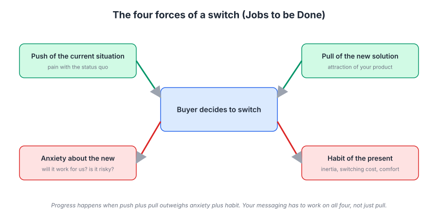
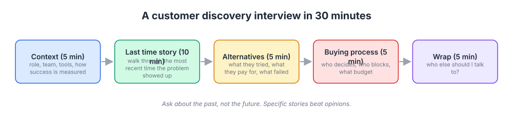
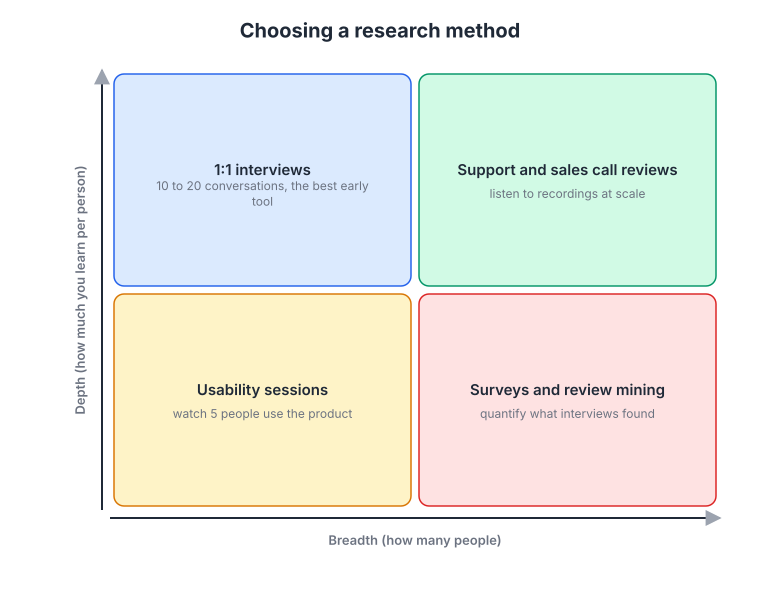

# Week 2: Customer research: interviews, jobs to be done, and listening at scale

> By the end of this week you will be able to run a 30-minute customer interview that produces usable insight, explain a purchase as a set of forces rather than a feature checklist, and mine the conversations you already have for patterns.

**Time budget:** reading about 3 hours, videos about 2.5 hours, exercise 3 to 4 hours (the interviews themselves take most of it).

## What this week covers and why it matters for a founder

Last week you diagnosed where your marketing system is broken. Whatever stage you picked, the fix starts with the same raw material: an accurate picture of why people buy, why they do not, and what they were doing before they found you. You cannot write positioning, choose a segment, or pick a channel without it. Most founders think they already have this picture. Almost none of them do, because the picture they have was built from the conversations they remember, which are the enthusiastic ones.

The mistake technical founders make here is subtle. They do talk to customers. But they ask questions that invite polite lies ("Would you use this?"), they talk mostly to fans, and they listen for validation of what they already built. The result is a set of confident beliefs that happen to be wrong, and a roadmap that grows features nobody switches for.

The alternative is a small set of disciplined habits. Ask about the past, not the future. Treat every purchase as a switch from something (even if that something is a spreadsheet or doing nothing), and find the forces that pushed and pulled them. Then check what a handful of interviews told you against the thousands of signals you already have in support tickets, sales recordings, review sites, and search queries.

When this works, the change is visible in your language. You stop describing your product with the words you invented and start using the words customers use for their problem. Your homepage gets clearer, your sales conversations get shorter, and your roadmap starts to reflect what people would switch for.

The outputs of this week are five completed customer interviews and a one-page insight summary. That summary feeds directly into week 3 (who to target) and week 4 (how to position), so do the interviews; reading about them is not the exercise.

## Core concepts

### 1. The Mom Test: how to ask questions that even your mother cannot lie to you about

Rob Fitzpatrick's book The Mom Test gets its name from a simple observation: if you ask your mother whether your business idea is good, she will say yes, and so will most people you talk to. People are polite. And when you ask about the future ("Would you pay for this?"), they answer with a story about the person they would like to be, not the person who makes purchasing decisions.

The three rules are short. Talk about their life instead of your idea. Ask about specifics in the past instead of generics or opinions about the future. Talk less and listen more. Every question in your interview script should pass all three.

A concrete before and after. Bad: "Would you use a tool that automatically flags failing deployments?" Good: "Tell me about the last time a deployment failed. How did you find out? What did you do next? What did that cost you?" The first gets a "sure, that sounds useful." The second gets a story with a timeline, the tools involved, the people who got paged, and the emotional temperature of the incident. Only the second is data.

The mechanism is that people are reliable narrators of what they did and unreliable predictors of what they will do. Fitzpatrick also points out the trap of compliments: "that's a great idea" is not a signal. The signals that count are commitments: they introduce you to a colleague, agree to a follow-up with real data, or ask when they can get access. If an interview ends with only compliments, it failed, however pleasant it was.

Superhuman built its product-market fit process on disciplined questions. Rahul Vohra's team surveyed users with a single question borrowed from Sean Ellis ("How would you feel if you could no longer use Superhuman?") and treated the percentage answering "very disappointed" as the score to move. It started around 22 percent; they segmented the "very disappointed" users, studied what they loved, and built for that group until the score passed 40 percent. The lesson is that they asked about a concrete counterfactual (losing the product) rather than a hypothetical (would you like this feature).

The failure mode is pitching. Founders cannot help it. Two minutes in, they are explaining the product, and from that moment on every answer is contaminated by politeness. Hold the pitch until the last five minutes, and treat anything said after the pitch as separate, lower-quality data.

### 2. Jobs to be done: people hire products to make progress

The jobs to be done (JTBD) idea, developed by Clayton Christensen, Bob Moesta, and others, reframes the question from "what do customers want" to "what progress is the customer trying to make in a particular situation." People do not buy a quarter-inch drill because they want a drill; they want a quarter-inch hole, and beyond that they want the shelf to stay up so they stop thinking about it.

The famous example is the milkshake study. A fast food chain wanted to sell more milkshakes and tried improving the milkshakes. Nothing worked. Then researchers watched who was buying and found that a large share of shakes sold early in the morning to solo commuters who wanted something to keep them occupied and full during a boring drive. The competition was not other milkshakes; it was bananas, bagels, and boredom. Once you see the job, the improvements and the marketing are obvious.

A job has three dimensions. Functional: the task itself, such as getting a report to a client by Friday. Emotional: how the person wants to feel, such as confident that the numbers are right. Social: how they want to be seen, such as the person on the team who has things under control. Most software marketing speaks only to the functional dimension, which is why so much of it sounds the same. The emotional and social dimensions are where the words that make people switch come from.

Intercom is the software company most associated with JTBD in practice. Its product and marketing teams worked with Bob Moesta and rebuilt how they described and built features around the jobs customers were hiring the product for, and published a free book on it (on this week's reading list). The visible result was product marketing that talked about what customers were trying to do (talk to visitors, onboard users, support them) rather than about "messaging platform features."

The failure mode with JTBD is turning it into a slogan. "Our customers hire us to grow their business" is a platitude, not a job. A usable job is specific enough that you could design an interview around it and recognize it in a support ticket. If it would fit any product in your category, it is not done yet.

### 3. The four forces of a switch

Every purchase is a switch, from something to something. Even "we did nothing before" is a switch from the status quo of doing nothing. Bob Moesta's four forces model describes what has to happen for a switch to occur, and it is the most practical tool this week for turning interview stories into marketing.



*Two forces push toward switching and two hold the buyer in place; your marketing has to raise the first pair and lower the second, and most founders only work on the pull.*

The push is what is wrong with the current situation: the spreadsheet broke again, the audit failed, the on-call engineer quit. The pull is the appeal of the new solution: the demo they saw, the colleague who raved about it, the outcome they imagine. The anxiety is the worry about the new solution: will migration take a month, will my team adopt it, what if it goes down. The habit is the inertia of the present: we know how the old thing works, our processes are built around it, the pain is familiar.

A switch happens when push plus pull is greater than anxiety plus habit. That sounds obvious until you notice that most product marketing only works on the pull. Homepages list capabilities. Ads promise outcomes. Meanwhile, the buyer's anxieties (data migration, security review, retraining a team) and habits (the old tool is integrated with everything) sit untouched, and the deal stalls. Some of the most effective marketing you will ever do is anxiety reduction: migration guides, security pages, "import from" features, onboarding calls, and case studies from companies that look like the buyer.

Basecamp learned this by listening. The founders have described for years how the whole team took turns answering support, and how the questions people asked shaped both the product and the way it was explained. When you read support tickets every week, you learn the anxieties directly: what confuses people on day one, what they fear losing, what they compare you to.

The failure mode is interviewing for the pull only. If your interview script asks what people like about your product, you will hear about the pull and nothing else. Ask instead: what was happening the day you decided to look for something new? What almost stopped you from switching? What did you have to give up? Those questions surface push, anxiety, and habit, which is where the rest of your marketing has been missing.

### 4. Running a 30-minute interview that produces data

An interview is a structured conversation with a script you mostly ignore. The script exists so you cover the ground; the discipline is following the interesting thread when it appears and then returning.



*Five blocks with time boxes; the middle three blocks are where the insight is, so protect them from your own pitch.*

Context (5 minutes). Role, team, what tools they use, how their week works. Easy questions that warm them up.

The last time (8 minutes). "Tell me about the last time you [did the task your product addresses]." Then "what happened next" until the story is finished. Ask for specifics: which tool, who was involved, how long it took, what went wrong.

The switch story (8 minutes). If they use your product or a competitor's: "Walk me through how you ended up using it. What were you using before? What happened that made you look?" You are listening for the trigger event, the alternatives they considered, and the moment of decision.

Forces (6 minutes). Probe the four forces explicitly. "What almost stopped you?" "What did you worry about?" "What did you give up?" "What was good about the old way?"

Wrap-up (3 minutes). "Who else should I talk to?" "What should I have asked?" Only then, if it fits, a brief mention of what you are working on.

Where to find interviewees: recent sign-ups who did not activate (underrepresented in every founder's mental model), churned customers, people who chose a competitor, and members of communities where your ICP hangs out. Many people will talk for 30 minutes if you ask specifically and explain that you want to understand their work rather than sell.

Record with permission, or bring a note-taker. Write up within an hour while it is fresh. Five interviews is enough to see the first patterns. Ten to twenty is enough to be fairly confident about the main ones.

The failure mode is the interview that turns into a demo. The other is interviewing only happy customers. Airbnb's founders provide a counterexample: in 2009, Brian Chesky and Joe Gebbia went to New York and stayed with hosts, saw the listings and the problems first-hand, and came back with the insight that professional photographs would change bookings. They went and looked at the struggling hosts, not the enthusiastic ones.

### 5. Listening at scale: the research you already have

Interviews are deep and slow. You also need something wide and fast, and you already have it: every company with more than a few dozen users is sitting on more unread customer research than it could process in a year.



*Interviews are deep and narrow; the other methods are wide and shallow; the point is to use both and check one against the other.*

Support tickets. Read the last 100. Tag each with the job, the anxiety, and the words the customer used. The same ten problems will account for most of the volume, and the words customers use for them are not the words on your website.

Sales calls. If you record calls (with consent), listen to the first ten minutes of the last twenty. That is where prospects explain their situation in their own words. Gong built a business on the observation that sales conversations contain patterns nobody was listening for; you do not need the tool to apply the idea.

Review mining. G2 and Capterra reviews of your competitors are a free, structured view of a market's four forces. Read the two-star and four-star reviews first; five-star reviews are vague, and one-star reviews are often about billing. Reddit threads and Hacker News comments about your category are less structured but far more candid.

Search queries. What people type into a search engine when they have the problem is the purest expression of a job in the wild. "Alternative to X" and "X vs Y" queries tell you what people are switching from (week 11 covers the tooling).

Surveys. Useful for measuring how common something is once interviews have told you what to ask about. Useless for discovering what to ask about.

The failure mode is treating scale data as a substitute for interviews. Tickets tell you what broke, not what job the customer was trying to do. Interviews are how you learn the story; the scale data is how you find out how common the story is.

### 6. Synthesis: from a pile of quotes to a one-page insight summary

Synthesis turns 5 interviews and 100 tickets into something a cofounder can act on.

Tagging. As you write up each interview, tag every notable quote with a small controlled vocabulary: trigger, push, pull, anxiety, habit, job (functional), job (emotional), job (social), alternative, language. A spreadsheet is fine. The value is in the constraint; you cannot tag a quote as "anxiety" without deciding it is one.

Affinity mapping. Put every tagged quote on a card and group cards that seem to be about the same thing. Do not name the groups first; let them form, then name them. You will typically end up with 6 to 12 clusters, and the biggest three are your story.

Switch stories. Lay every switch story side by side: trigger, alternatives considered, deciding factor, main anxiety. If four of five switchers had the same trigger event, you have found something that belongs in week 3 (trigger events as a segmentation dimension) and in week 5 (messaging).

Kano prioritization. Once you have the clusters, you need to decide what to build and what to say. The Kano model sorts attributes into three types: must-haves (their absence causes dissatisfaction, their presence is barely noticed), performance attributes (more is better and customers will pay for it), and delighters (unexpected, cause disproportionate satisfaction). Over time, delighters decay into performance attributes and then must-haves.


*Note the arrow of time: today's delighter becomes tomorrow's expectation, which is why you should never build your marketing around a must-have. Source: [Wikimedia Commons](https://commons.wikimedia.org/wiki/File:Kano_model_showing_transition_over_time.png)*

For marketing, the Kano distinction is decisive. Never lead your homepage with a must-have; nobody switches for something every competitor has. Lead with the performance attribute your ICP cares about most, and mention the delighter as the thing people will tell their friends about. Must-haves belong on the feature page and in the security section, where they reduce anxiety.

The failure mode of synthesis is confirmation. Two defenses: have someone who did not run the interviews do the clustering, and write down your prediction of the main clusters before you start, so you can see afterwards how wrong you were.

## Videos

- [How to Talk to Users, Eric Migicovsky (Y Combinator Startup School)](https://www.youtube.com/results?search_query=y+combinator+how+to+talk+to+users+eric+migicovsky) (YouTube search)
  Why watch: about 30 minutes; the founder of Pebble walks through the Mom Test rules with concrete bad and good questions, and covers how to find interviewees.
- [The Jobs to be Done Theory (milkshake story), Clayton Christensen](https://www.youtube.com/results?search_query=clayton+christensen+jobs+to+be+done+milkshake) (YouTube search)
  Why watch: about 5 to 10 minutes depending on the version you pick; the milkshake story told by the person who made it famous, and the shortest possible explanation of why "who is the competition" is the wrong question.
- [Jobs to be Done, Des Traynor (Business of Software)](https://www.youtube.com/results?search_query=des+traynor+jobs+to+be+done+business+of+software) (YouTube search)
  Why watch: about 40 minutes; Intercom's cofounder explains how JTBD changed what they built and how they talked about it, with software examples.
- [Jobs to be Done interview technique, Bob Moesta](https://www.youtube.com/results?search_query=bob+moesta+jobs+to+be+done+interview) (YouTube search)
  Why watch: variable length; Moesta demonstrates the switch interview, including how he pulls a timeline out of a customer, which is the skill you are practicing in the exercise.
- [Choice, happiness and spaghetti sauce, Malcolm Gladwell (TED, 2004)](https://www.ted.com/talks/malcolm_gladwell_choice_happiness_and_spaghetti_sauce)
  Why watch: about 17 minutes; the Howard Moskowitz story about why asking people what they want fails and observing what they choose works.

## Recommended reading

- Book: The Mom Test, Rob Fitzpatrick, chapters 1 to 4 ([author site](https://www.momtestbook.com/)). What to take from it: the three rules, the list of bad questions with their fixes, and the section on commitments versus compliments.
- [Know Your Customers' Jobs to Be Done, Christensen, Hall, Dillon, Duncan (HBR)](https://hbr.org/2016/09/know-your-customers-jobs-to-be-done). What to take from it: the definition of a job, the functional, emotional, and social dimensions, and the examples of companies that redesigned around a job.
- [Finding the Right Job for Your Product, Christensen et al. (MIT Sloan Management Review)](https://sloanreview.mit.edu/article/finding-the-right-job-for-your-product/). What to take from it: the longer version of the milkshake study and the argument that job-based segmentation beats demographic segmentation.
- [Replacing The User Story With The Job Story, Alan Klement (JTBD.info)](https://jtbd.info/replacing-the-user-story-with-the-job-story-af7cdee10c27). What to take from it: the "when, I want to, so I can" format, which you will use to write the jobs in your insight summary.
- [Intercom on Jobs-to-be-Done, Intercom (free book)](https://www.intercom.com/resources/books/intercom-on-jobs-to-be-done). What to take from it: how a software company actually applied JTBD to product and marketing, including their switch interview approach.
- [How Superhuman Built an Engine to Find Product Market Fit, Rahul Vohra (First Round Review)](https://review.firstround.com/how-superhuman-built-an-engine-to-find-product-market-fit). What to take from it: the survey question, the segmentation of "very disappointed" users, and the discipline of building for the people who already love you.
- [Marketing Malpractice: The Cause and the Cure, Christensen, Cook, Hall (HBR)](https://hbr.org/2005/12/marketing-malpractice-the-cause-and-the-cure). What to take from it: the case that segmenting by product category or customer demographics leads to products nobody hires, and what to do instead.

## Hands-on exercise (2 to 4 hours)

**Deliverable:** five completed customer interviews (notes or recordings) and a one-page insight summary saved in your company wiki.

**Steps:**
1. (20 minutes) Write your interview script using the five-block structure. Check every question against the three Mom Test rules. Remove any question that starts with "would you."
2. (30 minutes) Build a list of 15 candidate interviewees: at least 3 recent sign-ups who did not activate, 2 churned or lost deals, and the rest current customers or people in your ICP's communities. Send short, specific requests. Expect a third to say yes.
3. (5 × 30 minutes, spread over the week) Run the five interviews. Record with permission or bring a note-taker. Do not demo until the last three minutes, if at all.
4. (5 × 15 minutes) Write up each interview within an hour of finishing. Tag every notable quote with the vocabulary from concept 6.
5. (45 minutes) Read the last 50 support tickets or sales call openings. Tag them the same way. Note the exact words customers use for the main problems.
6. (30 minutes) Affinity map all tagged quotes. Name the clusters. Identify the three biggest.
7. (30 minutes) Write the insight summary using the template. Include at least one job story, the most common trigger event, the main anxiety, and five verbatim phrases customers used.
8. (15 minutes) Compare the summary to the prediction you wrote before the interviews. Note what surprised you; that is the most valuable line on the page.

**Template:**

```
INSIGHT SUMMARY, <company>, <date>
Interviews: 5 (list role and company type for each)
Scale sources: <n> tickets, <n> calls, <n> reviews

MAIN JOB (job story format):
When <situation>, I want to <motivation>, so I can <outcome>.
Emotional dimension:
Social dimension:

TRIGGER EVENTS (what was happening when they started looking):
1.
2.

FOUR FORCES (most common in each):
Push:
Pull:
Anxiety:
Habit:

ALTERNATIVES CONSIDERED (including "do nothing"):

CUSTOMER LANGUAGE (verbatim, five phrases):
- "..."

KANO SORT of our top attributes:
Must-have:
Performance:
Delighter:

WHAT SURPRISED US:

WHAT THIS CHANGES (for week 3 ICP and week 4 positioning):
```

**How to know it is good:**
- At least two of the five interviews were with non-fans (churned, lost, or never activated).
- Every quote in the customer language section is verbatim, not paraphrased.
- The main job would not fit a competitor's product word for word.
- The four forces section has something under anxiety and habit, not just push and pull.
- A cofounder reading the "what surprised us" line learns something they did not know.

## Self-check

Answer these without looking back. If you cannot, reread the relevant section.

1. State the three Mom Test rules and rewrite this question to pass them: "Do you think you would use a tool that alerts you when a deployment fails?"
2. What is the difference between a compliment and a commitment at the end of an interview, and why does only one count?
3. Name the four forces and give one example of a marketing asset that works on each.
4. What are the three dimensions of a job, and which one does most software marketing ignore?
5. Why do the two-star and four-star reviews of a competitor tell you more than the five-star ones?
6. A customer says "we needed better reporting." Write the follow-up questions that turn that into a switch story with a trigger event.
7. Explain the Kano model's three attribute types and why you should never lead a homepage with a must-have.
8. Name two defenses against confirmation bias during synthesis.

**You are done with this week when:**
- [ ] Five interviews are done and written up with tagged quotes.
- [ ] You have read at least 50 tickets, calls, or reviews and tagged them.
- [ ] The one-page insight summary is in your wiki with a job story, trigger events, four forces, and verbatim language.
- [ ] You have written down what surprised you.

## Next week

You now know why people switch and in what words they describe it. Next week you use that to decide who to win first: segmentation dimensions for software, an ICP scorecard, the beachhead strategy, and a target list of 50 accounts or communities.
