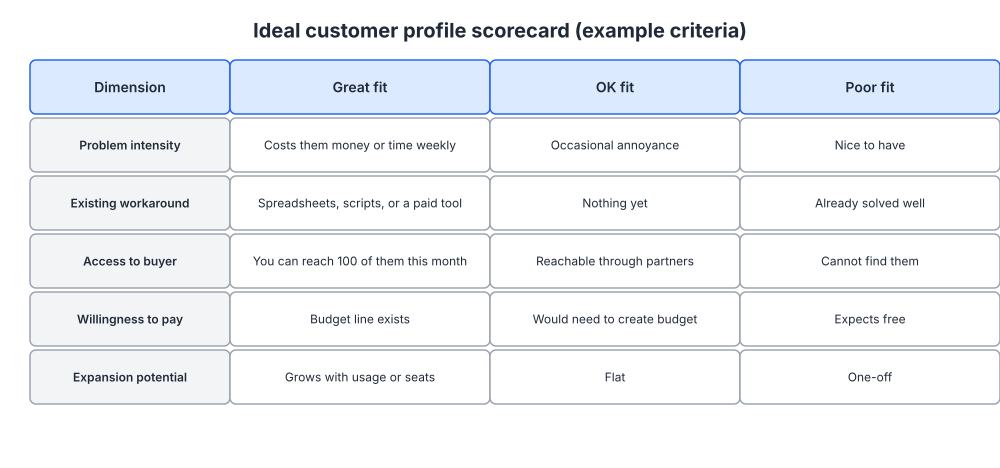
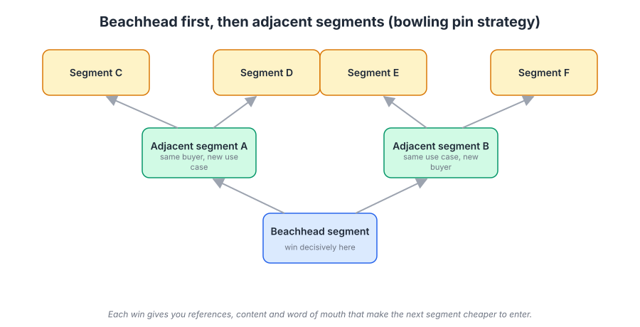
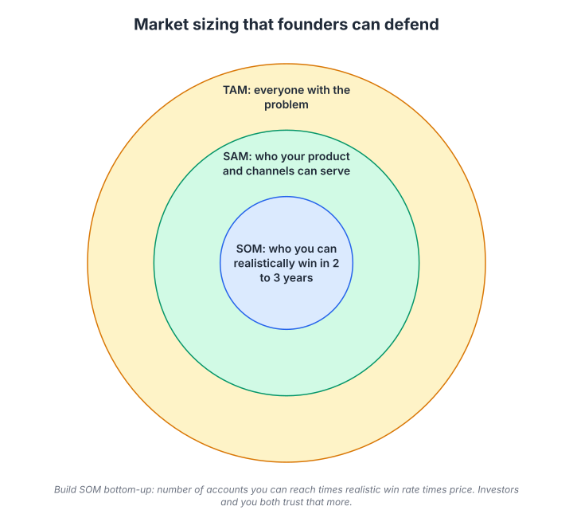

# Week 3: Segmentation and the ideal customer profile

> By the end of this week you will be able to name the one segment you are going to win first, score any prospect against a written ICP in under a minute, and defend a bottom-up market size to an investor or a skeptical cofounder.

**Time budget:** reading about 3.5 hours, videos about 2 hours, exercise 3 to 4 hours.

## What this week covers and why it matters for a founder

You have a diagnosis (week 1) and a pile of customer insight (week 2). Now comes the decision most founders avoid: who, specifically, are you going to win first? Not who could use the product. Who you will spend the next two quarters pursuing to the exclusion of everyone else.

Founders resist this for an understandable reason. A platform, by design, serves many kinds of users, and narrowing feels like giving up on most of them. But with a tiny budget and a handful of people, you cannot be even slightly known to a broad market. You can be the obvious choice for a narrow one. Every hour of marketing works harder when it lands on people who share a problem, a vocabulary, and a set of watering holes, because word of mouth only travels inside groups that talk to each other.

The mistake is not just "targeting too broadly." It is targeting by a category that does not predict buying. "SMBs" is not a segment; a two-person agency and a 400-person logistics firm share nothing that matters. A segment is a group of people who have the same job (week 2), hit the same trigger events, hang out in the same places, and would recognize each other's problems. Defined that way, your positioning writes itself, your channels become obvious, and your roadmap stops sprawling.

What changes when founders get this right is speed. Sales cycles shorten because you are talking to people who already have the problem. Content gets easier because you know who you are writing for. Referrals start, because your customers know other people like themselves. And you get a clear rule for what to say no to.

The outputs of this week are a written ICP with scoring criteria, and a list of 50 target accounts or communities you will go after first. Both feed directly into week 4, where you position for exactly that group.

## Core concepts

### 1. Choosing is the strategy

Michael Porter's line that strategy is about what you choose not to do applies to marketing more than anywhere. The whole point of segmentation is to make a choice, and the whole difficulty is that every choice feels like a loss.

The mechanism that makes narrowness work is concentration. Word of mouth requires density: enough customers in one connected group that they start hearing about you from each other. If you win 30 customers spread evenly across 30 industries, no one in any industry has heard of you. If you win 30 customers in one industry with 500 companies in it, you are a known name in that industry and the next 30 are far cheaper. Facebook launched in February 2004 to Harvard students only, then expanded to other universities one at a time. At each school it reached a large share of students within weeks, because everyone there knew someone already on it. Opening to everyone on day one would have produced a sparse, dead network.

The software examples follow the same shape. Slack's earliest customers were tech companies and startups, often ones the founders knew, and those teams talked to each other. Figma's early adoption was concentrated in design teams at technology companies, where multiplayer editing solved a daily pain and designers moved between employers and brought the tool with them. Stripe started with developers at startups (many of them Y Combinator companies), who could integrate an API in an afternoon and told other developers. Snowflake targeted data teams that had already committed to the cloud rather than trying to move on-premise warehouse owners. Shopify began as a snowboard store's own e-commerce software and grew by serving other small merchants who wanted to sell online without hiring a developer.

None of these companies stayed narrow. All of them started narrow. The failure mode is confusing the starting point with the ceiling. You are not choosing your total market; you are choosing your first market. A good first market is small enough to dominate, reachable with what you have, and connected to the next market you want.

### 2. Segmentation dimensions for software

You can slice a market many ways. Here are the five slices that predict buying behavior for software.

Firmographic. Company size, industry, geography, funding stage, growth rate. Easy to find, easy to filter in any prospecting tool, and weakly predictive on their own. A 200-person fintech and a 200-person manufacturer buy very different things.

Technographic. What tools they already use. This is unusually powerful for software because it reveals both the job and the sophistication of the buyer. A company on a particular cloud provider, CRM, or CI system has told you what it is capable of and what it is likely to switch from. Snowflake's focus on companies already on the cloud is a technographic choice.

Behavioral. What they actually do: deploys per week, seats on their current tool, whether they have a data team, whether they have hired for the role your product supports. Behavior reveals the pain in a way size never does.

Needs-based. The job they are trying to get done and how they prioritize its dimensions (speed versus control, cost versus reliability). This comes straight out of your week 2 interviews and matters most for messaging. Two companies of identical size and stack can hire your product for different jobs, and you can only lead your homepage with one of them.

Trigger events. Something changed that made the problem urgent: a new VP, a funding round, a compliance deadline, a headcount threshold, an old tool's price increase. Trigger events tell you when to show up, not just who to show up for. Your week 2 switch stories should already contain two or three.

The best ICPs combine dimensions. "Series A to C software companies (firmographic) running Kubernetes (technographic) with more than five services in production (behavioral) whose engineering lead is under pressure to reduce incident time (needs) after a visible outage (trigger)." That is a segment you could find, reach, and write for.

The failure mode is the demographic-only ICP. It is the easiest to build, because the data is in every prospecting tool, and the least useful, because it does not say why anyone would switch. The HBR piece on rediscovering market segmentation on this week's list is about exactly this problem.

### 3. The ICP scorecard

An ideal customer profile is only useful if you can apply it consistently, which means turning it into a scorecard. A scorecard is a table of criteria with a "great fit," "okay fit," and "poor fit" description for each, and a weight.



*Read across one row at a time: the dimension, what a great fit looks like, what a poor fit looks like, and how much the row counts; the weights force you to say which criteria actually matter.*

Build it from evidence, not aspiration. Take your last 20 customers and score them. The criteria that separate your best customers (fastest to close, highest retention, most expansion, most referrals) from your worst are the criteria that belong on the card with heavy weights. If a criterion does not separate good from bad customers, drop it, however plausible it sounds.

Weighting is where the thinking happens. Most founders give every criterion equal weight and end up with a score that means nothing. Ask instead: which single criterion, if absent, makes the deal a bad idea regardless of the rest? That is a disqualifier, not a score. Which criterion best predicts retention? That gets the highest weight. Which ones are nice-to-have signals? Low weight.

Use it in three places. In sales, to decide how much effort a lead deserves and whether to say no. In marketing, to decide which content, communities, and ads to prioritize. In product, to decide which feature requests come from ICP customers and which come from customers you should not have signed. HubSpot's early growth was shaped by this last use: the founders have described defining their ideal customer as a small business with a marketer on staff, and consciously deprioritizing requests from companies outside that profile.

The failure mode is the scorecard that only describes your current customers. If they are early adopters (week 1), a scorecard built purely on them selects for more early adopters. Add one criterion for the segment you want next, scored separately, so you can watch the mix shift.

### 4. Beachhead and bowling pins: winning one segment and using it to reach the next

Geoffrey Moore's Crossing the Chasm is the source of the beachhead idea and the reason this week exists. His argument: technology companies fail not because they cannot find early adopters but because they cannot get from early adopters to the early majority. The early majority buys on references from people like themselves, and early adopters are not like them. So the way across the chasm is to pick one mainstream segment, win it decisively so that everyone in it hears about you from a peer, and then use that segment as a reference for adjacent ones.



*The first pin is the beachhead; each pin behind it is reachable because it shares either a job or a buyer with the pin in front; plan the sequence, not just the first pin.*

The bowling-pin picture makes the sequencing explicit. Each subsequent segment should be adjacent to a segment you have already won, either because it shares the same job (so your product barely changes) or the same buyer (so your references transfer). Figma's path is a good illustration: product designers at tech companies, then the engineers and product managers who collaborated with those designers, then design teams at non-tech companies, then, with FigJam, the wider set of people who run meetings and workshops. Each step shared either the buyer or the job with the previous one.


*The yellow curve is cumulative share; notice how slowly it rises through early adopters and how fast it rises once the early majority starts, which is what winning a beachhead unlocks. Source: [Wikimedia Commons](https://commons.wikimedia.org/wiki/File:DiffusionOfInnovation.png)*

Early adopters and mainstream buyers need different marketing. Early adopters respond to capability, novelty, and access: a demo video, a technical blog post, an invite-only beta. Mainstream buyers respond to proof and safety: case studies from companies like theirs, integrations with what they already use, security pages, a pricing page with no surprises. The same product can be marketed both ways, but not with the same words on the same homepage. In week 4 you will decide which of these two audiences your positioning is for.

Moore's criteria for a beachhead: a compelling reason to buy, a whole product you can deliver (with partners if needed), no entrenched competitor, and a segment that leads somewhere. The failure mode is picking a beachhead because it is easy to reach rather than because it leads somewhere. Winning a dead-end segment gets you a nice niche business and no path to the mainstream. That may be what you want. Just decide it on purpose.

### 5. TAM, SAM, SOM: market sizing you can defend

Most market sizing done by founders is top-down and useless. "The global DevOps market is $30 billion; if we get 1 percent that is $300 million." Nobody believes it, including the founder. Bottom-up sizing is slower and far more useful, because it is built from the same units as your ICP.



*Start from the inside circle (SOM) and work outward; the inner number is what you can actually reach in two years and is the one your plan depends on.*

Total addressable market (TAM) is everyone who has the problem, counted as a number of accounts times what each would pay per year. Serviceable addressable market (SAM) is the subset your product can serve today, given its feature set, language, geography, and integrations. Serviceable obtainable market (SOM) is the subset of SAM you can realistically win in about two years given your channels and team. SOM is the number that matters for planning; TAM is the number that matters for whether the company can become large.

Do it bottom-up. Count the accounts that match your ICP scorecard at "great fit" (use a prospecting database, a public list, or a manual count in one geography extrapolated carefully). Multiply by a realistic annual contract value from your actual deals. That is your beachhead SAM. Then estimate what share of it you can reach with the channels you have (if you can talk to 200 accounts a quarter and close 10 percent, your two-year SOM is about 160 accounts). Repeat for each bowling pin to build the TAM.

Christoph Janz's essay on five ways to build a $100 million business gives you the sanity check: how many customers, at what price, does your model need? A thousand customers at $100,000 a year and a hundred thousand customers at $1,000 a year are the same revenue and completely different marketing systems. Your segment choice has to be consistent with your price point and your channel capacity; a segment of 300 companies cannot support a $500 per year product, and a segment of 3 million companies cannot be reached by founder-led sales.


*Markets look like this too: a few large accounts in the head and many small ones in the tail; your ICP decides which part of the curve you are building for, and the two parts need different pricing and channels. Source: [Wikimedia Commons](https://commons.wikimedia.org/wiki/File:Long_tail.svg)*

The long tail applies directly. Many software markets have a head of a few hundred large accounts and a tail of tens of thousands of small ones. Shopify built for the tail: an enormous number of small merchants, each paying a modest subscription, reached through self-serve and partners. Snowflake built for the head: a smaller number of data-heavy enterprises with large consumption bills, reached through direct sales. Both work. Choosing one and pricing and marketing for the other does not.

The failure mode is sizing a market that is not your segment. If your ICP is "engineering teams running Kubernetes with more than five services" then the TAM of "all companies with engineers" is irrelevant. Size what you have decided to win.

### 6. Anti-ICP, trigger events, and buying signals

A written ICP tells you who to pursue. An anti-ICP tells you who to decline, and it is the half most founders skip because saying no to revenue feels wrong.

The anti-ICP is a short list of characteristics that predict a bad customer: churns fast, consumes support, demands features nobody else wants, and pays little. Build it from your worst customers the same way you built the scorecard from your best. Typical entries for a software platform: companies with no one who owns the problem, companies whose stack cannot integrate, companies below a size threshold where the product is overkill, and companies whose trigger was a discount rather than a problem. Every early customer outside your ICP costs you twice, once in support and once in the roadmap distortion their requests cause.

Trigger events deserve their own list because they tell you when to act. A trigger event is an observable change that makes your segment's problem urgent. For a software platform the common ones are a new executive in the buying role, a funding round, a headcount threshold, a public incident or outage, a compliance deadline, an acquisition, a competitor's price increase, and a new office or geography. You can watch for these in job postings, press releases, funding databases, changelogs, and social posts, and many of them are cheap to monitor.

Buying signals are the smaller, closer-in behaviors that say someone in your ICP is now in the 5 percent (week 1): visiting your pricing page, searching for "your product vs competitor," a second person from the same company signing up, a question in your community, a request for a security document. The mechanism is simple: your ICP tells you the population, trigger events tell you who in that population is likely in-market this quarter, and buying signals tell you who is in-market this week.

Snowflake's early sales motion combined all three: a defined segment (cloud-committed data teams), trigger events (migration projects and new data leadership), and buying signals (trial usage), so that a small sales team could concentrate on the accounts most likely to close. You will not have their tooling, but the logic works in a spreadsheet.

The failure mode is watching for signals without an ICP. Every prospecting tool will happily surface thousands of "intent signals." Without the scorecard to filter them, you spend your week chasing companies that were never going to buy, and you conclude that intent data does not work. It works fine; it just multiplies whatever targeting you already have, including bad targeting.

## Videos

- [Lecture 5: Competition is for Losers, Peter Thiel (Stanford CS183B, 2014)](https://www.youtube.com/watch?v=5_0dVHMpJlo)
  Why watch: about 50 minutes; Thiel argues for starting in a small market you can dominate and expanding from there, which is the beachhead strategy in economic terms, and his critique of top-down market sizing is worth the time on its own.
- [How to Evaluate Startup Ideas, Kevin Hale (Y Combinator)](https://www.youtube.com/results?search_query=y+combinator+kevin+hale+how+to+evaluate+startup+ideas) (YouTube search)
  Why watch: about 40 minutes; Hale's framework of problem, solution, and insight includes a clear treatment of what makes a problem worth pursuing (frequent, urgent, expensive, mandatory), which is a checklist for evaluating a segment.
- [Designing the Ideal Bootstrapped Business, Jason Cohen (MicroConf, 2013)](https://www.youtube.com/results?search_query=jason+cohen+designing+the+ideal+bootstrapped+business+microconf) (YouTube search)
  Why watch: about 45 minutes; the founder of WP Engine explains how he chose a market by looking for predictable, recurring demand and a customer that was easy to reach, and it is the most practical talk on segment selection you will find.
- [How to Get Your First Customers, Michael Seibel (Y Combinator)](https://www.youtube.com/results?search_query=y+combinator+michael+seibel+how+to+get+your+first+customers) (YouTube search)
  Why watch: about 15 minutes; Seibel covers who to approach first and why the first ten customers should look alike, which is the beachhead in miniature.

## Recommended reading

- Book: Crossing the Chasm, Geoffrey Moore, chapters 1 to 3 ([Wikipedia](https://en.wikipedia.org/wiki/Crossing_the_Chasm)). What to take from it: the technology adoption life cycle, why the chasm exists, and the D-Day analogy for concentrating on a single beachhead segment.
- [Rediscovering Market Segmentation, Yankelovich and Meer (HBR)](https://hbr.org/2006/02/rediscovering-market-segmentation). What to take from it: why demographic segmentation stopped predicting behavior and what a segmentation that actually guides decisions looks like.
- [Choosing the Right Customer, Robert Simons (HBR)](https://hbr.org/2014/03/choosing-the-right-customer). What to take from it: the argument that choosing a primary customer is the most important strategic decision a company makes, and how that choice should drive resource allocation.
- [Five ways to build a $100 million business, Christoph Janz](https://christophjanz.blogspot.com/2014/10/five-ways-to-build-100-million-business.html). What to take from it: the customer count and price point combinations that produce a large business, and the check that your segment size and price are consistent.
- [1,000 True Fans, Kevin Kelly](https://kk.org/thetechnium/1000-true-fans/). What to take from it: the case that a small, dense group of committed customers is a viable business, and a reminder that the beachhead does not have to be large to be valuable.
- [Market Product Fit, Brian Balfour](https://brianbalfour.com/essays/market-product-fit). What to take from it: Balfour's argument that you should define the market first (category, who, problems, motivations) and then fit the product to it, not the reverse.
- [How to Get Startup Ideas, Paul Graham](https://paulgraham.com/startupideas.html). What to take from it: the well analogy (a small number of people who need something urgently beats a large number who need it mildly) is the clearest single argument for a narrow beachhead.

## Hands-on exercise (2 to 4 hours)

**Deliverable:** a written ICP with a weighted scorecard and an anti-ICP, plus a list of 50 target accounts or communities, saved in your company wiki.

**Steps:**
1. (30 minutes) List your last 20 customers (or as many as you have). For each, record firmographics, stack, the job they hired you for (from week 2), their trigger event if you know it, and how they have done since: retention, expansion, support load, referrals.
2. (20 minutes) Sort them into best, middle, and worst by outcome. Write down what the best five have in common and what the worst five have in common. Those are your first scorecard criteria and your first anti-ICP entries.
3. (30 minutes) Build the scorecard: five to eight criteria, each with a great-fit and poor-fit description and a weight from 1 to 3. Mark any disqualifiers separately. Score your 20 customers with it and check that the scores separate best from worst; if they do not, change the criteria.
4. (20 minutes) Write the beachhead in one paragraph: the segment, the job, the trigger events, and why it leads somewhere. Then name the two adjacent segments (bowling pins) and what each shares with the beachhead.
5. (30 minutes) Size it bottom-up. Count accounts matching the beachhead, multiply by your realistic annual contract value, and estimate what share you can reach in two years with your current channels. Write the three numbers and the assumptions.
6. (15 minutes) Write the anti-ICP: four to six characteristics that predict a bad customer, with one sentence each on why.
7. (45 minutes) Build the target list. Fifty named accounts scored at "great fit," or, if your motion is self-serve, fifty communities, newsletters, events, or forums where your beachhead gathers. Include for each a trigger event or buying signal if you can find one.
8. (10 minutes) Share the ICP with whoever else talks to customers and ask them to score the last five leads independently. Compare scores; disagreement means the criteria are not clear enough.

**Template:**

```
IDEAL CUSTOMER PROFILE, <company>, <date>

BEACHHEAD (one paragraph): segment, job, trigger events, why it leads somewhere.

NEXT PINS: 1. <segment> (shares <job or buyer> with beachhead)  2. <segment> (...)

SCORECARD
Criterion         | Great fit (3)         | Okay fit (2)     | Poor fit (1)     | Weight | Disqualifier?
------------------|-----------------------|------------------|------------------|--------|--------------
Company size      |                       |                  |                  |        |
Stack             |                       |                  |                  |        |
Behavior          |                       |                  |                  |        |
Job / need        |                       |                  |                  |        |
Trigger event     |                       |                  |                  |        |
Owner of problem  |                       |                  |                  |        |

ANTI-ICP (we decline when):
- 

MARKET SIZE (bottom-up)
Beachhead accounts: <n>   x ACV <$>   = SAM <$>
Reachable in 2 years: <n> accounts = SOM <$>
Assumptions:

TARGET LIST (50): account or community | score | trigger or signal | owner | next step
```

**How to know it is good:**
- The scorecard, applied to your existing customers, puts your best customers at the top and your worst at the bottom.
- The beachhead is small enough that you could name most of the accounts in it and large enough to support your revenue goal for the next two years.
- The anti-ICP would have excluded at least two of your worst past customers.
- The market size is built from a count of accounts and a real price, and someone else can check the arithmetic.
- Two people scoring the same lead get the same answer.

## Self-check

Answer these without looking back. If you cannot, reread the relevant section.

1. Why does word of mouth require density, and what does that imply about spreading 30 customers across 30 industries?
2. Name the five segmentation dimensions for software and say which one tells you when to show up rather than who to show up for.
3. What is the difference between a disqualifier and a heavily weighted criterion on a scorecard?
4. State Moore's four criteria for choosing a beachhead segment.
5. Why do early adopters and mainstream buyers need different marketing? Give one asset that works for each.
6. Explain bottom-up market sizing in three sentences, and say which of TAM, SAM, and SOM your plan should depend on.
7. Using Christoph Janz's framing, why is a segment of 300 companies incompatible with a $500 per year product?
8. Give three examples of trigger events for a software platform and one buying signal that indicates someone is in-market this week.
9. What is the failure mode of using intent data without an ICP?
10. Look at your own current customers: which adopter group are they, and does your scorecard select for the next group or just for more of the same?

**You are done with this week when:**
- [ ] Your ICP scorecard exists, has weights and at least one disqualifier, and correctly ranks your existing customers.
- [ ] Your beachhead paragraph names the segment, the job, the trigger events, and the next two pins.
- [ ] Your bottom-up market size has three numbers and written assumptions.
- [ ] Your list of 50 target accounts or communities is in the wiki with an owner and a next step for each.

## Next week

You know who you are winning first. Next week you decide how they should think about you: April Dunford's positioning method step by step, the three ways to frame your category, and a one-page positioning document you will test on real customers.
