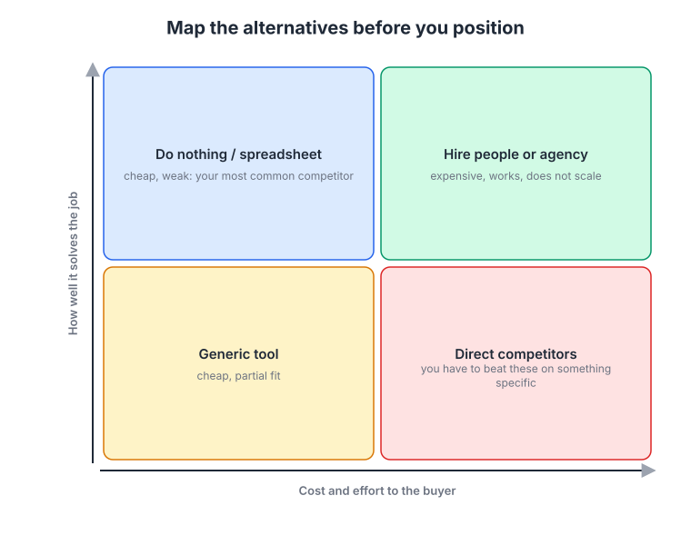
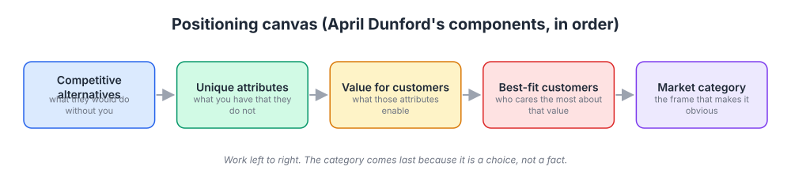
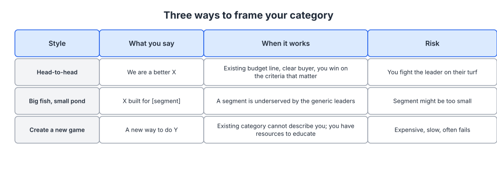

# Week 4: Positioning

> By the end of this week you will be able to write and defend a one-page positioning document that says what your platform is, who it is for, what it does that the alternatives cannot, and which market category you are asking buyers to put you in.

**Time budget:** reading about 3 hours, videos about 2 hours, exercise 3 to 4 hours.

## What this week covers and why it matters for a founder

You picked a beachhead in week 3. Positioning is the decision that follows it: given that those people are your first market, what should they conclude about you in the first ten seconds?

Positioning is context. It is the frame a buyer uses to decide what your product is comparable to, what it should cost, and whether it deserves attention. Buyers do this automatically and fast. If you do not choose the frame, they choose one for you, usually the most familiar category available, and judge you by its rules. A workflow platform filed under "project management" gets compared to tools costing a tenth of your price on features you never intended to have.

Most founders get this wrong in a specific way. They treat positioning as a writing exercise, sit down with a template, and fill in blanks about their product. It is not a writing exercise. It is a set of decisions about competitors, differentiation, value, audience, and category, made in that order, and the writing is the last five percent. If you start with words you will describe your product. If you start with the alternatives your buyer is actually weighing, you will describe why you win.

The second common error is confusing positioning with messaging. Positioning is an internal decision document that nobody outside your company reads. Messaging (week 5) is the customer-facing language you derive from it, and a tagline is one small piece of messaging. Founders who skip to the tagline get a clever sentence that nothing else in the company supports.

What changes when you get positioning right is that a lot of other arguments stop. Which features to build first, which competitors to put on the comparison page, what to charge: all of these get easier once there is a written answer to "what are we, and to whom?" Sales calls get shorter because the prospect stops trying to work out what bucket you belong in.

The output is a one-page positioning document, tested on real customers, that week 5 turns into messaging.

## Core concepts

### 1. Positioning is a decision about context, not a sentence about your product

Al Ries and Jack Trout, writing in the early 1970s, made the point that positioning happens in the customer's head, not in your marketing copy. People cope with too many choices by sorting products into mental categories and remembering only the top one or two in each. You cannot install a new idea in an occupied slot; you can only attach yourself to an existing one or open a new one.

That still holds, and for software it holds harder, because most buyers evaluate in a browser tab next to four other tabs. A buyer cannot judge your product in isolation. They judge it against whatever they believe it is an instance of, so changing that belief changes every downstream judgment, including price.

The clearest software example is Slack. Positioned as a team chat tool, it would have been compared to IRC, HipChat and Campfire and judged on message features and price. Stewart Butterfield's well-known internal memo argued for selling something larger than the tool itself, and Slack's public positioning ran against email and organizational noise rather than against chat apps, with "be less busy" as the promise. The comparison set changed from chat tools to the daily experience of work, and the value went up accordingly.

Salesforce did the same thing in its early years with the "No Software" mark, a circle and slash over the word. The product was software. The positioning made the comparison not "which CRM" but "installed CRM versus something you just log into", a frame in which the incumbent's whole architecture was the weakness.

The failure mode is positioning into the category you wish you were in rather than the one your buyer uses, with no plan for closing the gap. If you call yourself a "revenue platform" while every buyer searches for "lead routing tool", you have not repositioned the market, you have made yourself hard to find. Positioning can move a buyer one step. It cannot teleport them.

### 2. Start from competitive alternatives, not from competitors

The first component of April Dunford's method, and the one founders skip, is an honest list of competitive alternatives. Not the companies you consider peers. The things your best-fit customer would actually do if you did not exist. For a software platform that list almost always includes four kinds of thing.



*Place every alternative by how well it does the job and what it costs the buyer in money and effort; the bottom-left box, doing nothing or using a spreadsheet, is the alternative that beats most early-stage software.*

Doing nothing, or a spreadsheet and a recurring meeting, is the most common competitor for any new platform and the one founders leave off the list. It is cheap, already in place, and does the job badly enough that people tolerate it. If you lose deals to "we decided not to do anything this quarter", that is your real competitor, and you have to beat it on urgency, not on features.

Hiring people or an agency is the expensive alternative that works. It competes with anything that automates judgment or labor, and it scales badly, which is where your differentiation usually lives.

A generic tool that partly fits is the quiet competitor: a spreadsheet suite, a general database, a platform the company already pays for. The objection is never quality, it is "we already have something for that", and your counter has to be a specific job that tool does poorly.

Direct competitors are the ones you think about most and lose to least early on. They matter, but only on the criteria the buyer actually uses to choose.

The mechanism that makes this list valuable is subtraction. Your unique attributes are whatever remains after you remove everything the alternatives also have. Founders who start from a feature list claim what three competitors also claim, which is why so many software homepages are interchangeable.

Get this list from evidence. Your week 2 interviews contain switch stories and your sales notes contain lost-deal reasons. Ask your last ten customers one question: "if we had not existed, what would you have done?" The answers are usually not what the founder expected.

### 3. The positioning components, in order

Dunford's method is a sequence of five components, and the order is what makes it work. Each one constrains the next.



*Work left to right and do not skip ahead; the category comes last because it is a choice you make once you know what value you deliver and to whom.*

Competitive alternatives, covered above, define what you are compared with.

Unique attributes are the capabilities you have that the alternatives do not. They should be factual and checkable: an architecture, a data set, an integration, a delivery model, a business model, a workflow you support end to end. "Easy to use" is not a unique attribute, because competitors say it too and nobody can verify it. "Runs inside the customer's own cloud account" is one, because it is either true or false.

Value is what those attributes let the customer do. Every attribute should map to a value statement; if it does not, it is a feature you like rather than a differentiator. Run each through "so what?" twice. Running inside the customer's cloud account means data never leaves their perimeter, which means the security review takes days instead of months, which means the project ships this quarter. The last link is the one a buyer cares about.

Best-fit customers are the people who care disproportionately about that value. This is where week 3 pays off: your ICP characteristics should predict caring about your specific value, not just be easy to filter on. If your value is a fast security review, your best-fit customers are regulated or enterprise buyers, and a startup buyer will not pay for it.

Market category is the frame you put around all of it so the value is obvious. It is chosen last, on purpose. The category is not a fact about your product, it is a decision about which buyer expectations you inherit. Choose the one whose default expectations are closest to your strengths and whose budget already exists.

An optional sixth component is trends. If a real shift in your buyer's world (a regulation, a platform change, a change in how teams work) makes your value more urgent, attach your positioning to it. The discipline is that the trend must make your value matter more, not just sound current.

The failure mode is doing this in reverse: picking a category you find exciting, then reverse-engineering attributes to justify it. You can spot it when a company's category claim has nothing to do with what its product actually does better than the alternatives.

### 4. Three ways to frame your category

Once you know your value and your best-fit customers, you have three category strategies. They differ in cost, speed and risk.



*Most early-stage companies should be in the middle row; the bottom row is the one founders want and the one that most often fails.*

Head-to-head means entering an established category and claiming you are the better version. "We are a better X." It works when there is an existing budget line, a known buyer, and evaluation criteria on which you genuinely win, and you spend nothing teaching the market why the category should exist. The risk is that you fight the leader on ground they chose, and if your advantage sits on criteria buyers rank fourth, you lose.

Big fish, small pond means taking an existing category and narrowing it to a segment the generic leaders serve badly. "X built for [segment]." This is the right answer for most early companies: it inherits existing budget and demand while removing the leader's scale advantage, and the leader cannot follow you into the niche without hurting their broader product. Linear is a useful study. Issue tracking is an old category with a dominant incumbent in Jira, and Linear did not invent a new one. It narrowed the frame to fast-moving software teams and made speed and craft the evaluation criteria, so the only question left was which issue tracker.

Create a new game means naming a category that does not exist yet. "A new way to do Y." Drift did this with "conversational marketing", Gong with "revenue intelligence", HubSpot with "inbound marketing", and Snowflake with the "data cloud". It is the most valuable outcome when it works, because the company that names a category tends to define its evaluation criteria. It is also expensive and slow, because you are paying to teach the market that a problem has a name before you can sell the solution. HubSpot's category creation ran on a book, a conference, a large blog and free tools over years.

A middle path: position head-to-head or big fish small pond now, and seed the category language you eventually want in your content. Gong sold sales-call recording into an existing need long before "revenue intelligence" was a phrase anyone searched for.

The failure mode is new-category positioning adopted for internal reasons: it makes the founder feel differentiated and the buyer confused. A quick test: search the term you want to own. If nobody searches for it and no analyst has a report on it, you have chosen education, not positioning.

### 5. Positioning is a strategy artifact, so check it against strategy

A positioning claim you cannot defend for two years is a campaign, not a position. Borrow two tools from strategy here: Porter's five forces for the structure of your market, and the plain question of whether your differentiation is durable.


*Use it as a checklist for your positioning claim: substitutes and new entrants tell you how long your differentiation will last, buyer power tells you whether the value you claim will survive a procurement conversation. Source: [Wikimedia Commons](https://commons.wikimedia.org/wiki/File:Porters_five_forces.PNG)*

Threat of substitutes maps onto your alternatives map. If the strongest substitute is "do nothing", your positioning must attack the status quo and your content has to create urgency rather than compare features. Threat of new entrants tells you how fast your attributes will be copied. A single feature goes in a year. Hard-to-copy attributes are structural: a data asset that grows with usage, a business model competitors cannot adopt without hurting their existing revenue, integration depth that took years, or a workflow spanning several jobs.

Buyer power decides whether your value claim survives procurement. Few large buyers will push you toward a feature comparison and a discount, so anchor the position to an outcome they are accountable for. Many small buyers mean positioning does the selling alone, because no human will be on the call.

Michael Porter's argument in "What Is Strategy?" is the one to keep: strategy is a distinctive set of activities and the tradeoffs that come with them, and positioning is the customer-facing face of those tradeoffs. If your position implies no tradeoff, it is not a position. "The most flexible platform, also the easiest to use, also the most secure, at the lowest price" is a wish list. Basecamp has said for years that it is deliberately less featured than enterprise project tools, and that is what its buyers are choosing.

The failure mode is positioning on something true today and copyable tomorrow. Speed, a nicer interface and a lower price are real advantages and all temporary. Use them to win the first market, but write down what structural advantage you are building behind them.

### 6. Testing positioning, and repositioning when it stops working

Positioning tested only inside the building is a hypothesis. There are three cheap tests; run at least two this week.

The sales-call test. Use the new positioning at the top of your next five calls and measure two things: how many follow-up questions the prospect asks about what you are (fewer is better), and whether they repeat your frame back in their own words. When someone says "so this is basically X for Y teams" and that is what you intended, it is working.

The repeat-back test. Show your positioning statement to five people in your ICP for a minute, take it away, and ask them to describe the product to a colleague. What they say is your actual positioning, whatever you wrote.

The competitive-alternative test. Ask prospects what else they are considering. If the answers do not match your alternatives map, your positioning is aimed at the wrong comparison set and everything downstream is off. Panels such as Wynter run this with B2B audiences quickly.

Repositioning is normal and the triggers are recognizable. You are winning a segment you did not aim at. Your win rate against one competitor collapsed. Your product changed enough that the old frame undersells it. Slack's frame shifted from replacing internal email toward being the platform work happens in. Notion moved from notes and documents to "all-in-one workspace" as databases and wikis became the reason teams adopted it.

When you reposition, keep the old term reachable for a while so buyers searching it still find you. The failure mode is repositioning on the website and nowhere else. Sales decks, onboarding emails, support macros and your pitch at events all carry positioning. Change them together, or you will run two positions at once, which is worse than either.

## Videos

- [Obviously Awesome: How to Nail Product Positioning, April Dunford (Business of Software)](https://www.youtube.com/results?search_query=april+dunford+obviously+awesome+positioning+talk) (YouTube search)
  Why watch: the source for this week's method, with real repositioning stories and the reasoning behind the order of the components. Usually 30 to 45 minutes; watch this first.
- [April Dunford on positioning, Lenny's Podcast](https://www.youtube.com/results?search_query=lenny%27s+podcast+april+dunford+positioning) (YouTube search)
  Why watch: goes deeper on category choice, repositioning triggers and how positioning shows up in a sales pitch. Over an hour, and worth it at 1.5x.
- [The Greatest Sales Deck I've Ever Seen, Andy Raskin (strategic narrative talk)](https://www.youtube.com/watch?v=dkVJnaxDlXE)
  Why watch: a preview of week 8, showing how a positioning decision becomes a narrative built on a named shift in the world. Usually 30 to 40 minutes.
- [How great leaders inspire action, Simon Sinek (TEDx, 2009)](https://www.ted.com/talks/simon_sinek_how_great_leaders_inspire_action)
  Why watch: about 18 minutes, and worth watching critically. "Start with why" is a useful reminder that buyers respond to the reason a product exists, but it is a communication device, not a positioning method: it says nothing about competitive alternatives, best-fit customers or category choice. Watch it, then notice what it leaves out.

## Recommended reading

- Book: Obviously Awesome, April Dunford, chapters 3 to 7 ([April Dunford](https://www.aprildunford.com/)). What to take from it: the five components in order and the chapter on category choice; this is the core text for the week.
- Book: Positioning, Al Ries and Jack Trout ([Wikipedia](https://en.wikipedia.org/wiki/Positioning_(marketing))). What to take from it: the original argument that positioning happens in the buyer's mind, and the idea that being first in a category beats being better in a crowded one.
- [What Is Strategy?, Michael Porter (HBR, 1996)](https://hbr.org/1996/11/what-is-strategy). What to take from it: strategy is a set of activities and tradeoffs, not a list of aspirations; use it to check whether your position names something you are willing to be worse at.
- [Fletch PMM, positioning for early-stage startups](https://www.fletchpmm.com/). What to take from it: annotated homepage rewrites showing positioning applied to real early-stage software, and the common failure patterns.
- [Wynter, message testing with B2B audiences](https://wynter.com/). What to take from it: what a structured positioning and message test looks like, so you can run a manual version with five prospects this week.
- Book: Crossing the Chasm, Geoffrey Moore, the chapter on positioning and the elevator pitch template ([Wikipedia](https://en.wikipedia.org/wiki/Crossing_the_Chasm)). What to take from it: the classic "for [customer], who [need], our product is a [category] that [benefit], unlike [alternative]" template, and why it is a test of completeness rather than a finished statement.

## Hands-on exercise (2 to 4 hours)

**Deliverable:** a one-page positioning document saved in your company wiki, with the five components filled in, a category strategy chosen and justified, and notes from three positioning tests with real people.

**Steps:**
1. (30 minutes) Build the competitive alternatives list from evidence: switch stories from your week 2 interviews, lost-deal reasons from your notes, and three recent customers asked what they would have done without you. Place each alternative on the two-by-two map.
2. (40 minutes) List your unique attributes, and for each write the name of an alternative that does not have it. If you cannot name one, delete the attribute. Aim for three to six survivors, all factual and checkable. Then convert each to value: ask "so what?" twice and keep the second answer, which is the buyer-level outcome.
3. (20 minutes) Name the best-fit customers using your week 3 ICP. Write the characteristics that predict caring most about the value you just wrote, and mark any ICP criteria that turn out not to predict it.
4. (30 minutes) Choose the category strategy. Write one paragraph each for head-to-head, big fish small pond and new category as applied to your platform, pick one, and write two sentences on why the others are wrong for you today. Search your candidate term to see whether buyers use it.
5. (20 minutes) Write the document using the template below. Keep it to one page. If it will not fit, you have not chosen.
6. (45 minutes) Test it. Run the repeat-back test with five people in your ICP and use the new frame at the top of your next two calls or demos. Record what they said verbatim.
7. (20 minutes) Revise, then list every place the old positioning lives: homepage, deck, onboarding emails, support macros, job posts, your own one-line introduction. That list is your week 5 and week 6 work queue.

**Template:**

```
POSITIONING DOCUMENT, <company>, <date>   (internal, not customer-facing)

COMPETITIVE ALTERNATIVES (what they do without us)
1. <alternative> | why people choose it | where it fails

UNIQUE ATTRIBUTES (checkable; each absent from at least one alternative)
- <attribute> -> not present in: <alternative>

VALUE (so what? twice)
- <attribute> -> <user benefit> -> <buyer outcome>

BEST-FIT CUSTOMERS (from week 3 ICP)
Characteristics that predict caring about the value above:
Segments that do NOT fit, and why:

MARKET CATEGORY
Chosen category: <term buyers already use, or the new term>
Strategy: head-to-head / big fish small pond / new category
Why this and not the others:
What we inherit (expectations, budget, competitors):

TREND (optional): shift that makes this value more urgent
TRADEOFF: what we are deliberately worse at
DURABILITY: what stops a competitor copying this in 12 months

TEST RESULTS
Person / role | repeated back as | questions asked | verdict
```

**How to know it is good:**
- Every unique attribute is something a competitor cannot honestly claim, and you can prove it in a demo.
- The alternatives list includes "do nothing" or a spreadsheet, with a written reason someone would choose it.
- At least three of five test participants describe the product back in roughly the frame you intended, unprompted.
- The document names one thing you are deliberately worse at, and the category term is one your buyers already use (or you have written what educating them will cost).

## Self-check

Answer these without looking back. If you cannot, reread the relevant section.

1. Why must positioning start from competitive alternatives rather than from your feature list?
2. Name the five positioning components in order and explain why the market category is chosen last.
3. What is the difference between a unique attribute and a value statement, and what question gets you from one to the other?
4. Give the three category strategies, the sentence pattern for each, and the main risk of each, and say which one fits most early-stage companies.
5. What did positioning against email rather than against chat tools do for Slack that a chat-tool frame would not have?
6. Your strongest competitive alternative turns out to be "do nothing". What does that change about your positioning and your content?
7. Describe two cheap ways to test positioning with real people, and what result counts as a pass.
8. Name three triggers that mean it is time to reposition, and say what else has to change besides the website.
9. What is the difference between positioning, messaging and a tagline? Which does a customer read?

**You are done with this week when:**
- [ ] Your one-page positioning document exists with all five components, a chosen category strategy, and a written tradeoff.
- [ ] Your competitive alternatives came from customer evidence, not from a guess, and include the status quo.
- [ ] At least five people outside your company have repeated the positioning back to you and you have recorded their words.
- [ ] You have a list of every asset that currently carries the old positioning.

## Next week

You have decided what you are, who it is for, and what you are competing against. Next week you turn that internal document into words customers actually see: a messaging hierarchy with a one-liner, a value proposition, three pillars with proof, and an objection map.
