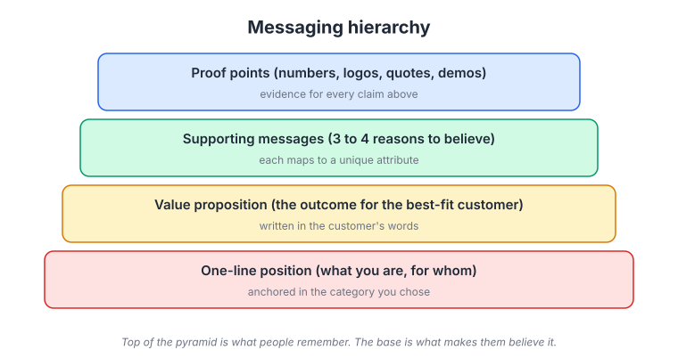
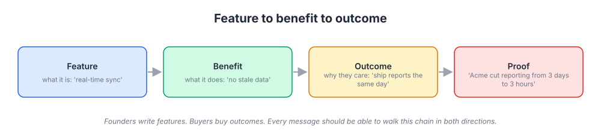
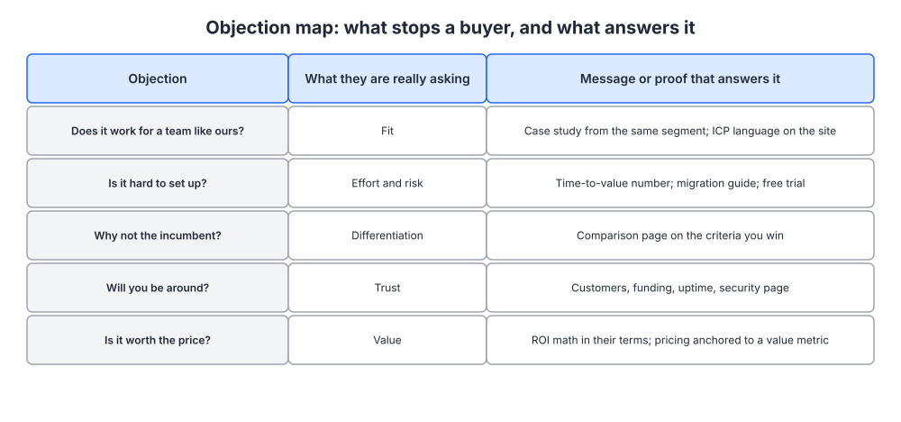
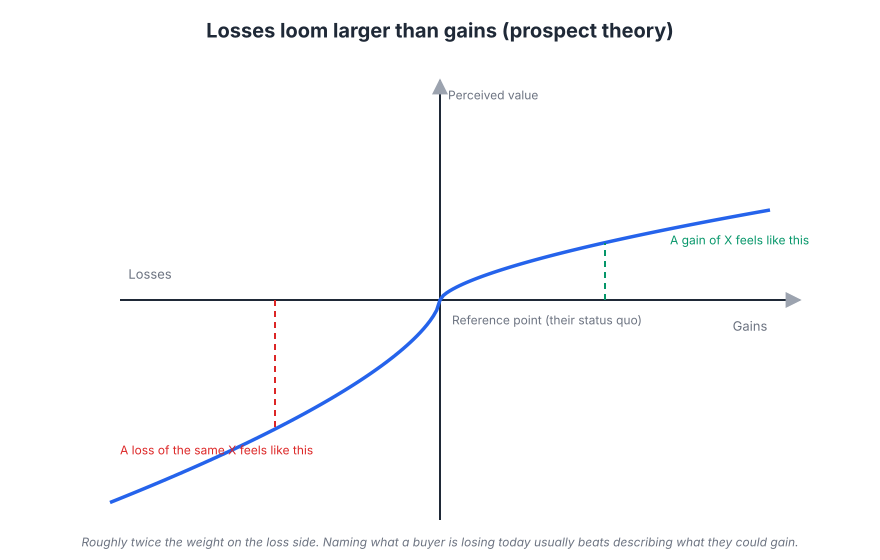

# Week 5: Messaging and value propositions

> By the end of this week you will be able to turn your positioning into a messaging document that any page, deck, email or salesperson can pull from without inventing new claims.

**Time budget:** reading about 3 hours, videos about 1.5 hours, exercise 2 to 4 hours.

## What this week covers and why it matters for a founder

You wrote your positioning document in week 4. Pull it up now. It tells you what you are, who it is for, what you do that the alternatives do not, and why that matters. It is not something a customer will ever read. Messaging is the layer that turns that internal document into words a customer sees on your homepage, in a cold email, in a pricing page, and in your sales calls.

Most founders skip this layer. They go straight from a positioning statement (or, more often, from no positioning at all) to writing a homepage, and every page ends up saying something slightly different. The homepage says "collaboration". The pricing page says "workflow automation". The sales deck says "visibility". The founder says "we are kind of like X but for Y". Nobody outside the company can repeat what the product is, so nobody does, and word of mouth stalls.

The mechanism you are fixing is memory and belief. A buyer has to remember one thing about you (the one-liner), believe one promise (the value proposition), and have their doubts answered (supporting messages and proof). If those three layers are inconsistent, the buyer has to do the work of reconciling them, and buyers do not do that work. They leave.

What changes when you get it right is mundane and enormous. Every asset you make from here on is faster to write and says the same thing. Sales calls stop being improvised. And you can test messages, because you finally have a fixed thing to test.

The outputs of this week: a messaging document with a one-liner, a value proposition, three message pillars each with proof, and an objection map. Weeks 6, 7 and 8 all draw from it.

## Core concepts

### 1. The messaging hierarchy

A messaging hierarchy is a pyramid with four levels. At the top is the one-line position: what you are and for whom, anchored in the market category you chose in week 4. Under it sits the value proposition: the outcome your best-fit customer gets, written in the customer's words rather than yours. Under that are three or four supporting messages, sometimes called pillars, each of which maps to one of the unique attributes from your positioning work. At the base are proof points: the numbers, logos, quotes, and demos that make each claim believable.



*The top of the pyramid is what people remember; the base is what makes them believe it. Notice that each supporting message should trace back to one unique attribute from your positioning document.*

The pyramid matters because different assets use different depths. A Twitter bio uses the top line only. A homepage hero uses the top two levels. A sales deck or a long landing page walks all four. When every asset draws from the same pyramid, they agree with each other by construction.

Stripe is the cleanest example in software. For years the one-liner was "payments infrastructure for the internet". The value proposition underneath was about developers integrating payments in hours rather than weeks of bank negotiations. The supporting messages were the developer experience, the breadth of payment methods, and the reliability of the platform. The proof was the documentation itself, the customer logos, and the uptime record. You could land on any Stripe page and the story held together.

Superhuman did the same at a smaller scale with "the fastest email experience ever made". One idea at the top, and everything below it (keyboard shortcuts, split inbox, speed benchmarks, testimonials from well-known founders) supported that one idea. Notion's "all-in-one workspace" works the same way, with the supporting messages being notes, docs, wikis and databases in a single tool.

The common failure mode is a pyramid with no top. Founders write five pillars and no one-liner, because picking one thing feels like giving up the other four. The result is a homepage that lists capabilities. Capabilities are not memorable. The discipline is the same as positioning: choose. If the one-liner does not fit in a sentence a customer would say to a colleague ("it's the X for Y teams"), keep cutting.

### 2. Feature, benefit, outcome, proof

Founders write features because features are what they built. Buyers buy outcomes because outcomes are what they are accountable for. The chain between them has four links: the feature (what it is), the benefit (what it does for the user), the outcome (why the buyer cares), and the proof (evidence that the outcome really happens).



*Read it left to right to write copy; read it right to left to check that every outcome you promise is backed by a real feature.*

Take the diagram's example. The feature is real-time sync. The benefit is no stale data. The outcome is that the team ships reports the same day. The proof is a named customer who cut reporting from three days to three hours. The buyer cares about the third and fourth links, the user about the second, the evaluating engineer about the first. A good message can be walked in either direction so each audience finds their layer.

Loom is a good study here. The feature is recording your screen and camera together. The benefit is that you can explain something without writing it out. The outcome, which is what Loom led with in its messaging, is fewer meetings. "Async video messaging for work" is an outcome-level statement compressed to a category, and it landed because every knowledge worker in 2020 and 2021 was drowning in meetings. Datadog, by contrast, keeps its messaging closer to the feature end, because its buyers are engineers who translate features to outcomes themselves and distrust anyone who does it for them. That is a deliberate choice for a technical audience, not a mistake.

The failure mode is stopping at the benefit. "Real-time sync means your data is always up to date" is true and boring. Nobody budgets for up-to-date data. They budget for same-day reports, fewer incidents, or a sales team that closes faster. Push every message one more step until it lands on something a buyer would put in a quarterly review, then find proof for exactly that claim.

### 3. Proof, and the five types of it

Proof is the base of the pyramid and the part founders neglect most. There are five practical types, and each answers a different doubt.

Numbers answer "how much". A specific figure ("reduced page load by 40 percent", "handles 2 million events a day") is more credible than a round one, and a range is more credible than a suspiciously precise single point when you only have a few data points. Only publish numbers you can defend if a prospect asks how you measured them.

Logos answer "who else". A row of recognizable customer logos tells the buyer that a company like theirs already took the risk. Logos work best when they match the visitor's segment. Five logos from your ICP beat twenty from random industries. If you have no logos yet, use the count ("used by 340 engineering teams") or the type ("used by Series A fintech companies") rather than faking a logo wall with partners and vendors.

Quotes answer "what is it actually like". A good testimonial is specific, names a person and a role, and describes a before and after. "Great tool, love it" is worthless. "We replaced three spreadsheets and a weekly status meeting with it in the first month" is proof. You get quotes by asking customers a specific question ("what changed for you after the first month?") rather than "can you give us a testimonial?".

Demos answer "does it really work". For software, a 60-second product video or an interactive demo is the strongest proof available, because it removes the need to trust anyone. Stripe's original proof was seven lines of code on the homepage. Slack's early homepage proof was the product itself, shown in screenshots and a short video.

Guarantees answer "what if it fails". Free trials, money-back periods, uptime SLAs, and migration assistance all shift risk from the buyer to you. They are underused in B2B software because founders fear abuse. In practice the abuse rate is tiny and the conversion lift is real.

The failure mode is proof that does not match the claim. A pillar that says "enterprise-grade security" supported by a testimonial about ease of use is not supported at all. Every pillar needs its own proof, and the proof should be the strongest type you can honestly offer for that specific claim.

### 4. Objection mapping

An objection is a question the buyer is asking silently. If your messaging answers it before they ask, they keep reading. If it does not, they go looking for an answer elsewhere, and elsewhere is usually a competitor's site or a Reddit thread you do not control.



*Each row pairs an objection with its underlying question and the specific proof that resolves it. Fit, effort, differentiation, trust and value cover most objections in software buying.*

The five rows in the diagram cover the majority of software objections. "Does it work for a team like ours?" is a fit question, answered by a case study from the same segment and by using your ICP's language on the page. "Is it hard to set up?" is about effort and risk, answered by a time-to-value number, a migration guide, or a free trial. "Why not the incumbent?" is a differentiation question, answered by a comparison page on the criteria where you win (more on those in week 6). "Will you be around?" is a trust question, answered by customer counts, funding, uptime and a security page. "Is it worth the price?" is a value question, answered by ROI math in the buyer's own terms and pricing anchored to a value metric (week 20).

You build the map from real sources, not from imagination. Reread the interview notes from week 2. Listen to your last ten sales calls and write down every question a prospect asked. Read the reviews of your competitors on G2 and look for what people complain about, because those complaints are objections you will face too. Tag each question by type, count the frequency, and write the answer.

The failure mode is answering objections defensively. "Is it hard to set up?" answered with "No, it is easy" convinces nobody. "Most teams are running in under 20 minutes; here is the guide" convinces most people. Answer with evidence, not reassurance.

### 5. Audiences and stages of awareness

The same product is bought by different people for different reasons, and read by the same person at different moments. Messaging has to account for both.

Start with roles. In most software purchases there is a user (who lives in the product daily), a buyer (who owns the budget and is accountable for the outcome), and a champion (who wants it badly enough to push it through). Sometimes one person is all three; in a self-serve tool for individual developers, they usually are. In a team sale they are usually different people. The user cares about benefits and the daily experience. The buyer cares about outcomes and risk. The champion needs ammunition to convince the other two, which usually means proof and a way to compare you against the alternative. Your homepage speaks to the champion, product pages to the user, and a ROI or security page to the buyer.

Now overlay awareness. Eugene Schwartz, a direct-response copywriter writing in the 1960s, described five stages a prospect moves through, and the model still holds. Unaware: they do not know they have the problem. Problem-aware: they feel the pain but do not know a solution exists. Solution-aware: they know the category exists but not your product. Product-aware: they know you but are not convinced. Most aware: they are ready and need a reason to act now.

Each stage needs a different message. To the unaware you talk about a change in their world, not your product (week 8 covers this in depth). To the problem-aware you name the pain precisely and show there is a way out. To the solution-aware you explain why your approach to the category is different. To the product-aware you supply proof and handle objections. To the most aware you make the offer easy: a trial, a price, a next step.

The practical consequence for a founder is that your homepage is usually written for the solution-aware and product-aware, because those are the people who typed your name or your category into a search box. Your content and ads (weeks 10 to 12) are where you reach the problem-aware. Cold outreach to someone unaware of the problem, using product-aware messaging, is why most cold email fails.

Slack's early messaging is a good example of matching stage. Many early customers were solution-aware; they were using HipChat or IRC or email threads. So Slack's message was not "what is team chat", it was "be less busy", which is an outcome pitched against the alternative the reader already had. HubSpot in its early years had the opposite problem. Nobody was aware of "inbound marketing" as a solution, so its messaging had to create problem and solution awareness first, which is why it invested in a book, a blog, and free tools rather than in product pages.

The failure mode is writing every asset at the same stage, usually product-aware, because that is the stage the founder lives in. Check each asset you produce this week: who is reading it, what role, and what do they already know?

### 6. Framing and loss aversion

Two messages with identical facts can produce different decisions depending on how they are framed. The most reliable effect here is loss aversion, documented by Daniel Kahneman and Amos Tversky in prospect theory: people feel a loss roughly twice as strongly as an equivalent gain. The value function in the figure is steeper on the loss side than on the gain side.



*The curve is asymmetric: losing an amount hurts more than gaining the same amount feels good. Messaging that names what a buyer is currently losing often lands harder than messaging about what they could gain.*

For messaging, this means "you are losing 3 days a month to manual reporting" is often more motivating than "save 3 days a month". The facts are identical; the frame is different. The reference point matters too. If the buyer's reference point is the status quo (which it usually is), then switching is a loss of familiarity and effort even before they weigh the gain. That is why the effort and risk row in your objection map is so important: you are working against a built-in bias.

There are ethical limits. Naming a real loss the buyer is already experiencing is fair and useful. Inventing a threat, or using countdown timers on offers that do not really expire, is manipulation and it corrodes trust, which is the asset you are trying to build. Use loss framing to describe reality more vividly, not to fabricate urgency.

Two other framing tools worth knowing: contrast (the old way next to yours, "weeks of integration" against "an afternoon") and anchoring (the first number a reader sees shapes how they judge the next one; week 20 uses this on pricing pages). The failure mode is using these tools on a weak positioning. Framing amplifies a message; it cannot rescue one. If the buyer does not believe your outcome is real, no amount of loss framing will help.

## Videos

- [Perspective is everything, Rory Sutherland (TED, 2011)](https://www.ted.com/talks/rory_sutherland_perspective_is_everything)
  Why watch: the clearest argument that how something is framed changes its value to the buyer, full of examples you will steal. About 18 minutes.
- [Are we in control of our own decisions?, Dan Ariely (TED, 2008)](https://www.ted.com/talks/dan_ariely_are_we_in_control_of_our_own_decisions)
  Why watch: the experimental evidence behind defaults, anchoring and framing, which you will use in pricing and messaging. About 17 minutes.
- [Conversion copywriting talk, Joanna Wiebe (Copyhackers)](https://www.youtube.com/results?search_query=joanna+wiebe+conversion+copywriting+talk) (YouTube search)
  Why watch: Wiebe's method of mining customer language from reviews and interviews and putting it directly into copy is the single most useful habit in this week. Pick the top result; most of her talks run 30 to 45 minutes.
- [Marketing Examples talk on copywriting, Harry Dry](https://www.youtube.com/results?search_query=harry+dry+marketing+examples+copywriting+talk) (YouTube search)
  Why watch: short, concrete rules with before-and-after rewrites of real company copy. Good for calibrating what "specific" actually looks like. Usually 20 to 40 minutes.

## Recommended reading

- [The B2B Elements of Value, Almquist, Cleghorn and Sherer (HBR, 2018)](https://hbr.org/2018/03/the-b2b-elements-of-value). What to take from it: a pyramid of 40 things business buyers value, from table stakes up to inspirational; use it to check whether your pillars sit above table stakes.
- [The New Science of Customer Emotions, Magids, Zorfas and Leemon (HBR, 2015)](https://hbr.org/2015/11/the-new-science-of-customer-emotions). What to take from it: the emotional motivators behind purchases, and why an outcome message should connect to one of them even in B2B.
- [Value proposition examples and how to create one (CXL)](https://cxl.com/blog/value-proposition-examples-how-to-create/). What to take from it: a practical structure for a value proposition and a set of software examples critiqued line by line.
- [Copywriting guide, Harry Dry (Marketing Examples)](https://marketingexamples.com/copywriting). What to take from it: the rules on specificity, customer language and cutting adjectives; read it before you write your one-liner.
- [Copywriting formulas, Joanna Wiebe (Copyhackers)](https://copyhackers.com/2015/10/copywriting-formula/). What to take from it: dozens of formulas for headlines and value propositions; use them as scaffolding for first drafts, not as final copy.
- [Wynter, message testing with B2B audiences](https://wynter.com/). What to take from it: how a paid message-testing panel works and what a test report looks like, so you can run a cheap version yourself in the exercise.
- [Writing Handbook, Julian Shapiro](https://www.julian.com/guide/write/intro). What to take from it: a technical founder's approach to writing clearly, including how to compress and how to test whether a sentence carries information.
- Book: Made to Stick, Chip and Dan Heath, chapters on Simple, Concrete and Credible ([Heath Brothers](https://heathbrothers.com/books/made-to-stick/)). What to take from it: the six traits of ideas that stick, and the "curse of knowledge" that makes founders write in abstractions.

## Hands-on exercise (2 to 4 hours)

**Deliverable:** a two-page messaging document saved in your company wiki, containing a one-liner, a value proposition, three message pillars each with proof, an objection map, and the results of a five-person message test.

**Steps:**
1. (15 minutes) Open your positioning document from week 4 and your interview synthesis from week 2. Copy the market category, the competitive alternatives, the unique attributes, and the top five customer quotes into a scratch file.
2. (20 minutes) Write ten candidate one-liners of the form "[what you are] for [who]". Use the formulas in the Copyhackers reading as scaffolding. Cut any that use a word your competitors also use. Pick two finalists.
3. (20 minutes) Write the value proposition: one or two sentences describing the outcome your best-fit customer gets, using words lifted from the interview quotes. If a customer would not say it, rewrite it.
4. (30 minutes) Write three pillars. Each must map to a unique attribute from positioning, and each must be walked through the feature, benefit, outcome chain. Write all four links for each pillar.
5. (30 minutes) Attach proof to each pillar. For each, write the strongest honest proof you have today (a number, a logo, a quote, a demo, a guarantee). Where you have none, write what you would need and how you will get it in the next 30 days.
6. (30 minutes) Build the objection map. List every question from your last ten sales calls or support conversations, tag each by type (fit, effort, differentiation, trust, value), and write an evidence-based answer for the top eight.
7. (30 minutes) Run a five-second test. Show your two finalist one-liners plus the value proposition, one at a time, to five people who match your ICP (or the closest you can find). After five seconds, hide it and ask: what does this company do, who is it for, and what would you do next? Record the answers verbatim.
8. (15 minutes) Pick the one-liner that was most accurately repeated back. Assemble everything into the template below and save it.

**Template:**

```
MESSAGING DOCUMENT (v1, date)

One-liner: [what you are] for [who]
Value proposition: [outcome, in the customer's words]

Pillar 1: [claim]
  Unique attribute it maps to:
  Feature -> Benefit -> Outcome:
  Proof (type):

Pillar 2: ...
Pillar 3: ...

Objection map
| Objection (buyer's words) | Really asking | Answer and proof |
|---------------------------|---------------|------------------|
|                           |               |                  |

Message test (5 people, five-second test)
| Person | Repeated back | Who for | Next step | Notes |
|--------|---------------|---------|-----------|-------|

Audience notes
  User cares about:
  Buyer cares about:
  Champion needs:
```

**How to know it is good:**
- At least four of five test participants can say what you do and who it is for after five seconds.
- Every pillar maps to a unique attribute in your positioning document, and none of them is something a competitor also claims.
- Every pillar has proof of a specific type attached, or a dated plan to get it.
- The objection map has at least eight rows sourced from real conversations, not guesses.
- The one-liner fits in a sentence someone would say to a colleague without sounding like an ad.

## Self-check

Answer these without looking back. If you cannot, reread the relevant section.

1. What are the four levels of the messaging hierarchy, and which level does a Twitter bio use?
2. Walk one of your own features through feature, benefit, outcome, proof. Which link is the buyer accountable for?
3. Name the five types of proof and the doubt each one answers.
4. A prospect asks "how long does setup take?" Which objection type is this, and what is an evidence-based answer?
5. What are Eugene Schwartz's five stages of awareness? Which stage is your homepage written for, and why?
6. Explain why "you are losing three days a month" often works better than "save three days a month". What is the ethical limit?
7. Why should each pillar map to a unique attribute rather than to a feature you are proud of?
8. What did Stripe's "payments infrastructure for the internet" do that "the easiest way to accept payments" would not have done?

**You are done with this week when:**
- [ ] Your messaging document is saved with a one-liner, value proposition, three pillars with proof, and an objection map.
- [ ] Five people have taken a five-second test and at least four repeated your one-liner back accurately.
- [ ] Every claim in the document is either proven or has a dated plan to get proof.
- [ ] You can explain, in one sentence, how each pillar traces back to your positioning document.

## Next week

Next week you take the messaging document and turn it into pages: a rewritten homepage hero and a landing page, plus the basics of conversion copywriting and the loop you use to improve them.
