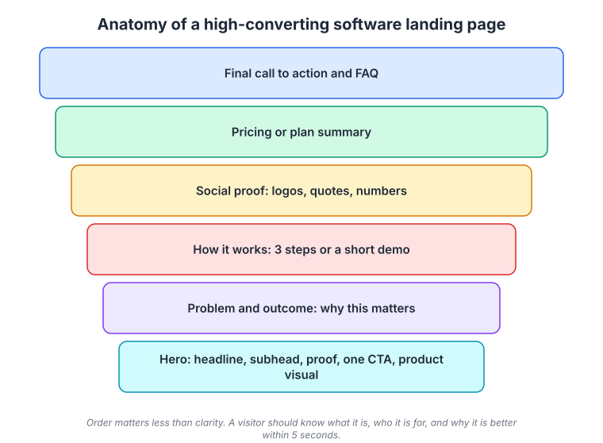
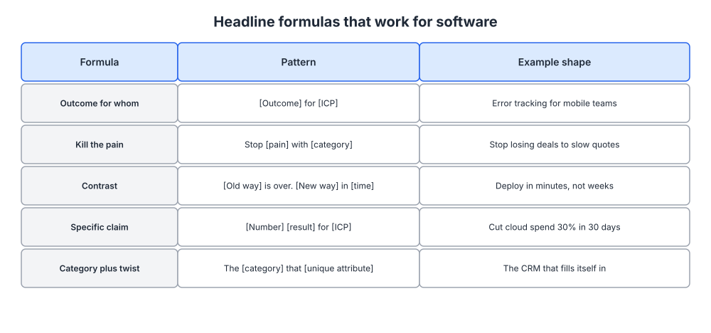
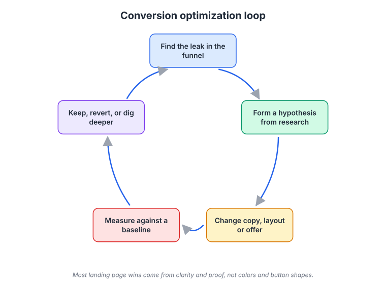

# Week 6: Copywriting and landing pages that convert

> By the end of this week you will be able to write a homepage hero and a campaign landing page that a stranger understands in five seconds, and run the loop that improves them.

**Time budget:** reading about 3 hours, videos about 1.5 hours, exercise 2 to 4 hours.

## What this week covers and why it matters for a founder

Your messaging document from week 5 is the source. This week you turn it into pages. Not "a website" in the abstract, but the specific pages where a visitor decides whether to keep going: the homepage hero, a campaign landing page, a pricing page, and a comparison page. Each has a different job, and each is mostly a writing problem, not a design problem.

Founders treat the website as a design project. They spend three weeks on a template and forty minutes on the words, then wonder why traffic does not convert. The truth from a decade of conversion work is uncomfortable for people who like visuals: most landing page wins come from clarity and proof, not from colors, animations or button shapes. A page that says exactly what the product is, for whom, and why it is better will beat a beautiful page that says "work smarter" every time.

The mechanism is attention. A visitor gives you a few seconds and reads perhaps a fifth of the words on the page, in a predictable pattern. If the headline and the first few words of each section do not carry the message on their own, the message is not delivered. Copywriting for the web is the craft of putting the meaning where the eyes go.

When you get this right, three things happen. Your conversion rate goes up, which lowers the cost of every channel you try in weeks 9 to 15. Your sales conversations start further along, because prospects arrive already understanding what you do. And you gain a loop: research, hypothesis, change, measure, that keeps improving the page as you learn.

The outputs of this week: a rewritten homepage hero, one campaign landing page draft, and the results of a five-second test on five people.

## Core concepts

### 1. How people actually read a web page

Nielsen Norman Group has been eye-tracking web readers since the 1990s and the findings have barely changed. People do not read; they scan. They read the first line or two fully, scan down the left edge picking up the first words of paragraphs and headings, and occasionally read a line further in. Plotted as a heatmap, it looks like the letter F. When content is well structured, with meaningful headings and short paragraphs, the pattern breaks down into something closer to a layer cake: readers hop between headings and read only the section they need.

The implication for copy is simple and widely ignored. The first two or three words of every headline, subheading and paragraph carry almost all the weight. "Our platform helps teams to collaborate more effectively on documents" puts the meaning at the end, where nobody reads. "Collaborate on documents without version chaos" puts it at the front. Front-load every line.

The second implication is that visual hierarchy is content, not decoration. Headings must be able to tell the story alone. Test this by reading only the headings on your homepage top to bottom. If they do not summarize what you do, who it is for, why it is better and what to do next, the page fails scanners, which is nearly everyone.

Stripe's homepage has always been a good example of hierarchy doing the work. The headline states the category, the subhead states the outcome, and every section below has a heading that could stand alone. Linear's site does the same with even fewer words; each section is a short, declarative claim about the product with a screenshot as proof. Neither company needs you to read the paragraphs.

The failure mode is writing a page as prose and then formatting it. Write the headings first, as a complete outline of the argument. Only then write the paragraph under each, and keep it short enough that the heading still carries the meaning if the paragraph is skipped.

### 2. Landing page anatomy

A high-converting software landing page follows a predictable structure. It is not a rule of design; it is the order in which a skeptical visitor's questions arise.



*Each block answers the next question a visitor asks. The hero must answer "what is it, who is it for, why is it better" on its own; everything else supports it.*

The hero is the headline, a subhead, one call to action, a piece of proof, and a product visual. Its job is to answer three questions in five seconds: what is this, is it for me, and why is it better than what I have. Your one-liner and value proposition from week 5 go here almost verbatim. The product visual matters more than founders think; a real screenshot or short looping video reassures the visitor that the product exists and looks competent.

Below the hero, the problem and outcome section names the pain in the visitor's words and states what changes. This is where your interview quotes from week 2 earn their keep. Then "how it works" in three steps or a short demo, which answers the effort objection from your objection map. Then social proof: logos, quotes, numbers, placed right after the claims they support rather than in a pile at the bottom. Then a pricing or plan summary, because "is it worth it" is the next question. Then a final call to action and an FAQ built directly from your objection map.

Different pages weight these blocks differently. The homepage serves every visitor, so it stays general and links out to deeper pages. A campaign landing page serves one audience arriving from one source (an ad, an email, a partner), so it repeats the promise they clicked on, strips the navigation, and has a single action. Message match between the ad and the page is the single biggest lever in paid acquisition (week 12). A pricing page is a decision page; its copy exists to make the plans comparable and to handle the value objection. A comparison page ("your product vs incumbent") exists for solution-aware and product-aware visitors who are deciding between you and a named alternative, and it should be honest about where the incumbent wins, because that honesty is what makes the rest of the page credible.

Basecamp is worth a look for its history. For years its homepage was very long, with a plain headline, a lot of customer quotes, and paragraphs of direct explanation. It kept getting longer, not shorter, because the company found that visitors who were seriously considering a switch wanted the whole argument in one place. Length is not the enemy; irrelevance is. Superhuman's waitlist page went the other way: a headline, a short pitch about speed, and a single email field. Both work because each matches its visitor's stage of awareness.

The failure mode is a homepage that tries to be a landing page for every audience at once, with three CTAs in the hero and a feature grid instead of an argument. Pick the primary visitor (usually the champion from week 5), write for them, and route everyone else to a dedicated page.

### 3. Headlines: clarity over cleverness

The headline is the most-read line on the page and the one most founders get wrong in the same way: they try to be clever. Puns, abstractions and aspirational verbs ("Empower your team") all fail the five-second test, because the visitor cannot tell what the product is. Clarity converts; cleverness entertains the person who wrote it.



*Five patterns that produce clear software headlines. Use them to generate ten candidates quickly, then pick the one that best matches your positioning.*

Five formulas cover most good software headlines. Outcome for whom: "[Outcome] for [ICP]", as in "Error tracking for mobile teams". Kill the pain: "Stop [pain] with [category]". Contrast: "[New way] in [time], not [old way]", as in "Deploy in minutes, not weeks". Specific claim: "[Number] [result] for [ICP]", which only works if the number is real and defensible. Category plus twist: "The [category] that [unique attribute]", as in "The CRM that fills itself in", which is a direct translation of the week 4 positioning into a headline.

Which one you choose depends on the awareness stage of the visitor. Solution-aware visitors respond to category plus twist, because they already know the category and want to know your angle. Problem-aware visitors respond to kill the pain. Product-aware visitors, arriving from a comparison search, respond to contrast and specific claims.

Notion's headline for a long time was a category statement: the all-in-one workspace. Loom used an outcome and a category together, async video messaging for work. Slack in its early days used "Be less busy", which is an outcome, paired with a subhead that stated the category ("a messaging app for teams") so the outcome had context. Notice the pattern: when the headline is an outcome or a pain, the subhead states the category, and when the headline is the category, the subhead states the outcome. The pair always covers both.

A useful discipline is to write the subhead as the answer to "how?". Headline: "Deploy in minutes, not weeks". Subhead: "Connect your repo, and every push gets a preview URL and a production deploy with zero config." Now the visitor knows both the promise and the mechanism, and the mechanism is what makes the promise believable.

The failure mode, beyond cleverness, is the adjective. "Powerful, flexible, intuitive" say nothing because every competitor says them too. Cut every adjective you cannot prove, and replace it with the specific thing you were trying to describe. "Intuitive" becomes "no training needed; most teams are live in 20 minutes".

### 4. Calls to action, friction and the signup flow

A call to action is a request. Like any request, its success depends on how much you are asking for relative to how much the visitor trusts you. "Start free trial" from an unknown company asks for an email, a password, and possibly a credit card. "See how it works" asks for a click. Match the size of the ask to the stage of awareness. Product-aware visitors will start a trial. Solution-aware visitors want a demo or a walkthrough first.

Friction is everything between the click and the value. Every form field, every verification step, every "tell us about your company" screen is friction. Some friction is useful: a qualifying question lets you route enterprise visitors to sales, and a credit card up front filters out tire kickers if you are capacity-constrained. Most friction is accidental: a form that asks for a phone number nobody will call, or a signup that requires a work email when your ICP includes indie developers.

Kevin Hale's talk in the video list makes the point that the first interaction with your product is like a first date, and most companies open with a demand for personal information. Watch your own signup flow with fresh eyes, or better, watch five strangers go through it. The drop-off points will be obvious and embarrassing.

Button copy matters more than button color. "Submit" is a command; "Get my report" describes what happens next. Write the button as the completion of the sentence "I want to...". And use one primary CTA per page. Two competing buttons in a hero split attention and lower both.

Dollar Shave Club's 2012 launch page is an extreme example of a landing page built around a single piece of proof and a single action: a video that made the pitch funny and concrete, and a button to join. The video did the work of the whole page. Most software companies cannot make that video, but the principle stands: one message, one proof, one action.

The failure mode is the free trial that leads to an empty product. If a visitor signs up and lands on a blank dashboard, the landing page did its job and onboarding failed. Week 13 and week 17 cover activation. For now, make sure the first screen after signup delivers on the headline's promise, or at least shows the path to it.

### 5. Social proof placement and honesty

Proof persuades most when it sits next to the claim it supports. A testimonial about setup speed belongs under the "how it works" section, not in a carousel at the bottom. A logo wall belongs near the hero for a company with recognizable customers, and near the pricing section for a company whose customers are unknown but numerous ("trusted by 2,000 teams").

Specificity is the source of credibility. "Cut our deploy time from 40 minutes to 4" with a name, a role and a company beats any amount of star ratings. If you have no customers yet, use what you have honestly: your own usage, beta user quotes labeled as such, or a public roadmap. Fabricated proof gets found out, and the internet has a long memory.

Two ethical lines. Do not invent urgency (fake countdowns, "only 3 spots left" for a software product). Do not use logos of companies where one employee tried the free tier. Both are common and both convert in the short term at the cost of trust, and trust is the brand you will spend week 7 building.

### 6. Benchmarks and the conversion loop

Founders ask "what is a good conversion rate?" and the honest answer is "it depends on where the traffic came from". Unbounce's benchmark report shows that median landing page conversion varies widely by industry, and for software it is typically in the low single digits. But a page receiving cold paid traffic will convert at a fraction of the rate of one receiving visitors who searched your brand name. Compare your page against its own history, not against a global number.

The loop for improving a page has five steps and it is the same loop you will use for experiments in week 19.



*The loop starts with research, not with ideas. Most landing page wins come from clarity and proof, not from colors and button shapes.*

First, find the leak. Look at the funnel: visits, scroll depth, CTA clicks, signups, activations. The step with the biggest drop is the one to work on. Second, form a hypothesis from research, not from a brainstorm. Session recordings, five-second tests, survey pop-ups ("what stopped you from signing up today?") and sales call notes all tell you why people leave. Third, change one thing: the headline, the proof, the offer, the form. Fourth, measure against a baseline. At low traffic you will not reach statistical significance (week 19 explains why), so rely on qualitative signals and big changes rather than button-color tests. Fifth, keep, revert, or dig deeper.

Marketing Examples and Growth.Design both publish teardowns that show this loop applied to real pages, and they are worth reading as pattern libraries. The pattern that recurs: the winning version almost always makes the page clearer, more specific, or better proven. It almost never wins by being prettier.

The failure mode is running the loop without step one. Founders redesign the hero when the leak is on the pricing page, or test headline variants when the real problem is that the traffic is the wrong audience. Find the leak first.

## Videos

- [How to Improve Conversion Rates, Kevin Hale (Y Combinator)](https://www.youtube.com/results?search_query=y+combinator+kevin+hale+how+to+improve+conversion+rates) (YouTube search)
  Why watch: a Startup School lecture on landing pages and signup flows from the Wufoo cofounder, with the "first date" framing for asking users for information. About 45 minutes.
- [Conversion optimization talk, Peep Laja (CXL)](https://www.youtube.com/results?search_query=peep+laja+conversion+optimization+talk) (YouTube search)
  Why watch: the research-first approach to conversion work, and a healthy skepticism of tactics lists. Pick the top result; typically 30 to 45 minutes.
- [Growth marketing talk, Julian Shapiro](https://www.youtube.com/results?search_query=julian+shapiro+growth+marketing+talk) (YouTube search)
  Why watch: Shapiro walks through landing page structure and the relationship between ads and pages in the same plain style as his written handbook. Usually 30 to 60 minutes.
- [Dollar Shave Club launch video (2012)](https://www.youtube.com/watch?v=ZUG9qYTJMsI)
  Why watch: 90 seconds. Study it as a landing page in video form: one promise, one proof, one action, and the pain named in the customer's words.

## Recommended reading

- [Landing pages, Julian Shapiro (Growth Handbook)](https://julian.com/guide/growth/landing-pages). What to take from it: a section-by-section structure for a software landing page and a checklist you can run against your draft.
- [How Users Read on the Web, Nielsen Norman Group](https://www.nngroup.com/articles/how-users-read-on-the-web/). What to take from it: the original scanning research and the writing rules that follow from it (front-loading, one idea per paragraph, meaningful headings).
- [F-Shaped Pattern of Reading on the Web, Nielsen Norman Group](https://www.nngroup.com/articles/f-shaped-pattern-reading-web-content/). What to take from it: what the F pattern is, when it appears, and how good formatting breaks it in your favor.
- [Copywriting 101, Copyblogger](https://copyblogger.com/copywriting-101/). What to take from it: the fundamentals of headline, promise and proof in a form you can read in an hour.
- [Conversion Benchmark Report, Unbounce](https://unbounce.com/conversion-benchmark-report/). What to take from it: how much conversion rates vary by industry and traffic source, so you stop comparing your page to a made-up average.
- [The Gary Halbert Letter archive](http://www.thegaryhalbertletter.com/). What to take from it: old direct-mail letters from a master of the craft; read two or three to see how a promise is built and proven in plain language.
- [Swiped.co copywriting swipe file](https://swiped.co/). What to take from it: annotated examples of real ads and pages; use it to find a structure for your landing page, not to copy lines.
- [Write Simply, Paul Graham](https://paulgraham.com/simply.html). What to take from it: the case for plain words and short sentences, which is the whole of web copywriting in two pages.

## Hands-on exercise (2 to 4 hours)

**Deliverable:** a rewritten homepage hero and one campaign landing page draft, both documented in your wiki, with the results of a five-second test on five people.

**Steps:**
1. (15 minutes) Open your messaging document from week 5. Copy the one-liner, value proposition, three pillars with proof, and objection map into a scratch file.
2. (20 minutes) Audit your current homepage by reading only the headings. Write down what a stranger would conclude about what you do, who it is for, and why it is better. Note where the current hero fails.
3. (30 minutes) Write ten headline candidates using the five formulas. For each, write a subhead that answers "how?". Cut any headline containing an unprovable adjective.
4. (20 minutes) Assemble the hero: headline, subhead, one CTA whose copy completes "I want to...", one piece of proof, and a note describing the product visual to use.
5. (45 minutes) Draft the campaign landing page for one audience and one source (for example, your ICP arriving from a comparison search). Write headings first as a complete outline, then the copy under each block: problem and outcome, how it works, proof next to each claim, plan summary, FAQ from the objection map, final CTA.
6. (30 minutes) Run a five-second test on five people who match your ICP as closely as possible. Show the hero for five seconds, hide it, and ask: what does this company do, who is it for, what would you click? Record answers verbatim.
7. (20 minutes) Fix what the test exposed. If fewer than four of five could say what you do, the headline is unclear; rewrite it before touching anything else.
8. (15 minutes) Write down the current baseline conversion numbers for the page you are replacing (visits, CTA clicks, signups) so you can measure the change when it ships.

**Template:**

```
HOMEPAGE HERO (v1, date)
Headline:
Subhead (answers "how?"):
Primary CTA (completes "I want to..."):
Proof line:
Product visual:

CAMPAIGN LANDING PAGE
Audience and source:
Promise they clicked on (must match the headline):

| Block              | Heading (must stand alone) | Copy (2 to 4 sentences) | Proof placed here |
|--------------------|----------------------------|-------------------------|-------------------|
| Hero               |                            |                         |                   |
| Problem and outcome|                            |                         |                   |
| How it works       |                            |                         |                   |
| Social proof       |                            |                         |                   |
| Plan summary       |                            |                         |                   |
| FAQ (from objection map) |                      |                         |                   |
| Final CTA          |                            |                         |                   |

FIVE-SECOND TEST
| Person | What do we do | Who for | What would you click | Notes |
|--------|---------------|---------|----------------------|-------|

BASELINE
Visits / CTA clicks / signups (last 30 days):
```

**How to know it is good:**
- Reading only the headings of the landing page tells the whole story: what, for whom, why better, what to do.
- At least four of five test participants can state what the product does after five seconds of the hero.
- Every claim on the page has proof placed next to it, and every adjective left standing is provable.
- There is exactly one primary CTA per page, and its copy describes what happens next.
- The FAQ answers the top objections from your week 5 map with evidence, not reassurance.

## Self-check

Answer these without looking back. If you cannot, reread the relevant section.

1. Describe the F pattern and the two changes it forces on how you write a paragraph.
2. List the blocks of a software landing page in order and the visitor question each one answers.
3. What must a hero communicate in five seconds? Write your own hero from memory.
4. Pick two headline formulas and explain which awareness stage each suits.
5. Why should a subhead answer "how?" when the headline states an outcome?
6. Name three sources of friction in a signup flow and one case where friction is useful.
7. Where should a testimonial about setup speed sit on the page, and why?
8. What are the five steps of the conversion loop, and why does skipping the first one waste time?
9. Why is comparing your conversion rate to an industry average misleading?

**You are done with this week when:**
- [ ] Your rewritten hero and landing page draft are saved in your wiki with a baseline recorded.
- [ ] Five people took the five-second test and at least four stated what you do correctly.
- [ ] Every heading on the landing page can stand alone and every claim has adjacent proof.
- [ ] You have identified the biggest leak in your current funnel and written one research-backed hypothesis for it.

## Next week

Next week steps back from the page to the memory: what a brand actually is for a software company, why distinctive beats merely different, and how to write a one-page brand guide that keeps every touchpoint consistent.
