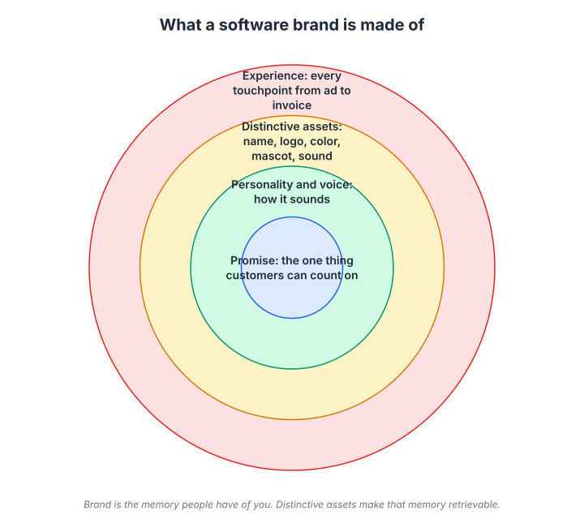
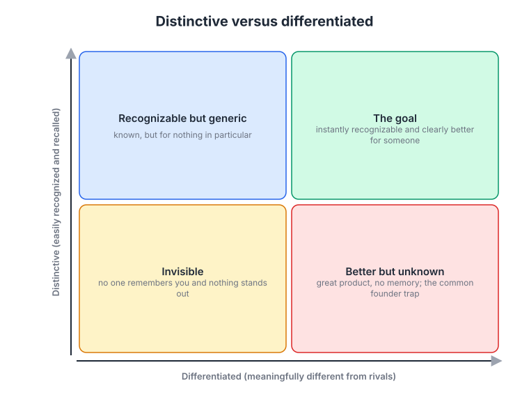
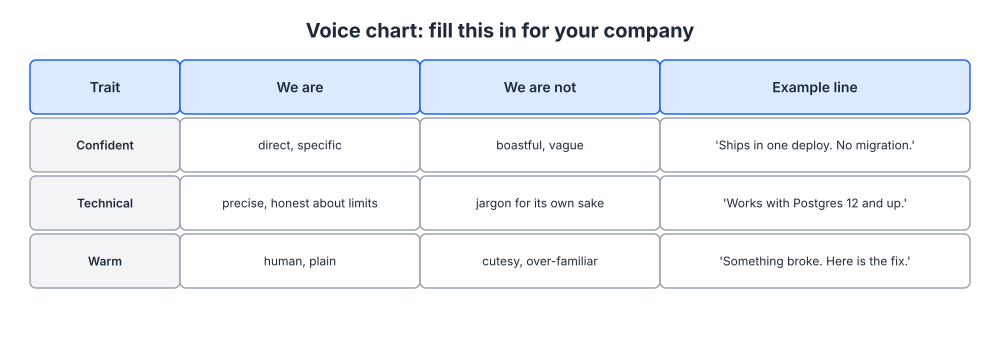

# Week 7: Brand for software companies

> By the end of this week you will be able to explain what your brand actually is in terms of memory and recognition, and write a one-page brand guide that keeps every touchpoint consistent.

**Time budget:** reading about 3 hours, videos about 2 hours, exercise 2 to 4 hours.

## What this week covers and why it matters for a founder

Ask a technical founder what their brand is and they will point at the logo. Ask a marketer and you will get a paragraph of abstractions about purpose and authenticity. Both answers are wrong in useful ways. A brand is the memory a person has of you: what comes to mind when they hear your name, and whether your name comes to mind at all when they have the problem you solve. Everything else (the logo, the colors, the voice, the tagline) exists to make that memory easier to form and easier to retrieve.

The founder's situation is that almost nobody in the market is buying right now. Research from the Ehrenberg-Bass Institute and the LinkedIn B2B Institute puts it at roughly 95 percent of B2B buyers being out of market at any given moment. If your marketing only speaks to the 5 percent who are buying this quarter, you are invisible to everyone whose purchase decision is next year. Brand is the work of being remembered by the 95 percent so that when they enter the market you are on the shortlist without having to win an auction for their attention.

The mistake founders make is to treat brand as a later-stage luxury, something you buy with a Series B and an agency. In reality, small companies build brand every day whether they mean to or not. Every error message, every invoice, every reply from the founder on a forum is depositing a memory. The question is whether those memories are consistent and distinctive, or random.

What changes when you get it right is that your other marketing gets cheaper. Ads perform better because people recognize the name. Content gets shared because it sounds like someone. Sales cycles shorten because the buyer has already formed a positive impression before the first call. And your product decisions get easier, because "would our brand do this?" becomes a real question with a real answer.

The output this week is a one-page brand guide: a promise, three personality traits, a voice chart, and visual basics. It is deliberately short. A brand guide nobody reads protects nothing.

## Core concepts

### 1. What a brand is made of

Think of a software brand as four layers, from the inside out.



*The promise is the one thing customers can count on; the outer layers are how that promise becomes recognizable and how it is actually experienced. Brand is the memory people have of you; distinctive assets make that memory retrievable.*

At the center is the promise: the one thing customers can count on from you. It is derived directly from your positioning in week 4 and your value proposition in week 5. Stripe's promise, as experienced by developers, has always been that the hard parts of money will be handled with care so you can get back to building. Linear's promise is that the tool will be fast and thoughtfully made. Basecamp's is calm: fewer meetings, less chaos, opinions included.

The second layer is personality and voice: how the company sounds. Slack launched with a playful, human voice that made a business tool feel friendly, and it carried that through release notes and error messages. Mailchimp wrote its voice down in a public style guide and it shaped a decade of copy. Personality is what makes a brand feel like someone rather than something.

The third layer is distinctive assets: the name, logo, colors, typography, mascot, sound, or catchphrase that let a person recognize you without reading. Mailchimp's Freddie the chimp, Duolingo's owl, Notion's black-and-white illustrations, Stripe's gradient, Linear's dark, precise interface. These are not decoration; they are retrieval cues. The more consistently they appear, the faster the memory forms.

The outer layer is the experience: every touchpoint from an ad to the invoice. This is where software companies have an advantage over consumer goods, because the product itself is a touchpoint used daily. Docs, onboarding, error messages, support replies, changelogs, billing emails, and the founder's posts all either reinforce the promise or contradict it.

Marty Neumeier's point in The Brand Gap is worth remembering: the brand is what the customer feels it is, not what the company says it is. You do not control the brand. You control the inputs.

The failure mode is spending on the third layer without settling the first. A rebrand with a new logo and no clear promise produces a prettier version of a company nobody can describe. Settle the promise first; it is one sentence and it comes straight from the work you have already done.

### 2. Distinctive versus differentiated

This distinction, from Byron Sharp's research at Ehrenberg-Bass, is the most useful idea in this week. Differentiated means meaningfully different from rivals: you do something they do not. Distinctive means easily recognized and recalled: people know it is you at a glance. Founders obsess over the first and neglect the second.



*The common founder trap is the "better but unknown" quadrant: a differentiated product with no memory attached to it. The goal is the top right, instantly recognizable and clearly better for someone.*

The grid has four quadrants. Invisible: neither recognized nor different; nobody remembers you and nothing stands out. Recognizable but generic: known, but for nothing in particular, which describes a lot of well-funded companies with big ad budgets and vague positioning. Better but unknown: a great product with no memory attached, which is where most technical founders live. And the goal: instantly recognizable and clearly better for someone.

Sharp's research on consumer brands found that most brands in a category are not perceived as very different from each other by buyers, and that what drives growth is mental availability (being thought of in buying situations) and physical availability (being easy to buy). His argument is that distinctiveness, built through consistent assets, does more for growth than most differentiation claims. In software the picture is more nuanced, because products genuinely do differ and buyers do evaluate them. But the lesson holds: a real difference that nobody remembers is worth nothing.

Consider the pattern. Liquid Death sells canned water, a product with essentially no functional differentiation, and grew into a large brand almost entirely through distinctiveness: a heavy-metal aesthetic, tallboy cans, a name nobody forgets. Old Spice's 2010 campaign did not change the product; it made the brand impossible to confuse with anything else. In software, Duolingo's owl on TikTok is pure distinctive asset work; the app was already differentiated, and the owl made it memorable to people who had not yet thought about learning a language.

Your positioning work from week 4 is your differentiation. This week is about making it distinctive: choosing a small number of assets and applying them with relentless consistency.

The failure mode is changing your assets because you are bored of them. You see your logo every day; your customers see it a few times a year. By the time you are sick of it, they are just starting to recognize it.

### 3. Mental availability and why the mainstream buys the familiar

Mental availability is the probability that your brand comes to mind when a buyer is in a buying situation. It is built through memory structures: links between your brand and the cues that show up in those situations. "Deploy preview" links to Vercel. "Team chat" links to Slack. "Payments API" links to Stripe. The more cues you are linked to, and the stronger those links, the more often you are on the shortlist.

This connects to the adoption curve from week 1. Early adopters seek out new, different things and will tolerate an unknown brand. The early majority, who make up the bulk of any market, buy what feels safe, and safe means familiar. A brand that is only differentiated wins the early adopters; a brand that is also distinctive is what carries you across to the mainstream.


*The bulk of the market sits in the early and late majority, who buy what is familiar. Building memory among people who are not yet buying is how a brand moves from the left of this curve to the middle. Source: [Wikimedia Commons](https://commons.wikimedia.org/wiki/File:Diffusion_of_ideas.svg)*

Les Binet and Peter Field, analyzing decades of advertising effectiveness data for the IPA, found that campaigns aimed at building long-term brand memory and campaigns aimed at short-term sales activation work on different timescales and that the most effective advertisers do both. Their widely quoted rule of thumb for established consumer brands is about 60 percent of budget on brand and 40 percent on activation. Their later work with the LinkedIn B2B Institute suggested a more even split for B2B.

For a startup the caveats matter. You have no budget for brand advertising and no time horizon to wait for it. The point is not the ratio; it is that activation-only marketing (paid search, retargeting, promotions) captures demand but never creates it, and it gets more expensive as you exhaust the in-market 5 percent. Brand for a startup is built through cheap, consistent, repeated exposure: founder content, design quality, opinionated writing, and community. Week 14 covers founder-led distribution; think of it as your brand budget.

HubSpot is the software example. It spent its first decade making "inbound marketing" a phrase that marketers linked to HubSpot, through a blog, free tools, a conference and a book. When those marketers eventually had budget, HubSpot was already in their heads.

The failure mode is measuring brand work with activation metrics. A founder posts thoughtful content for two months, sees no signups attributed to it, and stops. Brand shows up as branded search volume, direct traffic, and prospects saying "I have been reading your stuff for a year" on the first call. Track those.

### 4. Voice and tone

Voice is the consistent personality in everything you write. Tone is how that voice adapts to the situation: a changelog and a downtime notice come from the same voice in different tones. Writing this down is the single highest-return brand exercise for a small company, because it lets anyone (a contractor, a first hire, a support tool) write as you.



*Each trait is defined by what it is and what it is not, with a real example line. The "we are not" column is what stops a trait from sliding into its caricature.*

The voice chart is simple. Pick three traits. For each, write what it means in practice, what it does not mean (the caricature), and an example line. Confident means direct and specific, not boastful and vague. Technical means precise and honest about limits, not jargon for its own sake. Warm means human and plain, not cutesy and over-familiar. The "we are not" column is the important one, because every trait has a failure mode and naming it prevents drift.

Mailchimp's public voice and tone guide is the reference here, and it is in the reading list. It defines a voice and then shows how the tone shifts by context, from a success message to a compliance warning. Notice how much of it is about restraint: when to be funny and when funny would be insulting. Slack's early voice was similar, playful in the product and careful in the incident reports. Basecamp's voice is opinionated and plain, and it extends to the founders' public writing, which is why the company feels like specific people rather than a brand.

Voice reaches further than marketing copy. Error messages, empty states, billing emails and API documentation are all read more often than your homepage. Stripe's docs are a brand asset because they are written with unusual care: clear, complete, and respectful of the reader's time. That care is the promise made tangible.

The failure mode is a voice chart that describes every company. "Friendly, professional, innovative" is not a voice. Test each trait by asking whether a serious competitor could claim its opposite. If nobody would say "we are unfriendly", friendly is not a trait, it is a baseline.

### 5. Visual identity minimums and consistency

You do not need a full identity system to have a consistent brand. You need a small set of decisions applied everywhere. A wordmark (your name in one typeface, in one weight). One primary color and one or two supporting colors. One typeface for headings and one for body text, or one for both. A rule for screenshots (real product, consistent framing, light or dark mode). A rule for illustration or photography, even if the rule is "none". That is enough to make a homepage, a deck, a docs site and an invoice look like they came from the same company.

Atlassian's design system, in the reading list, shows what this looks like at scale: components, colors, typography and writing guidelines that let thousands of people ship consistent work. You are not building that. You are building the one-page version that prevents the most common startup problem: a website, a product, and a sales deck that look like three different companies.

Linear is the software example of design as brand. The product is fast and precise, the website is dark and spare, the changelog is written with care, and the whole thing signals craft before you have read a word. Notion made black-and-white line illustrations a distinctive asset so consistently that imitators became a recognizable genre. Apple is the canonical case: the 1984 commercial and the 1997 "Think Different" campaign both worked because they said almost nothing about products and everything about what the company stood for, and the products then delivered on it for decades.

Consistency is where startups fail. The logo differs slightly on the app icon, the docs use a different blue, the deck uses default fonts. Together these tell the customer that nobody is paying attention, and that impression transfers to the product.

The failure mode on the other side is polish before substance. A company with a gorgeous identity and no clear promise has spent money making its confusion look expensive. Do the promise and the voice first; the visuals should express them.

### 6. Naming basics

You may already have a name. If you are about to choose one, or considering a change, a few rules save years of regret.

Names fall on a spectrum from descriptive (what it does: Salesforce) through suggestive (evokes the benefit: Slack, Stripe, Loom) to abstract (means nothing until you fill it: Zapier, Figma). Descriptive names are easy to understand and hard to own; they get lost in search and cannot stretch if the product changes. Abstract names are easy to own and expensive to fill with meaning. Suggestive names are the usual sweet spot for software: short, pronounceable, spellable after hearing it once, and hinting at the promise without limiting it.

Practical checks before you commit: say it on the phone and have someone write it down; search it and see who already owns the results; check the trademark registers in your main markets; check the domain and the social handles, accepting that a modifier (getX, tryX, X.dev) is fine early. Avoid names that describe a feature you may outgrow. Avoid names that are hard to search for because they are common words.

The failure mode is renaming to fix a marketing problem that is really a positioning problem. A new name with the same vague promise is a vague company with a fresh domain.

## Videos

- [Steve Jobs, 1997 internal talk on marketing and values (Think Different launch)](https://www.youtube.com/watch?v=keCwRdbwNQY)
  Why watch: if you saw it in week 1, watch it again with this week's lens. Jobs argues that marketing is about what the company stands for, not product specs, and then shows the campaign. About 7 minutes.
- [How Brands Grow talk, Byron Sharp](https://www.youtube.com/watch?v=VUFYkOE2538)
  Why watch: the evidence behind mental and physical availability and distinctive assets, delivered by the researcher himself. Pick the top result; 30 to 60 minutes.
- [The Long and the Short of It, Les Binet and Peter Field](https://www.youtube.com/watch?v=F-_fo3YhPso)
  Why watch: the data on brand versus activation and why they work on different timescales. Watch for the argument, then apply the startup caveats from this week. About 30 to 45 minutes.
- [The Brand Gap talk, Marty Neumeier](https://www.youtube.com/watch?v=ApRrkjpReQU)
  Why watch: the clearest short explanation of what a brand is (a gut feeling) and why strategy and creative usually fail to meet. Typically 20 to 40 minutes.
- [Apple "1984" Super Bowl commercial](https://www.youtube.com/watch?v=2zfqw8nhUwA)
  Why watch: one minute. Notice that it never shows the product and says nothing about specs; the entire ad is a statement of what the company stands against.

## Recommended reading

- [The Brand Gap, Marty Neumeier (SlideShare)](https://www.slideshare.net/coolstuff/the-brand-gap). What to take from it: the whole book in slide form; the definitions of brand, differentiation and the gap between strategy and design.
- [The Brand Report Card, Kevin Lane Keller (HBR, 2000)](https://hbr.org/2000/01/the-brand-report-card). What to take from it: ten characteristics of strong brands; score yourself honestly on consistency and on whether the brand delivers what customers want.
- [Building Brands Without Mass Media, Joachimsthaler and Aaker (HBR, 1997)](https://hbr.org/1997/01/building-brands-without-mass-media). What to take from it: examples of companies that built strong brands through experience, community and product rather than advertising, which is exactly your situation.
- [Branding in the Digital Age, David Edelman (HBR, 2010)](https://hbr.org/2010/12/branding-in-the-digital-age-youre-spending-your-money-in-all-the-wrong-places). What to take from it: the argument that the post-purchase experience and advocacy are where brand is now built, which for software means the product and support.
- [Mailchimp voice and tone guide](https://styleguide.mailchimp.com/voice-and-tone/). What to take from it: a working example of a voice chart applied to real situations; copy its structure for your own.
- [Atlassian Design System](https://atlassian.design/). What to take from it: what a mature design and writing system covers, so you can pick the five decisions that matter for your one-page version.
- Book: How Brands Grow, Byron Sharp, chapters on mental availability and distinctive assets ([Ehrenberg-Bass Institute](https://www.marketingscience.info/)). What to take from it: the research behind distinctiveness, the double jeopardy law, and why consistency beats novelty.
- Book: Purple Cow, Seth Godin ([Seth's blog](https://seths.blog/)). What to take from it: the case that being remarkable, literally worth remarking on, is the cheapest marketing a small company has.

## Hands-on exercise (2 to 4 hours)

**Deliverable:** a one-page brand guide saved in your company wiki with a promise, three personality traits, a voice chart, and visual basics, plus a touchpoint audit listing the five most inconsistent surfaces to fix.

**Steps:**
1. (15 minutes) Reread your positioning document (week 4) and messaging document (week 5). Write the promise: one sentence stating the one thing customers can count on. If it could be said by a competitor, sharpen it.
2. (20 minutes) List every touchpoint a customer meets in a month: site, signup, onboarding, product UI, error messages, docs, support replies, changelog, billing emails, founder posts, sales deck. Screenshot five of them side by side.
3. (30 minutes) Pick three personality traits. For each, write "we are", "we are not", and an example line using the voice chart. Reject any trait whose opposite no competitor would claim.
4. (20 minutes) Rewrite three real pieces of copy in the voice: one error message, one onboarding email, one support reply. Put the before and after in the guide.
5. (20 minutes) Write the visual basics: wordmark usage, primary and secondary colors with hex values, heading and body typefaces, screenshot rule, illustration or photography rule.
6. (20 minutes) List your distinctive assets (name, logo, color, any mascot or recurring visual or phrase). Rate each on whether a customer would recognize it without the name attached. Decide which one or two to apply everywhere.
7. (30 minutes) Audit the five screenshots from step 2 against the guide. List the five most inconsistent surfaces and assign a fix date for each.
8. (15 minutes) Show the guide to one customer or one person on your team and ask them to rewrite a sentence in the voice. If they cannot, the voice chart is too vague.

**Template:**

```
BRAND GUIDE (one page, v1, date)

Promise: [the one thing customers can count on]

Personality traits
| Trait | We are | We are not | Example line |
|-------|--------|------------|--------------|
| 1     |        |            |              |
| 2     |        |            |              |
| 3     |        |            |              |

Tone shifts
  Success message:
  Error or downtime:
  Sales and pricing:
  Docs:

Visual basics
  Wordmark:
  Colors: primary #, secondary #, neutral #
  Type: headings / body
  Screenshots:
  Illustration or photo rule:

Distinctive assets (apply everywhere)
  1.
  2.

Touchpoint audit
| Surface | What is inconsistent | Fix by |
|---------|----------------------|--------|
```

**How to know it is good:**
- The promise is one sentence and traces directly to your positioning and value proposition.
- Each trait has a "we are not" column that names a real failure mode, and a competitor could plausibly claim the opposite of at least one trait.
- Someone who has never written for you can rewrite a sentence in your voice using only the chart.
- The visual basics fit on half a page and are enough to make a deck, a doc and an invoice match.
- The touchpoint audit names specific surfaces with dates, not "be more consistent".

## Self-check

Answer these without looking back. If you cannot, reread the relevant section.

1. Define brand in one sentence without using the words logo, identity or values.
2. What are the four layers of a software brand, and which one comes straight from your week 4 work?
3. Explain the difference between distinctive and differentiated. Which quadrant are you in today?
4. What is mental availability, and why does it matter more for the early majority than for early adopters?
5. State Binet and Field's rule of thumb and two reasons it does not apply directly to a startup.
6. Why does the "we are not" column matter in a voice chart? Give an example of a trait and its caricature.
7. Name three touchpoints outside marketing copy where voice shows up, and which one your customers read most often.
8. What is the minimum set of visual decisions for consistency?
9. What is wrong with renaming a company to fix a marketing problem?

**You are done with this week when:**
- [ ] Your one-page brand guide is saved with a promise, three traits, a voice chart and visual basics.
- [ ] Three real pieces of copy have been rewritten in the voice and the before and after are in the guide.
- [ ] Your touchpoint audit lists five specific fixes with dates.
- [ ] One person outside the founding team has successfully written a sentence in your voice using only the chart.

## Next week

Next week takes the promise and the messaging and gives them a plot: strategic narrative, the story arc behind case studies and demos, and the six-slide pitch that connects a change in the world to your product.
