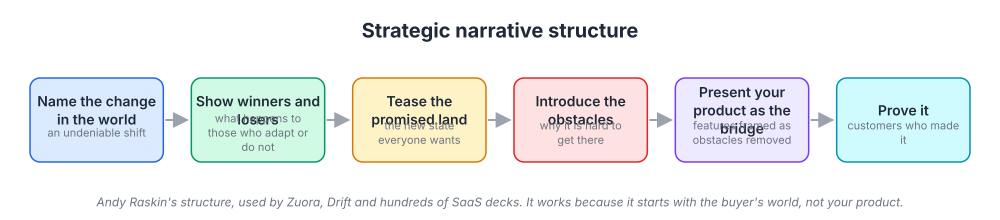
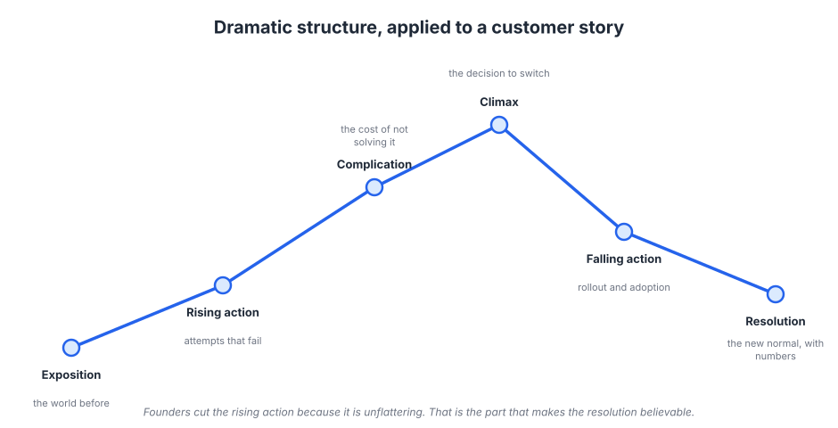
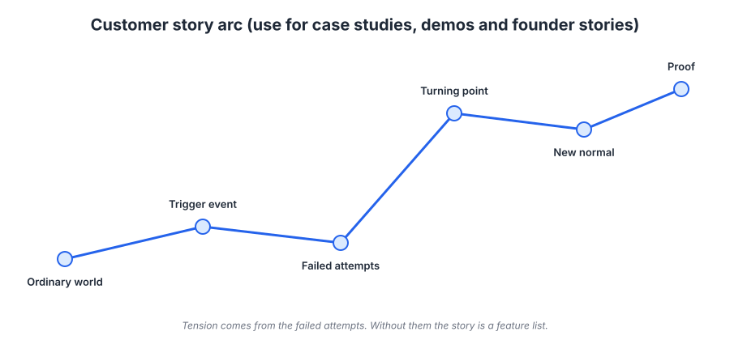
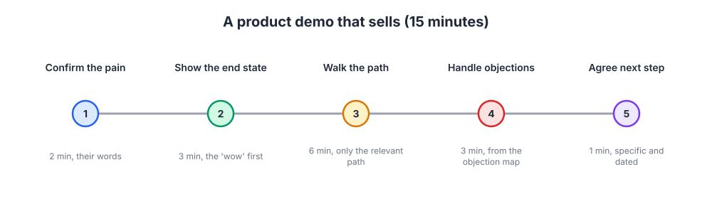

# Week 8: Storytelling, strategic narrative and the pitch

> By the end of this week you will be able to tell one story about a change in the world that connects your positioning to your sales deck, your demo, your case studies and your founder story.

**Time budget:** reading about 3 hours, videos about 2 hours, exercise 2 to 4 hours.

## What this week covers and why it matters for a founder

You now have positioning (week 4), messaging (week 5), pages (week 6) and a brand guide (week 7). What is missing is the plot. A list of true, well-proven claims is still a list. People do not remember lists; they remember stories, and they repeat stories to their colleagues. Narrative is the connective tissue that turns your positioning into something a champion can retell in a meeting you are not in.

The founder's situation is that the default pitch is a product tour. "Here is what we built, here is how it works, here are the features." It is comfortable because it is about the thing you know best. It fails because it starts with you, and the buyer does not care about you yet. They care about their world, what is changing in it, and whether they are going to be on the right side of that change.

The mistake is subtle. Founders think a story means a founding anecdote, or a case study with a happy ending. Those are stories, but the one that matters most is the strategic narrative: the account of a shift in the world that makes your product necessary. Get that right and everything else, from the homepage headline to the demo to the case study, becomes a chapter of the same book.

What changes when you get it right is that your pitch stops being a comparison. Instead of "we are better than the incumbent on these five criteria", it becomes "the world has changed, the old way no longer works, here is what the new way looks like, and here is the bridge." Buyers who accept the change accept the product. Salespeople who can tell the story stop needing you on every call.

The outputs this week: a strategic narrative in six slides, and one case study draft built on a story arc.

## Core concepts

### 1. Why stories work where lists fail

A story is a sequence of events with a change in the middle: something was one way, then something happened, and now it is another way. The human mind is built to track that shape. We remember causes and consequences, and we forget attributes. Ask a customer a month after a demo what they remember and they will not say "SOC 2 and real-time sync"; they will say "the team that showed how deploys went from an afternoon to a click".

Chip and Dan Heath, in Made to Stick, describe why some ideas survive and most do not: they are simple, unexpected, concrete, credible, emotional, and told as stories. The last trait does the work of the other five. A story is concrete by nature, carries emotion through the people in it, and supplies credibility through specifics. Robert McKee, the screenwriting teacher, makes the same argument for business in the HBR interview in this week's reading: persuasion through a list of facts is weak because the listener is arguing with you the whole time. A story lowers the guard, because the listener wants to know what happened next.

For marketing, this means every asset benefits from a before and after. The homepage's problem-and-outcome section from week 6 is a compressed story. A testimonial with a "we used to" and "now we" is a story. Even a changelog entry reads better as "you told us X was painful; now it does Y".

The failure mode is the story that has no tension. If nothing went wrong, nothing was at stake, and there is no reason to keep listening. Founders remove the struggle from case studies because it feels negative. The struggle is the story.

### 2. The strategic narrative

Andy Raskin's "The Greatest Sales Deck I've Ever Seen" describes the structure Zuora used to build the "subscription economy" narrative, and it has since been borrowed by hundreds of software companies. It has five moves, with proof as the sixth.



*The structure works because it starts with the buyer's world, not your product. Your product does not appear until step five, and when it does, its features are framed as obstacles removed.*

First, name a change in the world. Not a problem, and not your product, but an undeniable shift that everyone in the room already half-believes. Zuora's was that businesses are moving from selling products to selling subscriptions. Drift's was that buyers no longer want to fill out forms and wait; they want to talk now. Salesforce's, in 1999, was that software should be delivered over the internet, expressed as "the end of software". Snowflake's, in 2020, was that data was moving to the cloud and needed a single place to live, which it named the data cloud.

Second, show there will be winners and losers. The change is not neutral; the companies that adapt will pull ahead and the ones that do not will fall behind. This creates the stakes. It is where loss aversion from week 5 does its work, honestly, because the losses are real.

Third, tease the promised land: the new state everyone wants, described without your product in it. This is a crucial discipline. If the promised land is "using our tool", the story collapses into a pitch. If it is "every customer conversation answered in seconds, day or night", the buyer wants it whether or not they buy from you.

Fourth, introduce the obstacles. Why is the promised land hard to reach? What have people tried that did not work? This is where the competitive alternatives from your week 4 positioning appear, framed as approaches that fall short of the new state rather than as villains.

Fifth, present your product as the bridge. Each unique attribute from your positioning is now reframed as an obstacle removed. Real-time sync is not a feature; it is the thing that makes same-day reporting possible in the world you described.

Sixth, prove it. Customers who made it to the promised land, with the numbers and quotes from your week 5 proof work.

Slack's launch is a compact example. The change: work communication had moved from email to a scatter of tools and nobody could find anything. The losers: teams drowning in email. The promised land: "be less busy". The obstacle: chat tools that were just another silo. The bridge: search, integrations and a single place for everything. The proof: early customers and the founders' own use.

The failure mode is a change nobody believes. If step one is contested ("remote work is here forever", said in the wrong year to the wrong audience) the rest never lands. Pick a change your ICP already sees, and make them feel you see it more clearly.

### 3. Duarte's shape and the story arc

Nancy Duarte, analyzing famous speeches, found a repeated shape she calls the sparkline: the speaker moves back and forth between what is and what could be, widening the gap each time, and ends on the new bliss, a picture of the world after the idea is adopted. The strategic narrative is a sparkline with business content. The gap between the old way and the promised land is the engine.

The older, more general version of this is the dramatic arc that Gustav Freytag described in the 19th century: exposition, rising action, climax, falling action, and resolution.



*Every case study and founder story has this shape whether you intend it or not. The rising action, where things get harder before they get better, is the part founders cut and the part readers need.*

Translated for a customer story, the arc has six beats.



*Use this for case studies, demos and founder stories alike. Tension comes from the failed attempts; without them the story is a feature list.*

Ordinary world: what the customer's life looked like before, in their words. Trigger event: what changed that made the old way stop working (a new hire, a growth spurt, an outage, a compliance deadline). Failed attempts: what they tried first and why it did not work. Turning point: how they found you and what made them decide. New normal: what daily life looks like now. Proof: the numbers and the quote.

The trigger event is where this connects back to week 3. Trigger events are buying signals; a story built around one teaches your sales team what to look for and teaches prospects to recognize themselves.

Apple's iPhone introduction in 2007 is the most-studied example of arc in a product launch. Jobs did not open with the phone. He said Apple was introducing three revolutionary products: a widescreen iPod, a phone, and an internet communicator. He repeated the three, faster, and let the audience realize they were one device. Ordinary world (three devices in your pocket), tension (repetition building expectation), turning point (they are one thing), promised land (the demo). The structure did as much work as the product.

The failure mode is starting at the turning point. "Company X chose us because" skips the ordinary world and the failed attempts, so the reader has no reason to care and no way to recognize themselves.

### 4. Case studies that sell

A case study is a story arc with a specific job: to answer the fit objection from your week 5 map. "Does this work for a team like ours?" is answered by a story about a team like theirs. That determines everything about how you write it.

Choose the customer for resemblance, not for logo size. A story from a company in your ICP that a prospect recognizes as a peer will outperform a story from a famous company in a different industry. Lead with the ordinary world and the trigger, in the customer's own words, from a recorded interview. Write the failed attempts honestly, including any competitor they tried, because that is what makes the turning point credible. Put the numbers in the new normal, with enough method to be believed ("measured over the first 90 days, comparing to the prior quarter").

Structurally: a headline that states the outcome ("How Acme cut reporting from three days to three hours"), a short summary box with the trigger, the result, and the product area used, then the arc in 400 to 800 words, then a pull quote. Most readers will only read the headline and the box, so put the story's meaning there.

Superhuman's early growth offers an unusual example of story as onboarding. Every new user got a one-on-one session in which the product was introduced not as a feature tour but as a transformation: here is how you work today, here is what it will feel like to be done with email by noon. Users came out of it able to tell the story, and many did, publicly. Dropbox's 2008 demo video is the same idea at a distance: a narrated story of a file moving between machines, with jokes for the Digg audience it was made for, that reportedly grew the waitlist many times over in a day. Neither is a case study in form; both are story arcs doing a case study's job.

The failure mode is the case study written by marketing about marketing. "Acme wanted to increase efficiency and chose our platform for its extensive capabilities" contains no trigger, no attempts, no numbers and no person. Go back to the recording and find the sentence where the customer describes the day it broke.

### 5. The founder story and the category narrative

Two more story types deserve their own treatment.

The founder story answers a different question: why should I trust you to keep going? Its arc is the same six beats, applied to you. What were you doing before, what did you see that others missed, what did you try that failed, when did it click, and what does the company exist to do now? It is the strategic narrative told in the first person. The temptation is to make it heroic; resist it. The credible version has a specific frustration, a specific moment of noticing, and a specific decision. Drew Houston forgetting a USB stick is a small, believable origin for Dropbox. Grand missions are less believable than small irritations.

The category narrative is the strategic narrative told at the level of the market rather than the product. It is what you tell when you are trying to create or rename a category, as Drift did with conversational marketing and Gong with revenue intelligence. The difference from a product pitch is that the category narrative could in principle be told by a competitor; it argues for the new way of doing things, and only then for you as its best example. That is more expensive, because you are educating the market, but it is what wins when you are the first mover in a change that is real.

Most founders should tell a product-level strategic narrative, not a category narrative, until they have the evidence and the customers to back a bigger claim. Week 21 returns to category creation as a go-to-market decision.

### 6. The sales deck and the demo

The strategic narrative becomes a sales deck almost mechanically: one or two slides per move, six to ten slides total, product not appearing until the second half. April Dunford's Sales Pitch extends this with a structure specifically for the first sales call, which begins with an insight about the market, lays out the alternatives and their tradeoffs, describes the perfect world, and only then introduces the product and its differentiated value, followed by proof, objections and an ask. It is the same shape as Raskin's, tuned for a conversation rather than a keynote.

The demo is where most technical founders undo the story. Having told a good narrative, they open the product and start at the login screen, showing every menu in order. The buyer's attention was won by the promised land; the demo should show it first.



*Show the end state before the path. The wow moment comes first; the walkthrough only covers the path relevant to this buyer, and objections come from the map you built in week 5.*

Confirm the pain, in their words, for two minutes; you learned it in discovery and you are checking you heard right. Show the end state for three minutes: the finished dashboard, the deployed app, the closed ticket. Walk the path for six minutes, and only the path this buyer will take, not every feature. Handle objections for three minutes using the objection map. Agree a specific, dated next step in the last minute. Fifteen minutes total; a demo that runs an hour is a demo that lost the narrative.

Slack's 2014 "So Yeah, We Tried Slack" video, made by Sandwich Video, is a demo in story form: a team's ordinary world, their skepticism, the trigger, and the new normal, with the product shown only as it appears in the story. It is in the video list, and it is a better model for a product video than most feature tours.

The failure mode is the demo that shows everything. Every feature you show that this buyer does not need is a reason for them to think the product is complicated. Tie the demo to the narrative: the change, the promised land, the bridge.

## Videos

- [Strategic narrative talk, Andy Raskin](https://www.youtube.com/watch?v=dkVJnaxDlXE)
  Why watch: Raskin walking through the five moves with real decks, including what goes wrong when companies start with the product. Pick the top result; 30 to 45 minutes.
- [The secret structure of great talks, Nancy Duarte (TEDx, 2011)](https://www.ted.com/talks/nancy_duarte_the_secret_structure_of_great_talks)
  Why watch: the sparkline, what is versus what could be, shown on two famous speeches; the same shape your narrative should have. About 18 minutes.
- [Steve Jobs introduces the iPhone (Macworld 2007 keynote)](https://www.youtube.com/watch?v=VQKMoT-6XSg)
  Why watch: watch the first ten minutes for the three-devices setup and payoff, and note how long he waits before showing the product.
- [Dropbox original demo video, Drew Houston (2008)](https://www.youtube.com/watch?v=3lVtP0HRvyA)
  Why watch: a founder narrating a story about a file, made for one specific audience, that validated demand before the product was ready. About 3 minutes.
- [So Yeah, We Tried Slack (Sandwich Video, 2014)](https://www.youtube.com/watch?v=B6zVzWU95Sw)
  Why watch: a product video built entirely as a customer story arc, with the product only shown as it appears in that story. About 2.5 minutes.

## Recommended reading

- [The Greatest Sales Deck I've Ever Seen, Andy Raskin](https://medium.com/the-mission/the-greatest-sales-deck-ive-ever-seen-4f4ef3391ba0). What to take from it: the five moves, illustrated with Zuora's deck; this is the primary source for this week's exercise.
- [Storytelling That Moves People, Robert McKee interview (HBR, 2003)](https://hbr.org/2003/06/storytelling-that-moves-people). What to take from it: why persuasion through statistics fails, and what tension and struggle do in a business story.
- [Why Most Product Launches Fail, Schneider and Hall (HBR, 2011)](https://hbr.org/2011/04/why-most-product-launches-fail). What to take from it: a preview for week 21; notice how many launch failures are narrative failures, where the company could not explain why the product mattered.
- [How to Write Usefully, Paul Graham](https://paulgraham.com/useful.html). What to take from it: the test for whether a piece of writing says something true, important, novel and clear; apply it to step one of your narrative.
- Book: Sales Pitch, April Dunford ([author site](https://www.aprildunford.com/)). What to take from it: the structure of a first sales call that starts with insight and alternatives, which is your strategic narrative adapted for a conversation.
- Book: Made to Stick, Chip and Dan Heath, chapters on Emotional and Stories ([Heath Brothers](https://heathbrothers.com/books/made-to-stick/)). What to take from it: why stories are simulations and inspirations, and the three plots that recur in business (challenge, connection, creativity).
- Book: Building a StoryBrand, Donald Miller ([StoryBrand](https://storybrand.com/)). What to take from it: the customer as hero and the company as guide; useful as a check that your narrative does not make you the protagonist. Take the framework, skip the sales pitch.

## Hands-on exercise (2 to 4 hours)

**Deliverable:** a six-slide strategic narrative saved in your wiki or deck tool, and one case study draft of 400 to 800 words built on the story arc.

**Steps:**
1. (20 minutes) Reread your positioning document (week 4) and messaging document (week 5). List the competitive alternatives, the unique attributes, and the three pillars with proof.
2. (30 minutes) Write three candidate "changes in the world" your ICP already believes. For each, ask: would a prospect nod, or argue? Pick the one that is most undeniable and most connected to your unique attributes.
3. (30 minutes) Draft the six slides, one per move, in text only. Slide 1 the change; slide 2 winners and losers; slide 3 the promised land with no product in it; slide 4 the obstacles, including the alternatives; slide 5 your product as the bridge, each attribute framed as an obstacle removed; slide 6 proof.
4. (15 minutes) Read slide 3 aloud. If it mentions your product or a feature, rewrite it until it describes a state the buyer wants regardless of vendor.
5. (30 minutes) Pick one customer who resembles your ICP. Using a recorded call or a new 20-minute interview, fill in the six beats of the story arc in their words: ordinary world, trigger, failed attempts, turning point, new normal, proof.
6. (30 minutes) Write the case study: an outcome headline, a summary box (trigger, result, product area), the arc in 400 to 800 words, one pull quote.
7. (15 minutes) Tell the six-slide narrative to one person who does not know your company, without slides, in under three minutes. Ask them to tell it back. Note what they dropped.
8. (10 minutes) Rewrite your demo outline to follow the five-part structure, with the end state shown before the walkthrough.

**Template:**

```
STRATEGIC NARRATIVE (six slides, v1, date)

1. The change in the world:
   (one sentence, undeniable to the ICP)
2. Winners and losers:
   Winners do:            Losers keep doing:
3. The promised land (no product mentioned):
4. The obstacles (why it is hard; what people have tried):
   Alternative A falls short because:
   Alternative B falls short because:
5. The bridge (each attribute as an obstacle removed):
   Obstacle -> Attribute -> What becomes possible
6. Proof:
   Customer, number, quote

CASE STUDY DRAFT
Headline (outcome):
Summary box: Trigger / Result / Product area
Ordinary world:
Trigger event:
Failed attempts:
Turning point:
New normal:
Proof (number and method):
Pull quote (name, role, company):

RETELL TEST
Listener:            What they kept:            What they dropped:
```

**How to know it is good:**
- Slide 1 states a change your ICP already believes, and slide 3 describes a state they want without naming your product.
- Every unique attribute from your positioning appears on slide 5 as an obstacle removed, not as a feature.
- The case study has a trigger event and at least one failed attempt, and its numbers state how they were measured.
- A stranger can retell the narrative after hearing it once and keeps the change and the promised land.
- Your demo outline shows the end state within the first five minutes.

## Self-check

Answer these without looking back. If you cannot, reread the relevant section.

1. Why does a story persuade where a list of proven claims does not?
2. List the six moves of the strategic narrative in order. At which move does your product first appear?
3. What is wrong with a promised land that mentions your product?
4. Describe Duarte's sparkline and how it maps onto the strategic narrative.
5. What are the six beats of the customer story arc, and which beat supplies the tension?
6. How should you choose which customer to write a case study about?
7. What distinguishes a category narrative from a product-level strategic narrative, and which should most founders tell first?
8. What are the five parts of a fifteen-minute demo, and why does the end state come before the walkthrough?
9. Retell your own strategic narrative in under a minute from memory.

**You are done with this week when:**
- [ ] Your six-slide strategic narrative is saved and slide 3 contains no product mention.
- [ ] One case study draft is written on the story arc with a trigger, failed attempts and measured proof.
- [ ] One person outside your company retold the narrative and kept the change and the promised land.
- [ ] Your demo outline follows the five-part structure.

## Next week

Next week begins the channels section of the program. With positioning, messaging, pages, brand and narrative in place, you can finally choose where to tell the story: channel strategy, product-channel fit, and how to test a channel in four weeks.
