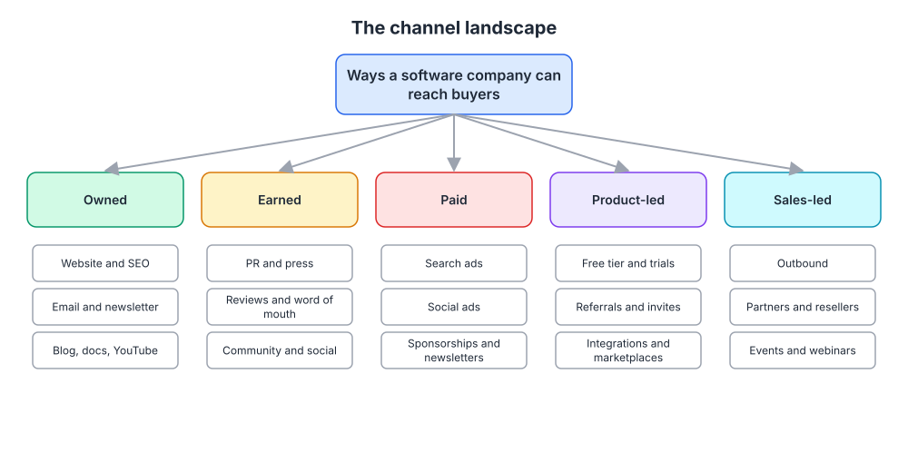
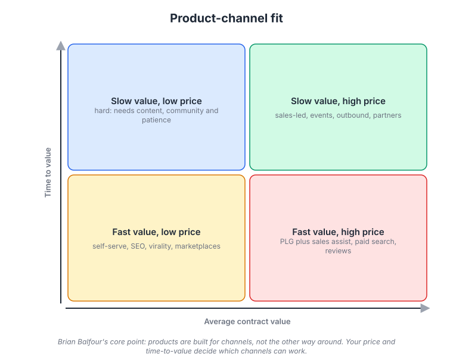
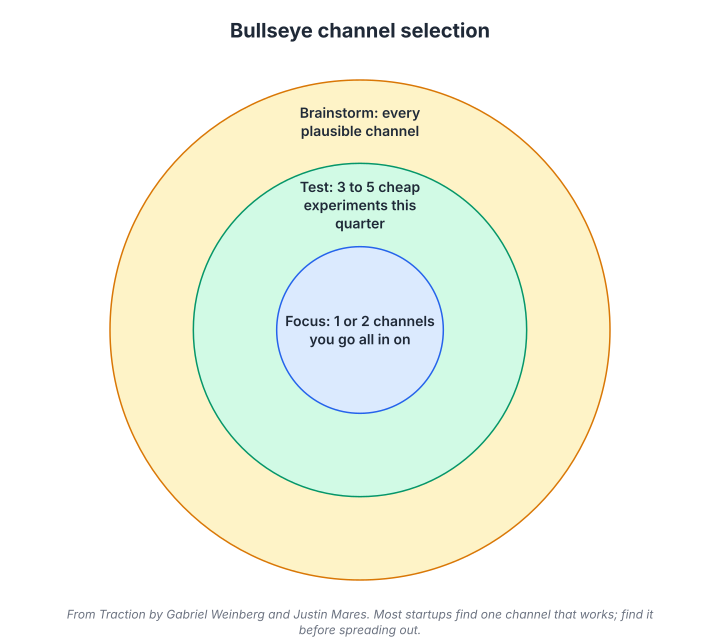

# Week 9: Channel strategy: picking where to play

> By the end of this week you will be able to name the two channels most likely to work for your platform, explain why in terms of your price and time-to-value, and have three cheap channel tests scheduled with pass and fail criteria written down in advance.

**Time budget:** reading about 3 hours, videos about 3 hours, exercise 2 to 4 hours.

## What this week covers and why it matters for a founder

Weeks 1 to 8 were about what you say and to whom. From this week on, the program is about where you say it. A channel is any repeatable path by which a person in your ICP ends up hearing about, trying, or buying your product. Search, a referral loop, a newsletter sponsorship, an outbound sales email, a marketplace listing: all channels.

Here is the situation most technical founders are in. You have a product, a positioning statement from week 4, a messaging doc from week 5, a decent landing page from week 6. Now you need people to show up. The instinct is to try everything at once: post on LinkedIn, run some Google Ads, write a blog post, cold email fifty people, launch on Product Hunt. Three weeks later nothing has obviously worked, you cannot tell which of the seven things you did produced the two signups you got, and you conclude that "marketing is hard".

The mistake is not effort. It is treating channels as a list of tactics to try rather than as a strategy question with a mostly predictable answer. Your product's price, its time-to-value, and who buys it constrain which channels can possibly work. A $30 a month self-serve tool cannot support a field sales team. A $150,000 a year data platform will not spread through a viral invite loop. Brian Balfour's line is the one to remember: products are built for channels, not the other way around. If you understand that, you can eliminate two thirds of the channel landscape before spending a dollar.

What changes when you get this right: you pick one or two channels on purpose, run small tests with written verdicts, and give the winner your full attention for months. Almost every company you admire got big on a single channel first. Zapier on search. HubSpot on content. Dropbox on referrals. Snowflake on enterprise sales. The second channel came later, once the first was a machine.

The concrete outputs of this week are a channel hypothesis document that names your two focus channels with reasoning, and a schedule of three channel tests, each with a budget, a duration, and a pass or fail threshold you commit to before starting.

## Core concepts

### 1. The channel landscape

There are five families of channels for a software company, and it helps to know the whole map before you pick a spot on it.



*The five families and the channels inside each; every channel you will ever consider fits in one of these boxes.*

**Owned** channels are assets you control: your website and its search traffic, your email list, your blog, your docs, your YouTube channel. They are slow to build and cheap to run. Once they work, nobody can take them away or raise the price on you. Weeks 10, 11, and 13 cover these in depth.

**Earned** channels are attention other people give you: press, reviews, word of mouth, community mentions, social sharing. You cannot buy them directly, which is exactly why they carry trust. They also do not scale on command. You can make earned attention more likely (a good product, a strong opinion, a launch worth talking about) but you cannot schedule it.

**Paid** channels are attention you rent: search ads, social ads, sponsorships in newsletters and podcasts, review site placements. Fast to start, easy to measure, and the price rises the moment your competitors notice. Week 12 goes deep here.

**Product-led** channels use the product itself as the distribution mechanism: free tiers and trials that turn users into buyers, referral and invite loops, integrations and marketplace listings where another product's users find you. Slack spread inside companies because one team invited another. Calendly and Loom spread because every link sent was an advertisement. Week 16 covers loops properly.

**Sales-led** channels involve a human reaching out: outbound email and calls, partners and resellers, events and webinars. Expensive per contact, but the only option when the deal is large and the buyer is a committee.

A common failure mode: founders think only about paid and sales-led, because those have obvious buttons to press and fast feedback. Owned and product-led channels feel vague because their loop is slow. But the slow channels usually create durable, cheap growth, and the fast ones create a treadmill.

The opposite failure mode is refusing to spend money or do sales on principle. Atlassian famously grew for years with no traditional sales force, selling Jira and Confluence through transparent self-serve pricing. That worked because their price was low, the products were tried by individual developers, and adoption spread from the bottom up. Copying the "no sales" stance without copying the conditions that made it work is cargo cult marketing.

### 2. Product-channel fit and Balfour's four fits

Brian Balfour, who ran growth at HubSpot and later founded Reforge, argues that product-market fit is not enough. A company needs four fits to grow: market-product fit, product-channel fit, channel-model fit, and model-market fit. This week is mostly about the middle two.

**Product-channel fit** means the product is shaped to fit the rules of the channel, because the channel will not reshape itself for you. Search rewards pages that answer specific queries, so Zapier built a page for every pair of apps it connects ("Connect Slack and Trello"), and those tens of thousands of pages became its largest acquisition source. Virality rewards products where using them exposes them to others, so Dropbox's referral program gave both sides extra storage and Superhuman's invite-only waitlist turned every user into a recruiter. Sales rewards products with a clear ROI story for a budget holder, so Snowflake sells through account executives to data leaders with real budgets.

**Channel-model fit** means the channel's cost per customer must be affordable given how much a customer pays you. Balfour draws this as a spectrum: low annual contract value (ACV) products need low-cost channels (search, virality, self-serve), high ACV products can afford high-cost channels (field sales, events, partners). The dead zone is in the middle. A product at $5,000 a year is too expensive to spread virally and too cheap to sell with a salesperson. Many B2B startups live in that zone and struggle until they either move up (add an enterprise tier and a sales-assist motion) or down (a self-serve tier that spreads).



*Find your quadrant by price and time-to-value; the channels listed there are the ones that can work, and the ones not listed usually cannot.*

The diagram adds a second axis Balfour's essays imply: time to value. If a new user can get value in ten minutes without talking to you, self-serve channels (search, product loops, marketplaces) are open. If value takes a month of implementation, you need channels that carry a human relationship (sales, partners, events) or content patient enough to educate someone over months.

Work through the quadrants for your platform honestly. Fast value and low price: self-serve, SEO, virality, marketplaces (Canva, Zapier, Loom). Fast value and high price: product-led growth with sales assist, paid search on high-intent terms, review sites (Datadog, Figma at the enterprise tier). Slow value and high price: sales-led, events, outbound, partners (Snowflake, most enterprise infrastructure). Slow value and low price is the hardest quadrant: you need content, community, and patience, and you should probably change the product or the price.

Failure mode: choosing a channel because it worked for a company you admire without checking whether you share their quadrant. Founders of a $20,000 a year platform read about Slack's word of mouth and try to make their onboarding "viral". Slack's price and instant team value made that possible; theirs does not.

### 3. Channel economics: CAC, payback, saturation, and shitty clickthroughs

Every channel has three numbers you should be able to estimate before and measure after.

**Customer acquisition cost (CAC)** is total spend on a channel over a period, including the people time, divided by the paying customers it produced. Founders undercount this by ignoring their own hours. If you spent 40 hours writing content that produced two customers, your CAC in that channel is 20 hours of founder time per customer, which is not free.

**Payback period** is how many months of gross margin from a customer it takes to recover CAC. David Skok's "Startup Killer" essay makes the point bluntly: most startups die not because they cannot acquire customers but because acquiring them costs more than those customers are worth. A 12 month payback is workable for a venture-backed SaaS company. Under 6 months is excellent. Beyond 18 months, you are financing your customers and will run out of cash before they pay you back.

**Saturation** is the point where spending more in a channel returns less per dollar. Every channel saturates. The keyword with 500 monthly searches only has 500 searches. The newsletter with 30,000 readers only has 30,000 readers. Paid channels saturate as you widen targeting to reach more people who care less. Referral loops saturate when you have reached most of the people your users know.


*Marketing and sales are one link in the chain that turns effort into margin; a channel whose cost eats the margin at that link breaks the whole chain. Source: [Wikimedia Commons](https://commons.wikimedia.org/wiki/File:Porter_Value_Chain.png)*

Andrew Chen's "Law of Shitty Clickthroughs" adds the time dimension. Every new channel or format performs best when it is new, because audiences have not yet learned to ignore it. The first banner ad in 1994 had a click rate above 40 percent; today it is a fraction of a percent. A channel that works today will decay, faster as competitors pile in. That is an argument for building owned assets while rented channels still pay, and for finding your next channel before the current one stops.

Failure mode: measuring a channel on the wrong metric. Clicks, followers, and even signups are inputs. The output is paying customers who stay, and their cost. Every channel test you run should track through to at least an activated user and ideally to revenue.

### 4. Why most companies get one channel to work

Gabriel Weinberg and Justin Mares surveyed dozens of companies for their book Traction and found a consistent pattern: most successful startups got their growth from one channel, not a mix. HubSpot and content. Zapier and search. Dropbox and referrals. Shopify and its partner and app ecosystem, where agencies and app developers brought merchants to the platform. Canva and search for templates ("birthday invitation template"), which pulls in people who did not know they wanted a design tool. Datadog and its integrations catalog plus a heavy presence at developer conferences.

Two reasons the pattern holds. First, a power law: the best channel for a given product is often ten times better than the second best, not 20 percent better. Second, attention: a channel only works once you understand its rules deeply, and a small team can learn one channel at a time. Zapier did not write a couple of integration pages; it built thousands. HubSpot did not publish a few posts; it built a content machine with dedicated writers, a free grader tool, and an academy.

Most founders get this wrong in a specific way. They run every channel at 20 percent intensity, below the threshold where any channel shows a signal, and conclude none of them work. Content needs three months and a dozen pieces. Search needs six months. Outbound needs a few hundred well-targeted emails with a good offer, not thirty generic ones. Paid needs enough budget to get statistically meaningful conversion data, which is usually more than a few hundred dollars.

So the strategy is: narrow first, then go deep. Which brings us to how to narrow.

### 5. The Bullseye method and designing a channel test

Traction's Bullseye framework is a three-ring process for choosing a channel without guessing.



*Move from the outer ring inward; the point is to reach the center, one or two channels you go all in on, as quickly and cheaply as possible.*

**Outer ring: brainstorm.** List every plausible channel, including the ones you dislike. For each, write one sentence on how it could work for your product specifically, and a rough guess at cost per customer. Use the landscape diagram from concept 1 so you do not skip whole families. The quadrant from concept 2 will let you cross out most of the list with a reason.

**Middle ring: test.** Pick three to five channels and run cheap, short tests. The purpose of a test is not to acquire customers; it is to answer one question: does this channel produce people from my ICP at a cost that could plausibly work at scale? Keep each test small enough that you can run them in parallel and cheap enough that failure costs little.

**Center: focus.** One channel showed a signal that the others did not. Put everything into it. Read everything about it, hire or contract for it, build product features for it. Stay there until it saturates or decays. Only then go back to the outer ring.

Designing a good channel test is where most of the value is, so here is the structure to use.

A test has a **hypothesis**: "Developers at seed-stage startups who search for 'how to [specific problem]' will read a guide and sign up for a free account at a rate that makes search worth pursuing." It has a **budget** in dollars and hours. It has a **duration**, typically four weeks; shorter and you have noise, longer and you have lost a month on a loser. It has a **primary metric** that goes at least as far as an activated user, and a **quality check**, such as "at least half of the signups match the ICP scorecard from week 3." And critically, it has a **threshold written before the test starts**: "If fewer than 10 ICP-matching signups in four weeks, stop."

The written threshold is the whole trick. Without it, you will look at a weak result, remember all the effort, and decide it "just needs more time". Sometimes that is true. Usually it is sunk cost talking. A verdict written in advance protects you from yourself.

Michael Seibel of Y Combinator makes a related point about first customers: for a very early company, the best first channel is often just talking to people directly, because it gives you feedback along with the customer. Treat founder-led outreach as a channel test in its own right. If you cannot get a stranger in your ICP to take a call and try your product after a good email, no other channel will do it for you either.

Failure mode: tests that cannot fail. A test with no threshold, no budget cap, or a metric like "awareness" will always be declared a partial success and dragged on. Make each test falsifiable.

## Videos

- [Why Product Market Fit Isn't Enough, Brian Balfour (Reforge talk)](https://www.youtube.com/results?search_query=brian+balfour+four+fits+product+market+fit+isn%27t+enough) (YouTube search)
  Why watch: the four fits explained by the person who framed them, with HubSpot as the running example; about 45 minutes.
- [How to Get Users and Grow, Gustaf Alströmer (Y Combinator Startup School)](https://www.youtube.com/results?search_query=y+combinator+gustaf+alstromer+how+to+get+users+and+grow) (YouTube search)
  Why watch: a former Airbnb growth lead on which channels early companies should and should not bother with, and why retention comes before any of them; about 50 minutes.
- [Lecture 6: Growth, Alex Schultz (Stanford CS183B, 2014)](https://www.youtube.com/watch?v=n_yHZ_vKjno)
  Why watch: Meta's growth chief on why retention is the foundation of every channel and how to think about the "magic moment" before you spend on acquisition; about 50 minutes.
- [Zapier's SEO and partner strategy, Wade Foster (interview)](https://www.youtube.com/results?search_query=wade+foster+zapier+seo+growth+interview) (YouTube search)
  Why watch: the clearest example of product-channel fit, where integration pages built for search became the company's main channel; length varies by interview, usually 30 to 60 minutes.
- [How to Get Your First Customers, Michael Seibel (Y Combinator)](https://www.youtube.com/results?search_query=y+combinator+michael+seibel+how+to+get+your+first+customers) (YouTube search)
  Why watch: a reminder that founder-led outreach is a channel, and the one you should test before any other; about 20 minutes.

## Recommended reading

- [Product Channel Fit, Brian Balfour (brianbalfour.com)](https://brianbalfour.com/essays/product-channel-fit-for-growth). What to take from it: products are built for channels; list the rules of your candidate channels and ask what the product would need to look like to fit them.
- [Four Fits for $100M+ Growth, Brian Balfour (brianbalfour.com)](https://brianbalfour.com/four-fits-growth-framework). What to take from it: the channel model fit and model market fit sections. Channel model fit gives you the ACV spectrum and why the middle is a dead zone, so place your price on it. Model market fit gives you the arithmetic linking ACV, number of customers in the market, and the revenue you want; check whether your ICP from week 3 contains enough companies.
- [The Law of Shitty Clickthroughs, Andrew Chen (andrewchen.com)](https://andrewchen.com/the-law-of-shitty-clickthroughs/). What to take from it: every channel decays; plan for the next one before the current one dies.
- Book: Traction, Gabriel Weinberg and Justin Mares, the Bullseye chapters and the chapters on the two or three channels you are considering. What to take from it: the three-ring process and the catalog of nineteen channels with real examples of each.
- [Startup Handbook, introduction, Julian Shapiro (julian.com)](https://www.julian.com/guide/startup/intro). What to take from it: a compact model of growth as acquisition, conversion, and retention, with which channels tend to work for which kind of product.
- [Startup Killer: the Cost of Customer Acquisition, David Skok (For Entrepreneurs)](https://www.forentrepreneurs.com/startup-killer/). What to take from it: CAC and payback as the numbers that decide whether a channel is viable; build the simple model he describes.
- [Five ways to build a $100 million business, Christoph Janz (blog)](https://christophjanz.blogspot.com/2014/10/five-ways-to-build-100-million-business.html). What to take from it: the "animals" metaphor for price points, which maps almost one to one onto which channels can work.

## Hands-on exercise (2 to 4 hours)

**Deliverable:** a channel hypothesis document (two pages) saved in your company wiki, naming two focus channels with reasoning, plus three channel tests scheduled on your calendar with budgets and written pass or fail thresholds.

**Steps:**
1. (15 minutes) Pull up your ICP from week 3 and your positioning document from week 4. Write down your ACV (or expected ACV) and your honest time-to-value in minutes, hours, or weeks for a new user who does not talk to you.
2. (15 minutes) Place your product in a quadrant of the product-channel fit diagram. Write two sentences on which channel families that opens and which it closes.
3. (30 minutes) Brainstorm the outer ring. Using the channel landscape diagram, list at least 15 channels. For each, write one line on how it would specifically work for your product and a rough guess at cost per customer. Do not skip channels you dislike.
4. (20 minutes) Cross out channels that conflict with your quadrant, and write the reason next to each. You should be left with five to eight.
5. (30 minutes) For each survivor, find one real company in a similar quadrant that grew on that channel. If you cannot find one, downgrade the channel.
6. (30 minutes) Pick three to test. For each, fill in the template below: hypothesis, budget in dollars and hours, duration, primary metric, quality check, and the threshold for pass and fail. Write the threshold before you look at any early data.
7. (15 minutes) Pick your two provisional focus channels: the ones you expect to win, so you can check your prediction later. Write why.
8. (15 minutes) Put the three tests on your calendar with a start date, a midpoint review, and an end date where you write the verdict. Share the document with a cofounder or advisor and ask them to hold you to the thresholds.

**Template:**

```
CHANNEL HYPOTHESIS DOC          Date:            Owner:

Product facts
  ACV (actual or expected):
  Time to value without human help:
  Quadrant:
  Channel families open:            Channel families closed (and why):

Outer ring (15+ channels, one line each with rough cost per customer)
  1. ...

Survivors after quadrant filter (5 to 8, with a comparable company for each)
  1. ...

Provisional focus channels (2)
  A:                Why:
  B:                Why:

TEST 1
  Channel:
  Hypothesis: [ICP segment] will [action] via [channel] at [rate] because [reason]
  Budget: $        Founder hours:
  Start:           Midpoint review:          Verdict date:
  Primary metric (activated users or better):
  Quality check (share of signups matching ICP scorecard):
  PASS if:                                 FAIL if:
  Verdict (fill in at end):

TEST 2 ...
TEST 3 ...
```

**How to know it is good:**
- Every channel you rejected has a reason tied to price, time-to-value, or ICP, not to taste.
- Each test has a metric that goes at least as far as an activated user, not clicks or impressions.
- Each test has a pass and a fail threshold that a skeptical friend would accept as fair, written before the test started.
- The total budget for all three tests is small enough that losing it all would be annoying, not damaging.
- Your two provisional focus channels are ones a real company in your quadrant actually grew on.

## Self-check

Answer these without looking back. If you cannot, reread the relevant section.

1. Name the five channel families and give one example channel in each.
2. What does "products are built for channels, not the other way around" mean in practice? Give an example of a product feature that exists because of a channel.
3. Where is the dead zone on the ACV spectrum, and what are the two ways out of it?
4. Define CAC and payback period. Why does founder time belong in CAC?
5. Explain the Law of Shitty Clickthroughs in two sentences. What does it imply for how you should invest in owned channels?
6. Why do most companies grow on one channel rather than a mix? Give two reasons.
7. A founder ran Google Ads for one week at $200, got 40 clicks and one signup, and concluded paid does not work. What is wrong with that test?
8. Your product costs $8,000 a year and takes two weeks to implement. Which quadrant is that, and which three channels would you test first?
9. What is the single most important thing to write down before starting a channel test, and why?

**You are done with this week when:**
- [ ] You have placed your product in a quadrant by ACV and time-to-value and written which channel families that rules in and out.
- [ ] Your channel hypothesis document names two focus channels with reasons tied to the quadrant.
- [ ] Three channel tests are scheduled, each with a budget, a metric that reaches activation, and pass and fail thresholds written in advance.
- [ ] Someone other than you has read the document and agreed to hold you to the thresholds.

## Next week

Owned channels are the ones that compound, and the biggest of them for most software companies is content. Next week you will build content as a system: what your ICP searches and asks, how to produce it without burning out, and how to distribute it so it is read.
