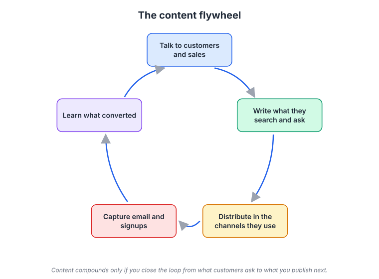
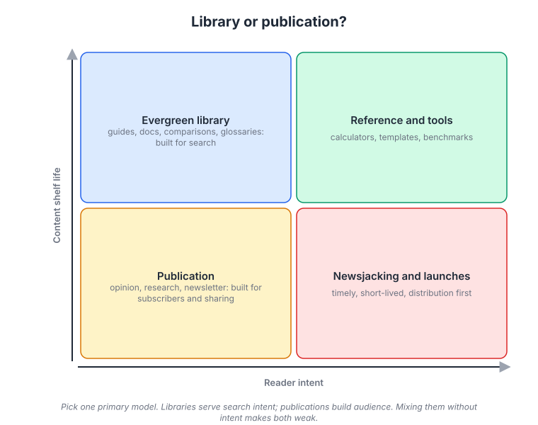
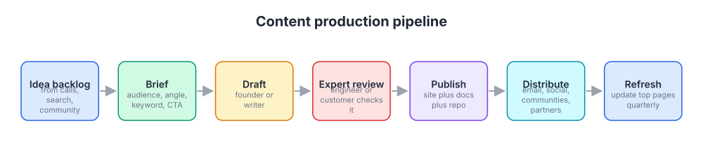

# Week 10: Content marketing that compounds

> By the end of this week you will have a content strategy that names one primary model, a 12-week calendar built from what your ICP actually searches and asks, and three briefs detailed enough that someone else could write the pieces.

**Time budget:** reading about 3 hours, videos about 2.5 hours, exercise 3 to 4 hours.

## What this week covers and why it matters for a founder

Content is the owned channel with the best long-run economics for most software companies, and the one founders most often do badly. The usual pattern: a founder writes four blog posts in a burst of enthusiasm, gets a few dozen views each, notices no signups, and stops. Six months later the "blog" has four posts dated within the same fortnight, which tells every visitor that nobody is home.

The mistake is treating content as posts. Content that works is a system: a clear picture of what your ICP is trying to learn, a model for what you produce, a pipeline that ships without depending on founder mood, a distribution habit, and a loop that feeds what converted back into what you write next. Posts are the visible output. Without the system, they are diary entries.

You have an advantage most marketers would pay for. You built the product, you talked to customers in week 2, you know the problem space better than any writer you could hire. The content that built HubSpot, Ahrefs, PostHog, and Buffer was written or directed by people who deeply understood the subject, not by an agency working from a keyword list.

When the system is in place, content compounds. A guide you publish this quarter is still bringing in ICP visitors two years from now at zero marginal cost. Paid ads stop the moment you stop paying. Content keeps working, which is why it is worth the slow start.

This week's outputs are a content strategy document (one page: audience, model, themes, distribution, measurement), a 12-week calendar, and three written briefs.

## Core concepts

### 1. Content as a system, not a stack of posts

Think of content as a loop with five stages, and notice that only one of them is "write".



*Follow the arrows; content only compounds when the last step feeds the first, so what converted decides what you write next.*

**Talk to customers and sales.** Every sales call, support ticket, and onboarding session contains a question someone paid to have answered. Those questions are your backlog. Basecamp's founders have long treated support conversations as a source of ideas; Intercom's early content came directly from what customers were struggling with.

**Write what they search and ask.** Not what you find interesting. Not your product's feature list. The exact questions, in the words they use. Week 11 covers finding those words in search data; this week you start with what you have heard directly.

**Distribute where they are.** A piece that is published and not distributed has an audience of your existing visitors. More on this in concept 5.

**Capture email and signups.** Give the reader a next step: subscribe, download a template, try the product on the thing you just taught. Without capture, you are educating people you will never see again.

**Learn what converted.** Which pieces produced signups, replies, or sales conversations? Write more like those. Retire what did nothing.

The loop explains why the four-posts-and-stop pattern fails. It executes stage two alone, skips distribution and capture, and never learns anything. Rand Fishkin's talk on why content marketing fails makes the same point: the failure is rarely the writing, it is the absence of an audience to distribute to and an expectation of instant results from a channel that takes months.

Failure mode: writing about your product. A blog of "Introducing feature X" posts is a changelog, not content marketing. Nobody outside your existing users searches for your feature names. The changelog as its own format (Linear does this well) serves retention, not acquisition.

### 2. Library or publication: pick a primary model

There are two fundamentally different ways to run content, and mixing them without deciding weakens both.



*Libraries serve search intent and live for years; publications serve subscribers and live for days; decide which one is primary before writing a word.*

A **library** is a set of evergreen pieces that answer specific questions, built for search and for being linked to. Guides, docs, comparisons, glossaries, templates, calculators, benchmarks. A library page's value is measured over years. It is organized by topic, not by date. Ahrefs runs a library: almost every article answers a "how to" question about SEO, shows how to do it with Ahrefs, and is refreshed when it decays. Zapier's integration pages and its guides on productivity tools are a library. Webflow University is a library disguised as a school.

A **publication** is a stream of timely, opinionated pieces built for subscribers and sharing. Newsletters, essays, original research, podcasts. Its value is the audience it builds and the trust it earns, and its pieces are measured in days or weeks of attention. Buffer's early blog, with its transparency about salaries and revenue, was a publication: people subscribed to follow the story. Intercom's blog in its strongest years was a publication with a library of books attached.

Both models work. They fail when a founder writes a timely opinion piece one week, an SEO guide the next, a product announcement the third, and wonders why neither search nor subscribers show up. Search does not reward opinion pieces that nobody queries. Subscribers do not stay for keyword-driven guides.

How to choose. If your ICP has a clear set of questions they search for, and a searcher can try the product quickly, start with a library. Most B2B and developer tools fit here. If your ICP is a defined community that follows people and ideas, and your positioning has a point of view baked in, a publication can work faster, but it depends on a founder who can write with a voice. Many companies eventually do both: PostHog runs an engineering blog and newsletter beside its docs and public handbook.

Failure mode: choosing a publication because it is more fun to write, when your ICP does not follow anyone and just wants their question answered. Ask five customers what newsletters they read. If the answer is "none", you want a library.

### 3. Content-market fit and content types for software

Content-market fit means your content answers the things your ICP is already trying to learn, in the formats they already consume. The test is simple: could you say, for each piece, who searched or asked for it and where?


*Most of the demand for your content is in the tail: hundreds of specific questions with small search volume each, which is where a small company can win. Source: [Wikimedia Commons](https://commons.wikimedia.org/wiki/File:Long_tail.svg)*

The long tail matters because a small company cannot win the head. "Project management software" is fought over by companies with content teams of fifty. "How to set up a two-week sprint for a hardware team" is not. Hundreds of tail questions add up to more relevant traffic than the head term, and every one of those visitors has a specific need you can meet. Canva's search presence is built on tens of thousands of template pages for specific occasions, not on "design software". Notion's template gallery does the same for use cases.

Content types that work for software, roughly in order of how often they are undervalued:

**Docs and tutorials.** For any product with a technical user, the documentation is the most-read content you will ever produce and the first place a serious evaluator goes. Stripe won developers in large part because its docs were better than the incumbents'. Hold docs to the same standard as your homepage.

**Comparisons and alternatives pages.** "X vs Y" and "alternatives to X" pages catch buyers late in their decision. Uncomfortable to write, they convert extraordinarily well, and they need to be honest to work. Week 11 covers them from the search side.

**Templates and tools.** A free calculator, a template, a checker, an open dataset. HubSpot's Website Grader brought in leads for years. These get linked to, which feeds search.

**Guides and how-tos.** The core of a library. One question per page, answered completely.

**Original research and benchmarks.** Data only you have. Expensive to produce, cited for years.

**Video and podcasts.** High trust, high effort, weak for search on their own. Good as a publication format and as a source to cut into written pieces.

**Books and long-form.** Intercom's free books on onboarding, jobs to be done, and customer support anchored its reputation for a decade.

Failure mode: producing the type that is easy for you rather than the type your ICP consumes. If your users live in YouTube and Discord, a text-heavy blog is content-market misfit even if the writing is excellent.

### 4. The production pipeline and founder-written content

Consistency beats brilliance in content, and consistency comes from a pipeline, not from willpower.



*Each stage has an owner and a queue; the founder's irreplaceable stages are the backlog, the brief, and the expert review, not necessarily the draft.*

**Idea backlog.** A single list, fed continuously from calls, support, community, and search data. One line per idea: the question, who asked it, where. Never start a piece that did not come from the backlog.

**Brief.** The most underrated document in marketing. A brief states the audience, the exact question, the angle (what this piece says that the top five existing answers do not), the target query if any, the proof to include, the call to action, and the length. A good brief lets a freelancer or teammate draft something you would publish. Without one, every piece is a founder project.

**Draft.** Should you write it yourself? Early on, yes, for the pieces where your expertise is the point: the opinionated essay, the technical deep dive, the "how we think about X". For the volume pieces in a library, your job is the brief and the review, not the prose. Ahrefs pairs writers with people who know the subject, because readers can tell when the author has never done the thing.

**Expert review.** An engineer, a customer, or you, checking that the piece is correct and would not embarrass the company in front of an expert reader. This is what separates founder-directed content from agency content, and it costs 20 minutes per piece.

**Publish.** On your site, and where relevant in your docs and as an example repository. A developer tutorial without runnable code is half a tutorial.

**Distribute.** Concept 5.

**Refresh.** Top pages decay. Once a quarter, update the ten pages that bring the most traffic or signups: screenshots, numbers, broken links, new features. Refreshing a page that ranks usually beats writing a new one. Prune or redirect pages that bring nothing after a year.

Ann Handley's Everybody Writes covers the craft side: writing is a habit and a process, and "I am not a writer" is a statement about practice, not talent. Paul Graham's "How to Write Usefully" is the standard: true, important, novel, and as strong as you can make it.

Failure mode: no editorial calendar. The pipeline needs a cadence you can sustain for a year: one library piece a week, or one publication issue every two weeks. A calendar you miss once a month is fine. No calendar means the pipeline drains when the founder gets busy, which is always.

### 5. Distribution: the 20/80 rule

A widely repeated rule of thumb among content marketers is to spend 20 percent of the effort creating and 80 percent distributing. The ratio is a provocation, not a measurement, but the direction is right. Most founders spend 95 percent on creation and then hit publish as if that were the end.

Distribution means putting each piece, deliberately, in front of the people it was written for. For a library piece: internal links from existing pages, a mention in onboarding emails where relevant, a post in the communities where the question gets asked (with the answer in the post, not just a link), and a note to the customers who asked. For a publication piece: your email list first, then the platform where your ICP lives, then direct sends to the twenty people you most want to read it.

Email is the distribution channel you own. Every piece should nudge toward the list, and the list should hear about every piece. Week 13 covers email properly; for now, make sure a signup box exists and works.

Repurposing is distribution too. One long guide becomes a thread, three short posts, a section of the docs, and a newsletter issue. Kevin Kelly's "1,000 True Fans" applies: a small audience that reads everything you publish is worth more than a large audience that glances once, and it is built by showing up in their channels repeatedly.

Avinash Kaushik's See, Think, Do, Care framework matches content to distribution. "See" content (broad, top of awareness) needs wide distribution and will not convert directly. "Think" content (the reader is researching a problem) is your library, distributed through search and communities. "Do" content (ready to choose) is comparisons and pricing, distributed through search and retargeting. "Care" content (existing customers) goes through email and in-product. Measuring "See" content on signups, or "Do" content on reach, produces the wrong conclusion every time.

Failure mode: distributing only to your own followers, who already know you. Distribution means going where strangers in your ICP are and being useful there before asking for anything.

### 6. Measuring content and the developer-content specifics

Traffic is the metric founders look at and the one that matters least. The questions that matter: is content bringing in people who match the ICP, are they taking a next step, and is it influencing the deals you close?

Set up three measures. First, **ICP share of content traffic**: of the visitors content brings in, what fraction look like your ICP (by company, by the query that brought them, or by what they do next)? Second, **assisted conversions**: how many signups or deals had a content page somewhere in their path? Week 18 goes deep on attribution. Third, **self-reported attribution**: a free-text "How did you hear about us?" at signup. Content is often the answer even when analytics say "direct".

Give content a fair timeline. A library piece takes three to six months to reach its ranking position; judging it at four weeks tells you nothing. A publication is faster to judge: if subscribers are not growing after three months, the model or the voice is wrong.

Developer content has specific rules. Docs come first, and they are content. Tutorials must be runnable, tested, and versioned; a tutorial that fails at step four loses the developer permanently. Example repositories on GitHub rank and get forked. Engineering posts about how you built something (the hard problem, the tradeoff, the incident) travel far on Hacker News and recruit as well as they market. PostHog's public handbook and engineering blog are a good model: the company writes down how it works and why, and that openness is the marketing. Stripe went further and ran a magazine, Increment, about how software teams work.

Failure mode: optimizing for the metric you can see. Chasing traffic leads to broad, off-ICP topics that bring people who will never buy. A page with 200 ICP visitors a month that produces three trials beats a page with 20,000 visitors that produces none.

## Videos

- [Why Content Marketing Fails, Rand Fishkin (talk)](https://www.youtube.com/results?search_query=rand+fishkin+why+content+marketing+fails) (YouTube search)
  Why watch: the clearest diagnosis of why most content efforts produce nothing, centered on distribution and unrealistic timelines; about 30 minutes in most versions.
- [Content marketing talk, Tim Soulo (Ahrefs)](https://www.youtube.com/watch?v=TBaSly-k86c)
  Why watch: how Ahrefs built a library where every piece shows the product solving the problem, and why they judge topics by business potential rather than volume; about 30 to 40 minutes.
- [Everybody Writes, Ann Handley (talk)](https://www.youtube.com/watch?v=JAWGDvHbLv0)
  Why watch: the craft and habit side of writing for people who do not think of themselves as writers; about 30 to 45 minutes.
- [Inbound marketing, Dharmesh Shah (talk)](https://www.youtube.com/results?search_query=dharmesh+shah+inbound+marketing+talk) (YouTube search)
  Why watch: the HubSpot cofounder on why they bet the company on content and free tools instead of ads, and what it took to make that work; length varies, usually 30 to 60 minutes.

## Recommended reading

- [Customer acquisition channels, Startup Handbook, Julian Shapiro (julian.com)](https://www.julian.com/guide/startup/growth-channels). What to take from it: where content sits among the channels, and a practical model for choosing topics, structuring pieces, and distributing them; read it before writing your briefs.
- [Creating helpful, reliable, people-first content, Google Search Central](https://developers.google.com/search/docs/fundamentals/creating-helpful-content). What to take from it: the questions Google says it uses to judge content quality; use them as a checklist in expert review.
- [1,000 True Fans, Kevin Kelly (The Technium)](https://kk.org/thetechnium/1000-true-fans/). What to take from it: a small audience that reads everything beats a large audience that reads once; it reframes what a publication is for.
- [The Skyscraper Technique, Brian Dean (Backlinko)](https://backlinko.com/skyscraper-technique). What to take from it: the useful idea is to study the best existing answers and be clearly better; the caveat is that "longer and more of the same" is not better, and outreach for links has decayed as everyone copied the method.
- [See, Think, Do, Care, Avinash Kaushik (Occam's Razor)](https://www.kaushik.net/avinash/see-think-do-content-marketing-measurement-business-framework/). What to take from it: match each piece to a stage of intent and measure it on the metric that stage can move.
- [How to Write Usefully, Paul Graham (paulgraham.com)](https://paulgraham.com/useful.html). What to take from it: the standard for a piece worth publishing: true, important, novel, and stated as strongly as the truth allows.
- Book: Everybody Writes, Ann Handley, the chapters on process and on writing for the reader ([author page](https://annhandley.com/)). What to take from it: a repeatable writing process for people who find the blank page hard.
- [Content Marketing course, HubSpot Academy](https://academy.hubspot.com/courses/content-marketing). What to take from it: a free, structured walk through pillar pages, topic clusters, and calendars; skim the modules that match your gaps rather than doing all of it.

## Hands-on exercise (2 to 4 hours)

**Deliverable:** a content strategy document (one page) plus a 12-week editorial calendar and three complete briefs, saved in your company wiki.

**Steps:**
1. (20 minutes) Reread your ICP from week 3 and your messaging doc from week 5. Write three sentences: who the content is for, what they are trying to learn or decide, and where they currently go to learn it.
2. (20 minutes) Choose your primary model, library or publication, using the questions in concept 2. Write two sentences justifying it, including what five customers told you they read.
3. (40 minutes) Build the idea backlog from your week 2 interview notes, support tickets, sales calls, and the communities your ICP uses. Write down at least 30 questions in the words they were asked. Tag each with a content type and a See, Think, Do, or Care stage.
4. (20 minutes) Group the backlog into three to five themes. These become the sections of your library or the recurring threads of your publication.
5. (30 minutes) Build the 12-week calendar from the backlog. One library piece a week or one publication issue every two weeks is a sustainable founder cadence. Assign each slot a working title, a type, an author, and a distribution plan. Include two refresh slots if you already have pages with traffic.
6. (45 minutes) Write three full briefs using the template below. Pick pieces from the first four weeks of the calendar. Each brief should be detailed enough that a competent writer who does not know your product could draft from it.
7. (15 minutes) Write the measurement section of the strategy: which three numbers you will look at monthly and what "working" looks like at three and six months.
8. (10 minutes) Put the first four calendar slots and the quarterly refresh on your actual calendar with times blocked.

**Template:**

```
CONTENT BRIEF                                   Slot: week __ of 12

Working title:
Audience (from ICP):
The question, in their words:
Where it was asked (call, ticket, community, search):
Stage: See / Think / Do / Care
Type: guide / comparison / template / tutorial / essay / research
Target query (if library):                 Rough monthly volume:
Angle: what this says that the top 5 existing answers do not:
Must include (examples, data, screenshots, code):
Proof from our customers (quote, number, logo):
Call to action (subscribe / template / trial / docs page):
Length:                 Author:                Expert reviewer:
Distribution plan (3 specific places):
  1.
  2.
  3.
Success measure at 90 days:
```

| Week | Working title | Type | Stage | Author | Distribution | Status |
|------|---------------|------|-------|--------|--------------|--------|
| 1 | | | | | | |
| 2 | | | | | | |
| ... | | | | | | |
| 12 | | | | | | |

**How to know it is good:**
- Every calendar slot traces back to a real question a real person asked, not to a topic you found interesting.
- The primary model is named, and every piece in the calendar fits it.
- Each brief has an angle that a competitor could not copy without your product knowledge or customer data.
- Every brief lists three specific distribution actions, not "share on social".
- The measurement section names ICP share and a downstream action, not just traffic.

## Self-check

Answer these without looking back. If you cannot, reread the relevant section.

1. Draw the content flywheel from memory and name the stage most founders skip.
2. What is the difference between a library and a publication, and what does each one get measured on?
3. Why does the long tail favor a small company's content over the head terms?
4. List five content types that work for software and say which is most often undervalued and why.
5. What goes in a brief, and why is the brief more important than the draft for a founder's time?
6. Explain the 20/80 rule and give three concrete distribution actions for a library piece.
7. Which stage of See, Think, Do, Care does a comparison page belong to, and what is the right metric for it?
8. Why is traffic a weak metric for content, and what three measures should replace it?
9. A tutorial for developers has a code sample that no longer runs. What is the cost, and which pipeline stage should have caught it?

**You are done with this week when:**
- [ ] Your content strategy names a primary model with a reason grounded in what customers told you they read.
- [ ] A 12-week calendar exists with a working title, type, author, and distribution plan for every slot.
- [ ] Three briefs are complete enough that someone else could draft from them.
- [ ] The first piece is on your calendar with time blocked, and a refresh review is scheduled for the quarter.

## Next week

Most library content lives or dies on search, and search is changing under everyone's feet. Next week covers how search engines actually rank pages, how to find and cluster the queries your ICP types, the technical basics your site must get right, and what AI answers change and do not change.
