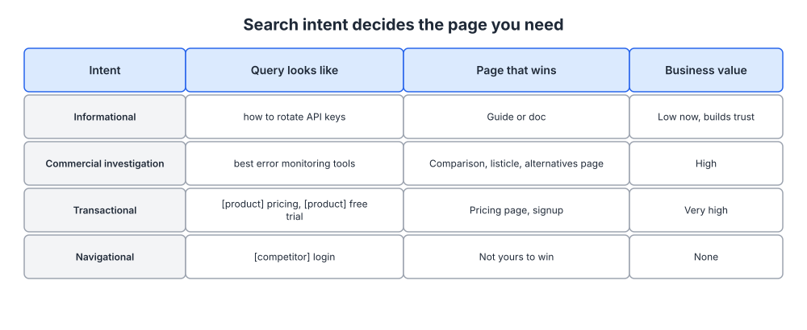
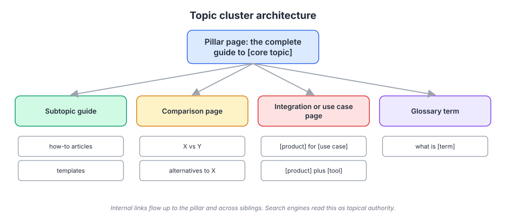
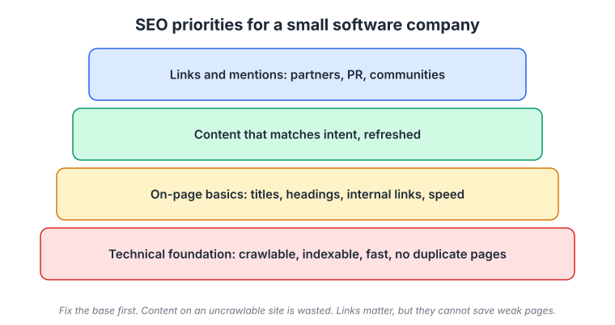

# Week 11: Search: SEO and the new search landscape

> By the end of this week you will be able to explain how a search engine decides what to rank, build a keyword map of 30 target queries grouped into three clusters by intent, and run a technical checklist on your own site so that the content from week 10 can actually be found.

**Time budget:** reading about 3.5 hours, videos about 3 hours, exercise 3 to 4 hours.

## What this week covers and why it matters for a founder

Search is the channel where a stranger tells you exactly what they want, in their own words, at the moment they want it. No other channel gives you that. It is also the channel most technical founders assume they understand because they understand how a crawler works, and then get wrong because ranking is about people's intent, not about HTML.

The founder's situation is usually one of two. Either you have no search traffic and assume SEO is a dark art run by agencies who send you spreadsheets, or you have some traffic and no idea which pages produce customers. In both cases the fix is the same: understand the mechanism, find the queries your ICP types, match each one to the right kind of page, and make sure your site does not get in its own way.

The common mistake is chasing volume. Founders look at a keyword tool, see that "project management" gets a million searches a month, and write a generic post about project management. It never ranks, because a thousand better-funded sites already own that query, and if it did rank it would bring people who are nowhere near buying. The queries that build a software company are specific, lower volume, and closer to a decision: "how to [do the exact thing your product does]", "[competitor] alternatives", "[tool A] [tool B] integration".

What changes when you get search right: a stream of ICP visitors that grows month over month at no marginal cost, arriving already convinced they have the problem you solve. Zapier, Canva, Ahrefs, Notion, Wise, and Webflow all built large parts of their businesses on this. The channel takes months to start and years to compound, which is why competitors who start later cannot easily catch up. This week also covers what AI answers and zero-click results change, and what they do not.

Outputs for the week: a keyword map with 30 target queries in three clusters, each mapped to an existing or planned page, and a technical checklist run on your site with the fixes listed.

## Core concepts

### 1. How search engines work: crawl, index, rank

A search engine does three things. It **crawls**: a program follows links from page to page and fetches what it finds. It **indexes**: it parses each fetched page, works out what it is about, and stores it in a structure it can query. And it **ranks**: when someone searches, it retrieves candidate pages from the index and orders them by how well they are likely to satisfy that person.

The first two are mechanical, and your job is not to obstruct them: every important page reachable by links, no accidental blocking in robots directives, pages that render their content without requiring a client-side app to boot, a sitemap that lists what matters. Google's own SEO Starter Guide covers this and is the reference to trust over any third-party blog.

Ranking is where the judgment lives. Google's early breakthrough was PageRank: treat a link from one page to another as a vote, and weight votes by the importance of the page casting them. A link from a widely-linked page counts for more than a link from an obscure one.


*A page's size here is its PageRank; notice that page C is large despite having one inbound link, because that link comes from the most important page. Source: [Wikimedia Commons](https://commons.wikimedia.org/wiki/File:PageRanks-Example.svg)*

Links still matter, but modern ranking combines hundreds of signals: how well the content matches the query's meaning (not just its words), whether the site has demonstrated expertise on the topic, how people behave with the results, speed and mobile usability, and freshness where the query demands it. Backlinko's list of ranking factors is a useful catalog, with the caveat that most entries are inferred and many are tiny.

The model to hold in your head: the engine is guessing which page a human would be most satisfied by. Everything else is a proxy. When a tactic and that model conflict, the model wins, eventually.

Failure mode: optimizing for the crawler instead of the reader. Keyword stuffing, doorway pages, thin generated pages, bought links. These worked in the 2000s and now get sites demoted. A site that earns its rankings by being the best answer does not fear the next algorithm update.

### 2. Search intent decides the page

Every query carries an intent, and the engine tries to serve the type of page that satisfies that intent. This is the most useful idea in SEO and the one founders skip.



*Read across each row; the page type in the third column is the only kind that ranks for that intent, so writing a different kind is wasted work.*

**Informational** queries ("how to rotate API keys") want a guide or a doc. They are the most numerous, the easiest to rank for, and the furthest from a purchase. Their value is trust and later recall, and they are the way a small company gets onto the map.

**Commercial investigation** queries ("best error monitoring tools", "[competitor] alternatives", "X vs Y") want a comparison, a list, or an alternatives page. The searcher is choosing. These are worth more per visit than anything except transactional queries and are where comparison pages (week 10) earn their keep.

**Transactional** queries ("[product] pricing", "[product] free trial") want your pricing or signup page. Very high value, and mostly for your own brand. Protect them: make sure your pricing page is the page that ranks for "[your product] pricing", not a review site's page about you.

**Navigational** queries ("[competitor] login") want a specific site. Not yours to win. Do not waste effort.

To read intent, search the query and look at what already ranks. If the top ten results are all guides, the engine has decided the query is informational, and your comparison page will not rank for it no matter how good it is. If the results are a mix, you may be able to win with either type.

Zapier's integration pages are a lesson in intent matching. "Slack Trello integration" means: I want these two things connected. Zapier's page for that pair is exactly that: the connection, the popular workflows, a button to start. Wise does the same for currency queries ("USD to EUR"): the page is a converter with a live rate, because that is what the searcher wants, and the product is one step away.

Failure mode: writing a blog post for every query. A blog post is one page type. Commercial and transactional queries need comparison pages, landing pages, tool pages, and template pages. If your site is a homepage plus a blog, you are structurally unable to rank for the queries closest to money.

### 3. Keyword research and topic clusters

Keyword research is the process of turning "what my ICP wants to know" into a ranked list of queries with intent and rough volume attached. The tools (Ahrefs, Semrush, Google's own Search Console and keyword planner) help; the starting material is what you already gathered in weeks 2 and 10.

Start with seed topics: the five to ten problems your product solves, in your customers' language. Put each seed into a keyword tool and collect the variations and questions. Look at what competitors and adjacent tools rank for. Mine your own Search Console for queries where you already appear on page two; those are the cheapest wins.

Then judge each query on four things. Intent (concept 2). Volume, as a rough guide, since tool estimates are noisy and tail queries add up. Difficulty: can you realistically be a better answer than the sites currently ranking? And business potential: how close is this query to your product? Ahrefs scores this from 0 (nothing to do with the product) to 3 (the product is the obvious answer) and prioritizes 2s and 3s over higher-volume 0s and 1s. Adopt the same rule.



*The pillar is the complete guide to a core topic; the spokes are pages for specific queries, all linking to the pillar and to each other, which is what the engine reads as topical authority.*

Organize queries into topic clusters. A cluster has a pillar page (the complete guide to one core topic, targeting the broadest query) and a set of spoke pages, each targeting a specific query in that topic: subtopic guides, how-tos, a comparison page, an integration or use case page, glossary terms. Every spoke links up to the pillar and across to its siblings; the pillar links down to every spoke.

Clusters work for two reasons. The engine assesses whether a site covers a topic deeply, and a cluster of twelve interlinked pages on one topic signals that more than twelve scattered posts do. And internal links pass authority: your pillar page's earned links flow to the spokes and the spokes' relevance flows to the pillar. HubSpot popularized the model and built its own content on it.

Failure mode: cannibalization. Two pages on your site targeting the same query compete with each other and neither ranks. Each query gets one page. If you find duplicates, merge them and redirect.

### 4. On-page, technical foundations, and internal linking

Most SEO advice is about the top of the stack; most SEO problems for small companies are at the bottom.



*Work bottom-up; a technical problem at the base makes everything above it invisible, and links at the top cannot rescue a weak page in the middle.*

**Technical foundation.** Can the engine fetch and read every important page? Check: no important pages blocked in robots.txt or by a noindex tag left over from staging; content present in the HTML the crawler receives, not only after a JavaScript app hydrates; one canonical URL per page, so "example.com/pricing", "example.com/pricing/", and "www.example.com/pricing" do not compete as three pages; a sitemap submitted in Search Console; fast loading on mobile; HTTPS everywhere; no chains of redirects. Search Console's coverage and page experience reports will tell you most of this for free.

**On-page basics.** Each page has one target query. That query, or a natural variant, appears in the title tag (which is also what shows in the results), in the H1, in the first paragraph, and in the URL. Headings structure the page so a reader skimming (and a parser) can see the outline. Images have descriptive alt text. The meta description is a one-sentence pitch for the click, not a keyword list. None of this is clever. It is hygiene, and skipping it costs rankings for no reason.

**Internal linking.** The most under-used lever on small sites. Every new page should receive links from three or more existing pages, with descriptive anchor text (not "click here"). Your most-linked pages (usually the homepage and docs) should pass links toward the pages you want to rank. Orphan pages, with no internal links pointing at them, are often not indexed at all.

**Speed.** Slow pages rank worse and convert worse. Measure with the tools Google provides and fix the largest offenders: uncompressed images, render-blocking scripts, heavy third-party tags.

Failure mode: single-page app with no server rendering. A marketing site built as a client-only app can appear to a crawler as an empty div. If your site is in a framework, make sure the marketing pages are statically generated or server-rendered. Check by fetching the page with a plain HTTP client and looking for your content in the response.

### 5. Links that are not spam, programmatic pages, and comparison pages

Links from other sites still move rankings, and the honest way to get them is to make things worth linking to and then tell the right people.

**Digital PR and data.** Original research and benchmarks (week 10) get cited. A survey of your ICP, aggregated product data, an annual report on a niche. Journalists and bloggers link to numbers.

**Tools.** A free calculator, checker, or generator earns links for years. It also demonstrates your product's thinking.

**Partnerships and integrations.** Every integration partner has a directory or a page about you. Every customer with a "tools we use" page is a candidate. Every community you contribute to has a resources list.

**Being the source.** If your docs or a guide are the best explanation of a concept in your niche, people writing about that concept link to you. This is the slow, durable version.

What not to do: buy links, join link exchanges, spray guest posts on irrelevant sites, or use the outreach-at-scale version of the skyscraper technique that fills inboxes with "I noticed you linked to X". These are detectable, and the good sites you would want links from ignore them.

**Programmatic SEO** means generating many pages from a data set, each targeting a specific tail query. Zapier's integration pages (every pair of apps), Canva's template pages (every occasion and format), Notion's template gallery, Nomad List's city pages, G2 and Capterra's category and comparison pages, Tripadvisor's pages built from user reviews. The pattern works when three conditions hold: there is a real set of distinct queries, each page has unique, useful content (not a template with the noun swapped), and the product is the natural next step from the page. For a platform, integration pages ("[your product] plus [tool]"), use case pages ("[your product] for [role or industry]"), and a glossary of the terms your ICP searches are the usual starting points. Ahrefs' guide and tutorial on programmatic SEO cover the mechanics.

**Comparison and alternatives pages** deserve their own paragraph because founders resist them. "[Your product] vs [competitor]" and "[competitor] alternatives" pages catch buyers in the commercial investigation stage, and they convert far above average. They work when they are honest: name what the competitor does well, be specific about where you differ, and let the reader self-select. A page that is a thinly disguised attack is not believed and not shared. Your positioning doc from week 4 already lists your competitive alternatives and what makes you different; that is the outline.

Failure mode: programmatic pages that are all template and no substance. Thousands of near-identical pages get treated as low-quality and can drag down the rest of the site. If you cannot put something unique and useful on each page, generate fewer pages.

### 6. AI answers, zero-click search, and measuring SEO

Search results increasingly answer the question on the page: featured snippets, knowledge panels, and generated summaries. Rand Fishkin's research on zero-click search documented, years before generative answers, that a majority of searches ended without a click to any site. Generated answers extend that trend, especially for informational queries.

What changes: informational traffic declines for queries with short answers. If your library is built entirely on "what is X" pages, expect fewer visits per ranking. What does not change: people still search for comparisons, pricing, brand names, and integrations, because those queries need a page, not a sentence. Generated answers cite sources, and being the cited source is a version of ranking. Brand queries ("[your product] reviews") grow when your other marketing works, and they convert best of all.

Practical adjustments. Weight your keyword map toward commercial and transactional intent and toward queries where a summary cannot substitute for the page (tools, templates, comparisons, integration pages, deep tutorials with code). Make your pages easy to cite: clear definitions, stated numbers, structured headings. Watch which of your pages appear in generated answers and in AI assistants when you ask them about your category, and treat that as a ranking signal. Invest in the brand and community work from weeks 7 and 15, because it produces the brand searches that no answer engine can intercept.

**Measuring SEO.** Rankings are a vanity number on their own. Track, monthly: non-brand organic clicks and impressions by cluster (from Search Console), the number of target queries where you rank in the top ten, and the signups and revenue that organic visits assist (from your analytics, week 18). Judge clusters, not individual pages. Expect three to six months before a new cluster shows movement, and longer in competitive niches. Set the expectation with your cofounders before you start, or the channel will be abandoned at week eight for lack of results.

Failure mode: treating a drop in informational traffic as proof that SEO is dead. It is proof that "what is" pages are worth less than they were. The queries that make money are still there, and there is now less competition for them from companies that gave up.

## Videos

- [How Search Works, Google (Google Search Central)](https://www.youtube.com/watch?v=5MIAugQ17ks)
  Why watch: Google's own short explanation of crawling, indexing, and ranking, useful to calibrate against the myths; about 5 to 10 minutes.
- [SEO for Beginners: Rank #1 In Google, Sam Oh (Ahrefs)](https://www.youtube.com/watch?v=xsVTqzratPs)
  Why watch: a complete, practical walkthrough of the whole stack from technical to links; about 60 minutes and worth all of it.
- [Keyword Research Tutorial, Sam Oh (Ahrefs)](https://www.youtube.com/watch?v=c9oKifDiuLk)
  Why watch: the exact process for going from seed topics to a prioritized list, including the business potential score; about 20 to 30 minutes, watch before the exercise.
- [Programmatic SEO, Ahrefs](https://www.youtube.com/watch?v=Ale2fK1Xnbs)
  Why watch: how integration, template, and directory pages are built at scale and where the approach breaks; about 15 to 20 minutes.
- [Zero-click search and audience research, Rand Fishkin (SparkToro)](https://www.youtube.com/watch?v=B35eQ7keoGA)
  Why watch: the data on searches that end without a click and what it means for where to invest; about 30 to 45 minutes.

## Recommended reading

- [SEO Starter Guide, Google Search Central](https://developers.google.com/search/docs/fundamentals/seo-starter-guide). What to take from it: the authoritative list of what Google asks of a site; use it as the source for your technical checklist.
- [How Search Works, Google](https://www.google.com/search/howsearchworks/). What to take from it: the plain-language version of crawl, index, rank, and the signals Google says it uses.
- [Beginner's Guide to SEO, Moz](https://moz.com/beginners-guide-to-seo). What to take from it: the classic structured introduction; read the chapters on keyword research and on-page if you skip the rest.
- [Search Intent, Ahrefs](https://ahrefs.com/blog/search-intent/). What to take from it: how to read intent from the results page and match it with a page type; the core skill of this week.
- [How to Do Keyword Research, Ahrefs](https://ahrefs.com/seo/keyword-research). What to take from it: the process and the business potential score; follow it step by step in the exercise.
- [Programmatic SEO, Ahrefs](https://ahrefs.com/blog/programmatic-seo/). What to take from it: when generated pages work and the quality bar each page must clear.
- [Google's 200 Ranking Factors, Backlinko](https://backlinko.com/google-ranking-factors). What to take from it: a catalog of signals, read with skepticism; most are inferred, and the top handful (content quality, links, intent match, technical health) carry nearly all the weight.
- [Ahrefs Academy](https://ahrefs.com/academy). What to take from it: free structured courses if you want to go deeper than this week; the SEO fundamentals course is the one to do.

## Hands-on exercise (2 to 4 hours)

**Deliverable:** a keyword map spreadsheet with 30 target queries grouped into three clusters, each query mapped to a page (existing or planned) with intent and priority, plus a completed technical checklist for your site with fixes listed and owners assigned.

**Steps:**
1. (20 minutes) Set up Google Search Console for your site if it is not already, and submit a sitemap. Even if you do nothing else this week, this gives you free query data from now on.
2. (20 minutes) Write down five to ten seed topics: the problems your product solves, in the words from your week 2 interviews and week 10 backlog.
3. (40 minutes) Expand each seed into queries using a keyword tool (free tiers are enough) plus Search Console's existing queries plus questions from your ICP's communities. Aim for 60 to 80 candidates.
4. (30 minutes) For each candidate, search it and classify the intent from what ranks. Score business potential 0 to 3. Note rough volume and whether the current top results look beatable.
5. (20 minutes) Cut to 30. Keep queries with business potential 2 or 3, a mix of intents weighted toward commercial and transactional, and at least a few where you already rank on page two.
6. (20 minutes) Group the 30 into three clusters. Name the pillar page for each cluster and assign each spoke query to an existing page or a page to create. Note the page type (guide, comparison, integration page, tool, glossary). Check for cannibalization: one page per query.
7. (40 minutes) Run the technical checklist below on your site. Use Search Console reports, a plain HTTP fetch of your main pages, and Google's page speed tool. Record every failure with a fix and an owner.
8. (10 minutes) Add the three pillar pages and the two highest-priority spokes to the content calendar from week 10, and block a monthly 30-minute slot to review Search Console by cluster.

**Template:**

| Cluster | Query | Intent | Volume (rough) | Business potential (0 to 3) | Beatable? | Page type | Existing or planned URL | Priority |
|---------|-------|--------|----------------|------------------------------|-----------|-----------|--------------------------|----------|
| A: [topic] | [pillar query] | Informational | | 3 | | Pillar guide | | 1 |
| A | | | | | | | | |
| B: [topic] | | Commercial | | | | Comparison | | |
| C: [topic] | | Transactional | | | | Integration page | | |

```
TECHNICAL CHECKLIST                         Site:            Date:

[ ] Search Console set up, sitemap submitted, no coverage errors on key pages
[ ] robots.txt does not block important paths; no stray noindex tags
[ ] Key page content is present in raw HTML (fetch with curl and search for a headline)
[ ] One canonical URL per page; www and trailing-slash variants redirect to it
[ ] HTTPS everywhere, no mixed content, no redirect chains longer than one hop
[ ] Every important page has a unique title tag and H1 containing its target query
[ ] Meta descriptions written for the click on the top 20 pages
[ ] Every new page linked from at least three existing pages with descriptive anchors
[ ] No orphan pages (pages with zero internal links)
[ ] Mobile page speed acceptable on homepage, pricing, top 5 content pages
[ ] Images compressed and have alt text
[ ] No duplicate pages targeting the same query (merge and redirect if found)
[ ] 404s on old URLs redirected to the closest live page

Failures found:            Fix:                 Owner:        Due:
```

**How to know it is good:**
- Every one of the 30 queries has an intent read from the actual results page, not guessed.
- At least half the queries have business potential 2 or 3, and at least a third are commercial or transactional.
- No two queries map to the same page, and every query has a page.
- The technical checklist has been run against the live site, and every failure has a named fix and owner.
- The three pillar pages are on the content calendar with dates.

## Self-check

Answer these without looking back. If you cannot, reread the relevant section.

1. Describe crawl, index, and rank in one sentence each. Which of the three can your site accidentally break, and how?
2. What is the PageRank intuition, and why does one link from an important page beat ten from obscure ones?
3. Name the four search intents and the page type that wins for each. How do you determine the intent of a query you have never seen?
4. Why would a well-written blog post fail to rank for "[competitor] alternatives"?
5. What is Ahrefs' business potential score, and why would you prioritize a query with 200 searches over one with 20,000?
6. Draw a topic cluster and explain the two reasons the structure helps rankings.
7. Your marketing site is a client-rendered single-page app. What is the risk, and how do you check for it in under a minute?
8. Give three ways to earn links that are not spam, and two link tactics to avoid.
9. When does programmatic SEO work, and what is the failure mode that can damage the whole site?
10. What kinds of queries do AI answers and zero-click results take from you, and which do they leave alone?

**You are done with this week when:**
- [ ] Search Console is set up with a sitemap submitted, and you have looked at the query report at least once.
- [ ] Your keyword map has 30 queries in three clusters, each with intent, business potential, page type, and a mapped URL.
- [ ] The technical checklist has been run, and every failure has a fix, an owner, and a date.
- [ ] The pillar pages are on the week 10 content calendar.

## Next week

Search and content are slow and cheap. Next week covers the fast and expensive channel: paid acquisition. You will learn how ad auctions actually price a click, build the unit economics spreadsheet that tells you whether paid can ever work for your price point, and design a four-week test that you will know how to stop.
