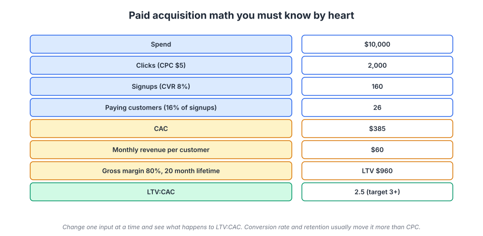
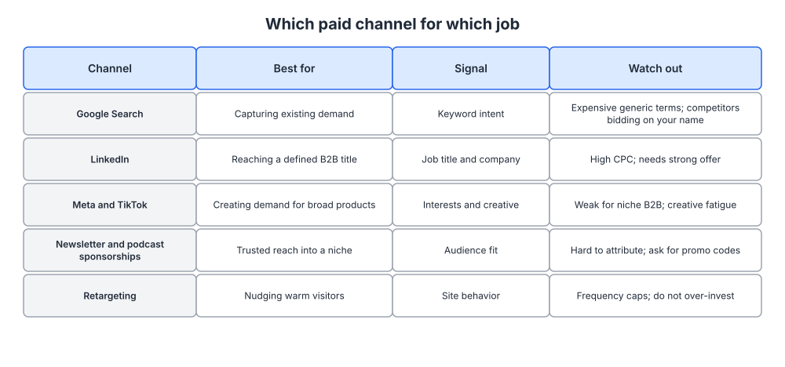
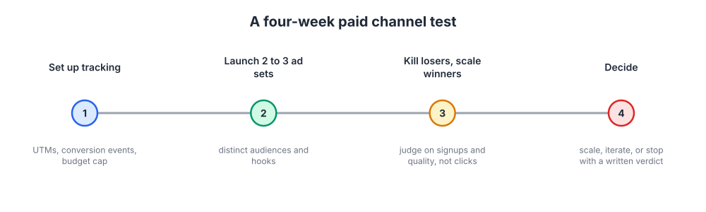

# Week 12: Paid acquisition

> By the end of this week you will have a unit economics model that tells you whether paid can ever work at your price point, and a four-week test plan for one paid channel with a written stop rule.

**Time budget:** reading about 3 hours, videos about 2.5 hours, exercise 3 to 4 hours.

## What this week covers and why it matters for a founder

In week 9 you placed your product in a quadrant by contract value and time to value, picked two focus channels, and wrote thresholds for a test. Paid was probably on your list. This week is where you find out whether it belongs there, and how to run it without setting money on fire.

Understand this before anything else: paid acquisition is a scale lever, not a discovery tool. It amplifies a machine that already works. If a stranger who lands on your site converts, activates, and stays, paid lets you buy more of those strangers at a price you can calculate. If that machine does not work yet, paid buys a larger number of people who bounce.

Most technical founders get this backwards. They treat ads as a way to find out whether anyone wants the product, because ads feel like an experiment. But the signal is noisy and each observation is expensive. Five customer interviews (week 2) tell you more about demand than $2,000 of cold traffic.

The other thing founders get wrong is the arithmetic, which is odd, because arithmetic is the part you should be best at. A founder who has not multiplied out cost per click, signup rate, signup-to-paid rate, gross margin, and retention has no business spending a dollar on ads. That multiplication takes twenty minutes and it is the core of this week. When you know that $1 in at the top produces $3 of gross profit over twenty months, growth becomes a financing question rather than a marketing question. That is why paid is worth understanding even if you conclude, as many software companies correctly do, that you should not run ads yet.

Outputs for the week: a unit economics model with sensitivity analysis, and a four-week test plan for one channel with budget, tracking, creative variants, and a stop rule written in advance.

## Core concepts

### 1. How an ad auction actually prices your click

Every major ad platform runs an auction. You are not buying a fixed-price slot; you are competing for an impression sold in milliseconds, and the price is set by the other bidders.

Two mechanics matter. First, search auctions have long worked on a second-price principle: you pay roughly the minimum needed to beat the advertiser ranked below you, not what you bid. So your bid mostly determines whether you win, not what you pay. Bidding a little higher often costs nothing extra per click and wins more auctions; bidding into a crowded auction means you clear at a price set by whoever is most desperate in your category.

Second, quality. Google ranks ads by something close to bid multiplied by an expected quality signal, because the platform earns on clicks, not impressions. Quality Score is the visible proxy: expected click-through rate, ad relevance to the query, and landing page experience.

This is why a relevant advertiser pays less than an irrelevant one for the same position. If your ad says exactly what the searcher typed and your page delivers exactly that, your effective cost per click can be a fraction of a competitor's bidding higher with generic creative. Relevance is a discount, and it is the main lever a small company has against a funded one.


*An ad auction is this diagram running every few milliseconds: supply of impressions is fixed by how many people search, demand is every advertiser's bid, and the clearing price is what you pay. Source: [Wikimedia Commons](https://commons.wikimedia.org/wiki/File:Supply-demand-equilibrium.svg)*

That picture explains the prices you will see. A click from someone searching "SOC 2 compliance software" costs many times a click from someone scrolling a feed: the searcher is scarce and close to a purchase, and everyone in the category wants them. It is also why costs rise every year in established categories, and why a narrower, less contested market is a pricing strategy, not just a positioning one.

Automated bidding works only with enough conversion data to learn from. Below roughly 30 conversions a month it is guessing, so start with manual or cost-capped bidding and a conversion event that fires often (a signup, not a closed deal).

Failure mode: broad match keywords with no negative list. Broad match lets the platform decide which queries are close enough to yours, so without negatives you will pay for "free", "jobs", "tutorial", and competitor complaints. Pull the search terms report daily in week one.

### 2. The arithmetic: CAC, payback period, and LTV to CAC

Read this section twice. Everything else in paid acquisition is decoration on this arithmetic.



*Follow the chain from spend down to customers, then across to the ratio; each stage multiplies, which is why a small change in conversion rate swings the result more than a large change in cost per click.*

Work the example by hand. Spend $10,000. At $5 a click that is 2,000 clicks. At an 8 percent visitor-to-signup rate, 160 signups. If 16 percent of signups pay, that is 26 customers, so CAC is about $385. On the value side, a customer paying $60 a month at 80 percent gross margin contributes $48 a month, so a 20 month lifetime is $960 of gross profit and LTV to CAC is about 2.5.

**CAC** is all the money and time spent per acquired customer, not just media spend: ad budget, tools, creative, and your own hours at a realistic rate. Founders undercount this, as week 9 warned, then wonder why the bank balance disagrees with the spreadsheet.

**Payback period** is CAC divided by monthly gross profit: $385 over $48, about eight months. This determines whether you can grow without raising money. Under 12 months is workable, under six lets you recycle cash and compound, beyond 18 you are lending your customers money and will run out of cash before they repay you. David Skok's "Startup Killer" is the canonical treatment.

**LTV to CAC** compares lifetime gross profit to acquisition cost. Three or above is the usual bar; below three the channel is not paying for engineering, support, and everything else. Far above three usually means you are underspending, or your LTV is fiction. Be conservative: use gross profit, not revenue, and if your company is a year old you do not have a 20 month lifetime, you have a guess, so cap the horizon at 24 or 36 months.

Now the part that makes this useful: change one input at a time.

- Cost per click $5 to $4 (better relevance): CAC about $308, ratio 3.1.
- Landing page conversion 8 to 10 percent (copy and offer, week 6): CAC about $308.
- Signup-to-paid 16 to 20 percent (onboarding, week 17): CAC about $308.
- Retention 20 to 26 months: LTV about $1,250, ratio 3.2.

Four levers, roughly equal effect, and three have nothing to do with your ad account. When paid does not work, the fix is usually in conversion, activation, retention, or price. Founders who skip the model spend months tuning bids to rescue a funnel whose real problem is that 84 percent of signups never activate.

Failure mode: measuring CAC blended across all channels. Blended CAC hides the truth, because organic and word-of-mouth customers subsidize the paid ones. Calculate paid CAC separately, from the customers paid actually produced. It will be an uncomfortable number.

### 3. Channel by channel: what each one is good at

Every paid channel does one job well. Choosing the wrong channel for your job is the most expensive mistake available, because you will spend enough to be sure and still learn nothing.



*Match your situation to the second column first; the targeting signal in the third column tells you what data you need before you can set a campaign up at all.*

**Google Search captures demand that exists.** Someone typing "alternative to [tool]" has told you what they want: the highest intent you can buy, and the most expensive per click. It fails when your product is genuinely new, because nobody searches for a category that does not exist. Three sub-plays: bid on your own brand (cheap, and it stops competitors appearing above you, which is why HubSpot and most large SaaS companies do it defensively), bid on competitor brand terms (keywords are generally permitted, their trademark in your ad text is not, and it works only alongside an honest comparison page of the kind you planned in week 11), and bid on high-intent tail queries from your keyword map.

**LinkedIn reaches a defined B2B audience** by title, company, and seniority. If your ICP from week 3 is "heads of data engineering at companies over 200 people", this is the only channel that sells exactly that. You pay for the precision: costs per click run several times search costs, so LinkedIn rarely works below roughly $10,000 to $15,000 in annual contract value. You are interrupting rather than answering, so benchmark reports and webinars outperform "book a demo".

**Meta and TikTok create demand rather than capture it.** Nobody there is looking for you. You win with creative people want to watch and a product with broad appeal. Dollar Shave Club is the reference case. For narrow B2B these platforms usually disappoint, with an exception where the buyer is also a consumer, as Grammarly found with heavy video advertising to students and professionals.

**Newsletter and podcast sponsorships buy trusted reach into a niche**, because the recommendation carries the writer's credibility; Squarespace built much of its brand on podcast sponsorships over many years. The tradeoff is attribution, so use a promo code or dedicated URL per sponsor.

**Retargeting nudges people who already visited.** Cheap, high converting on paper, and systematically over-credited, because many of those people were coming back anyway. Cap frequency, exclude customers, keep the budget small.

**Review sites (G2, Capterra)** sell placement to buyers comparing options, worth a test if your category page there gets real traffic. **Reddit** can be cheap when your ICP lives in specific subreddits, but punishes anything that reads like an ad.

Failure mode: running three channels at once on a small budget. Each gets too little data to conclude anything. Pick one, per week 9, and go deep enough to get a signal.

### 4. Creative, offer, and landing page match

Inside a channel, three things decide whether the money works: the hook, the offer, and what happens after the click. Creative and offer swing results by multiples; bid tuning swings them by percentages. Founders spend their time on the bids.

**The hook** is the first line or the first three seconds, and its job is to make the right person stop and the wrong person scroll on. Specificity does that. "Stop guessing which queries your customers use" is a hook. "The modern platform for data teams" is wallpaper. Use the messaging hierarchy from week 5; the best ad copy is usually a sentence a customer said in an interview.

**The offer** is what you ask for and what they get. "Book a demo" is a large ask from a stranger. A calculator, a benchmark report, or a trial with no card are smaller asks that still reveal intent. Match the ask to the temperature of the traffic: high-intent search can take a trial, cold feed traffic usually cannot.

**Message match** means the landing page continues the ad's sentence. If the ad says "Postgres monitoring without the agent", the page headline says that, not "Observability, reimagined". Mismatch is the most common reason paid underperforms, and it raises your cost per click through the quality signal in concept 1, so you pay twice for one mistake. Build a dedicated page per campaign: one headline repeating the ad's promise, one proof element, one call to action used twice, nothing else. Your homepage is a bad landing page because it is written for every audience at once.

Plan for creative fatigue on feed platforms. The same ad to the same audience decays within weeks, which is Andrew Chen's law of shitty clickthroughs from week 9 on fast-forward. Budget for batches of cheap variants, not one expensive production.

Failure mode: testing ten variables at once. Change the hook, hold everything else. Then change the offer. You cannot learn from a test where three things moved.

### 5. Tracking and why attribution will mislead you

You can see less than the dashboards suggest.

Start with plumbing. Tag every ad destination with UTM parameters using one convention decided in advance: source, medium, campaign, content. Sloppy UTMs, where one campaign is "Q3-Launch" and another is "q3_launch", quietly destroy a quarter of reporting. Then define conversion events deeper than the click: signup, activation (the week 17 definition), and paid conversion. Send the signup event back to the platform so its optimization learns from something real, but judge the channel yourself on activation and revenue. Store the UTM values on the user record at signup so that months later you can join a paying customer to the ad that brought them.

Now the caveats, because this is where founders get fooled.

**Platforms mark their own homework.** Each counts a conversion if it showed the person an ad within some window, often 7 to 28 days, sometimes including view-throughs with no click. Run Google, Meta, and LinkedIn together and their claimed conversions will exceed your actual signups. Each is truthful by its own rules; none tells you what would have happened without the ads.

**Last-click over-credits the bottom of the funnel.** Someone reads your guide, follows you for a month, searches your brand, clicks your brand ad. Last click says the brand ad earned the customer; it earned a click on a customer content earned. This is why brand campaigns and retargeting always look brilliant, and why they are usually the least incremental spend in the account.

**Tracking is lossier than it used to be.** Cookie restrictions, ad blockers, mobile privacy settings, and device switching hide much of the path. Dark social makes it worse: a link shared in a private Slack channel arrives as direct traffic.

Three practices survive this. **Incrementality over attribution**: the clean question is what changed when you turned spend on or off, so run a geographic holdout or pause the channel for two weeks and watch total signups, not attributed ones. Crude, and more trustworthy than any model. **Self-reported attribution**: an optional "How did you hear about us?" field is biased and imprecise, and it will still surface the podcast, the community, and the colleague no pixel can see. **Judge the total**: if dashboards claim great results while blended CAC is flat, you are buying customers you already had.

Failure mode: optimizing to clicks or cost per lead. Clicks are the cheapest thing to buy and the least connected to money. Optimize to the deepest event you have enough volume to measure.

### 6. Running a four-week test and knowing when to stop

Here is how to run the test, and it is deliberately boring.



*The decision point in week four is the reason the plan exists; everything before it is preparation for making one honest call.*

**Before week one**, write the test document: hypothesis, channel, budget cap, primary metric (activated signups, not clicks), quality check against the week 3 ICP scorecard, duration, and kill threshold. Derive the minimum budget from your model: at a 6 percent signup rate and $6 clicks, 40 signups needs roughly $4,000. If you cannot afford a readable result, do not run the test.

**Week one: instrumentation.** Events firing and verified, UTMs set, landing pages live, budget caps and negatives in place. Do not launch until a test signup appears in your analytics with its UTM attached.

**Week two: launch two or three ad sets**, each with a distinct audience or hook, on identical budgets. Two or three, not ten: you need enough spend per variant to separate it from noise. Check search terms daily for waste, but leave bids alone, because platform learning needs stability.

**Week three: cut and concentrate.** Kill the worse variants and move their budget to the leaders. Judge on cost per activated signup and on the quality check, not click-through rate. Look at the actual signups: are they your ICP, or students, job seekers, and competitors?

**Week four: decide, and write it down.** **Scale**: the threshold was hit and the economics sit inside your model, so raise budget by no more than 20 to 30 percent a week. **Iterate**: results are near the threshold and you have one named change worth another four weeks. One iteration, not four. **Stop**: it missed and you have no specific hypothesis, so turn it off and return to what works. Stopping is a good outcome; you bought information at a price you set in advance.

Two reasons not to run this test at all. If activation is poor, fix that first, because paid multiplies whatever your funnel does, including failure. And if demand is unproven, paid is the wrong instrument, which is why plenty of good companies did no paid for years: Superhuman grew through a waitlist, referrals, and one-to-one onboarding long before buying traffic. Companies at the other extreme, like Monday.com, run paid at very large scale, but only with a funnel and retention curve that made the arithmetic work first.

Failure mode: the test that never ends. Without a written kill threshold you will remember the setup effort and the one promising week, and keep campaigns burning for six months.

## Videos

- [Google Ads Tutorial for Beginners, Google Ads (official)](https://www.youtube.com/results?search_query=google+ads+tutorial+for+beginners+official) (YouTube search)
  Why watch: the mechanics of a search campaign, keywords, match types, and negatives from the platform itself; about 30 to 60 minutes and enough to set up your first test properly.
- [Facebook Ads for Beginners, Meta Blueprint](https://www.youtube.com/results?search_query=meta+blueprint+facebook+ads+for+beginners) (YouTube search)
  Why watch: how audience targeting and creative testing work on a demand-creation platform, a different discipline from search; about 30 to 45 minutes.
- [Growth marketing, Julian Shapiro](https://www.youtube.com/watch?v=0Pnhdpa5P-k)
  Why watch: a practitioner's view of creative testing, landing page match, and how to structure paid experiments; about 30 to 45 minutes.
- [Growth talk, Andrew Chen (a16z)](https://www.youtube.com/results?search_query=andrew+chen+growth+talk+a16z) (YouTube search)
  Why watch: why paid channels decay, why low-CAC growth is the goal, and how paid fits alongside loops; about 30 minutes.

## Recommended reading

- [Ads, Julian Shapiro (Growth Handbook)](https://www.julian.com/guide/startup/growth-channels). What to take from it: the practical sequence for testing a paid channel, and how much budget a real test needs.
- [PPC 101, WordStream](https://www.wordstream.com/ppc). What to take from it: the vocabulary and account structure (campaigns, ad groups, match types, negatives) so the interfaces stop being confusing.
- [Quality Score explained, WordStream](https://www.wordstream.com/quality-score). What to take from it: why relevance lowers your cost per click, and the three components you can influence.
- [Startup Killer: the Cost of Customer Acquisition, David Skok](https://www.forentrepreneurs.com/startup-killer/). What to take from it: why payback period, not the ratio alone, decides whether you survive.
- [The Law of Shitty Clickthroughs, Andrew Chen](https://andrewchen.com/the-law-of-shitty-clickthroughs/). What to take from it: every ad format decays, so plan creative refresh and an exit before you need them.
- [Attribution (marketing), Wikipedia](https://en.wikipedia.org/wiki/Attribution_(marketing)). What to take from it: the attribution model families and their assumptions; read it to inoculate yourself against dashboard confidence.
- [Customer lifetime value, Wikipedia](https://en.wikipedia.org/wiki/Customer_lifetime_value). What to take from it: the formal LTV models, plus the reminder to use gross margin and a capped horizon.
- [Google Skillshop](https://skillshop.withgoogle.com/). What to take from it: free search advertising certifications if you will run the channel yourself.

## Hands-on exercise (2 to 4 hours)

**Deliverable:** one spreadsheet with two tabs, saved in your company wiki. Tab 1 is a unit economics model with a sensitivity table. Tab 2 is a four-week paid test plan for a single channel with budget, tracking, creative variants, and a written stop rule.

**Steps:**
1. (30 minutes) Build the model with your real numbers: visitor-to-signup rate, signup-to-paid rate, revenue per customer per month, gross margin, retention in months. Mark every guess in red with a note on where the real number will come from.
2. (20 minutes) Get a cost per click estimate from the platform's keyword planner or audience estimator, using queries or audiences from weeks 9 and 11. Take the high end.
3. (20 minutes) Compute CAC, payback, and LTV to CAC, put them at the top of the tab, and judge them: payback under 12 months, ratio at or above 3.
4. (30 minutes) Build the sensitivity table: vary each of the four inputs by plus and minus 25 percent, one at a time, then rank the levers by effect and name an owner for each.
5. (15 minutes) Make the go or no-go call in writing. If the model only works with three optimistic assumptions at once, the verdict is "not yet", and the next sentence names the lever you are fixing instead.
6. (30 minutes) If it is a go, write the test plan: hypothesis, primary metric, quality check against the week 3 scorecard, budget cap, four-week duration, and the kill threshold as a number.
7. (30 minutes) Define tracking: UTM convention, the three conversion events, where the UTM is stored on the user record, and the "How did you hear about us?" field on your signup form.
8. (45 minutes) Draft two or three ad sets (audience or keyword group, hook, offer, landing page), noting the single variable that differs, then send both tabs to a cofounder and put the week-four decision in the calendar.

**Template:**

```
UNIT ECONOMICS MODEL      Channel: ____   Date: ____

INPUTS   budget $__  CPC $__  visitor-to-signup __%
         signup-to-paid __%  revenue/month $__
         gross margin __%  retention (months) __

OUTPUTS  clicks    = budget / CPC
         signups   = clicks x visitor-to-signup
         customers = signups x signup-to-paid
         CAC       = budget / customers          $__
         profit/mo = revenue x margin            $__
         payback   = CAC / profit per month      __
         LTV       = profit per month x retention $__
         LTV:CAC   = LTV / CAC                   __

VERDICT  payback under 12 months? [ ]  LTV:CAC 3+? [ ]
GO / NO-GO:          Reason:
```

| Lever | Current | Minus 25% | Plus 25% | LTV:CAC swing | Owner |
|-------|---------|-----------|----------|---------------|-------|
| Cost per click | | | | | Marketing |
| Visitor to signup | | | | | Marketing and web |
| Signup to paid | | | | | Product and onboarding |
| Retention months | | | | | Product and success |

```
FOUR-WEEK TEST PLAN

Hypothesis:
Channel: ____  Budget cap: $____  Metric: activated signups
Quality check: __% matching ICP scorecard
KILL THRESHOLD (before launch): fewer than __ activated ICP
  signups by day 28 means we stop

W1 setup   [ ] events [ ] UTMs [ ] pages [ ] negatives [ ] caps
W2 launch  ad set A ____  B ____  C ____
W3 cut     kill above $__ per activated signup, shift to winner
W4 verdict SCALE / ITERATE (one named change) / STOP
Owner: ____  Reviewer: ____  Decision date: ____
```

**How to know it is good:**
- Every input is a measured number or marked as a guess with a plan to measure it.
- The sensitivity table ranks the four levers and you can say which to fix first and who owns it.
- The kill threshold is a number written before any money is spent, and someone else has agreed to hold you to it.
- The primary metric reaches at least activation, not clicks or raw signups.
- The budget produces roughly 30 or more conversions in four weeks, or the test is postponed.

## Self-check

Answer these without looking back. If you cannot, reread the relevant section.

1. Explain second-price auction intuition in two sentences. Why does bidding higher often not raise what you pay per click?
2. What are the three components of Quality Score, and why does relevance act as a price discount?
3. Work it out: $8,000 spend, $4 per click, 5 percent visitor-to-signup, 20 percent signup-to-paid. What is CAC?
4. Same scenario: customers pay $99 a month at 75 percent gross margin and stay 18 months. What are payback and LTV to CAC, and would you scale?
5. Which two of the four CAC levers are usually owned outside marketing, and why does that matter when paid is not working?
6. Why does blended CAC flatter your paid channel, and when would you look at it anyway?
7. Name three reasons your ad platform reports more conversions than you actually got, and what incrementality testing does about it.
8. Give the three verdicts at the end of a four-week test and the condition that triggers each.

**You are done with this week when:**
- [ ] The unit economics model is built with real or flagged inputs, and CAC, payback, and LTV to CAC are written at the top.
- [ ] The sensitivity table is complete and the top lever is named with an owner.
- [ ] A four-week test plan exists with a budget cap, a metric reaching activation, and a kill threshold written before launch, or a written "not yet" naming the lever you are fixing instead.
- [ ] UTM conventions, conversion events, and the "How did you hear about us?" field are in place.

## Next week

Paid rents attention, and the rent goes up every year. Next week you build the channel you own: email and lifecycle marketing, where the people you acquired here get turned into activated, paying, returning customers at close to zero marginal cost.
