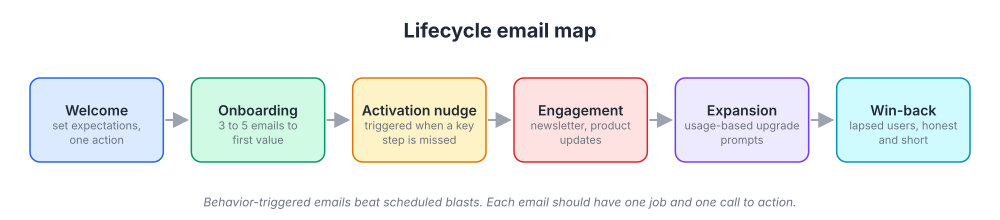
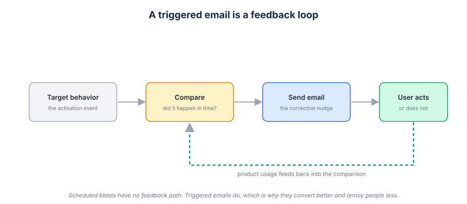
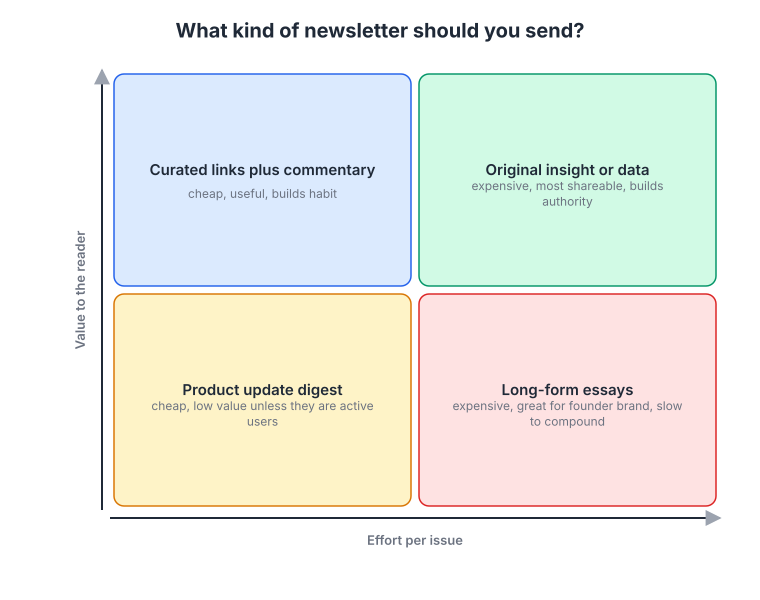
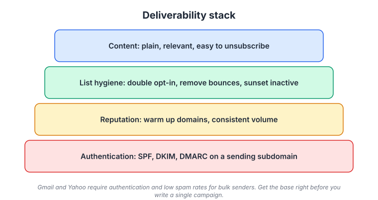

# Week 13: Email and lifecycle marketing

> By the end of this week you will have a lifecycle email map for your platform, three written sequences, and a deliverability setup that will not land you in spam.

**Time budget:** reading about 3 hours, videos about 2 hours, exercise 2 to 4 hours.

## What this week covers and why it matters for a founder

Every channel you studied in weeks 9 to 12 has a landlord. Google can change its ranking rules, LinkedIn can throttle your reach, ad prices rise every year (Andrew Chen's law of shitty clickthroughs from week 9 applies to every rented audience). Email is different. Once someone gives you their address and permission, you can reach them for as long as you keep being useful, at close to zero marginal cost, with nobody in the middle deciding whether they see it.

Most founders treat email as an afterthought: a welcome email in the signup flow, a product update when they remember, then confusion about why trial users vanish. The mistake is thinking of email as a broadcast tool. Email is the connective tissue of the customer lifecycle, moving a person from signup to first value, to habit, to paying, to expanding.

When you get it right, email quietly becomes one of your highest-return activities. A good onboarding sequence lifts activation with no engineering beyond a few event triggers, and a newsletter people actually read becomes the distribution engine for the content you planned in week 10.

The concrete outputs of this week: a one-page lifecycle map with every email you send or plan to send, three written sequences (welcome, onboarding, win-back) with triggers defined, and a deliverability checklist run against your actual domain.

## Core concepts

### 1. Email is the channel you own, and the lifecycle map is how you use it

Your list is an asset. Every subscriber has told you they want to hear from you, and unlike a follower or a search ranking, nobody can take that relationship away by changing an algorithm. The flip side is that the asset depreciates: addresses go stale, and a list you neglect for six months produces bounces and spam complaints when you finally send to it.

The way to think about what to send is a lifecycle map. Take the customer journey you sketched in week 1 (audience, attention, trust, conversion, retention, advocacy) and ask, at each stage, what does this person need to hear from us to move to the next stage, and what event tells us they are ready for it?



*Six stages, each with a single job: notice that the activation nudge and win-back stages are triggered by something the user did not do, which is where most of the value hides.*

The stages that matter for a software platform:

**Welcome.** One email, sent immediately. Set expectations (what you will send, how often), and ask for one action. Not five. One. For a developer platform that action is usually "run this one command" or "read this three-minute quickstart". For a team tool it is "invite one colleague" or "create your first project".

**Onboarding.** Three to five emails over the first one to two weeks, each pushing toward first value. This is the sequence Superhuman built alongside its famous one-on-one onboarding calls, and it is the one Loom and Notion use to walk new users through the one or two features that predict retention. The trick is that onboarding emails should be about the user's job, not your features. "Here is how to get your first recording in front of a colleague" beats "Introducing our sharing options".

**Activation nudge.** Triggered when a key step is missed. If a user signed up three days ago and has not connected a data source, that is a specific, addressable problem and the email should address exactly that.

**Engagement.** The newsletter and product updates. Grammarly's weekly progress report is an engagement email that is really a retention mechanism: it shows users their own data, which they find inherently interesting, and reminds them the product exists.

**Expansion.** Usage-based prompts when someone approaches a plan limit or uses a feature that suggests a higher tier would fit. These emails have the best economics of any you will send, because the person is already paying.

**Win-back.** Sent to lapsed users. Honest and short. "You have not logged in for 30 days. Here is what changed. If we are not the right fit, this link unsubscribes you." Win-back emails that pretend nothing happened perform badly.

The common failure mode: building the engagement newsletter first because it is the fun one, while the onboarding sequence is a single generic "welcome aboard" message. Build from the signup outward. The emails closest to signup have the highest leverage on whether a user ever becomes a customer.

### 2. Behavior-triggered beats scheduled

There are two ways to decide when an email goes out. Scheduled: every Tuesday at 9am, or day 1, day 3, day 7 after signup. Triggered: when the user does (or fails to do) a specific thing.

Scheduled sequences are fine for a newsletter. For onboarding they are a blunt instrument: the day-3 email about connecting an integration goes to people who connected it on day 1 and to people who never logged in, and neither needed it.

Triggered emails treat the product as a sensor. The user takes an action, the product emits an event, a rule evaluates the event against what should have happened, and an email closes the gap. Duolingo's streak reminders are the canonical consumer example: the message fires based on the user's own behavior (you have not practiced today and your streak is about to break), which is why it is effective and why it can also feel manipulative if overdone. Nir Eyal's Hooked model, in the readings, describes this loop as trigger, action, variable reward, investment. Use it with care; the ethics of triggered messaging get their own discussion in week 17.



*A triggered email system is a feedback loop: product usage is the output, the trigger rule compares it against the target behavior, and the email is the corrective input.*

Implementation is straightforward. Define five to eight product events that matter (signed up, completed setup, hit first value, invited teammate, approached limit, went quiet for N days), send them to your email tool via its API, and write one email per missed milestone. Most marketing automation tools support "if event X has not happened within N days of event Y, send Z" without code.

Two tradeoffs. First, triggered systems need suppression logic: nobody should get an activation nudge and a win-back in the same week, and someone who just upgraded should not get the expansion prompt. Build a priority order and a rule of one lifecycle email per 48 hours. Second, triggers depend on correct instrumentation. If "completed setup" fires on page load instead of on success, you will congratulate people who are stuck.

The failure mode: over-triggering. A product that emails you every time you do anything trains people to ignore it. Every trigger should pass the test "would a helpful colleague sitting next to the user say this right now?"

### 3. Writing emails that get read

An email is opened on a phone, in a few seconds, by someone looking for a reason to archive it. These rules hold up across the hundreds of sequences I have reviewed.

**One job per email.** One idea, one call to action, one link (or the same link twice). If you find yourself writing "also", start a new email. The messaging hierarchy you built in week 5 helps here: each email carries one supporting message, never the whole pitch.

**Plain text often wins.** For anything that is not a newsletter or a designed announcement, an email that looks like it came from a person outperforms one that looks like it came from a marketing department. Basecamp has sent plain, opinionated text emails for years. The reason is not aesthetic. Designed emails signal "campaign", plain emails signal "message", and people reply to messages. Replies are also a deliverability signal, which we will get to.

**Subject lines are the whole ballgame for opens.** Specific beats clever. "Your workspace is ready, here is step one" beats "Welcome to the family". Under 50 characters, no exclamation marks, no fake urgency. Preview text (the first line of the body, or a hidden preheader) is the second headline; do not waste it on "View this email in your browser".

**Write from a person.** "Maria at YourCompany" outperforms "YourCompany Team" in almost every test I have seen. During the founder-led phase the sender should be you, and you should read the replies: they are week 2 customer research delivered to your inbox.

**Front-load the ask.** People read the first two lines and the call to action. If the useful part is in paragraph four, it does not exist. The NN/g reading from week 6 applies with more force to email.

Stripe's transactional emails are worth studying for the opposite reason: functional, sparse, and never selling anything. Match register to job; transactional emails carry trust, so do not spend it on promotions.

The failure mode is the "product update" email that lists eight features with screenshots and ends with "let us know what you think". Nobody knows what to do with it, so they do nothing.

### 4. Newsletters: pick a model before you pick a cadence

A newsletter is the one scheduled email that earns its place, because it is a habit you are building in the reader. Before deciding weekly versus monthly, decide what kind of newsletter it is. The models have very different economics.



*Four models, plotted by how much work each issue takes against how much the reader gets out of it. Product update digests are cheap and rarely worth reading; original insight is expensive and the only one that reliably gets forwarded.*

**Curated links plus commentary.** Cheap to produce, useful, and habit-forming if the curation reflects real taste. Morning Brew built a large business on a daily curated business newsletter with a distinctive voice. For a software founder, a weekly roundup of what matters in your ICP's world, with two sentences of your opinion on each item, is the fastest newsletter to start and the one most likely to survive past issue five.

**Original insight or data.** Expensive, and the most shareable. Lenny Rachitsky's newsletter (in the link bank) is the model: each issue is a researched answer to a question the audience actually has. If your platform generates data about how your customers work, an occasional benchmark issue built on that data is the highest-authority thing you can send.

**Product update digest.** Cheap and low value unless the reader is an active user. Fine as a monthly changelog to customers. Terrible as your main newsletter to prospects, because prospects do not care about your features yet.

**Long-form essays.** Slow to compound but the best format for founder brand (week 7). Substack made this model easy to run. Works if you have a point of view worth reading, which you established in weeks 4 and 8.

Cadence rule: pick the frequency you can sustain for a year with the resources you have now, then never miss. A weekly newsletter that drifts to monthly tells the reader you gave up. Fortnightly is a fine compromise for a solo founder.

The failure mode is starting a newsletter to "build an audience" without a model, so every issue is a different format and the reader never learns what they are getting. Look through the Really Good Emails archive and notice that the newsletters you would actually subscribe to are recognizable at a glance.

### 5. Deliverability and compliance: the infrastructure layer

None of the above matters if your email lands in spam. Deliverability is a stack, and you build it from the bottom up.



*Read it bottom to top: authentication is the foundation, reputation is built on it, list hygiene protects reputation, and content is the last layer, not the first.*

**Authentication.** Three DNS records. SPF says which servers may send mail for your domain. DKIM signs each message so the receiver can verify it was not altered. DMARC tells receivers what to do when SPF or DKIM fail and where to send reports. Set all three up on a dedicated sending subdomain (for example `mail.yourdomain.com` for marketing, `notify.yourdomain.com` for transactional) so a problem with campaigns cannot hurt your password-reset emails, and so your root domain's reputation is protected.

**Reputation.** Mailbox providers score sending domains and IPs on complaint rates, bounce rates, engagement, and volume consistency. A new domain that sends 50,000 emails on day one looks like a spammer. Warm up: start with your most engaged users in small batches and increase volume gradually over two to four weeks. Keep volume consistent afterward; spiky senders get throttled.

**List hygiene.** Use double opt-in for anything that is not a product signup. Remove hard bounces immediately. Sunset inactive subscribers: if someone has not clicked anything in six months, send a "still want these?" email and remove them if they do not respond. A smaller list with high engagement delivers better than a large list with low engagement, because engagement is what mailbox providers measure.

**Content.** Last, and least important. Avoid link shorteners and image-only emails, and make the unsubscribe link obvious. Hidden unsubscribes produce spam complaints, which hurt far more than unsubscribes.

**Bulk sender rules.** Since early 2024, Gmail and Yahoo enforce requirements for anyone sending large volumes to their users: SPF and DKIM authentication, a DMARC policy, one-click unsubscribe headers in marketing mail, and a spam complaint rate kept well under one percent (Google's published threshold is 0.3 percent, and it advises staying under 0.1 percent). Read Google's sender guidelines in the readings; the document is short and specific.

**Compliance.** CAN-SPAM in the United States requires a truthful sender and subject line, a physical mailing address, a working opt-out honored promptly, and clear identification of commercial messages. GDPR in the European Union requires a lawful basis, which for marketing to individuals usually means recorded consent. Buying lists and cold-emailing them violates GDPR and damages reputation everywhere. Rules for B2B outbound vary by country; get real advice before you scale it.

The failure mode: a founder exports the CRM, blasts it from the root domain with no warm-up, gets a two percent complaint rate, and discovers three days later that password resets are also going to spam.

### 6. Measuring email honestly

Open rates used to be the headline email metric. They are no longer reliable. Since Apple introduced Mail Privacy Protection in 2021, Apple Mail preloads email images, including the tracking pixel that registers an open, regardless of whether the user looked at the message. For many B2B lists a large fraction of subscribers use Apple Mail, so open rates are inflated and the inflation is not evenly distributed. Treat opens as a rough deliverability signal (a sudden drop means something broke) and nothing more.

What to measure instead, in order of usefulness:

**Downstream actions.** Did the onboarding sequence increase the share of signups who reached first value within seven days? That is the only question that matters for onboarding, and you answer it with your product analytics (week 18 covers the tooling), comparing cohorts who received the sequence with those who did not.

**Clicks and click-to-delivered rate.** Clicks are a real action. Compare click rates across emails in the same sequence to find the weak link.

**Replies.** For plain-text emails from a founder, reply rate is the quality signal. It also feeds deliverability.

**Unsubscribes and complaints per email.** A spike on a specific email tells you that message missed the mark or went to the wrong segment.

Mailchimp's industry benchmarks (in the readings) are for orientation only. The gap between a well-targeted triggered email and a generic blast is far larger than the gap between industries.

The failure mode is optimizing subject lines for opens (an unreliable metric) while never checking whether the emails changed anyone's behavior in the product.

## Videos

- [Val Geisler, onboarding email talk](https://www.youtube.com/watch?v=hI9Msr4ZVAo)
  Why watch: Geisler teaches onboarding sequences through teardowns of real SaaS companies, and her "dinner party" framing (welcome, get to know, serve) is the simplest way to structure your first sequence; about 30 to 45 minutes depending on the version.
- [How to Improve Conversion Rates, Kevin Hale (Y Combinator)](https://www.youtube.com/watch?v=PGqX9fpweyc)
  Why watch: the middle section on reducing friction and setting expectations at signup applies directly to what your welcome email should say; about 50 minutes.
- [Growth Frameworks for Acquisition, Monetization and Retention, Elena Verna](https://www.youtube.com/watch?v=9FHYtjw6mjs)
  Why watch: Verna connects lifecycle messaging to retention curves, which is the frame you need before you write a single activation nudge; about 40 minutes.
- [HubSpot Academy, Email Marketing course](https://academy.hubspot.com/courses/email-marketing-certification-en)
  Why watch: a free, structured video course covering segmentation, deliverability basics, and testing; skip the parts that assume you are using HubSpot and watch the lessons on list health and sending frequency; roughly 3 hours in total, do the first half.

## Recommended reading

- [Retaining users by building state, Julian Shapiro (Startup Handbook)](https://www.julian.com/guide/startup/retention). What to take from it: onboarding and retention are product problems that email supports, and the sequence should push toward a specific activation event rather than "engagement".
- [Email sender guidelines, Google](https://support.google.com/a/answer/81126). What to take from it: the exact authentication, unsubscribe, and complaint-rate requirements for bulk senders; run your domain through the checklist this week.
- [CAN-SPAM Act compliance guide, FTC](https://www.ftc.gov/business-guidance/resources/can-spam-act-compliance-guide-business). What to take from it: the seven requirements, and the fact that each non-compliant email is a separate violation.
- [GDPR overview](https://gdpr.eu/). What to take from it: what consent means, why purchased lists are off the table for EU contacts, and the difference between consent and legitimate interest.
- [Email marketing benchmarks, Mailchimp](https://mailchimp.com/resources/email-marketing-benchmarks/). What to take from it: rough ranges for click and unsubscribe rates by industry, and a reminder that opens are the least trustworthy number on the page.
- [Really Good Emails](https://reallygoodemails.com/). What to take from it: browse the onboarding and transactional categories, and save five emails you would be happy to receive; notice how few ideas each one contains.
- [Litmus blog](https://www.litmus.com/blog). What to take from it: practical coverage of rendering, Apple Mail Privacy Protection, and deliverability changes; read the most recent posts on the Gmail and Yahoo rules.
- Book: Hooked, Nir Eyal, chapters on triggers and investment ([author page](https://www.nirandfar.com/hooked/)). What to take from it: the distinction between external triggers (your emails) and internal triggers (the habit you are trying to build), and why the goal is for the user to stop needing your emails.

## Hands-on exercise (2 to 4 hours)

**Deliverable:** a lifecycle email document saved in your company wiki containing the lifecycle map, three complete sequences (welcome, onboarding, win-back) with triggers, and a completed deliverability checklist for your sending domain.

**Steps:**
1. (20 minutes) Audit what you send today. List every automated and manual email your platform sends, who triggers it, and what its call to action is. Most founders find two or three transactional emails and one generic welcome.
2. (30 minutes) Draw your lifecycle map. Using the diagram in concept 1, write one line per stage: the goal, the trigger event, and the single action you want. Pull up your activation definition from week 9's channel tests; if you do not have one yet, pick the product event that best predicts a user staying (week 17 refines this).
3. (45 minutes) Write the welcome email and a three-email onboarding sequence. Plain text. One action each. Sender is you. Use the template below.
4. (30 minutes) Write one activation nudge triggered by a missed milestone, and one win-back email for users inactive for 30 days.
5. (30 minutes) Deliverability check. Choose a sending subdomain. Verify SPF, DKIM, and DMARC records exist and pass (your email tool will show status, or use `dig TXT` on the domain). Confirm one-click unsubscribe is enabled for marketing mail. Write down your warm-up plan.
6. (20 minutes) Define your five to eight trigger events and check that each one is actually instrumented in the product. Note any that fire incorrectly.
7. (15 minutes) Decide your newsletter model and cadence from concept 4, and write the one-sentence promise a subscriber will see on the signup form.
8. (15 minutes) Send the welcome and first onboarding email to three people in your ICP (week 3) and ask one question: what would you do after reading this? Adjust if the answers do not match.

**Template:**

```
LIFECYCLE EMAIL SPEC

Stage: (welcome / onboarding 1 / onboarding 2 / activation nudge / win-back)
Trigger: (event name, plus delay or missed-event condition)
Suppress if: (events that cancel this email)
Goal: (the one action the user should take)

From: <Your name> at <Company>
Subject: (under 50 characters, specific)
Preview text: (one line, continues the subject)

Body (plain text, under 150 words):
- Line 1: why you are writing, tied to what they did or did not do
- Line 2 to 4: the one thing to do and why it helps their job
- Call to action: one link, stated as the outcome ("Connect your first repo")
- Sign-off: your name, and "reply to this email if you get stuck"

Success metric: (downstream product event within N days)
```

**How to know it is good:**
- Every email in the document has exactly one call to action, and a stranger can say what it is within five seconds.
- Every onboarding and activation email is tied to a product event, not a calendar day.
- SPF, DKIM, and DMARC pass on a dedicated sending subdomain, and you can point to the one-click unsubscribe header.
- The three ICP readers could each tell you the action the email wanted without being prompted.
- You have a written success metric for each sequence that is a product action, not an open rate.

## Self-check

Answer these without looking back. If you cannot, reread the relevant section.

1. Why is email described as the channel you own, and what makes the asset depreciate?
2. List the six stages of the lifecycle map and name the trigger for the activation nudge and win-back stages.
3. A user signed up four days ago, completed setup on day one, and has not invited anyone. Which emails should they receive and which should be suppressed?
4. What do SPF, DKIM, and DMARC each do, and why send from a subdomain?
5. Why are open rates unreliable, and what should you measure instead for an onboarding sequence?
6. Name the four newsletter models and the tradeoff between the cheapest and the most shareable.
7. Under GDPR, can you email a purchased list of EU contacts? Under CAN-SPAM, what must every commercial email include?
8. Your weekly product update email lists eight features. What is wrong with it and how would you fix it?

**You are done with this week when:**
- [ ] Your lifecycle map lists every email with a trigger, a goal, and a suppression rule.
- [ ] Welcome, onboarding, activation nudge, and win-back emails are written in plain text with one call to action each.
- [ ] Authentication records pass on a dedicated sending subdomain and a warm-up plan is written down.
- [ ] A newsletter model and cadence are chosen and the subscription promise is written.

## Next week

Email reaches people who already know you. Next week covers how to reach the people who do not, through social platforms and founder-led distribution, and why the reply-driven loop you start there will feed the newsletter you just designed.
