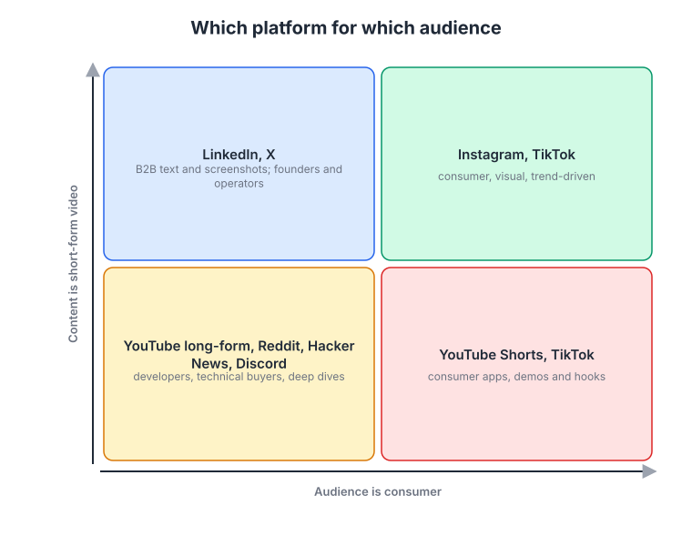
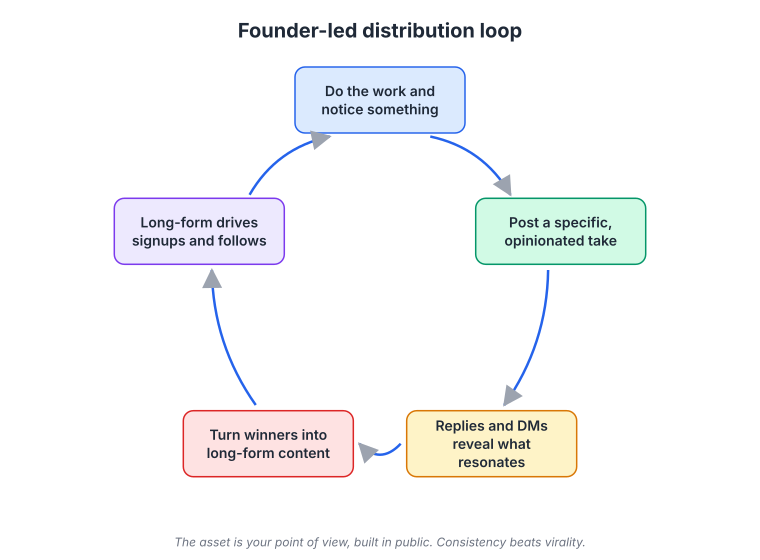
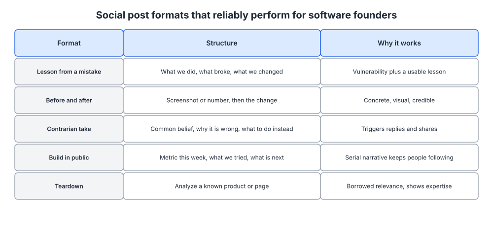
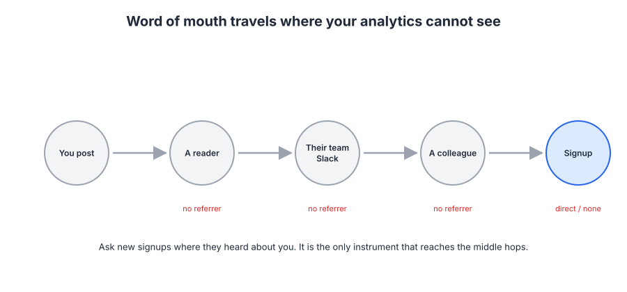

# Week 14: Social media and founder-led distribution

> By the end of this week you will have chosen one primary platform, written a point of view, published a first batch of posts in proven formats, and set up a way to see the word of mouth that analytics cannot.

**Time budget:** reading about 2.5 hours, videos about 2 hours, exercise 2 to 4 hours.

## What this week covers and why it matters for a founder

Ask a founder about social media and you will usually hear one of two things: "we should be on LinkedIn" or "I do not have time for that". Both come from the same misunderstanding, which is that social is a place to be present, like having a listing in a directory. It is not. Social is distribution. It is how the positioning from week 4, the messaging from week 5, and the content from week 10 reach people who do not yet know you exist, and the only question is whether you are going to do the distribution yourself or leave it to chance.

The mistake founders make is treating the company account as the asset. Company accounts on every platform get a fraction of the reach of a person saying the same thing, because platforms reward conversation and people do not converse with logos. The founder is the distribution channel. Your opinions about the problem your platform solves, the mistakes you have made, and what you are seeing in the market are the content, and they are content nobody else can produce.

The second mistake is measuring the wrong thing. Likes and follower counts are easy to see and almost meaningless. The people who matter most, the ones who paste your post into a team Slack channel and say "we should look at this", never show up in your analytics. That is dark social, and this week you will learn how to capture at least part of it.

When founders get this right, a specific thing happens: sales calls start with "I have been reading your stuff". Trust is transferred before the conversation starts, the positioning is already understood, and the deal cycle shortens. That effect is why founder-led distribution has become the default early channel for B2B software.

The concrete outputs of this week: a platform decision with reasoning, a one-page point of view document, ten posts drafted in the formats covered below (five published), and a self-reported attribution question live on your signup form.

## Core concepts

### 1. Pick the platform where your ICP already talks

Platforms are not interchangeable. Each has a native format, a culture, and an audience, and the right choice depends entirely on who you decided to win first in week 3.

*Two axes: is your audience consumer or business, and is your content text or short video. Find your quadrant and ignore the others for now.*

**LinkedIn and X** are where B2B buyers and operators read text and screenshots. LinkedIn has the broadest professional reach and rewards longer posts with a clear lesson; X (formerly Twitter) still concentrates the startup, product, and developer-adjacent crowd, moves faster, and rewards sharp, short takes and threads. Gong built a large LinkedIn presence by having its people post data-backed observations about sales conversations, which is exactly the content its buyers (sales leaders) want to read at work.

**YouTube, Reddit, Hacker News, and Discord** are where developers and technical buyers go for deep dives and honest opinions. These communities punish marketing that looks like marketing. On Hacker News the Show HN guidelines (in the readings) are explicit about what is welcome; on Reddit each subreddit has its own rules and moderators will remove self-promotion. The founders of Vercel and Supabase are active on X and in developer communities, and the tone is consistently that of an engineer talking about what they built, not a company announcing features.

**TikTok and Instagram** are for consumer products where the content is visual and trend-driven. Duolingo's TikTok account, built around its owl mascot behaving badly, is the example everyone cites. Note what it required: a consumer product with a recognizable character, a team willing to be strange, and a platform whose users reward that. It does not transfer to a B2B data platform.

The rule: pick one primary platform. Not two, not four. A founder with five hours a week for marketing can be consistently good on one platform or invisibly mediocre on three. Use a second platform only for repurposing, which is covered in concept 3.

The failure mode is choosing the platform you personally enjoy rather than the one where your ICP reads. Plenty of developer tool founders post diligently on LinkedIn to an audience of recruiters and marketers while their actual users are on GitHub and Hacker News.

### 2. Founder-led content: a point of view and the reply-driven loop

The asset in founder-led distribution is not the posts. It is your point of view, built and sharpened in public over time. Go back to your positioning document from week 4 and the strategic narrative from week 8. Your point of view is the narrative's "change in the world" section, expressed as opinions you are willing to defend: what the old way gets wrong, what the new way looks like, and what you have seen that others have not.

*The loop runs on observation, not inspiration: the raw material is what you noticed while doing the work this week, and the replies tell you which observations are worth expanding.*

The loop works like this. You do the work of building and selling your platform, and you notice something: a customer objection that keeps recurring, a metric that surprised you, a mistake you made. You post a specific, opinionated take on it. Replies and direct messages tell you which takes resonate; a post that gets thoughtful disagreement is worth more than one that gets polite likes. The takes that resonate become long-form content (a newsletter issue from week 13, a guide from week 10, a talk). The long-form content drives signups and follows, and those new followers give you a bigger audience for the next take.

Three things make this loop turn. **Specificity**: "we lost a deal last week because our pricing page hid the enterprise tier" beats "pricing pages matter". **Consistency**: three posts a week for a year beats thirty posts in a month followed by silence, because the platform's distribution and the audience's habit are both built by regularity. **Replies**: reply to every substantive comment for the first hour, and reply to other people's posts in your space daily. Replies are where relationships form and where the algorithm decides you are a person rather than a broadcast.

Lenny Rachitsky is the clearest example of creator-led B2B distribution: a newsletter and podcast about product and growth grew into a business because each piece of content started from a specific question his audience had and was answered with evidence. Justin Welsh built a solo business by posting on LinkedIn daily with a consistent point of view about leaving corporate life. Neither would have worked from a company account.

The failure mode: posting company announcements from a personal account. "Excited to share that we launched X" is not a point of view. It is a press release with a face on it, and it gets treated accordingly.

### 3. Formats, cadence, and repurposing

Founders who struggle to post consistently usually think the problem is ideas. The problem is formats. Once you have five formats that reliably work, every observation from the loop above slots into one of them and the writing takes fifteen minutes.

*Each row is a structure you can fill in, and the third column is why the format earns replies rather than just views.*

**Lesson from a mistake.** What we did, what broke, what we changed. Vulnerability plus a usable lesson. This is the highest-performing format for founders because it is credible and impossible to fake.

**Before and after.** A screenshot or a number, then the change you made. Concrete and visual. A rewritten landing page hero (week 6) with the conversion change is a ready-made post.

**Contrarian take.** Common belief, why it is wrong, what to do instead. Triggers replies and shares. Use sparingly and only when you actually believe it; manufactured contrarianism is easy to spot.

**Build in public.** Metric this week, what we tried, what is next. A serial narrative that keeps people following. Buffer pioneered radical transparency by publishing its revenue and salaries, and the Shopify ecosystem is full of merchants and app developers documenting their journey in public. Be deliberate about what you share; concept 4 covers the tradeoffs.

**Teardown.** Analyze a known product, page, or campaign. Borrowed relevance plus a demonstration of expertise. Marketing Examples (in the readings) is an entire site built on this format.

**Short video.** On every platform, native video now gets more distribution than text. You do not need production quality. A phone, decent light, and a 45-second explanation of one idea, with the first three seconds stating the payoff, is enough. Talk to the camera the way you would explain the idea to a colleague.

**Repurposing.** Write long-form once, then cut it. A newsletter issue becomes three posts (one per section), each post becomes a short video script, and the video's transcript becomes a thread. Linear's changelog is a small example of this discipline: each release note is written well enough to stand alone as a post, so shipping product and shipping content are the same act. Batch the cutting: one hour every Friday producing next week's posts from this week's long-form.

Cadence: three to five posts a week on the primary platform, one long-form piece a week or fortnight, and daily replies. Write down the schedule and treat it like a deploy pipeline.

The failure mode is the founder who writes an excellent 2,000-word essay, posts the link once, and moves on. The essay was the expensive part. The distribution was the point.

### 4. Building in public and the audience it creates

Building in public means sharing progress, numbers, decisions, and mistakes as they happen rather than after the fact. It works because it turns your company into a story people follow, and because it generates trust faster than any finished marketing asset. It also compounds: someone who watched you go from zero to your first hundred customers is an advocate before they are a customer.

Notion's early growth came partly from a community of enthusiastic users on Twitter and YouTube who shared templates and setups, which Notion later formalized into an ambassador program. Superhuman's invite-only launch generated a stream of tweets from people asking for access and celebrating when they got in, which was free distribution created by the product's scarcity. Both are cases where the company created conditions for other people to talk about it, rather than doing all the talking itself.

*Your audience is not a list, it is a graph: notice the dense clusters and the few nodes that bridge them, because reaching a bridge node reaches a whole cluster. Source: [Wikimedia Commons](https://commons.wikimedia.org/wiki/File:Social_Network_Analysis_Visualization.png)*

The graph view explains why founder-led distribution works at small scale. You do not need a million followers. You need to reach the few dozen people in your ICP's cluster who are themselves connected to everyone else in it. Kevin Kelly's 1,000 True Fans essay, in the readings, makes the economic version of this argument; the network version is that a few hundred well-placed followers who reshare into their own clusters outperform a large audience of strangers.

What to share and what not to. Share decisions and the reasoning behind them, metrics that show trajectory, mistakes once you have fixed them, and customer stories with permission. Do not share anything that gives a competitor a roadmap, anything about a customer that they have not approved, or revenue detail if you are raising money and your investors would object. The test is whether the disclosure creates trust with your ICP without creating risk you cannot absorb.

The failure mode is performative vulnerability: sharing "mistakes" that are really humblebrags, or metrics that are cherry-picked. Audiences detect this quickly and the trust you were building reverses.

### 5. Dark social and self-reported attribution

Here is the measurement problem that makes founders undervalue social. Someone reads your post, does not click anything, and three weeks later types your product name into Google. Or they paste the post into a private Slack group of 200 people in your ICP, five of whom sign up over the next month with "direct" or "organic search" as the source. Your analytics will credit Google. The post did the work.

This is dark social: word of mouth that happens in channels analytics cannot see, which is most of them. Private Slack and Discord communities, direct messages, WhatsApp groups, podcasts, conference hallway conversations, and screenshots shared without links. For B2B software, dark social is often the majority of how buyers actually hear about a product.

*Word of mouth travels along paths you cannot instrument: each hop is a private conversation, and only the last one, if any, leaves a trace in your analytics.*

You cannot fully measure it, but you can capture a large part of it with a single field on your signup form or in your first sales conversation: "How did you hear about us?" as a free-text box, not a dropdown. This is self-reported attribution. It is imperfect (people forget, and they name the last thing they remember), but it is the only source that will ever tell you "a friend shared your post in our team channel", and that is the answer you need. Read the responses weekly and tag them by hand. Week 18 puts this next to your click-based attribution so you can see how much they disagree.

Two more signals. Branded search volume (people searching your product name) is the cleanest proxy for word of mouth over time; it is in your search console from week 11. And direct traffic spikes that follow a post or a podcast appearance, with no click path, are the footprint of dark social even when you cannot see the conversation.

The failure mode: killing founder-led content after three months because "it did not drive signups", judged entirely on last-click attribution, while the signup form's free-text field was never read.

### 6. Vanity traps, engagement pods, and criticism

Three things will tempt you or catch you off guard.

**Vanity metrics.** Followers, impressions, and likes rise with volume and controversy, not with business value. The metrics that matter are replies from people in your ICP, DMs that turn into conversations, newsletter signups attributed to social, and "how did you hear about us" answers that mention you or your posts. Track those four and ignore the rest.

**Engagement pods.** Groups of people who agree to like and comment on each other's posts within minutes of publishing, to game the algorithm's early-engagement signal. They produce numbers and nothing else. Your ICP is not in the pod, the comments are visibly hollow, and platforms periodically penalize the pattern. The same applies to buying followers and to automated commenting tools.

**Criticism.** If you post opinions, some people will disagree, and occasionally someone will be hostile. The rule is that you respond to the substance and never to the tone. If they are right, say so publicly and thank them; this builds more trust than any post you could write. If they are wrong, state your reasoning once, briefly, and stop. Do not delete comments unless they are abusive, and never argue in a thread for more than two replies. Handling criticism well in public is itself a form of content, and your prospects are watching how you do it.

A note on the company account. Keep one, post product news and repost the founder's content, and treat it as a directory listing rather than a channel. Its job is to exist and look alive when a prospect checks.

## Videos

- [Justin Welsh on LinkedIn content strategy](https://www.youtube.com/watch?v=D_12KNeS07k)
  Why watch: a practitioner explaining the daily system behind a consistent LinkedIn presence, including how he batches writing and picks formats; about an hour in most interview versions.
- [How to start a movement, Derek Sivers (TED, 2010)](https://www.ted.com/talks/derek_sivers_how_to_start_a_movement)
  Why watch: three minutes on why the first follower matters more than the leader, which is the correct way to think about early replies and reshares.
- [How to get your ideas to spread, Seth Godin (TED, 2003)](https://www.ted.com/talks/seth_godin_how_to_get_your_ideas_to_spread)
  Why watch: the argument that remarkable means "worth making a remark about", which is the test every post should pass; about 17 minutes.
- [Rand Fishkin on zero-click search and audience research (SparkToro)](https://www.youtube.com/watch?v=B35eQ7keoGA)
  Why watch: Fishkin's data on how platforms keep users on-platform explains why you should post native content rather than links, and why dark social is growing; about 40 minutes.
- [Notion's growth (Lenny's Podcast with Notion growth leaders)](https://www.youtube.com/watch?v=bY5KC9Gguz8)
  Why watch: how a community of enthusiastic users on social became a deliberate program, and what Notion did and did not control; about an hour.

## Recommended reading

- [1,000 True Fans, Kevin Kelly](https://kk.org/thetechnium/1000-true-fans/). What to take from it: you need a small number of people who care a lot, not a large number who care a little, and social is where you find them.
- [Show HN guidelines, Hacker News](https://news.ycombinator.com/showhn.html). What to take from it: what the community considers a legitimate post, and the tone that works there (show what you built, invite feedback, no marketing language).
- [Reddit rules](https://www.redditinc.com/policies). What to take from it: the sitewide rules on self-promotion and manipulation; then read the rules of the three subreddits your ICP uses before you post in any of them.
- [Write Simply, Paul Graham](https://paulgraham.com/simply.html). What to take from it: simple writing reaches more people and is harder to write; every social post should pass the "would I say this out loud" test.
- [Writing Handbook, Julian Shapiro](https://www.julian.com/guide/write/intro). What to take from it: the sections on generating ideas from your own experience and on rewriting for clarity; both apply directly to short posts.
- [Marketing Examples, Harry Dry](https://marketingexamples.com/). What to take from it: a library of teardowns in the format described in concept 3; study how each one makes a single point with one image.
- [Seth Godin's blog](https://seths.blog/). What to take from it: a daily post for decades is the clearest demonstration that consistency and a point of view beat production value.

## Hands-on exercise (2 to 4 hours)

**Deliverable:** a founder distribution plan in your company wiki (platform choice, point of view, format list, weekly schedule), ten drafted posts with five published, and a "how did you hear about us" free-text field live on your signup form.

**Steps:**
1. (20 minutes) Choose the primary platform. Take your ICP from week 3 and the list of 50 target accounts or communities. Where do those people actually post and read? Write the choice and one paragraph of reasoning.
2. (30 minutes) Write your point of view. Pull the "change in the world" and "winners and losers" sections of your week 8 narrative and turn them into five opinions of one sentence each that you would defend in public.
3. (15 minutes) Set up the profile. Headline states who you help and with what (use the week 5 one-liner). Photo of your face. Link to the site.
4. (60 minutes) Draft ten posts using the template below: two per format from concept 3. Source them from the last month of real work: a mistake, a metric, an objection, a rewrite, a product you admire.
5. (15 minutes) Publish the first post now and schedule four more across the next week. Record the schedule (days, times, formats).
6. (20 minutes) Add the "How did you hear about us?" free-text field to your signup form or onboarding flow, and create a place (a spreadsheet is fine) where you will tag the answers weekly.
7. (20 minutes) Build a reply list of 20 people in your ICP's cluster (the bridge nodes from concept 4) whose posts you will reply to substantively at least twice a week.
8. (10 minutes) Write the metrics you will track (ICP replies, DMs, newsletter signups from social, self-reported mentions) and the review cadence.

**Template:**

| Field | Your entry |
|---|---|
| Format | lesson from a mistake / before and after / contrarian take / build in public / teardown |
| Hook (line 1, under 15 words, states the payoff) | |
| Body (3 to 8 short lines, one idea) | |
| Proof (screenshot, number, or quote with permission) | |
| Close (a question or a one-line takeaway; no link in the body on platforms that suppress links) | |
| Repurpose into | newsletter section / short video / thread |
| Publish date and time | |

**How to know it is good:**
- The platform choice names where your ICP reads, not where you prefer to write.
- Each of the five opinions in your point of view would make at least one competitor uncomfortable.
- Every drafted post starts with a specific observation from your own work, and none announces a feature.
- The first post is live, four more are scheduled, and the schedule is written down.
- The free-text attribution field is live and you have a place to tag answers.

## Self-check

Answer these without looking back. If you cannot, reread the relevant section.

1. Why does a founder's personal account outperform the company account, and what is the company account for?
2. Name the five post formats and say which one is most credible and why.
3. Describe the founder-led distribution loop. What is the raw material, and what tells you which posts to expand?
4. What is dark social? Give three examples of where it happens and explain why analytics cannot see it.
5. How does self-reported attribution work, and why should the field be free text rather than a dropdown?
6. Your developer tool is getting good engagement on LinkedIn from marketers and recruiters. What went wrong in platform selection?
7. Someone with a large following posts that your product is overpriced and badly designed. Write your reply in two sentences.
8. Why do engagement pods produce nothing of value even when the numbers go up?
9. What are the four metrics worth tracking for founder-led social, and why is follower count not one of them?

**You are done with this week when:**
- [ ] You have one primary platform chosen with written reasoning and a set-up profile.
- [ ] A five-opinion point of view document exists and ten posts are drafted in named formats.
- [ ] Five posts are published or scheduled, and a reply list of 20 ICP accounts is in use.
- [ ] A free-text "how did you hear about us" field is live with a tagging process.

## Next week

Social reaches your ICP one post at a time. Next week covers community, developer relations, and partnerships: the structures that let other people do the distribution for you, and the difference between an audience that follows you and a community that belongs to each other.
