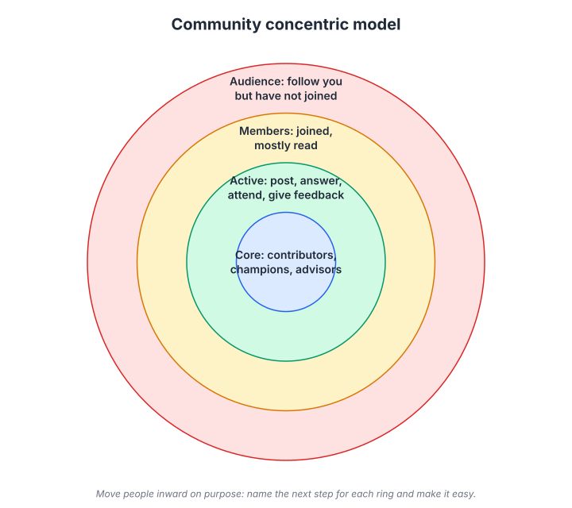
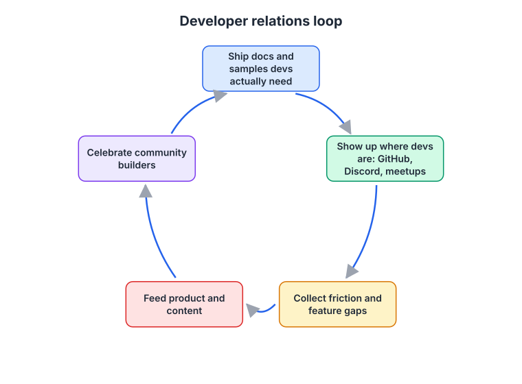
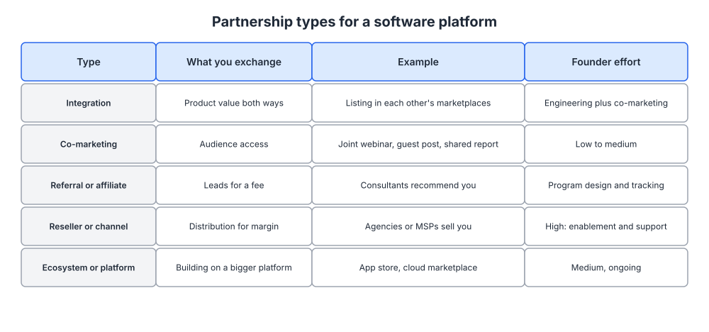
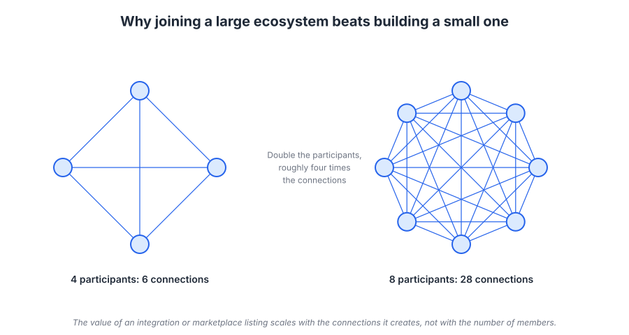

# Week 15: Community, developer relations and partnerships

> By the end of this week you will know whether your platform should have a community at all, and you will have a written plan for one community program, one developer relations activity, and one partnership, each with a metric.

**Time budget:** reading about 3 hours, videos about 2.5 hours, exercise 2 to 4 hours.

## What this week covers and why it matters for a founder

Everything in weeks 9 to 14 was you or your company reaching people directly. This week is about the structures that let other people do it for you: a community whose members answer each other's questions and recommend you, developers who build on your platform and write about it, and partners whose customers become yours. Done well, these compound in a way no paid channel can, because each new member, builder, or partner adds value for the ones already there.

The mistake founders make is starting with the tool. They create a Discord server or a Slack workspace, invite their users, post a welcome message, and watch it go quiet within a month. A community is not a chat room. It is a group of people who get value from each other, and your job is to design the reasons they would. Many software platforms should not have a community at all in the early stage, and knowing when that is true will save you months.

Developer relations has a similar trap. Founders hear that Stripe and Twilio won developers and conclude they need a devrel hire. What Stripe and Twilio actually did first was ship documentation and SDKs so good that developers could succeed without talking to anyone, and then they showed up where developers already were. The order matters.

Partnerships are the most underused of the three for early-stage software, and the most often done badly. A logo swap and a joint press release is not a partnership. An integration that makes both products more valuable, listed in both marketplaces, with a shared customer story, is. The difference is whether a customer of the partner gets something real out of it.

The concrete outputs of this week: a decision document on whether and how to run a community (with the concentric model filled in for your audience), a devrel plan with one concrete activity for the next month, and a partnership shortlist with one outreach drafted.

## Core concepts

### 1. Community as a moat and a channel: the concentric model

A community is a channel because members recommend you, answer prospects' questions, and produce content you did not have to write. It is a moat because a competitor can copy your features but cannot copy the relationships between your users. dbt Labs is a good example: its community Slack grew into one of the largest in data tooling, and for years the fastest way to get a dbt question answered was to ask other practitioners there. A competing product had to compete with that, not just with dbt's code.

The way to think about who is in your community is a set of concentric rings.



*Four rings, and the arrow points inward: the design question for each ring is what the next step toward the center is and how you make it easy to take.*

**Audience** follows you (week 14) but has not joined anything. **Members** joined and mostly read. **Active** members post, answer, attend, and give feedback. **Core** members contribute code or content, champion you inside their companies, and advise you. In a healthy community the rings are roughly a pyramid: a large audience, a smaller membership, a fraction active, and a handful in the core. The failure is expecting everyone to be active; most people in any community read and never post, and that is fine as long as the active ring is large enough to keep it alive.

Your job is to move people inward on purpose. For each ring, name the next step and remove friction from it. Audience to member: a clear reason to join that is not "get updates" (an answer to a question, access to templates, a monthly call with peers). Member to active: a first easy contribution, such as an introductions thread or a weekly prompt. Active to core: recognition, early access, a direct line to you, and a title (ambassador, champion, maintainer).

Figma's community is a case study in ring design. The Figma Community lets anyone publish files, plugins, and templates, which turned active users into contributors whose work is discoverable by everyone else. Config, Figma's annual conference, gives the core ring a stage. Notion's ambassador program formalized what was already happening: enthusiastic users who ran local meetups and made templates were given a name, resources, and recognition.

The common failure mode: measuring the community by member count. A Slack with 10,000 members and no answers in the help channel is a failed community. A forum with 300 members where every question gets a good answer within a day is a working one. Measure activity ratios and answer rates, not headcount.

### 2. When community makes sense, and where to host it

Community is not free. It needs a person's attention every day, it takes six to twelve months to become self-sustaining, and if you abandon it the damage to trust is worse than never having started. So decide honestly.

Community makes sense when at least two of these are true. Your users have questions that other users can answer better than your docs can (implementation patterns, workflows, edge cases). Your users benefit from meeting each other (peers in the same role, or people building on the same platform). Your product produces shareable artifacts (templates, plugins, configurations, boards). Your ICP already gathers somewhere and there is no good home for the conversation.

Community does not make sense yet when your users are few and do not share a role, when the product is simple enough that a good docs site answers everything, or when you cannot commit a few hours a day to it for a year. In those cases, join and contribute to existing communities where your ICP is (week 14's reply list) and revisit this in six months.

Where to host it, if you proceed. Discord is where developers and consumer enthusiasts already are; it is chat-first and best for real-time help, and the Discord community resources in the readings cover moderation and setup. Slack is what B2B professionals already have open, but message history limits on free plans and workspace sprawl are real problems. Forums (Discourse-style) and GitHub Discussions are slower, searchable, and indexable by search engines, which means every answered question becomes a page that ranks (week 11); this is a strong reason to prefer them for a developer platform. In-product community, where help and discussion live inside the application, is the most convenient for users and the most work to build.

Programs are how you give the community structure. **Ambassadors or champions** recognize the core ring and give them a role. **Events**, from a monthly community call to an annual conference, give people a reason to show up at the same time. **Office hours** with you or your engineers, on a fixed weekly slot, are the cheapest and most reliable program to start with; they turn support into relationship building and give you a steady supply of customer research (week 2).

The failure mode is launching all of this at once. Start with one channel and one program. Add the next when the first is running without you.

### 3. Developer relations: docs first, then presence

If developers are your users or buyers, developer relations is your marketing whether or not you call it that. Wikipedia's article on developer relations (in the readings) gives the standard definition; here is the practical version.



*The loop starts with docs, not with a conference talk: everything after the first step depends on a developer being able to succeed alone.*

**Ship docs and samples developers actually need.** Stripe set the standard: documentation that reads like a well-edited tutorial, code samples in every language a developer might use, a test mode that works exactly like production, and a quickstart that gets to a working call in minutes. Your equivalent is a quickstart that a stranger can complete in under fifteen minutes, reference docs generated from the code so they never drift, and example repositories for the three most common use cases. SDK quality counts as marketing: a library with clear errors and idiomatic design is the product experience for a developer.

**Show up where developers are.** GitHub issues and discussions, Stack Overflow questions tagged with your product or the problem you solve, Discord servers in your ecosystem, and meetups. Twilio's early developer evangelists went to hackathons and meetups and helped people build, and Twilio's billboard reading "Ask your developer" was aimed at the business buyer while the developer was already convinced. Patrick Collison's interviews on developers as customers (in the videos) make the same point: developers choose tools, and they choose the ones that respected their time.

**Collect friction and feature gaps.** Every question is a docs bug or a product bug. Keep a log, tag it, and route it. This is the highest-value input a product team can get, and it is why devrel should report on what it learned, not only on what it produced.

**Feed product and content.** The questions become tutorials (week 10's content calendar), the gaps become roadmap items, and the patterns become talks.

**Celebrate community builders.** Feature what developers build with your platform. Retweet it, write it up, invite them to demo at a community call. Kelsey Hightower's talks on developer community (in the videos) are the best explanation of why generosity toward other people's work is the core of developer credibility.

Measuring devrel is notoriously hard, and Mary Thengvall's framework (in the videos) is the standard answer: track the developer's journey from awareness to activation to contribution, and count "devrel qualified leads" (developers who took a meaningful step because of a devrel activity) rather than talk attendance. For an early-stage founder, three numbers suffice: time to first successful API call for a new developer, the share of questions answered by docs versus humans, and the number of external projects or posts built on your platform each month.

The failure mode is hiring a developer advocate to give talks while the quickstart still takes an hour and the SDK throws unhelpful errors. Talks send developers to docs. If the docs fail them, the talk made things worse.

### 4. Open source as marketing

Open source is the most powerful developer marketing strategy available to a software platform, and it is a business model decision, not a marketing tactic. Supabase and PostHog both built their companies on open source cores: developers can read the code, run it themselves, and trust that they are not locked in, and the hosted product is where the revenue comes from. Their GitHub repositories function as landing pages, their issues as support forums, and their contributors as the core ring of the community from concept 1.

What open source gives you as marketing: distribution through GitHub and package managers that no other channel matches for developers, credibility that no amount of copy can buy, a community that forms around the code without you organizing it, and search visibility through every blog post someone writes about using it.

What it costs: you must support users who will never pay, the license decision constrains your business forever, and competitors (including cloud providers) can use your code. HashiCorp built Terraform and Vault as open source, grew a large ecosystem, and in 2023 changed its license to restrict competing commercial use; the community response included a fork of Terraform, and the episode is a useful case study in how strongly developers feel about license changes and how much an ecosystem depends on trust.

If you go this route: pick the license with legal advice and do not change it lightly; make the hosted or enterprise version the obvious choice for teams that value their time; treat the repository as a product surface (README as landing page, issue templates, contribution guide, fast responses); and measure stars as a vanity metric, contributors and dependents as real ones.

If your platform is not open source, you can still borrow the strategy: open source your SDKs, CLI, and example applications. Developers judge a company by the code it publishes.

### 5. Partnerships: what you exchange and what it costs you

A partnership is an exchange. Before you approach anyone, be clear on what each side gives and gets. The types differ enormously in founder effort.



*Read the last column first: the types that sound easiest (referral, reseller) are the ones that need the most program design and ongoing support.*

**Integration.** Both products become more valuable when connected, and each lists the other in its marketplace or integrations directory. Zapier's entire platform is an integration partnership at scale: every app that builds a Zapier integration gets a page, and Zapier gets more reasons for users to stay. Slack's app directory and Datadog's hundreds of integrations work the same way. For an early-stage platform, the play is to integrate with the two or three tools your ICP already lives in (their CRM, their chat tool, their data warehouse) and get listed. The engineering cost is real, so pick by ICP usage, not by partner logo.

**Co-marketing.** Audience access in both directions: a joint webinar, a guest post, a shared benchmark report, a case study of a shared customer. Low to medium effort and fast to test. The best co-marketing partner has the same ICP and a non-competing product.

**Referral or affiliate.** Consultants, agencies, and creators recommend you for a fee or a revenue share. Sounds easy; needs program design, tracking, terms, and payment infrastructure, and attracts low-quality partners if the incentive is misaligned. HubSpot's agency partner program is the mature version: agencies deliver HubSpot to clients and earn on it, and HubSpot gains a sales force it does not employ.

**Reseller or channel.** Agencies, managed service providers, or system integrators sell and sometimes deliver your product for margin. High effort: enablement, training, deal registration, support. Rarely appropriate before you have a repeatable sales motion yourself (week 21).

**Ecosystem or platform.** You build on a bigger platform's marketplace: an app store, a cloud marketplace, an integration directory. Medium and ongoing effort, covered next.

How to start: list every product your ICP uses alongside yours (from your week 3 target accounts and week 2 interviews). For each, write what the joint customer gains. Rank by ICP overlap and by how easy the partner is to reach. Draft one outreach to the top pick that leads with what their customers get.

The failure mode: partnerships driven by who replied to your email rather than by ICP overlap, resulting in a page of partner logos nobody uses.

### 6. Ecosystem plays and network effects

The largest partnership opportunity for many software platforms is to become part of, or to become, an ecosystem. Salesforce's AppExchange, Shopify's app store and partner program, Atlassian Marketplace, and Webflow's expert directory are all cases where a platform created a place for third parties to sell to its customers, and the third parties became a distribution channel that grows on its own.

If you are small, the play is to be a third party on a platform your ICP already uses. Building a Shopify app puts you in front of merchants searching for your category. Listing on a cloud marketplace lets enterprise buyers purchase against their existing cloud commitment, which removes procurement friction. Salesforce's Trailblazer community is a case study in how a platform can turn its users into a certified, self-identifying group that recommends ecosystem products to each other.



*Each new participant in an ecosystem adds connections to everyone already there, which is why marketplaces get more valuable as they grow and why joining a large one early is worth more than building a small one.*

The HBR article on two-sided markets and the NFX network effects manual (in the readings) cover the economics. The practical points for a founder: marketplaces have a chicken-and-egg problem that the platform owner solves by subsidizing one side, so as a third party you benefit from that subsidy; category listings are search results, so your listing page needs the copywriting discipline of week 6; and reviews on the marketplace are social proof that compounds, so ask every happy customer to leave one.

If you become the platform, network effects are a later-stage concern for most founders, and week 16 covers how they differ from virality and when they actually apply.

The failure mode is listing on every marketplace and maintaining none. A stale listing with two reviews hurts more than no listing.

## Videos

- [The Business of Belonging, David Spinks (CMX)](https://www.youtube.com/watch?v=txZF7KHxJYo)
  Why watch: Spinks founded CMX and wrote the standard book on community strategy; his framework for tying community to business outcomes is the one to use in your decision document; about 40 minutes.
- [The Business Value of Developer Relations, Mary Thengvall](https://www.youtube.com/watch?v=Z_eHb9TKvKI)
  Why watch: how to measure devrel without pretending talks are leads, including the devrel qualified lead concept; about 30 to 45 minutes.
- [Kelsey Hightower on developer community and open source](https://www.youtube.com/watch?v=eb0442K_zmY)
  Why watch: the most credible explanation of why generosity, live demos, and helping people succeed are what build developer trust; length varies by talk, pick one around 30 minutes.
- [Figma's growth and community (Lenny's Podcast and talks)](https://www.youtube.com/watch?v=UmirRfy-gzA)
  Why watch: how the Figma Community and Config turned users into contributors, and what Figma did deliberately versus what happened on its own; about an hour.
- [Patrick Collison on developers as customers (Stripe)](https://www.youtube.com/watch?v=WU-lBOAS1VQ)
  Why watch: why Stripe treated documentation and developer experience as the product, and how that decided its distribution; about an hour, the first half is the relevant part.

## Recommended reading

- [CMX, community professionals](https://www.cmxhub.com/). What to take from it: the community strategy frameworks and the SPACES model (support, product, acquisition, contribution, engagement, success) for deciding what your community is for.
- [Rosie Sherry on community](https://rosie.land/). What to take from it: practical, unglamorous advice on community building from someone who has done it for decades; read the pieces on starting small and on why most communities fail.
- [Heavybit Library](https://www.heavybit.com/library/). What to take from it: talks and articles on developer-first go-to-market from founders who did it; search for developer marketing and community.
- [Discord community resources](https://discord.com/community). What to take from it: setup, moderation, and safety guidance if you choose Discord; the moderation material applies to any platform.
- [The Network Effects Manual, NFX](https://www.nfx.com/post/network-effects-manual). What to take from it: the taxonomy of network effects, and which types (marketplace, platform, data) apply to ecosystems you might join or build.
- [Strategies for Two-Sided Markets, Eisenmann, Parker, Van Alstyne (HBR, 2006)](https://hbr.org/2006/10/strategies-for-two-sided-markets). What to take from it: why platforms subsidize one side, and how to think about pricing and exclusivity when you join a marketplace.
- [Developer relations, Wikipedia](https://en.wikipedia.org/wiki/Developer_relations). What to take from it: the scope of the discipline (advocacy, docs, community, support) so you can decide which parts you need now.
- Book: The Business of Belonging, David Spinks, chapters on community strategy and the member journey ([CMX page](https://www.cmxhub.com/)). What to take from it: the argument that community should be tied to one business objective at a time, and the member journey model that maps to the concentric rings.

## Hands-on exercise (2 to 4 hours)

**Deliverable:** a community, devrel and partnerships plan saved in your company wiki: a go or no-go decision on community with the concentric model filled in, one devrel activity scheduled for the next 30 days with a metric, and a ranked partnership shortlist with one outreach message drafted.

**Steps:**
1. (20 minutes) Apply the community test from concept 2. Score the four conditions honestly and write a go or no-go decision. If no-go, list the three existing communities where your ICP gathers and how you will contribute there weekly.
2. (30 minutes) If go: fill in the concentric model. For each ring, write who is in it today (with rough numbers), the next step inward, and the one thing you will change to make that step easier. Pick the hosting platform and the first program (office hours is the default).
3. (30 minutes) Devrel audit. Time a stranger (a friend who codes, or yourself with a fresh account) completing your quickstart. Record the minutes and every point of confusion. This is your friction log.
4. (20 minutes) Choose one devrel activity for the next 30 days: fix the top three quickstart issues, publish an example repository, or answer every question in a relevant forum for a month. Write the metric (time to first call, questions answered, external projects).
5. (30 minutes) Partnership map. List ten products your ICP uses alongside yours, from your week 2 interviews and week 3 target accounts. For each, write the joint-customer gain in one sentence and score ICP overlap 1 to 5.
6. (20 minutes) Draft outreach to the top-scoring partner using the template below. Lead with what their customers get.
7. (15 minutes) Check whether your ICP buys through any marketplace (app store, cloud marketplace, integration directory). If yes, add a listing to your plan with an owner and date.
8. (15 minutes) Write the review cadence: which numbers you will check monthly for community, devrel, and partnerships.

**Template:**

```
PARTNER OUTREACH

To: <name, role at partner>
Subject: <their product> + <your platform> for <shared ICP>

Hi <name>,

<One sentence on who you are and the ICP you share, named specifically.>

<Two sentences on what a shared customer gets from the two products
working together. Concrete: the workflow, the time saved, the data
that flows.>

<One sentence on what you are proposing first: an integration listing,
a joint webinar, a shared customer story. Small and dated.>

<One sentence on what you will do: the engineering, the writing, the
promotion. Make the partner's cost obvious and low.>

Would a 20-minute call next week work?

<Your name>
```

**How to know it is good:**
- The community decision is written with reasons, and a no-go is treated as a valid answer.
- If go, every ring has a named next step and a specific friction removed, and only one platform and one program are planned.
- The quickstart timing is a real number from a real attempt, with a friction log.
- The devrel activity has a metric that is not talk attendance or stars.
- The partnership shortlist is ranked by ICP overlap, and the outreach leads with the partner's customers, not with you.

## Self-check

Answer these without looking back. If you cannot, reread the relevant section.

1. Name the four rings of the concentric model and the design question you ask about each.
2. Why is member count a bad measure of a community, and what should you measure instead?
3. List the conditions under which community makes sense and the situation in which you should wait.
4. Why does the devrel loop start with docs rather than talks? What happens when the order is reversed?
5. What are the three devrel numbers an early-stage founder should track?
6. What does open source give a developer platform as marketing, and what does it cost? Why did the HashiCorp license change matter?
7. Rank the five partnership types by founder effort and explain why referral programs are harder than they look.
8. Why does joining a large marketplace early beat building a small one, in terms of network effects?
9. Your ICP uses your product alongside a CRM and a chat tool. Which partnership type do you pursue first and how do you pick between the two candidates?

**You are done with this week when:**
- [ ] A community go or no-go decision is written with the concentric model or an existing-communities plan.
- [ ] The quickstart has been timed by a fresh user and a friction log exists.
- [ ] One devrel activity is scheduled for the next 30 days with a metric.
- [ ] A ranked partnership shortlist exists and one outreach message is drafted.

## Next week

This week ended on network effects. Next week opens the growth section by explaining how they differ from virality, why funnels are the wrong mental model for a software platform, and how to design a growth loop and a product-led motion in which the product itself does the distributing.
