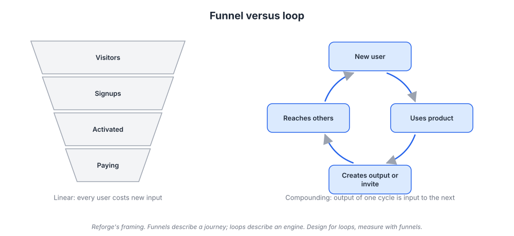
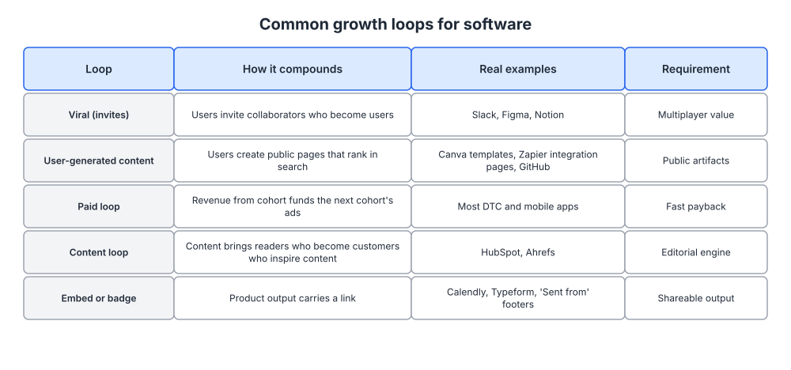
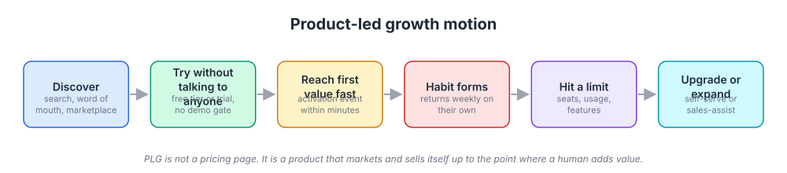

# Week 16: Growth loops and product-led growth

> By the end of this week you will be able to draw the growth loop your platform actually runs on, calculate its throughput and cycle time, and decide which product-led mechanics (free tier, trial, reverse trial, sales assist) fit your product and price.

**Time budget:** reading about 3 hours, videos about 2.5 hours, exercise 2 to 4 hours.

## What this week covers and why it matters for a founder

Weeks 9 to 15 were about channels: search, content, email, ads, social, community, partnerships. Each puts your product in front of someone who has not seen it. This week is about building a system where using the product produces the next batch of people who see it, so growth does not stop when you stop spending.

The mistake founders make is thinking in funnels. A funnel is one person's journey: arrive, sign up, activate, pay. It is a useful measuring device and a poor strategy, because it says nothing about where the next visitor comes from. If your only model is a funnel, you buy every visitor at the top forever, and your cost per visitor rises as you exhaust the cheap ones. Andrew Chen's "Law of Shitty Clickthroughs" (in the readings) is the formal version: every acquisition tactic decays.

A loop is different. The output of one cycle becomes the input to the next. Slack: someone creates a workspace and immediately invites colleagues, because a chat tool with one person in it is useless. Figma: a designer shares a file link, and to comment on it an engineer needs an account. Calendly: every meeting booked shows a stranger the booking page. None of those companies bought the second user.

Product-led growth is the business model that sits on loops like these. Instead of a salesperson explaining the product, the product explains itself: the user tries it without talking to anyone, reaches value, hits a limit, and upgrades.

Concrete outputs this week: one loop diagrammed with every step named, its throughput and cycle time measured from your own data, a decision on your free-to-paid model, and the two biggest constraints with a fix for each.

## Core concepts

### 1. Funnels describe, loops compound

Funnels and loops answer different questions. The funnel answers "where do people fall out of the journey," a conversion question. The loop answers "where does the next user come from," a growth question. You need both, but only one is a strategy.



*Read the labels under each shape. The funnel needs new input at the top every cycle; the loop takes its output and feeds it back in as input.*

The difference shows up in planning. A funnel plan says "we need 10,000 visitors to get 100 customers." Next quarter you need 12,000 and the cheap ones are gone. A loop plan says "each activated customer produces 0.4 new signups within three weeks, so the questions are how to raise 0.4 and how to shorten three weeks." The second question compounds.

Reforge's essay "Growth Loops are the New Funnels" (in the readings) made this framing popular, and Brian Balfour's talk of the same name is the clearest version on video. Durable growth companies are running one or two loops well, not better funnels.

Three consequences matter. Channels feed loops; they are not loops themselves, and running ads is only a loop if revenue from one cohort pays for the next cohort's ads fast enough to reinvest. A loop has a speed, not just a rate: two loops that each produce 0.5 new users per user behave very differently if one takes a week and the other six months. And loops leak, because a user who churns before completing the loop never produces the next one, which is why week 17 follows immediately.

The common failure is drawing a loop that is not closed: a circle from "user signs up" to "user loves product" to "user tells friends" with no mechanism on the last arrow. If you cannot name the button, link, page, or email that turns an existing user's action into a new person's first exposure, you do not have a loop.

### 2. The main loop types, with real examples

A handful of loop shapes work for software. Knowing which are possible for your product narrows the design problem, because most products can run only one or two.



*The right-hand column is the filter. If your product does not meet the requirement, that loop is not available to you no matter how well you execute.*

**Viral or invite loops.** A user brings others because the product is better with them in it. Slack, Figma, Notion, and Miro all work this way, and the requirement is multiplayer value. A referral program is different: multiplayer invites happen because the user wants the outcome, while referral programs pay people to do something they were not going to do. Dropbox is the famous case of the second type done well, because both the referrer and the new user got extra storage, so the reward was denominated in the product and attracted people who wanted the product. PayPal's early cash bonuses worked too, but that loop is expensive and stops the day you stop paying.

**User-generated content and SEO loops.** Users create public artifacts, those pages get indexed, strangers find them through search, and some become users who create more. Canva's template gallery, Notion's template ecosystem, and GitHub's public repositories all do this. Zapier is the sharpest B2B example: it built a page for essentially every pair of apps it connects, so a search for connecting two specific tools lands on a Zapier page. That is week 11's programmatic SEO, powered by product data rather than writers. If everything your users create is private by necessity, this loop is closed to you.

**Paid loops.** Revenue from one cohort funds acquisition of the next. The constraint is the payback period from week 12: if recovering acquisition cost takes fourteen months, you cannot reinvest fast enough to spin the loop.

**Content loops.** Content brings an audience, the audience becomes customers, and customers supply the questions and credibility for the next content. HubSpot built a company on this and Ahrefs runs it deliberately, publishing tutorials that both demonstrate and require the product. The requirement is an editorial engine you can sustain, which is why week 10 was about cadence rather than campaigns.

**Embed and badge loops.** Your product's output carries a link into places you never reach: Calendly's booking page, Loom's share link, Typeform's forms, and the "Sent from" footers of the email era, of which Hotmail's free email line at the bottom of every message is the original. The requirement is that users send the product's output to other people as a normal part of using it. This is the cheapest loop to add if you qualify, so audit every artifact your product emits for whether it identifies you.

A sixth shape, the sales-assisted loop, sits on top of any of these: a self-serve user inside a company becomes the entry point for a sales conversation that brings in a team, then a department. Concept 5 covers it.

The failure mode is running four loops at once. Each needs product work, instrumentation, and attention. Pick the one your product makes possible, get it working, then consider a second.

### 3. Designing a loop and measuring it: throughput and cycle time

Write the loop as numbered steps, each with a conversion rate and a time delay, then compute two numbers.

**Throughput** is how many new entrants one entrant produces per cycle: multiply the conversion rate of every step. If activated users each share a document, 40 percent of shares are opened by a new person, and 15 percent of those sign up, throughput is those rates multiplied by shares per user.

**Cycle time** is how long one entrant takes to produce the next: add the delay at each step. Signup to first share three days, share to open one day, open to signup two days. Six days per cycle.

Throughput tells you whether the loop grows or decays; cycle time tells you how fast. Throughput above 1.0 grows on its own and is rare. Most real loops sit between 0.1 and 0.6, so they amplify other channels rather than replace them. A loop at 0.5 turns every 100 users you acquire elsewhere into roughly 200 over time, halving your effective acquisition cost. Worth building, even though it never goes exponential.

The k-factor is the same idea from the viral marketing literature: invites per user multiplied by invite conversion, so four invites at 12.5 percent gives k of 0.5. Measure it per cohort within a fixed window, such as invites sent in the first 30 days; a k-factor that mixes every user who ever signed up with every invite ever sent flatters the result.

Once the loop is written as steps, find the constraint: the step that costs the most volume and is cheapest to change. Usually it is one of three. Too few users reach the step that starts the loop, in which case the real work is activation (week 17). Or the trigger is weak: the share exists but sits three clicks deep, or the default is private. Figma's decision to make sharing a link the natural way to show work, rather than exporting an image, set its loop throughput. Or the new person lands badly, hitting a signup wall before seeing anything. Loom handles that well: you watch the video, and only recording or commenting needs an account.

Cycle time is the most ignored lever. Shortening a loop from 21 days to 7 triples the cycles per quarter, and compounding is exponential in cycles. Prompt the loop action during onboarding, remove setup steps between signup and the shareable moment, and remind users who have not acted within the usual window.

The failure mode is optimizing a loop nobody is in. If activation is 20 percent, fix activation first. A loop multiplies whatever reaches it.

### 4. Product-led growth: free tier, trial, and reverse trial

Product-led growth means the product is the primary way you acquire, convert, and expand customers. The Wikipedia article in the readings gives the definition; the mechanics are the useful part.



*Each box is a place your product can fail. The line at the bottom is the point: PLG is a product that sells itself up to where a human genuinely adds value.*

PLG fits when a user can get real value alone in one session, when what they get is worth showing someone, and when the price point cannot support a salesperson per deal. It fits badly when the product needs integration and a security review before it does anything, when the buyer is never the user, or when contract values are high and volume is low. The free-to-paid model then takes one of three shapes.

**Free tier (freemium).** A permanently free version limited by seats, usage, or features. It works when marginal cost per free user is near zero, when free users are part of a loop, and when the limit is something a successful user naturally outgrows. Slack's free plan limited searchable history, so a team that genuinely adopted it eventually hit a wall that mattered. Figma is free for individual use and charges per editor. GitHub was free for public repositories and charged for private ones, which turned open source into its distribution. The failure mode is a free tier so generous nobody upgrades, or so stingy nobody reaches value. You will revisit the line in week 20.

**Free trial.** Full product, limited time. It works when value takes a few sessions to appear and usage is continuous rather than occasional. The failure mode is the 30-day trial where the user signs up, does nothing for 29 days, and gets an expiry email. Trial length should match your natural usage cycle, and every day of it should be an onboarding campaign (week 13).

**Reverse trial.** The user starts on the full paid experience for a short window without a credit card, then drops to the free tier rather than to nothing. Elena Verna has made the strongest case for this shape, and the logic holds: the user sees what they are missing before you take it away, and if they do not convert you keep them in the loop as a free user. Canva's approach, where a new user can try paid features and then continues on the free plan, is the consumer version. It is the best default when you have both a viable free tier and meaningful premium features.

Two rules hold whichever you choose. No credit card up front unless your product attracts abuse, because a card form before value destroys the top of the loop. And the free experience must be worth telling someone about, because in a PLG company the free tier is the marketing budget.

### 5. Activation, self-serve upgrade, and sales assist

Three mechanics turn the PLG motion into revenue.

**Activation** is the point where a new user has experienced enough value to come back. Week 17 covers defining and measuring it; here the point is that activation is where your loop and your revenue both live. Onboarding is the most important marketing surface you own: more prospects see it than will ever see your homepage a second time, and it is the only marketing asset that runs while the user is deciding.

Design it like a landing page from week 6. Cut every step not required to reach value. Pre-fill what you can. Use sample data or a template so an empty state is never the first thing a user sees, as Notion does with templates and Airtable with starter bases. Ask for the invite or the share at the moment it fits the workflow, not in a modal on day one.

**Self-serve upgrade** means a user can hit the limit, understand why, and pay without talking to anyone. Three details decide whether it works. The limit must be visible before it is hit, so nobody is surprised into churn (a usage meter, not a hard stop). The upgrade prompt must appear at the moment of blocked intent, in the context of what the user was doing, not in a general pricing email. And checkout must be short: every field is a conversion tax on the highest-intent moment you will get.

**Sales assist** is the part founders skip and rediscover expensively. Self-serve gets you individuals and small teams. It does not get you the 200-seat contract, the security questionnaire, or the annual invoice procurement requires. Sales assist means a human enters at a defined trigger rather than at the start.

Define that trigger with product data, not form fills: active users inside one company domain cross a threshold, a user hits an enterprise-only feature such as SSO or audit logs, or someone from a week 3 target account signs up. This is a product-qualified lead, and it beats a whitepaper download because it is behavior rather than curiosity.

Datadog, Atlassian, and Slack are the reference cases. All let individuals and teams adopt without approval, then engaged sales as accounts grew, and all ended with enterprise contracts that began as one person's self-serve signup.

The failure mode is the hybrid that satisfies nobody: a "start free" button that opens a demo request form. Either the product sells itself or a person does. Make the choice visible and honor it.

### 6. Virality is not network effects

These two get used interchangeably and they are different things. **Virality** is an acquisition mechanism: how users bring other users, measured with throughput or k-factor. It affects your growth rate and says nothing about how good the product is once people arrive. **Network effects** are a value mechanism: the product becomes more valuable to each user as more users join. They affect retention, pricing power, and defensibility, and say nothing about how users arrive.


*Each added participant creates connections to everyone already present, which is the shape of a network effect: value to each user rises with the number of users.*

You can have either without the other. Dropbox's referral loop was viral without strong network effects, since your files are not more useful because a stranger also uses Dropbox. Figma has both: sharing a file brings new users, and a design file is more useful when your whole team is in it.

Two practical implications. First, network effects are usually local, not global. Slack's operates inside a workspace, not across all Slack users worldwide, which means you can build real network effects with a handful of customers rather than dominating a market. Ask whether the tenth person at a customer makes the product better for the first nine. If yes, your strategy should be depth inside accounts, not breadth across them.

Second, they are neither automatic nor permanent. Hagiu and Rothman's HBR piece "Network Effects Aren't Enough" walks through marketplaces that grew and still failed, and the NFX Network Effects Bible catalogues the types and their strength. Most claimed network effects are scale economies, brand, or switching costs wearing a better name. Be honest about which you have, because the three require different defenses.

## Videos

- [Growth Loops are the New Funnels, Brian Balfour (Reforge)](https://www.youtube.com/results?search_query=brian+balfour+growth+loops+are+the+new+funnels) (YouTube search)
  Why watch: the clearest argument for replacing funnel thinking with loop thinking, with worked examples; 30 to 45 minutes.
- [Casey Winters on growth loops (Lenny's Podcast)](https://www.youtube.com/watch?v=QMFvz8utx-Q)
  Why watch: Winters ran growth at Pinterest and Grubhub and is the most practical voice on picking one loop and instrumenting it; an hour.
- [Elena Verna on product-led growth (Lenny's Podcast)](https://www.youtube.com/watch?v=UTmFuSZfJ9U)
  Why watch: the case for the reverse trial, and a candid account of where PLG fails and where sales belongs; an hour.
- [Product-Led Growth, Wes Bush (talk)](https://www.youtube.com/watch?v=16L-UYXq6Vs)
  Why watch: a structured walk through free tier versus trial decisions and the onboarding each implies; 30 to 45 minutes.

## Recommended reading

- [Growth Loops are the New Funnels (Reforge)](https://www.reforge.com/blog/growth-loops). What to take from it: the loop framing, the taxonomy, and why you pick one loop rather than run several.
- [Growth Hacker is the new VP Marketing, the Airbnb and Craigslist case study, Andrew Chen](https://andrewchen.com/how-to-be-a-growth-hacker-an-airbnbcraigslist-case-study/). What to take from it: how a loop can be built on someone else's distribution, and why growth work is product work.
- [The Law of Shitty Clickthroughs, Andrew Chen](https://andrewchen.com/the-law-of-shitty-clickthroughs/). What to take from it: the reason funnel-only growth decays, in one short essay.
- [The Network Effects Bible, NFX](https://www.nfx.com/post/network-effects-bible). What to take from it: the catalogue of network effect types and their strength, so you can name which one you have.
- [Network Effects Aren't Enough, Hagiu and Rothman (HBR, 2016)](https://hbr.org/2016/04/network-effects-arent-enough). What to take from it: the failure cases, and when a network effect is worth building a strategy on.
- [Product-led growth resources, OpenView](https://openviewpartners.com/product-led-growth/). What to take from it: the vocabulary (product-qualified lead, self-serve, expansion) and benchmarks for free-to-paid conversion in software.
- Book: Product-Led Growth, Wes Bush, the chapters on choosing a free model and on the onboarding path ([author page](https://productled.com/)). What to take from it: a decision framework for free tier versus trial based on price, time to value, and market strategy.

## Hands-on exercise (2 to 4 hours)

**Deliverable:** a one-page growth loop document in your company wiki: a numbered loop, throughput and cycle time measured from your own data, the named constraint with a fix, and a free-to-paid decision.

**Steps:**
1. (20 minutes) List the loops your product could run using the types in concept 2. For each, write the requirement and whether your product meets it. Cross out the rest. Most founders end with one or two.
2. (30 minutes) Write the strongest candidate as numbered steps in the template below. Every step must name a product surface: a button, a link, a page, an email. If a step has no surface, the loop is not closed.
3. (40 minutes) Pull the numbers. For each step, get the conversion rate for one cohort (users who signed up in a single month, at least 30 days ago). If you cannot measure a step, write "not instrumented" rather than guessing.
4. (15 minutes) Multiply the rates for throughput. Add the delays for cycle time. Write both at the top with the cohort you used.
5. (20 minutes) Find the constraint. Sort steps by volume lost. For the top two, write why users drop and one change you could ship this month.
6. (20 minutes) Estimate the effect. If the top constraint moved to your target rate, what does throughput become? Show the arithmetic. If it moves throughput less than 20 percent, you picked the wrong constraint.
7. (25 minutes) Decide your free-to-paid model: which of free tier, trial, or reverse trial you are on, which you should be on, the limit that triggers upgrade, and why a successful user will hit it.
8. (30 minutes) Define your sales assist trigger (product event, threshold, owner), or the price point that justifies having none. Then list the events you need instrumented next month, and who will add them.

**Template:**

```
GROWTH LOOP: <name of loop>          Cohort measured: <month>
Throughput: <product of rates>       Cycle time: <sum of delays>

STEP  ACTION                       SURFACE           RATE    DELAY
1     New user signs up            <page>            100%    day 0
2     Reaches activation           <event>           __%     __ days
3     Takes the loop action        <button or link>  __%     __ days
4     Output reaches a new person  <artifact>        __ per  __ days
5     New person signs up          <landing page>    __%     __ days

CONSTRAINT 1: step __, losing __% of volume
  Why users drop:
  Change to ship this month:
  Throughput if fixed:

CONSTRAINT 2: step __, losing __% of volume

FREE-TO-PAID MODEL
  Current:  free tier / trial / reverse trial / none
  Chosen:   free tier / trial / reverse trial
  Upgrade limit:           <seats, usage, or feature>
  Why a good user hits it:
  Sales assist trigger:    <product event and threshold, or none>

NOT INSTRUMENTED (add these events):
  -
```

**How to know it is good:**
- Every step names a product surface a user can click, not an abstraction such as "user loves product".
- Throughput and cycle time come from one real cohort, with unmeasurable steps marked uninstrumented rather than estimated.
- The named constraint is the step losing the most volume, and the fix is shippable within a month.
- The free-to-paid decision states the limit and why a successful user will run into it.
- Someone else could read the page and know what to build next.

## Self-check

Answer these without looking back. If you cannot, reread the relevant section.

1. What question does a funnel answer, and what question does a loop answer? Why is only one of them a growth strategy?
2. Name the loop types from concept 2 and the requirement each places on your product.
3. What is the difference between a multiplayer invite loop and a referral program, and why did Dropbox's storage reward work better than cash would have?
4. Define throughput and cycle time. Why is a loop with throughput of 0.5 still worth building?
5. When is a free tier the right choice and when is a trial? What problem does the reverse trial solve that both of the others have?
6. What is a product-qualified lead, and why is it a better sales trigger than a form fill?
7. Explain the difference between virality and network effects using two real companies, and say why local network effects are good news for an early-stage founder.
8. Your activation rate is 18 percent and your invite conversion is 40 percent. Where do you spend the next month, and why?

**You are done with this week when:**
- [ ] One loop is written as numbered steps, each with a named product surface.
- [ ] Throughput and cycle time are measured from a real cohort, with uninstrumented steps listed.
- [ ] The top constraint is named with a change you can ship this month and the expected throughput effect.
- [ ] Your free-to-paid model and sales assist trigger are decided in writing.

## Next week

Every loop you just drew assumes the people entering it stay long enough to complete it. Next week is retention: reading cohort curves, defining activation with a measurable event, diagnosing why customers leave, and fixing the leak that is capping the loop you designed this week.
