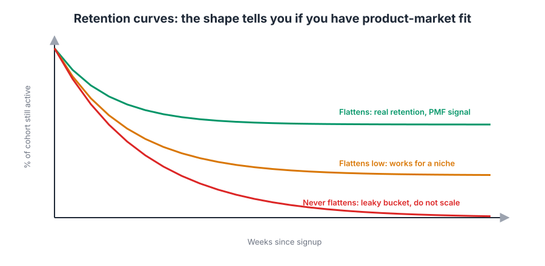
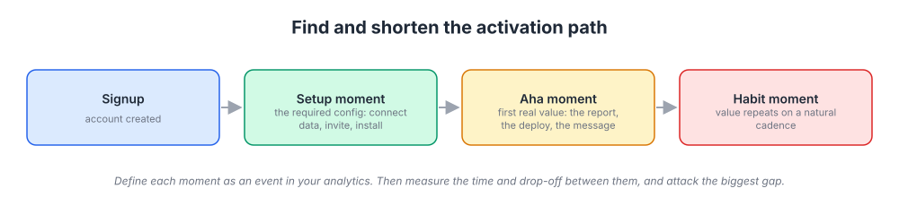
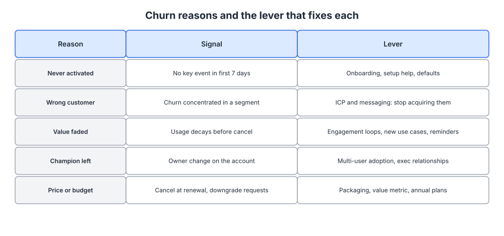
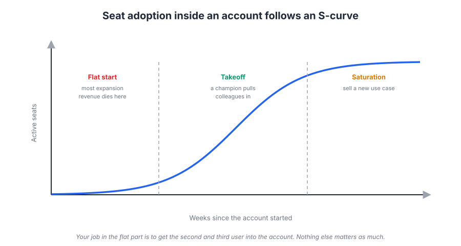

# Week 17: Retention, activation and engagement

> By the end of this week you will be able to read a retention curve, define activation for your platform with a measurable event, diagnose why customers churn, and put a plan in place to fix the biggest leak.

**Time budget:** reading about 3 hours, videos about 2 hours, exercise 2 to 4 hours.

## What this week covers and why it matters for a founder

Last week you designed a growth loop. Every loop you drew has the same hidden dependency: the people who come in have to stay. A viral loop with 40 percent month-one churn is a leaky bucket with a bigger tap. Retention is not a "later" problem you handle after acquisition works. It is the thing that decides whether acquisition is worth doing at all.

Most technical founders treat retention as a product quality question and leave it there. Ship a better product, people will stay. That is half right. The other half is that retention is a marketing problem in three specific ways: you attract the wrong people (an ICP failure from week 3), you set the wrong expectations (a messaging failure from week 5), or you fail to get new users to the moment where the product proves itself (an onboarding failure, which is what most of this week is about).

The mistake founders make here is measuring retention as a single number ("our churn is 4 percent") and staring at it. A single number cannot tell you what to fix. This week you will break it into cohorts, into an activation path, and into churn reasons, and each of those breakdowns points at a specific lever.

When you get this right, several things change at once. Your growth loops start to compound instead of leak. Your paid acquisition math from week 12 stops lying to you, because lifetime value becomes a real number instead of a hope. And you gain the single most convincing signal of product-market fit you can show anyone, including yourself: a cohort curve that flattens.

Concrete outputs this week: a cohort retention table built from your own data, a written activation definition with the event that measures it, a churn reason breakdown, and a one-page retention plan naming the one leak you will fix first.

## Core concepts

### 1. Reading retention curves

A retention curve plots the percentage of a signup cohort that is still active over time. "Active" needs a definition (more on that below), and "cohort" means everyone who signed up in the same week or month. You plot each cohort as its own line, weeks since signup on the x axis, percent still active on the y axis.

The only question that matters at first is whether the curve flattens. Every product loses people early. Some of those signups were curious, some were the wrong customer, some never got set up. The drop in the first two to four weeks is normal. What separates a product with product-market fit from one without is what happens after that drop. If the line levels off at some percentage (20 percent, 40 percent, it depends on the category) and stays there, you have a core of people for whom the product is now part of how they work. If the line keeps sliding toward zero, you do not, and no amount of acquisition will fix it.



*Look at the slope after week four, not the height at week one. A curve that flattens is the signal; a curve that keeps falling means the product is not yet retaining anyone.*

Lenny Rachitsky collected benchmarks from growth leaders across categories, and the ranges are wide. Consumer social products retaining 25 percent of users at six months is decent; a B2B SaaS tool retaining 80 percent of paying accounts at twelve months is merely acceptable. The absolute number is category dependent. The shape is not. Read his piece in this week's list before you decide your numbers are good or bad.

Two mechanics matter when you build the chart. First, use the right time unit. If your product is used weekly, measure weekly retention; if it is a monthly reporting tool, weekly retention will look terrible and mean nothing. Second, compare cohorts to each other. If your March cohort flattens higher than your January cohort, something you changed in between worked. This is how you see the effect of onboarding changes without an A/B test, and you will lean on it in week 19 when you find out your traffic is too low for most experiments.

The common failure: plotting retention on all users lumped together. A blended curve mixes a two-year-old cohort that already flattened with last week's signups that have not yet dropped, and the result is a line that tells you nothing. Always cohort.

### 2. Defining activation

Activation is the moment a new user has experienced enough value that they are likely to come back. It sits between signup and habit, and it is the single most important number a founder can move, because everything upstream of it (traffic, signups) is wasted if it does not happen, and everything downstream of it (retention, expansion, referral) depends on it.

The useful way to think about it is as a path with three moments. The setup moment is the required configuration: connect a data source, invite a teammate, install the SDK, import the spreadsheet. The aha moment is the first time the product does the thing you promised in your positioning: the first report, the first deploy, the first message a teammate replies to. The habit moment is when the user has done that thing enough times that it becomes routine.



*Map your own product onto these four boxes, then measure the drop between each one. The biggest drop is your first project.*

You find the aha moment by correlation, then confirm it by intervention. Pull your event data and ask: what did users who retained at week eight do in their first week that users who churned did not? Slack's early team found that groups which had exchanged around 2,000 messages were very likely to stick, and they used that as a working target. Facebook's growth team popularized the heuristic of a new user reaching 7 friends in 10 days. Treat both as illustrations of the method, not as numbers to copy. The point is that each company found one early behavior that separated the retained from the lost, and then bent the whole onboarding experience toward producing it.

The confirmation step is the part founders skip. Correlation can run backwards: maybe people who were always going to stay are simply the ones who invite colleagues, and forcing invites on everyone else changes nothing. So after you pick a candidate event, change the onboarding to push more users toward it, and check whether the next cohort's retention actually rises. If it does, you have your activation metric. If it does not, pick the next candidate.

Once you have the event, measure time-to-value: the median time from signup to the aha moment. This is the number your onboarding work is trying to shrink. Calendly's aha moment is the first booked meeting on a shared link, which can happen within an hour of signup. A data platform's aha moment might require a two-day integration. Both are fine, but the second one needs a completely different onboarding design, and probably a human in the loop.

The failure mode: defining activation as something the company wants (added a credit card) instead of something the user got (saw their first result). Card-on-file is a conversion metric. Activation is a value metric.

### 3. Cohort analysis and churn reasons

You cannot fix churn until you know why it happens, and "why" comes in a small number of recurring types. Each has a distinct signal in your data and a distinct lever, and mixing them up sends you to the wrong fix.



*Before you touch the product or the emails, classify last quarter's churned accounts into these rows. The distribution tells you where to spend the next month.*

Never activated: the account signed up and never hit the aha event. Signal: no key event in the first 7 to 14 days. Lever: onboarding, setup help, better defaults, and in some cases a human call. This is usually the largest bucket for a self-serve product and the cheapest to fix.

Wrong customer: they activated, used it, and left because the product was never built for them. Signal: churned accounts cluster outside your ICP on company size, role, or use case. Lever: fix targeting and messaging, not the product. If your ads and content keep bringing in the wrong people, you have an acquisition problem masquerading as a retention problem. This is the reason Amy Gallo's HBR piece in the reading list argues that keeping the right customers matters more than keeping all customers.

Lost the habit: they used it for a while, usage tapered, then they left. Signal: declining weekly activity for four to eight weeks before churn. Lever: engagement loops, triggered emails (week 13), and finding out what changed at their end. Often a champion left the company.

Outgrown or outcompeted: they hit a ceiling in your product or a competitor offered something you lack. Signal: support tickets and feature requests in the months before churn, or an exit survey naming a competitor. Lever: roadmap and positioning. This is the bucket that gets all the attention and is usually the smallest.

Price and value mismatch: the bill grew faster than the perceived value, or budget got cut. Signal: downgrades before cancellations, churn clustered at renewal. Lever: packaging and value metric, which is week 20.

David Skok's essay on churn makes the arithmetic clear. At 2.5 percent monthly churn you lose roughly a quarter of your customers per year, which means you need to replace a quarter of your revenue before you grow at all. Small differences in monthly churn compound into completely different companies over five years. Read it and then build your own table.

The Wikipedia entry on cohort analysis is a fine primer on the mechanics if you have not built one before. The practical version: a table with signup month as rows, months since signup as columns, and the retained percentage in each cell. You can build it in SQL in an hour. Amplitude, Mixpanel and PostHog will build it for you, but build it by hand once so you understand what "active" means in your own data.

### 4. Engagement loops and habit, with an ethics caveat

Nir Eyal's Hooked model describes how products become habits through a four-step loop: a trigger (external at first, like a notification, then internal, like a feeling of boredom or anxiety), an action (the simplest behavior in anticipation of a reward), a variable reward (the outcome is uncertain enough to keep attention), and an investment (the user puts something in that makes the next loop more likely: data, content, followers, configuration).

For a work tool the model translates cleanly. The external trigger is a teammate's comment or a scheduled report. The action is opening the product. The reward is the answer, the update, the thing that was blocked now being unblocked. The investment is the integration you set up, the templates you built, the history that now lives there. Notion's retention is built on investment: once your team's documents live there, the cost of leaving is enormous. Grammarly's weekly report email is a scheduled external trigger that reminds you the product is working even when you were not thinking about it.

Duolingo's streak is the most studied example. A streak is a variable reward (will I keep it?) combined with loss aversion (you have something to lose) and an external trigger (the reminder). It works, and Duolingo has been open about how much it moved retention. It is also the kind of mechanic that can tip from helpful into manipulative, which brings up the caveat.

The ethics question is simple to state and worth asking every time: does the loop serve the user's job, or does it serve your dashboard? A reminder that helps someone finish the report they wanted to finish is a service. A reminder engineered to create anxiety so they open an app they did not need is a dark pattern. The practical test is whether you would be comfortable explaining the mechanic to the user in plain words. "We remind you on Fridays because most teams review metrics then" passes. "We send a fake urgency badge to spike opens" does not. Week 19 comes back to dark patterns in the context of experiments; the rule is the same.

The failure mode: adding engagement mechanics before the core value works. Streaks, badges and notifications on top of a product with no aha moment just accelerate the churn, because you are reminding people of something they do not value.

### 5. Onboarding as a marketing surface

Onboarding is the last mile of your marketing. Your positioning made a promise, your landing page repeated it, and onboarding is where it either comes true or does not. Founders hand it to the engineer who drew the short straw. Do not.

A few principles hold across almost every software product. First, remove every step that does not lead directly to the aha moment. If a user can get value without setting a profile picture, do not ask for one. Second, use defaults and sample data so the product is not empty. An empty dashboard is a dead end; a dashboard with demo data and a "connect your own" button is an invitation. Third, tell people what to do next at every screen, in one sentence, in the voice you defined in week 7. Fourth, watch sessions. Five recordings of new users will teach you more than a month of funnel charts, and Growth.Design's case studies in the reading list show what careful observation looks like.

Superhuman, in its early years, onboarded every user with a live 30-minute call. It looked unscalable and expensive, and it was. It also produced very high activation, an unusually clear picture of who the ideal customer was, and word of mouth that a $30-a-month email client could not have bought. Rahul Vohra's product-market fit engine, which you may have read in week 2, was built on those conversations. The lesson is not "do calls forever." It is that when time-to-value is long or setup is unfamiliar, a human in the loop early is often the fastest way to learn what the automated version needs to do.

Zoom's version of onboarding was to make the first meeting need almost no onboarding at all: click a link, you are in. That was a product decision with retention consequences. The shorter the path to the aha moment, the less onboarding you need to write.

Where usage within an account can grow, onboarding does not end with the first user. Adoption inside a company tends to follow an S-curve: a slow start with one or two people, a steep middle as teams adopt, then saturation. Your job is to shorten the slow start.



*Seat adoption inside a customer account usually follows this shape; the flat beginning is where most expansion revenue is lost.*

The failure mode: a product tour. Tooltip sequences that explain the interface are the onboarding equivalent of reading the manual aloud. Show the outcome, not the buttons.

### 6. Expansion, net revenue retention, and customer success

Retention has a revenue dimension that is separate from logo retention. Net revenue retention (NRR) measures the revenue from a cohort of customers twelve months later, including upgrades and downgrades, divided by their revenue at the start. Above 100 percent means your existing customers grow faster than they churn, and the business grows even with zero new customers. Snowflake, Datadog and Twilio have all reported NRR well above 100 percent at various points, which is why usage-based and seat-based platforms are valued the way they are. You will choose the value metric that makes this possible in week 20.

Expansion comes from three places: more seats (Slack, Figma), more usage (Twilio, Snowflake), and higher tiers (HubSpot). Each needs a different trigger. Seat expansion is driven by collaboration features and invitations. Usage expansion is driven by the product being on a path that grows with the customer's business. Tier expansion is driven by fencing the right features (again, week 20).

Customer success is a marketing function in disguise. The people who talk to customers after the sale hear the churn reasons first, see the expansion signals first, and produce the case studies you wrote about in week 8. If you have no customer success person yet, the founder is the customer success person, and the weekly habit that matters is reading every cancellation reason and every support ticket from accounts in their first month.

Dixon, Freeman and Toman's HBR piece "Stop Trying to Delight Your Customers" is a useful corrective here. Their research found that reducing effort (fixing the problem fast, not making people repeat themselves) predicted loyalty far better than exceeding expectations. For a software company that means: make the support docs findable, make the error messages actionable, and answer fast. Delight is a bonus.

Win-back is the last piece. Churned customers already know your product, which makes them the cheapest audience you have. A win-back email that names what changed since they left ("you asked for SSO; it shipped") converts far better than a generic discount. Keep the list, tag the churn reason, and contact them when you fix the thing that made them leave.

The failure mode: chasing NRR through aggressive upsell before logo retention is solid. Customers who feel squeezed in month three do not renew in month twelve.

## Videos

- [What is good retention, Lenny Rachitsky (talk)](https://www.youtube.com/results?search_query=lenny+rachitsky+what+is+good+retention) (YouTube search)
  Why watch: the clearest walk through category benchmarks and why the shape of the curve matters more than the number; about 30 minutes.
- [Growth Frameworks for Acquisition, Monetization and Retention, Elena Verna](https://www.youtube.com/watch?v=9FHYtjw6mjs)
  Why watch: Verna ran growth at SurveyMonkey and Miro and explains retention as the input to every other growth lever, with practical detail on activation; 30 to 60 minutes depending on the talk.
- [Retention analysis tutorial (Amplitude)](https://www.youtube.com/watch?v=6oDGzu2Hxlw)
  Why watch: a hands-on look at building cohort charts and finding the aha event in a product analytics tool, so you can replicate it in whatever tool you use; about 15 minutes.
- [How Superhuman Built an Engine to Find Product Market Fit, Rahul Vohra (talk)](https://www.youtube.com/watch?v=uf246kh5les)
  Why watch: if you did not watch it in week 2, this is the best example of using retention and qualitative feedback together to decide what to build; about 40 minutes.

## Recommended reading

- [What is good retention, Lenny Rachitsky (Lenny's Newsletter)](https://www.lennysnewsletter.com/p/what-is-good-retention-issue-29). What to take from it: benchmarks by category and the reminder that a flattening curve is the goal.
- [Why Churn is SO critical to success in SaaS, David Skok (For Entrepreneurs)](https://www.forentrepreneurs.com/why-churn-is-critical-in-saas/). What to take from it: the compounding math of churn and why negative churn (NRR above 100 percent) changes everything.
- [The Value of Keeping the Right Customers, Amy Gallo (HBR)](https://hbr.org/2014/10/the-value-of-keeping-the-right-customers). What to take from it: retention economics, and the distinction between keeping customers and keeping the right ones.
- [Retaining users by building state, Julian Shapiro (Startup Handbook)](https://www.julian.com/guide/startup/retention). What to take from it: why retention comes from the state a user builds up in your product, plus a practical view of cutting steps to value.
- [Case studies, Growth.Design](https://growth.design/case-studies). What to take from it: screen-by-screen teardowns of real onboarding flows; pick two in a category near yours and note every friction point they flag.
- [Stop Trying to Delight Your Customers, Dixon, Freeman and Toman (HBR)](https://hbr.org/2010/07/stop-trying-to-delight-your-customers). What to take from it: low effort beats delight for loyalty; apply it to your support and docs.
- [Cohort analysis (Wikipedia)](https://en.wikipedia.org/wiki/Cohort_analysis). What to take from it: the mechanics of building the table, if you have not done it before.
- Book: Hooked, Nir Eyal, chapters 1 to 5 ([author page](https://www.nirandfar.com/hooked/)). What to take from it: the trigger, action, reward, investment loop, and the chapter on ethics, which you should read as carefully as the rest.

## Hands-on exercise (2 to 4 hours)

**Deliverable:** a one-page retention plan in your company wiki containing a cohort table, an activation definition, a churn reason breakdown, and the one leak you will fix in the next four weeks.

**Steps:**
1. (30 minutes) Write a SQL query or use your analytics tool to produce a cohort table: signup week or month as rows, periods since signup as columns, percent active in each cell. Define "active" as a real usage event, not a login. Use weekly periods if your product is used weekly.
2. (15 minutes) Plot the last six cohorts as curves. Write one sentence on whether they flatten, and at what level. If they do not flatten, everything else this week is about fixing that.
3. (45 minutes) Find your activation candidate. Compare the first-week behavior of users retained at week 8 against users who churned. List the three events with the biggest gap. Pick the one that is most clearly "the user got value," not "the user did what we wanted."
4. (15 minutes) Measure time-to-value: the median hours or days from signup to that event, for the last cohort.
5. (45 minutes) Pull the last 30 to 50 churned accounts (or the last 30 to 50 users who stopped using a free product). Classify each into a churn reason from concept 3 using whatever data and notes you have. Where you have no idea, email five of them and ask; use your week 2 interview skills.
6. (20 minutes) Fill in the template below. Choose the single largest bucket as the leak to fix.
7. (30 minutes) Write the fix as a hypothesis in the form "If we [change], then [activation rate or week-4 retention] will move from [X] to [Y] for [cohort], because [reason]." You will reuse this format in week 19.
8. (10 minutes) Add a triggered email to your week 13 lifecycle map for users who reach day 3 without the activation event.

**Template:**

```
RETENTION PLAN, <date>

Cohort curve (last 6 cohorts, weekly):
  Flattens? yes / no      Flattens at: __%      Biggest drop: week __ to __

Activation definition:
  Event: ___________________________
  Why this event: correlation with week-8 retention = __ vs __ for non-activated
  Current activation rate (signup to event within 7 days): __%
  Median time-to-value: __ hours / days

Churn reasons (last __ accounts):
  Never activated       __%   lever: onboarding, setup help, defaults
  Wrong customer        __%   lever: ICP and messaging (weeks 3 and 5)
  Lost the habit        __%   lever: engagement loop, triggered email (week 13)
  Outgrown/outcompeted  __%   lever: roadmap and positioning (week 4)
  Price/value mismatch  __%   lever: packaging (week 20)

The one leak to fix first: ___________________________
Hypothesis: If we ______, then ______ moves from __ to __ for ______, because ______.
Owner: ______   Ship by: ______   Check cohort on: ______
```

**How to know it is good:**
- The cohort table uses a usage event, not logins, and the time unit matches the product's natural cadence.
- The activation event describes value the user received, and you have a number showing it separates retained users from churned ones.
- Every churned account is in exactly one bucket, and at least a few classifications came from talking to the customer rather than guessing.
- The chosen leak is the biggest bucket, not the most interesting one.
- The hypothesis names a metric, a baseline, a target, and a date to check the next cohort.

## Self-check

Answer these without looking back. If you cannot, reread the relevant section.

1. What does a retention curve that flattens tell you, and what does one that keeps falling tell you?
2. Why is a blended retention curve across all users misleading?
3. Name the three moments on the activation path and give an example of each for a product you know.
4. Explain how to find a candidate activation event by correlation, and why you then need to confirm it by intervention.
5. A customer used your product heavily for four months, then usage tapered and they cancelled. Which churn bucket is this, and what is the lever?
6. Your churned accounts are mostly companies much smaller than your ICP. Is this a product problem or a marketing problem, and what would you change?
7. What is net revenue retention, and why does a number above 100 percent matter so much for a subscription business?
8. State the ethics test for an engagement mechanic in one sentence.
9. Why did Superhuman's onboarding calls make sense even though they did not scale?
10. What is wrong with a product tour as an onboarding strategy?

**You are done with this week when:**
- [ ] You have a cohort retention table built from your own data and can say whether the curves flatten.
- [ ] You have a written activation definition with a measurable event and a current activation rate.
- [ ] You have classified recent churn into reasons and identified the largest bucket.
- [ ] Your one-page retention plan names a single fix, a hypothesis, an owner, and a date.

## Next week

You now have retention numbers, an activation event, and a hypothesis, and every one of them depends on measuring the right thing correctly. Next week is analytics and measurement: building the metrics tree, instrumenting the product and site so the numbers you just used are trustworthy, and learning the statistical traps that make founders confident about the wrong conclusions.
