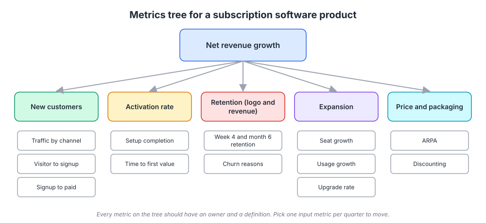
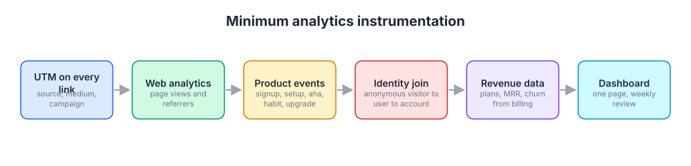
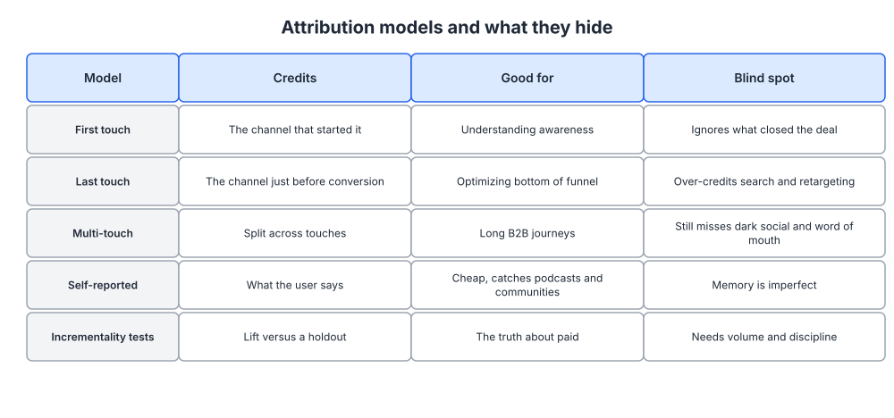

# Week 18: Analytics and measurement

> By the end of this week you will be able to draw a metrics tree for your business, instrument your site and product so the numbers on it are trustworthy, pick a north star metric, and spot the statistical traps that make founders confident about the wrong conclusions.

**Time budget:** reading about 3 hours, videos about 2.5 hours, exercise 3 to 4 hours.

## What this week covers and why it matters for a founder

You are a technical founder, so you already know how to count things. That is not the problem. The problem is that marketing measurement fails in ways that look like counting problems and are actually definition problems, identity problems, and inference problems. A dashboard that shows "signups up 30 percent" is useless if you do not know which signups, from where, and whether any of them reached the activation event you defined last week.

The mistake founders make here comes in two flavors. The first is measuring nothing and running on gut, which is common in the first year and gets fatal around the time paid spend starts. The second is measuring everything, building a 40-chart dashboard nobody reads, and picking whichever chart is going up this week to feel good about. Both produce the same result: decisions that are not connected to data.

What changes when you get it right is that arguments end faster. "Should we invest in the blog or the integration pages?" becomes a question you answer with a chart of activated signups by source, not a question you answer with whoever talks longest. You also get earlier warnings. A metrics tree with owners means someone notices when setup completion drops from 60 to 45 percent in the week after a release, instead of noticing three months later when revenue growth stalls.

There is a specific risk for technical founders: overconfidence in numbers. You will read a chart, see a pattern, and act, and this week's statistical literacy section exists because the pattern is often an artifact of who you are looking at (survivorship bias), of what varies together (correlation), or of how the groups are mixed (Simpson's paradox). The reading list leans on these because they are where smart people get fooled.

Concrete outputs this week: a metrics tree from revenue down to input metrics with an owner for each, a minimum instrumentation plan (what events, what UTMs, what identity join), a one-page weekly dashboard spec, and a written north star metric with the reasoning behind it.

## Core concepts

### 1. The metrics tree

A metrics tree starts with the outcome you actually want (for most software companies, net revenue growth) and decomposes it into the factors that drive it, level by level, until you reach numbers a single person can move in a week. It is the same idea as a driver tree in finance or a dependency graph in software, applied to the business.

For a subscription product the first split is almost always: new customers, retention, expansion, and price. New customers decompose into traffic by channel, visitor-to-signup rate, signup-to-paid rate. Retention decomposes into activation rate, week-4 and month-6 retention, and churn reasons (all of which you built last week). Expansion decomposes into seat growth, usage growth, and upgrade rate. Price decomposes into average revenue per account and discounting.



*Read it bottom up: the leaf nodes are what you can change this week; the root is what you are trying to affect. Every node should have an owner and a written definition.*

Two rules make the tree useful rather than decorative. First, every node needs a definition precise enough to write as a query. "Active user" is not a definition; "user who performed at least one core event in the trailing 7 days" is. Second, pick one input metric per quarter to move. The tree shows you the whole system; the point of drawing it is to choose where to push. HubSpot has been open over the years about running the business on a small set of funnel metrics that roll up to revenue, with each stage owned by a team. Airbnb's early growth team is often cited for the discipline of tying every project to a node on a tree rather than to a feature list.

The quarterly pick is where the tree connects to the rest of this program. If activation rate is the weak node, your week 17 plan is the project. If visitor-to-signup is weak, your week 6 landing page work is the project. If traffic is weak, your channel tests from week 9 are the project. The tree tells you which week to go back to.

The failure mode: a tree with 60 nodes and no owners. Keep it to what fits on one page, and do not add a node unless you know who would act on it.

### 2. The north star metric

A north star metric is the single number that best captures the value customers get from your product, that grows when the business grows, and that your whole team can rally around. Amplitude's North Star Playbook, in the reading list, is the standard reference and worth an hour.

The north star is not revenue. Revenue is the outcome; the north star is the leading indicator of it that reflects customer value. Slack's early thinking was around messages sent within teams, because messages were the value and predicted retention. Airbnb's was nights booked. For a data platform it might be queries run by active accounts per week; for a design tool, files edited collaboratively; for an API, successful calls from production keys. It is usually a count of the aha event from week 17, aggregated across all customers, with a time window.

What makes it useful is that it forces tradeoffs. If your north star is weekly active accounts running a report, then a campaign that brings 5,000 signups who never run a report has not moved it, and the team has to say so. It aligns marketing (bring people who will do the thing), product (make the thing easier), and success (help them keep doing the thing).

Three tests for a candidate: does it go up when customers get more value, does it lead revenue by weeks or months rather than lagging it, and can a person on the team explain it in one sentence? Vanity metrics fail the first test. Page views, total signups ever, app downloads, and social followers all go up without anyone getting value. A16z's "16 Startup Metrics" and its sequel cover which numbers investors take seriously and why, and they are a good filter for which numbers you should take seriously too.

The failure mode: choosing a north star that the team can game. "Signups" invites cheap traffic; "messages sent" invites notification spam. Pair the north star with a guardrail metric (retention, or the activation rate) that must not fall while you push it.

### 3. Instrumentation: web, product, revenue, and joining identities

Most founders have three separate data systems that do not talk to each other, and that gap is where measurement dies. Web analytics (GA4 or similar) knows about anonymous visitors, pages, and referrers. Product analytics (PostHog, Mixpanel, Amplitude) knows about logged-in users and events. Billing (Stripe or whatever you use) knows about plans, MRR and churn. The question "which channel brings customers who retain and pay" needs all three joined on identity, and out of the box none of them join.



*Six pieces, in the order to build them. The identity join in the middle is the one founders skip and the one that makes the rest useful.*

The minimum instrumentation plan has six parts. UTM parameters on every link you control, with a naming convention written down (source, medium, campaign, lowercase, no spaces; Google's campaign URL builder in this week's exercise enforces the shape). Web analytics for page views and referrers. Product events for the four or five moments that matter: signup, setup, aha, habit, upgrade. An identity join that connects the anonymous visitor ID to the user ID at signup and the user to the account. Revenue data pulled from billing into the same store. A one-page dashboard reviewed weekly.

The identity join deserves its own paragraph because it is the part with the most engineering nuance. When a visitor lands from a campaign, your analytics library assigns an anonymous ID and stores the UTM values. When they sign up, you call an identify method that links the anonymous ID to the new user ID, and you persist the first-touch UTM values on the user record. When that user joins or creates an account, you link user to account. From then on, every product event and every invoice can be traced back to the source. Segment built a company on making this plumbing standard, and Ilya Volodarsky's YC talk in this week's videos explains it at exactly the depth a founder needs. PostHog's product analytics docs are a good reference for how identify and group calls work in a modern tool.

Do the join early. Backfilling identity after a year of anonymous data is close to impossible, and it is the difference between "search brings customers who pay" and "search brings traffic."

On tools: GA4 is free and fine for web. PostHog, Mixpanel and Amplitude are all reasonable for product; PostHog is open source and can self-host, which matters for some privacy postures. Once you have more than a few thousand users, put everything in a warehouse (Postgres is fine at first) and write the joins yourself. You are a technical founder; you do not need a dashboard vendor to tell you activation by channel.

The failure mode: event sprawl. Teams instrument 300 events, none with a documented definition, and analysis becomes archaeology. Start with five events, document each, and add one only when a question needs it.

### 4. Attribution and its blind spots

Attribution is the practice of crediting a conversion to the marketing touches that preceded it. It is necessary, it is always wrong, and knowing how it is wrong is what separates useful attribution from harmful attribution.



*No model is correct; each answers a different question. Use two of them side by side and treat disagreement as information.*

First-touch attribution credits the channel that started the journey. It is good for understanding what creates awareness, and it ignores what closed the deal. Last-touch credits the touch just before conversion. It is good for optimizing the bottom of the funnel, and it systematically over-credits branded search and retargeting, because those are the channels people use on the way to buying something they already decided on. Multi-touch splits credit across touches by some rule (linear, time-decay, position-based). It handles long B2B journeys better and still misses everything it cannot see.

What it cannot see is the problem. A founder hears about your product on a podcast, a colleague mentions it in a Slack community, they read a comparison page months later, then search your name and sign up. Last touch says "branded search." First touch says "comparison page." Neither knows about the podcast or the Slack message. This is dark social from week 14, and the only tool that catches it is asking. Self-reported attribution means a single open question on the signup form: "How did you hear about us?" Free text, not a dropdown. It is cheap, it captures podcasts and communities, and its blind spot is memory. Run it alongside your tracked attribution and compare the two columns every month.

Incrementality is the honest answer for paid channels. Instead of asking which touch got credit, you ask what would have happened without the spend: hold back a region or an audience, run the campaign everywhere else, measure the lift. It needs volume and discipline, which is why it comes after your channels are working rather than before. The Wikipedia article on marketing attribution is a decent survey of the models if you want the vocabulary.

Kaushik's "Digital Marketing and Measurement Model" in the reading list is the best short piece on tying measurement to business objectives before you pick a model. Read it before you pick one.

The failure mode: optimizing spend toward whatever last-touch credits. It moves budget into branded search and retargeting, starves the channels that create demand, and looks great on the dashboard for about two quarters.

### 5. Statistical literacy for founders

You can do the arithmetic. The traps here are about which arithmetic to do.

Survivorship bias: you study the customers you have and conclude that whatever they share caused their success. The customers you never won, or who churned, are not in the sample. The classic illustration is Abraham Wald's analysis of returning bombers in the Second World War: the planes came back with damage in certain areas, and the naive plan was to armor those areas. Wald pointed out that the damage showed where planes could be hit and survive; the areas with no damage were where the hits were fatal, because those planes did not come back.


*The dots are where surviving planes were hit. The missing data, the planes that did not return, is what you need. When you analyze "what our best customers have in common," ask who is missing from the sample. Source: [Wikimedia Commons](https://commons.wikimedia.org/wiki/File:Survivorship-bias.svg)*

For your business: "our best customers all came from referrals" might mean referrals produce good customers, or might mean the wrong customers came from paid and churned before you looked. Always include the churned cohort in the comparison.

Correlation versus causation: users who invited a teammate in week one retain better. Did inviting cause retention, or do committed users both invite and retain? Week 17 covered the fix: intervene and measure the next cohort. The general rule is that observational data suggests hypotheses and experiments confirm them, which is what week 19 is about.

Simpson's paradox: a trend that appears in every subgroup reverses when the subgroups are combined. Suppose your new onboarding flow has a higher activation rate than the old one among enterprise signups and among small-team signups. Combined, the old flow can still look better, if the new flow happened to receive a larger share of the harder segment. This happens in real data all the time when traffic mix shifts under you, and it is invisible unless you segment.


*Each colored group trends one way; the combined line trends the other. Before you trust any before-and-after comparison, check whether the mix of segments changed at the same time. Source: [Wikimedia Commons](https://commons.wikimedia.org/wiki/File:Simpson%27s_paradox_continuous.svg)*

Seasonality: B2B signups drop in late December and August; consumer products spike in January. A week-over-week comparison across those boundaries measures the calendar, not your work. Compare to the same period last year where you can, and to the prior four weeks where you cannot.

Hans Rosling's TED talk in this week's videos is less about traps and more about the discipline of actually looking at the data over time, with humility. Watch it for the attitude.

The failure mode: acting on a dashboard change without asking "what else changed that week." Release, campaign, holiday, a broken tracking tag. The tag is the most common.

### 6. Dashboards, vanity metrics, and privacy basics

A useful dashboard is one page, reviewed at the same time every week, with a small set of numbers and their trend, and one person who is expected to say what happened. Everything else is a report, and reports are for when you have a question.

The one page should contain the north star and its guardrail, the four top-level branches of the metrics tree (new, retention, expansion, price), and the one input metric you chose to move this quarter. Each number gets this week, last week, and the same week last year if you have it. That is it. Adora Cheung's YC talk on KPIs in the videos is a good model for keeping the set small.

Vanity metrics are numbers that go up without telling you anything actionable: cumulative signups, total page views, followers, "impressions." The test is whether the number could go down. Cumulative anything cannot, so it is not a metric. Replace with rates and cohorts.

Privacy and consent basics, because you will collect personal data in all of the above. If you have users in the EU, GDPR applies: you need a lawful basis for processing, you need consent for non-essential cookies (which includes most marketing analytics), and users have the right to access and delete their data. Practically: run a consent banner that actually blocks analytics scripts until accepted, keep a record of what you collect and why, and make deletion a supported flow rather than a manual scramble. The GDPR overview linked in week 13 covers the basics. Server-side event tracking from your own backend reduces reliance on cookies and is more accurate anyway.

The failure mode: a dashboard with every metric in green because someone chose the comparisons that made it green. Fixed comparisons, chosen in advance, reviewed weekly. Week 22 builds the operating cadence around this.

## Videos

- [Analytics for Startups, Ilya Volodarsky (Y Combinator Startup School)](https://www.youtube.com/results?search_query=y+combinator+ilya+volodarsky+analytics+for+startups) (YouTube search)
  Why watch: a Segment cofounder walks through exactly which events to track, how identity works, and how to avoid event sprawl; about 30 minutes and the most directly applicable talk this week.
- [How to Set KPIs and Goals, Adora Cheung (Y Combinator)](https://www.youtube.com/results?search_query=y+combinator+adora+cheung+how+to+set+kpis+and+goals) (YouTube search)
  Why watch: picking one primary metric and a small set of secondaries, with examples of what founders get wrong; about 30 minutes.
- [Digital analytics keynote, Avinash Kaushik](https://www.youtube.com/results?search_query=avinash+kaushik+keynote+digital+analytics) (YouTube search)
  Why watch: Kaushik is blunt about vanity metrics and about tying measurement to business outcomes, and he is funny about it; 45 to 60 minutes depending on the keynote.
- [The best stats you've ever seen, Hans Rosling (TED, 2006)](https://www.ted.com/talks/hans_rosling_the_best_stats_you_ve_ever_seen)
  Why watch: the standard for showing data over time honestly and for updating your beliefs when the data disagrees with them; 20 minutes.
- [Google Analytics 4 tutorial (Google official)](https://www.youtube.com/results?search_query=google+analytics+4+tutorial+official) (YouTube search)
  Why watch: if GA4 is your web analytics tool, an hour with the official tutorial saves you a week of guessing at the events model.

## Recommended reading

- [16 Startup Metrics, a16z](https://a16z.com/16-startup-metrics/). What to take from it: definitions of the numbers investors and operators use, including the difference between bookings and revenue and between gross and net churn.
- [16 More Startup Metrics, a16z](https://a16z.com/16-more-startup-metrics/). What to take from it: the second set, including cohort analysis, LTV assumptions and why cumulative charts mislead.
- [Digital Marketing and Measurement Model, Avinash Kaushik (Occam's Razor)](https://www.kaushik.net/avinash/digital-marketing-and-measurement-model/). What to take from it: objectives first, then goals, then KPIs, then targets, then segments; use it to build the top of your metrics tree.
- [North Star Playbook, Amplitude](https://amplitude.com/north-star). What to take from it: the criteria for a north star metric and the input metrics that drive it; the worked examples map directly onto the exercise.
- [SaaS Metrics 2.0, David Skok (For Entrepreneurs)](https://www.forentrepreneurs.com/saas-metrics-2/). What to take from it: the full definitions for MRR, churn, CAC payback and LTV to CAC, with the formulas; keep it open when you build the revenue branch.
- [Product analytics docs, PostHog](https://posthog.com/docs/product-analytics). What to take from it: how identify and group calls work and how to define events; the concepts transfer to any product analytics tool.
- [Simpson's paradox (Wikipedia)](https://en.wikipedia.org/wiki/Simpson%27s_paradox). What to take from it: the worked examples, so you recognize the pattern the next time a segment mix shifts under a comparison.
- Book: Lean Analytics, Alistair Croll and Ben Yoskovitz, chapters 1 to 6 ([book site](https://leananalyticsbook.com/)). What to take from it: the "one metric that matters" idea and how the metric changes by stage and by business model.

## Hands-on exercise (3 to 4 hours)

**Deliverable:** a measurement document in your company wiki containing your metrics tree with owners and definitions, a north star metric with reasoning, an instrumentation plan, and a one-page weekly dashboard spec.

**Steps:**
1. (30 minutes) Draw your metrics tree. Start from net revenue growth, split into new, retention, expansion, price, and go two more levels down using the diagram in concept 1 as a template. Cross out any node nobody would act on.
2. (20 minutes) Write a one-line definition for each leaf node precise enough to be a query. Assign an owner (it can be you for all of them today; the point is that it is written).
3. (20 minutes) Choose a north star metric. Write three sentences: what it is, why it reflects customer value, and what guardrail metric must not fall while you push it. Check it against the three tests in concept 2.
4. (30 minutes) Audit your instrumentation against the six-part plan in concept 3. For each part, write "have," "partial," or "missing." Be honest about the identity join.
5. (30 minutes) Define your five core product events (signup, setup, aha, habit, upgrade) with the exact property names you will send. Use your week 17 activation event as the aha event.
6. (15 minutes) Write your UTM convention and build three example URLs with the [Google campaign URL builder](https://ga-dev-tools.google/ga4/campaign-url-builder/). Add a free-text "How did you hear about us?" question to your signup flow if it is not there.
7. (30 minutes) Write the one-page dashboard spec using the template. Decide the weekly review time and put it in the calendar.
8. (15 minutes) Pick the one input metric you will move this quarter and write it at the top of the document.

**Template:**

```
MEASUREMENT DOC, <date>

North star: ____________________  (window: weekly / monthly)
  Why it reflects value: ____________________
  Guardrail: ____________________ must not fall below __

This quarter's input metric: ____________________  from __ to __ by <date>

Metrics tree (leaf nodes only)
| Node                    | Definition (query-ready)                         | Owner | Source     |
|-------------------------|--------------------------------------------------|-------|------------|
| Traffic by channel      | sessions by first-touch utm_source, weekly       |       | web        |
| Visitor to signup       | signups / unique visitors, weekly                |       | web+product|
| Activation rate         | users with <aha event> within 7d / signups       |       | product    |
| Week-4 retention        | cohort users active in week 4 / cohort size      |       | product    |
| Upgrade rate            | accounts moving to paid / activated accounts     |       | billing    |
| ARPA                    | MRR / paying accounts                            |       | billing    |

Instrumentation status
  UTM convention: have / partial / missing   Rule: ____________
  Web analytics:  have / partial / missing
  Product events: signup, setup, aha, habit, upgrade   (list property names)
  Identity join:  anonymous -> user -> account   have / partial / missing
  Revenue join:   billing -> account             have / partial / missing
  Self-reported attribution question on signup:  yes / no

Weekly dashboard (one page)
  Row 1: north star, guardrail
  Row 2: new customers, week-4 retention, NRR, ARPA
  Row 3: this quarter's input metric
  Each: this week | last week | same week last year | note on what changed
  Review: every ______ at ______, owner ______
```

**How to know it is good:**
- Every leaf node has a definition you could hand to an engineer and get the same number back twice.
- The north star goes up only when customers get value, and it has a named guardrail.
- The identity join is either in place or is the first item on your engineering list, with a date.
- The dashboard fits on one screen and every number has a fixed comparison chosen in advance.
- You can name the single input metric for the quarter without looking at the document.

## Self-check

Answer these without looking back. If you cannot, reread the relevant section.

1. What are the four top-level branches of a subscription metrics tree, and which week of this program addresses each one?
2. State the three tests for a north star metric and explain why total signups fails them.
3. Describe the identity join in three sentences: what gets linked to what, and when.
4. Your last-touch report says branded search is your best channel. Give two reasons that might be misleading and one thing you would do to check.
5. What is self-reported attribution, what does it catch that tracking misses, and what is its blind spot?
6. Explain survivorship bias using a customer analysis example rather than the airplane.
7. Your new onboarding flow beats the old one in every segment but loses overall. What is happening and how would you find it?
8. Why can a cumulative chart never be a real metric?
9. What is the minimum a consent banner has to do to be compliant with GDPR for marketing analytics?
10. What is the single most common reason a dashboard number moves sharply in one week?

**You are done with this week when:**
- [ ] Your metrics tree fits on one page and every leaf has a definition and an owner.
- [ ] You have a written north star metric with a guardrail and can explain both in one sentence each.
- [ ] Your five core product events and your UTM convention are documented, and the identity join is in place or scheduled.
- [ ] The weekly dashboard review is on the calendar with a named owner.

## Next week

You now have trustworthy numbers and a single input metric to move. Next week is experimentation and the growth process: turning your week 17 hypothesis into a properly designed test, learning when an A/B test is worth running and when your traffic is too low to bother, and setting up the weekly loop that turns measurement into decisions.
