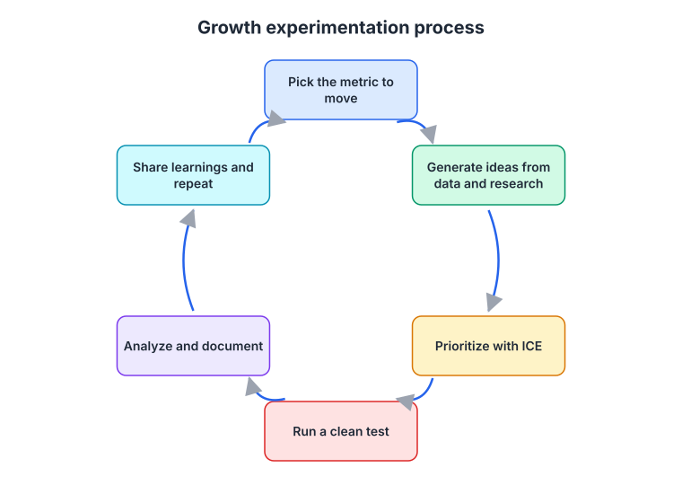
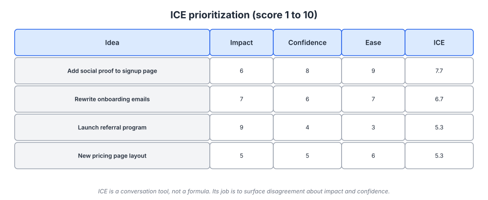
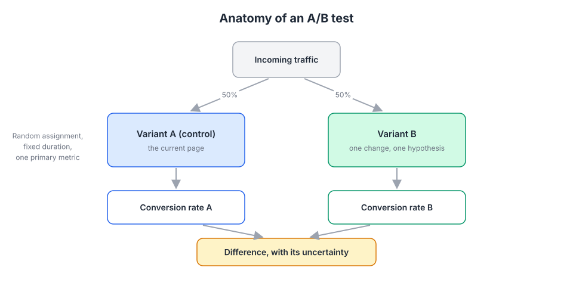
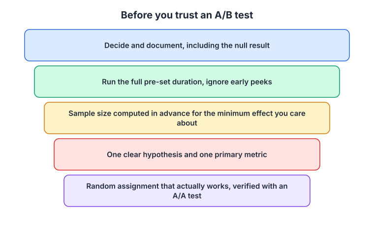

# Week 19: Experimentation and the growth process

> By the end of this week you will be able to write a testable hypothesis, prioritize a backlog of growth ideas, design an A/B test that will not fool you, decide when not to A/B test at all, and run a weekly growth meeting that turns learnings into the next test.

**Time budget:** reading about 3 hours, videos about 2 hours, exercise 2 to 4 hours.

## What this week covers and why it matters for a founder

You have a metrics tree with one input metric to move, a hypothesis from week 17, and instrumentation you can trust. This week is about the process that connects them: a repeatable loop of choosing, testing, learning and repeating that does not depend on whoever had the loudest idea in the last meeting.

Founders get experimentation wrong in two opposite directions. Some never test, ship on conviction, and cannot tell which of the twenty things they changed last quarter moved the number. Others read about Booking.com running a thousand tests at once, install an A/B testing tool, and run underpowered tests on 400 visitors a week that produce a "winner" every time by chance. The second group is more dangerous because they feel rigorous.

The statistics here are not hard for you. What is hard is the discipline: computing sample size before the test, not peeking, not stopping early when the number looks good, and writing down the null results. Ronny Kohavi, who built the experimentation platform at Microsoft and later worked at Airbnb, has spent two decades documenting how smart teams fool themselves, and his work anchors this week's reading.

The other half of the week is what to do when you are too small to A/B test, which describes most founders reading this. The answer is not "guess." It is qualitative research (week 2 skills), big swings instead of small tweaks, and cohort comparisons (week 17) instead of randomized splits. Superhuman built a product people loved without a single traditional A/B test, using structured surveys and interviews. Basecamp's founders have written that they rarely run A/B tests and prefer to make design calls by judgment and then watch what happens. Both approaches are legitimate at their scale, and knowing which scale you are at is the skill.

Concrete outputs this week: a prioritized experiment backlog with ICE scores, one fully specified experiment (hypothesis, metric, sample size, duration, decision rule), a one-page experiment log template, and a weekly growth meeting agenda on the calendar.

## Core concepts

### 1. The growth process as a loop

A growth process is a loop, and the diagram below is the whole thing. Pick the metric to move (you did this in week 18). Generate ideas from data and research, not from a brainstorm of whatever is fashionable. Prioritize. Run a clean test. Analyze and document, including the failures. Share what you learned and go around again.



*The loop matters more than any single test. A team that runs one clean test a week for a year learns more than one that runs ten sloppy ones a month.*

Sean Ellis and Morgan Brown's book Hacking Growth describes this cadence in detail, and the core is a weekly rhythm: a short meeting where the team reviews last week's results, decides which experiments to launch, and looks at the backlog. Ellis's own contribution to growth vocabulary, the product-market fit survey ("how would you feel if you could no longer use this product?"), belongs at the front of the loop as a source of ideas.

Ideas come from four sources, in order of value. Your own data: where in the metrics tree is the biggest drop, and what do session recordings show at that step? Customer research: what did the churned users from week 17 say, what did the five-second tests from week 6 reveal? Competitive and pattern research: what do the Growth.Design teardowns show working in adjacent products? And only then, the team's opinions.

Andrew Chen's essay on building a growth team, in the reading list, explains how larger companies organize this. For a founder the "team" is you and whoever is closest to the product, and the process is the same at any size: written hypotheses, a backlog, one meeting, a log.

The failure mode: treating the backlog as a to-do list. The backlog is a set of bets, most of which will lose. If every test wins, your tests are too small or your analysis is wrong.

### 2. Writing hypotheses and prioritizing with ICE

A hypothesis is a falsifiable statement with a mechanism. The format from week 17 holds: "If we [change], then [metric] will move from [baseline] to [target] for [segment], because [reason]." The "because" is the part that makes it a hypothesis rather than a wish. "If we add customer logos to the signup page, then visitor-to-signup will rise from 3.1 to 3.6 percent for organic traffic, because week 2 interviews showed prospects were unsure whether companies like theirs use us" is testable and, whether it wins or loses, you learn something about the mechanism.

Once you have ten or twenty hypotheses, you need to order them. ICE is the common tool: score each idea 1 to 10 on Impact (if it works, how much does it move the metric), Confidence (how strong is the evidence it will work), and Ease (how cheap is it to build and run), and average the three.



*Notice that the referral program scores high on impact and low on everything else, and lands below the social proof change. The score is a starting point for the conversation, not the decision.*

ICE has known weaknesses. The scores are subjective, people inflate impact for their own ideas, and averaging hides the fact that a 9 on impact with a 2 on confidence is a very different bet from a 5 across the board. Use it anyway, because its real job is to surface disagreement. If you score confidence at 8 and your cofounder scores it at 3, the useful output is the conversation about why, not the average.

Two adjustments make it work better. Anchor confidence to evidence type: 9 or 10 means you have data from your own users, 6 or 7 means a pattern from a comparable product, 3 or 4 means an opinion. And keep a "big swing" lane separate from the tweak lane, because ICE systematically favors cheap small changes, and a founder with low traffic needs the big swings (concept 5).

The failure mode: a backlog of 80 ideas with scores and no tests run. Cap the backlog at 20, kill the bottom five each month, and run the top one.

### 3. A/B testing statistics for founders

An A/B test randomly assigns each visitor or user to a control (A) or a variant (B), exposes each group to a different experience, and compares a metric. Randomization is the point: it makes the two groups identical in expectation, so any difference in outcome is caused by the change, not by who happened to show up.



*The structure is simple; the discipline is in everything around it: sample size, duration, one metric, and not stopping early.*

The numbers you need before you start are four. The baseline conversion rate of your metric. The minimum detectable effect (MDE): the smallest lift you would actually act on, expressed relatively (a 10 percent relative lift on a 3 percent baseline takes you to 3.3 percent). The significance level, conventionally 5 percent, which is the chance you will declare a winner when there is no real difference. And the statistical power, conventionally 80 percent, which is the chance you will detect the effect if it really is there. Plug those into Evan Miller's sample size calculator and it tells you how many visitors per variant you need.

Run the numbers once and the constraint becomes obvious. Detecting a 10 percent relative lift on a 3 percent baseline at 80 percent power needs on the order of 50,000 visitors per variant. If your signup page gets 2,000 visitors a week, that test takes about a year. This is why concept 5 exists.

Peeking is the mistake that ruins the most tests. If you check the result every day and stop as soon as it crosses significance, your real false-positive rate is several times the nominal 5 percent, because you have given randomness many chances to cross the line. Evan Miller's "How Not To Run an A/B Test" explains why with a worked example, and it should be the first thing you read this week. The fix is to compute the duration in advance and not decide until it is over. Run at least one full week, preferably two, so weekday and weekend behavior are both included.

A p-value is the probability of seeing a difference at least this large if there were truly no difference. It is not the probability that B is better. A p-value of 0.04 with a tiny sample and a huge apparent lift is usually noise. Confidence intervals are more useful than p-values because they show the range of plausible effects; if the interval runs from a 2 percent loss to a 30 percent gain, you have learned very little.


*The 95 percent interval is roughly two standard deviations either side of the mean. A small sample has a wide standard error, so its interval is wide, which is why an early "winner" so often vanishes. Source: [Wikimedia Commons](https://commons.wikimedia.org/wiki/File:Standard_deviation_diagram.svg)*

Three more traps. Novelty effects: users click the new thing because it is new, and the lift fades over weeks; run long enough to see whether it holds. Multiple comparisons: if you check ten metrics, one will look significant by chance; declare one primary metric in advance and treat the rest as diagnostics. And sample ratio mismatch: if you expected a 50/50 split and got 48/52 on thousands of users, your assignment is broken (a redirect that fails on some browsers, a bot filter that hits one arm), and the result is invalid regardless of what it says.

An A/A test is the check for that last problem: split traffic into two groups that see the same thing, and confirm the metrics do not differ. Run one before your first real test on any new tool. Kohavi's book, in the reading list, has a chapter on it.

The failure mode: reporting a winner from a test that was never powered to find one. It is the Optimizely-era lesson. A generation of teams ran tests with 500 users per arm, saw "B wins with 92 percent confidence," shipped it, and never noticed the number did not move afterward.

### 4. The A/B test checklist

Before you trust any test result, run through five checks. The diagram puts them in order.



*Print this. The most expensive experiments are the ones that were decided by the third item on the list before the first two were done.*

One clear hypothesis and one primary metric. If you cannot say which single number decides the test, you do not have a test. Sample size computed in advance for the minimum effect you care about, using the calculator, with the duration written down. Random assignment that actually works, verified with an A/A test on the tool and a sample ratio check on the live test. The full pre-set duration, ignoring early peeks (look if you must, but do not decide). A decision, documented, including the null result.

Kohavi and Thomke's HBR piece on the surprising power of online experiments has the numbers on how often experienced teams' ideas fail: at Microsoft, only about a third of ideas tested produced a positive result, and Booking.com has reported similar or lower rates. If people who do this for a living are wrong most of the time, the value of a test is mostly in the ideas it stops you from shipping. Document the losers.

Airbnb and Netflix are worth reading about in this context, not to copy but to calibrate. Netflix has written extensively about testing artwork and recommendation changes with elaborate guardrails, and Airbnb built an internal experimentation platform with automatic checks for the traps above. Both spent years and large teams getting to that point. You do not need the platform; you need the checklist.

The failure mode: skipping the documentation step. Six months later someone proposes the same test, nobody remembers it lost, and it runs again.

### 5. When not to A/B test

Most founders reading this do not have the traffic for conventional A/B tests on anything but the highest-volume page, and even there only for large effects. Accept it and use the tools that work at your scale.

First, qualitative research. Five user interviews (week 2) or five moderated sessions watching someone try to sign up will find the biggest problems in your funnel faster than any test. You are not looking for a 5 percent lift; you are looking for the step where three out of five people got confused.

Second, big swings. Small changes need big samples because the effect is small. A completely rewritten onboarding, a new pricing page structure, a different signup flow: these produce effects large enough to see in cohort comparisons without a randomized split. Compare the four weeks before and the four weeks after, segment by channel to avoid Simpson's paradox (week 18), and look at week-4 retention of the new cohort. It is not as clean as a test, but a 30 percent activation lift is visible; a 3 percent one is not, and at your scale you should not be chasing 3 percent.

Third, sequential and staged rollouts. Ship to 10 percent of new accounts, watch for breakage and gross effects, then go to 100 percent. This is a safety mechanism more than a measurement tool, but it catches the disasters.

Fourth, the Superhuman approach: a structured survey to a defined segment, asking what they would miss and what would make it better, then building what the "very disappointed" group asked for and measuring the score again. Rahul Vohra's process (week 2 and week 17 reading) is a rigorous alternative to A/B testing for early products.

Kohavi's work still applies here in one important way: the discipline of writing the hypothesis, the metric and the decision rule before you look. Even a before-and-after comparison is better when you wrote down in advance what "it worked" would look like.

The failure mode: using low traffic as an excuse for no measurement at all. You can always compare cohorts, and you can always talk to users.

### 6. Documentation, the weekly meeting, and dark patterns

An experiment log is the compounding asset of a growth process. Each entry records the hypothesis, the metric, the design, the result with its interval, the decision, and what you learned about the mechanism. Over a year it becomes a library of what your customers respond to, and it prevents rerunning losers. Keep it in the same wiki as your positioning and messaging documents so new hires read it in their first week.

The weekly growth meeting is 30 to 45 minutes, same time every week, right after the dashboard review from week 18. Agenda: results of tests that ended (decision and learning, two minutes each), status of tests running (any sample ratio or breakage issues), tests to launch this week (from the top of the backlog), and one new idea each, scored. It does not include brainstorming, roadmap debate or dashboard archaeology. Those get their own time.

Dark patterns need a paragraph because experimentation makes them easy. A test can show that hiding the cancel button raises retention, that a pre-checked upsell box raises revenue, and that a fake countdown raises conversion. All three will "win." All three are the kind of thing that ends up in a regulator's complaint, a viral thread, or a customer's decision to never trust you again. Set a rule before you start testing: no experiment that works by confusing, pressuring or deceiving the user, regardless of what the number says. The test from week 17 applies: would you be comfortable explaining the mechanic to the user in plain words?

Tim Harford's TED talk in this week's videos is about the humility that underlies all of this. Complex systems are not designed from the top; they are found by trial and error, and the people who insist they already know the answer are the ones who never learn it. That is the attitude a growth process is built on.

The failure mode: a meeting that becomes a status update. If nobody made a decision, cancel the next one until there is something to decide.

## Videos

- [Online Controlled Experiments, Ronny Kohavi (talk)](https://www.youtube.com/results?search_query=ronny+kohavi+online+controlled+experiments+talk) (YouTube search)
  Why watch: the person who built experimentation at Microsoft on the traps that fool experienced teams, with real examples of tests that looked like wins and were not; 45 to 60 minutes.
- [Trial, error and the God complex, Tim Harford (TED, 2011)](https://www.ted.com/talks/tim_harford_trial_error_and_the_god_complex)
  Why watch: the case for systematic trial and error over expert conviction, which is the philosophical basis of everything this week; 18 minutes.
- [Conversion optimization talk, Peep Laja (CXL)](https://www.youtube.com/results?search_query=peep+laja+conversion+optimization+talk) (YouTube search)
  Why watch: a practitioner on research-driven testing (what to test first and why), with a strong bias toward qualitative research before quantitative tests; about 40 minutes.
- [How to Improve Conversion Rates, Kevin Hale (Y Combinator)](https://www.youtube.com/results?search_query=y+combinator+kevin+hale+how+to+improve+conversion+rates) (YouTube search)
  Why watch: if you skipped it in week 6, it covers the low-traffic version of improving a funnel, which is where most founders are; about 40 minutes.

## Recommended reading

- [How Not To Run an A/B Test, Evan Miller](https://www.evanmiller.org/how-not-to-run-an-ab-test.html). What to take from it: exactly why peeking inflates false positives, with a simulation you can reproduce; read this first.
- [A/B test sample size calculator, Evan Miller](https://www.evanmiller.org/ab-testing/sample-size.html). What to take from it: run your own baseline and minimum detectable effect through it and see how long a real test would take on your traffic.
- [The Surprising Power of Online Experiments, Kohavi and Thomke (HBR)](https://hbr.org/2017/09/the-surprising-power-of-online-experiments). What to take from it: how often expert ideas fail when tested, and what an experimentation culture looks like at Microsoft and Booking.com.
- [A Refresher on A/B Testing, Amy Gallo (HBR)](https://hbr.org/2017/06/a-refresher-on-ab-testing). What to take from it: a plain-language summary of the concepts, useful for explaining tests to non-technical teammates.
- [How to build a growth team, Andrew Chen](https://andrewchen.com/how-to-build-a-growth-team/). What to take from it: how the process scales when you eventually hire for it, and what to keep the same at founder scale.
- [Statistical power (Wikipedia)](https://en.wikipedia.org/wiki/Power_(statistics)). What to take from it: the relationship between effect size, sample size and power, so the calculator is not a black box.
- Book: Trustworthy Online Controlled Experiments, Kohavi, Tang and Xu, chapters 1 to 3 and the chapter on A/A tests ([book site](https://experimentguide.com/)). What to take from it: the definitive reference; the early chapters are readable by anyone and the pitfalls chapters are worth returning to before every test.
- Book: Hacking Growth, Sean Ellis and Morgan Brown, chapters 1 to 4 ([GrowthHackers](https://growthhackers.com/)). What to take from it: the weekly growth process, the backlog, and the meeting cadence; skip the tactics chapters, they date quickly.

## Hands-on exercise (2 to 4 hours)

**Deliverable:** an experiment backlog with ICE scores, one fully specified experiment ready to run (or a specified cohort comparison if your traffic is too low), an experiment log started with that entry, and a weekly growth meeting on the calendar.

**Steps:**
1. (30 minutes) Generate 10 to 15 hypotheses aimed at the input metric you chose in week 18. Pull at least half from your own data (the biggest drop on the metrics tree) and your week 17 churn analysis. Write each in the full "If we, then, from, to, for, because" format.
2. (20 minutes) Score each on Impact, Confidence and Ease from 1 to 10. Anchor confidence to evidence type as described in concept 2. Average and sort.
3. (15 minutes) Take the top idea and compute the sample size with the calculator using your real baseline and a minimum detectable effect you would actually act on. Divide by your weekly traffic to that step to get the duration in weeks.
4. (15 minutes) Decide: if the duration is under four weeks, design an A/B test. If it is longer, redesign the idea as a big swing with a before-and-after cohort comparison, and write down in advance what result would count as success.
5. (30 minutes) Write the full experiment spec using the template: hypothesis, primary metric, guardrail metric, segment, sample size or cohort window, duration, decision rule, and the dark-pattern check.
6. (15 minutes) If you are using an A/B tool for the first time, set up an A/A test on it and let it run alongside your work this week.
7. (15 minutes) Create the experiment log page and add this experiment as the first entry with status "planned."
8. (10 minutes) Put a 30-minute weekly growth meeting on the calendar immediately after the dashboard review, with the four-item agenda from concept 6.

**Template:**

```
EXPERIMENT #001, <date>

Hypothesis: If we ____________, then ____________ will move from __ to __
            for ____________, because ____________.

Primary metric: ____________ (one only)
Guardrail metric: ____________ must not fall by more than __
Segment: ____________ (new signups / organic visitors / accounts on plan X)

Design:  A/B test  /  before-and-after cohort comparison  /  staged rollout
  Baseline rate: __%      Minimum detectable effect: __% relative
  Sample per variant: ______   Weekly traffic to this step: ______
  Duration: __ weeks (minimum 1 full week, includes a weekend)
  A/A test run on the tool: yes / no / not applicable
  Sample ratio check: expected __/__

Decision rule (written before launch):
  Ship if: ____________
  Kill if: ____________
  Extend if: ____________

Dark-pattern check: could I explain this mechanic to the user in plain words? yes / no

Status: planned / running / decided
Result: ______ (effect and interval)     Decision: ______
What we learned about the mechanism: ______
```

**How to know it is good:**
- Every hypothesis has a "because" that comes from data or research, not from preference.
- The sample size and duration were computed before anything was built, and the decision rule is written down.
- If traffic was too low, the idea was redesigned as a big swing rather than run as an underpowered test.
- The experiment has exactly one primary metric and a guardrail.
- The log entry exists before the experiment starts, and the weekly meeting is on the calendar.

## Self-check

Answer these without looking back. If you cannot, reread the relevant section.

1. Write a hypothesis in the full format for a change to your own signup page.
2. What is the purpose of ICE, and what is its main weakness?
3. Name the four numbers you need before computing an A/B test sample size.
4. Explain why checking a test daily and stopping when it hits significance inflates the false-positive rate.
5. What does a p-value of 0.03 mean, and what does it not mean?
6. Your test expected a 50/50 split and got 46/54 on 20,000 users. What do you conclude about the result?
7. What is an A/A test for, and when should you run one?
8. Your signup page gets 1,500 visitors a week and converts at 4 percent. Should you A/B test a headline change? What should you do instead?
9. Give one example of a test that would "win" and should not be shipped, and the rule that catches it.
10. What are the four items on the weekly growth meeting agenda?

**You are done with this week when:**
- [ ] You have a backlog of at least 10 written hypotheses with ICE scores, sorted.
- [ ] You have one fully specified experiment with sample size, duration and a decision rule written in advance.
- [ ] Your experiment log exists with the first entry, and the weekly growth meeting is on the calendar.
- [ ] You can state, for your own traffic, which pages support A/B tests and which need big swings.

## Next week

Every metric you have built so far (activation, retention, conversion, expansion) is shaped by what you charge and how you package it, and pricing is the lever founders touch last and least. Next week is pricing and packaging: choosing a value metric, designing tiers, deciding between free and trial, researching willingness to pay, and raising prices without losing the customers you want.
