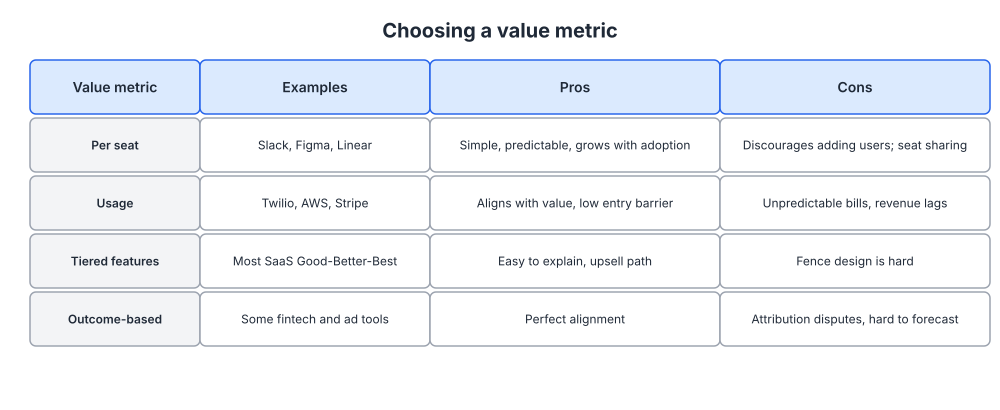
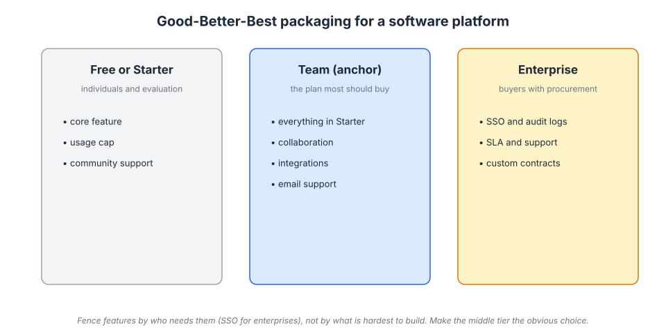
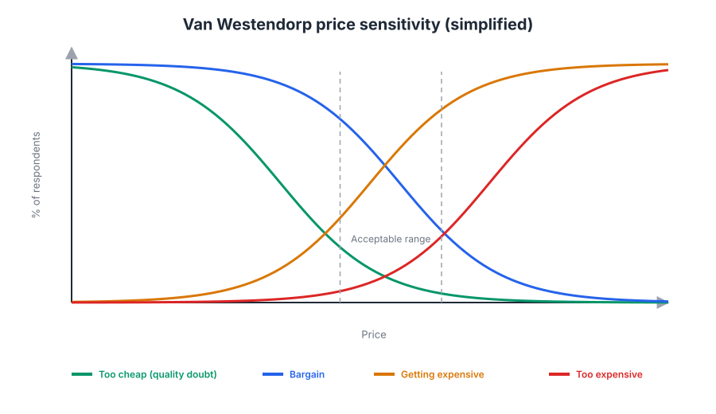

# Week 20: Pricing and packaging

> By the end of this week you will be able to choose a value metric for your platform, design a three-tier package structure with sensible fences, decide between freemium and a trial, run a basic willingness-to-pay study, and plan a price change without guessing.

**Time budget:** reading about 3.5 hours, videos about 2.5 hours, exercise 3 to 4 hours.

## What this week covers and why it matters for a founder

Pricing is the part of marketing that founders touch least and that moves revenue most. A 10 percent improvement in acquisition adds 10 percent to new bookings. A 10 percent improvement in price, if it does not cost you customers, adds 10 percent to every invoice you will ever send. Most founders set a price once, early, by looking at a competitor and subtracting a bit, and then leave it alone for three years because changing it feels dangerous.

Pricing is also positioning. Week 4 taught you that positioning is the context you set so customers understand what you are and what to compare you to. Your price is the loudest signal in that context. Superhuman charged $30 a month for an email client when most were free, and the price itself said "this is a professional tool for people whose time is expensive." Basecamp's flat fee said "we are not going to nickel and dime you per seat." Both prices did messaging work before a single word of copy was read.

The mistake founders make is treating pricing as a number. It is at least four decisions: what you charge for (the value metric), how you group features (packaging), who pays and who does not (free versus trial versus paid only), and how much (the price point). The number is the last and easiest of these. Getting the value metric wrong is the expensive one, because it determines whether your revenue grows with your customers' success or stays flat while they get more value.

When you get it right, net revenue retention (week 17) rises because the value metric expands with usage, activation improves because the free tier or trial is designed to get people to the aha moment, and your paid acquisition math (week 12) works because revenue per account goes up.

Concrete outputs this week: a written value metric decision with the reasoning, a three-tier packaging draft with fences, a free-versus-trial decision, a willingness-to-pay survey ready to send, and a one-page pricing change plan.

## Core concepts

### 1. Pricing as positioning, and the surplus you are dividing

Every sale creates value that gets divided between you and the customer. The customer's share is consumer surplus: the difference between what they would have paid and what they did pay. Yours is producer surplus: the difference between what you charged and what it cost you. Pricing is the decision about where to draw the line, and the economics matter because they tell you what you are giving away.


*The triangle above the price line is value customers keep; the one below is value you keep. Underpricing hands the top triangle to customers who would have paid more; overpricing shrinks both by losing the customers along the bottom of the demand curve. Source: [Wikimedia Commons](https://commons.wikimedia.org/wiki/File:Economic-surpluses.svg)*

Software has an unusual shape here. Marginal cost is close to zero, so almost any price above zero produces producer surplus on that sale. That makes underpricing tempting: any revenue looks like profit. But it also means the whole business is a bet on the demand curve, and different customers sit at wildly different points on it. A solo developer and a 500-person company get different value from the same feature. Charging them the same price gives the enterprise an enormous surplus and prices out the developer, or the reverse.

This is why packaging exists. Different tiers at different prices let you capture more of the surplus from customers who value the product highly without losing the ones who do not. Economists call this price discrimination; the software version is good-better-best (concept 3). Patrick McKenzie's conversation with Ramit Sethi in the reading list makes the founder-level case: customers are often happier when you charge more, because the price selects for people who take the product seriously and funds the support they want.

The failure mode: pricing to your costs. Customers do not care what it cost you to build. They care what it is worth to them, and the whole of this week is about finding that out.

### 2. Choosing a value metric

A value metric is the unit you charge for: per seat, per usage unit, per feature tier, flat fee, or a percentage of what flows through you. It is the most consequential pricing decision because it sets the slope of revenue against customer growth.



*Look at the pros and cons columns together. The best value metric tracks the value the customer gets, is easy to predict, and grows as they succeed. Most products need a primary metric and one secondary one.*

Per seat is the default for collaboration tools. Slack, Figma and Linear charge per user. It is simple, predictable, and grows with adoption inside an account, which is where expansion revenue comes from. Its weakness is that it taxes collaboration: if the fifth user costs money, someone will decide not to invite the fifth user. Figma's answer was to make viewers free and charge only for editors, so the people who create value pay and the people who consume it spread the product. Slack's answer was fair billing: you are only charged for users who are active, so a dormant seat costs nothing. Both are fences on the seat metric designed to remove the reason not to invite.

Per usage charges for the thing the product does: messages sent (Twilio), compute consumed (Snowflake), events tracked (Segment, PostHog), bandwidth and function invocations (Vercel). It aligns perfectly with value and produces very high net revenue retention when customers grow. Its weaknesses are predictability (finance teams hate variable bills), the risk that customers throttle usage to control cost, and the fact that early on, when usage is small, revenue is small too. Snowflake's consumption model is the clearest large example, and it works because the buyers understand that they are buying compute.

Per feature tier is what most products combine with one of the above. Flat fee (Basecamp) trades expansion revenue for simplicity and a positioning message. Percentage take applies to platforms and marketplaces (concept 6).

The test for a value metric has three parts. Does it scale with the value the customer receives? Can the buyer understand and predict it? Does it grow as the customer succeeds, without punishing the behavior you want (inviting, using, integrating)? Skok's "Multi-axis Pricing" essay explains why most mature products charge on two axes, for example seats plus a usage cap, so both adoption and intensity contribute to revenue.

The failure mode: picking the metric that is easiest to meter rather than the one that tracks value. API calls are easy to count and often a poor proxy for what the customer actually got.

### 3. Packaging: good-better-best and fencing

Packaging is how you group features and limits into a small number of plans. Three tiers is the standard because it works: a low tier that brings people in, a middle tier that most should buy, and a high tier that captures the customers with the most surplus and serves as an anchor that makes the middle look reasonable.



*The middle tier is the product. Design it first, then decide what to remove for the low tier and what to add for the high one.*

Rafi Mohammed's HBR piece on good-better-best, in the reading list, has the general theory. The software specifics come down to fences: the features and limits that separate tiers. A good fence is one that a customer crosses because of who they are, not because you made the product artificially worse. SSO, audit logs, role-based permissions and SLAs are enterprise fences because only enterprises need them; small teams do not feel deprived. A usage cap is a good fence for a free tier because it lets people reach the aha moment and only bites once they are getting real value. Withholding a core feature from the middle tier to push people up is a bad fence; it makes the tier most people buy feel broken.

HubSpot's Starter, Professional and Enterprise tiers across its hubs are a mature version of this, with the middle tier carrying most of the features and enterprise adding governance and scale. Notion made its personal plan free in 2020 and fenced the paid tiers by collaboration and admin features, which fits a product whose value grows when a team adopts it. Atlassian's historic $10 starter licenses for up to ten users (a one-time fee, donated to charity) were a fence designed to make the first purchase frictionless for small teams and let the product spread inside companies before anyone talked to sales.

Two structural rules. First, the anchor: a visible high tier makes the middle tier look like the sensible choice; the same middle tier shown alone looks expensive. Second, every tier should have a clear "this is for" line: individuals, teams, companies with procurement. If a prospect cannot place themselves in one sentence, the packaging is wrong.

The failure mode: too many tiers or too many add-ons. Five plans and eight add-ons is not flexibility, it is a decision the customer cannot make. Barry Schwartz's paradox of choice from week 5 applies to pricing pages more than anywhere else.

### 4. Freemium, free trial, and reverse trial

The question of who gets the product free is a marketing decision about acquisition and activation, not a generosity decision. There are three common structures and each fits a different product.

Freemium: a permanently free tier with limits. It works when the marginal cost of a free user is near zero, when free users create value for paying ones (network effects, content, word of mouth), and when the product's aha moment happens quickly enough that a free user can experience it. Zoom's free tier with a 40-minute limit on group meetings is the textbook case: every free meeting exposed new people to the product, and the limit bit exactly when a team was getting real value. Dropbox's free storage worked the same way, with referral bonuses turning free users into the acquisition channel (week 16). GitHub's free public repositories built an entire developer community before paid private repos were the business. Vikas Kumar's HBR piece on making freemium work covers the conversion math and the trap: a free tier so generous nobody upgrades, or so stingy nobody activates.

Free trial: full product for a fixed period, then pay. It works when the product needs setup time to show value, when free users would be costly to serve, or when your buyer is a business that will evaluate and decide. Trials create urgency and a natural sales conversation. Their weakness is that a 14-day trial on a product with a two-week integration is a trial of your onboarding, not your product; match the trial length to your time-to-value from week 17.

Reverse trial: the user gets the full paid product for a period, then drops to a limited free tier instead of losing access. It combines the freemium acquisition loop with the trial's exposure to premium features, and it has become common in product-led companies because it teaches users what they would be giving up. Its risk is complexity in explaining the transition.

The decision depends on three things you already know: your time-to-value (short favors freemium, long favors trial), your cost to serve a free user (near zero favors freemium), and whether free users feed a growth loop (if yes, freemium is an acquisition channel and should be evaluated as one, with CAC math from week 12). If free users do not spread the product and cost real money, they are a support burden with a marketing label.

The failure mode: a free tier designed to withhold value rather than to demonstrate it. If free users cannot reach the aha moment, the free tier is not marketing, it is a waiting room.

### 5. Willingness-to-pay research and psychology

You find out what customers will pay by asking, carefully, and by watching. Madhavan Ramanujam's book Monetizing Innovation, in the reading list, argues that the willingness-to-pay conversation should happen before you build, not after, because it tells you which features customers value enough to fund. For a founder with a product already in market, the same conversations tell you how to package it.

The simplest structured method is Van Westendorp's price sensitivity meter. You ask each respondent four questions about a described plan: at what price would it be so cheap you would doubt its quality, at what price is it a bargain, at what price is it getting expensive but you would still consider it, and at what price is it too expensive to consider. Plot the cumulative curves and the crossings define an acceptable range and a point of indifference.



*The acceptable range is between the crossing of "too cheap" and "getting expensive" on the left and the crossing of "bargain" and "too expensive" on the right. Use it to bracket a price, not to pick one to the dollar.*

Van Westendorp needs 50 to 100 responses from people who match your ICP to be useful, and its answers are hypothetical. Two things make it more reliable. Ask the four questions about a specific described package, not "the product." And follow up the survey with ten interviews using week 2 technique: what do they use today, what does it cost them, what would they stop paying for if they bought this? Conjoint analysis, where respondents choose between bundles at different prices so you can estimate the value of each feature, is the more rigorous method; it needs a tool and a few hundred responses, and it is worth it when you are designing tiers for a mature product.

Watching beats asking where you can. If you have a pricing page, which tier do people click? If you have sales calls, at what number do people flinch? Patrick Campbell's talks in the videos come from years of running exactly these studies across thousands of software companies, and his consistent finding is that most companies underprice and under-research.

Psychology, with caveats for B2B. Anchoring is real: the first number a buyer sees shapes what looks reasonable, which is why the enterprise tier sits on the pricing page even if few click it. Decoy pricing (a third option that makes the middle look better) works and is the good-better-best structure itself. Charm pricing ($29 instead of $30) is a consumer tactic with weak evidence in B2B, where a buyer is comparing to a budget line and a $29 price can look less serious than $30. Gourville and Soman's HBR piece on the psychology of consumption adds a subtle point: how and when people pay changes how much they use the product, and usage drives retention. Annual prepay improves cash flow and reduces churn events, but customers who paid once a year ago feel the cost less and may drift away without noticing; monthly billing keeps the cost salient and the usage decision alive.

The failure mode: surveying friends, users on the free tier, or people outside the ICP. Their willingness to pay is not your customer's willingness to pay.

### 6. Raising prices, enterprise pricing, price wars, and take rates

Raising prices is the highest-return project most founders never run. The mechanics are simple and the fear is what stops people. Grandfather existing customers for a period (six to twelve months is common) or forever on their current plan. Announce it with the reasons, tied to what shipped since they bought. Raise it for new customers first and watch conversion; if visitor-to-paid barely moves, you were underpriced. Then move existing customers with notice. Some will leave; they were usually the least profitable accounts, and the arithmetic almost always works in your favor. Model it before you do it with the template below.

Enterprise pricing and "contact sales" is not hiding the price out of cowardice. It exists because enterprise deals vary in scope, because procurement requires negotiation, and because a published price becomes a ceiling. The rule: publish the self-serve tiers, describe the enterprise tier's contents, and route buyers who need SSO, contracts and support to a conversation. Snowflake and Datadog both publish usage rates and still run enterprise deals on negotiated commitments.

Usage-based pricing has a specific tradeoff worth stating plainly. It maximizes alignment and expansion, and it makes revenue harder to forecast for both sides. Many usage-based companies add committed-use discounts (pay for a year of expected usage at a lower rate) to give both parties predictability. Twilio's per-message pricing with volume discounts is the standard example.

Price wars: if a competitor undercuts you, do not match reflexively. Rao, Bergen and Davis's HBR piece "How to Fight a Price War" lays out the alternatives: reveal your cost advantage if you have one, differentiate on the value metric, fence off the price-sensitive segment with a stripped tier, and let the competitor win the customers you did not want. Matching a price cut resets the whole market's anchor and is very hard to undo.

Take rates apply if your platform sits between two sides. Bill Gurley's essay "A Rake Too Far" argues that the optimal rake for a marketplace is usually lower than the maximum you could charge, because a high take rate invites disintermediation and competitors. Apple's App Store takes 30 percent (15 percent for smaller developers under its small business program), and the argument about whether that is a rake too far has been going on for years in courtrooms and regulatory bodies. Shopify chose a different model: low subscription fees plus payment processing, so its revenue grows with merchant sales without a visible rake on every transaction.


*A take rate is a wedge between what buyers pay and what sellers receive; the larger the wedge, the fewer transactions clear and the stronger the incentive to go around you. Source: [Wikimedia Commons](https://commons.wikimedia.org/wiki/File:Supply-demand-equilibrium.svg)*

Kyle Poyar's Growth Unhinged newsletter tracks how product-led companies actually price and repackage over time, with real examples of price changes and their results; it is the best ongoing source on this topic.

The failure mode: never revisiting pricing. Your product is better than it was two years ago; your price should reflect it. Put a pricing review on the calendar every twelve months, and treat it like any other experiment from week 19: hypothesis, metric, decision rule.

## Videos

- [SaaS pricing talk, Patrick Campbell (ProfitWell)](https://www.youtube.com/watch?v=npadtGFiCGA)
  Why watch: data from thousands of software companies on value metrics, willingness-to-pay research and how often companies underprice; 30 to 45 minutes.
- [Monetizing Innovation, Madhavan Ramanujam (Lenny's Podcast)](https://www.youtube.com/watch?v=A6veeCbKIzw)
  Why watch: the case for talking about price before building, and practical detail on willingness-to-pay conversations; about 75 minutes.
- [Product-led growth pricing and packaging, Kyle Poyar](https://www.youtube.com/watch?v=bz4BB2d5sSE)
  Why watch: how PLG companies structure free tiers, trials and self-serve upgrade paths, with named examples; about 30 minutes.
- [Runnin' Down a Dream, Bill Gurley (talk)](https://www.youtube.com/watch?v=xmYekD6-PZ8)
  Why watch: not a pricing talk, but the best introduction to how Gurley thinks about markets and platforms before you read his essay on take rates; about 60 minutes.

## Recommended reading

- [The Good-Better-Best Approach to Pricing, Rafi Mohammed (HBR)](https://hbr.org/2018/09/the-good-better-best-approach-to-pricing). What to take from it: why three tiers work, how to design fences, and the risks of a bad "good" tier.
- [Making 'Freemium' Work, Vineet Kumar (HBR)](https://hbr.org/2014/05/making-freemium-work). What to take from it: the conversion math of free tiers and the signs your free tier is too generous or too stingy.
- [Pricing and the Psychology of Consumption, Gourville and Soman (HBR)](https://hbr.org/2002/09/pricing-and-the-psychology-of-consumption). What to take from it: how billing timing affects usage and therefore retention; apply it to the annual-versus-monthly decision.
- [A Rake Too Far: Optimal Platform Pricing Strategy, Bill Gurley](https://abovethecrowd.com/2013/04/18/a-rake-too-far-optimal-platformpricing-strategy/). What to take from it: why the optimal take rate is lower than the maximum, with marketplace examples.
- [Multi-axis Pricing, David Skok (For Entrepreneurs)](https://www.forentrepreneurs.com/multi-axis-pricing-a-key-tool-for-increasing-saas-revenue/). What to take from it: how to combine two value metrics so that both adoption and usage grow revenue.
- [Ramit Sethi and Patrick McKenzie on why your customers would be happier if you charged more (Kalzumeus)](https://www.kalzumeus.com/2012/09/21/ramit-sethi-and-patrick-mckenzie-on-why-your-customers-would-be-happier-if-you-charged-more/). What to take from it: the founder psychology of underpricing and the argument for charging what the value justifies.
- [Van Westendorp's Price Sensitivity Meter (Wikipedia)](https://en.wikipedia.org/wiki/Van_Westendorp%27s_Price_Sensitivity_Meter). What to take from it: the four questions and how the curves are read; enough to run the survey in the exercise.
- Book: Monetizing Innovation, Madhavan Ramanujam and Georg Tacke, chapters 1 to 4 and 7 ([Simon-Kucher](https://www.simon-kucher.com/)). What to take from it: willingness-to-pay conversations, the four types of failure in monetization, and the chapter on packaging.

## Hands-on exercise (3 to 4 hours)

**Deliverable:** a pricing and packaging document in your company wiki containing a value metric decision, a three-tier packaging draft, a free-versus-trial decision, a willingness-to-pay survey ready to send to 50 ICP contacts, and a modeled price change plan.

**Steps:**
1. (20 minutes) Write down your current pricing: value metric, tiers, price points, free structure. Then write one sentence on what your price currently signals about your positioning (week 4). If the two disagree, that is your first finding.
2. (30 minutes) Evaluate three candidate value metrics against the three tests in concept 2 (tracks value, predictable, grows with success without punishing wanted behavior). Pick a primary and, if needed, a secondary. Write the reasoning.
3. (30 minutes) Draft three tiers using the template. Write the "this is for" line for each first. Then fence: list every feature and limit, and for each write who needs it. Enterprise fences go in Enterprise; usage caps go on Free; everything else goes in the middle tier unless you have a reason.
4. (20 minutes) Decide free, trial or reverse trial using your time-to-value from week 17, your cost to serve a free user, and whether free users feed a growth loop from week 16. Write the decision and the reason.
5. (30 minutes) Build the Van Westendorp survey: describe the middle tier in three sentences, then the four questions, then two open questions (what do you use today and what does it cost, what would you need to see to pay at the top of your range). Draft the email to 50 ICP contacts from your week 3 list.
6. (30 minutes) Model a price change: take your current paying accounts, apply the proposed price, assume 5, 10 and 20 percent of accounts churn in response, and compute net MRR under each. If even the 20 percent case is positive, the change is safe. Write the grandfathering rule and the announcement's first paragraph.
7. (20 minutes) Write the pricing page copy for each tier in the voice from week 7: name, price, "this is for" line, five bullets, one call to action. Show the enterprise tier as an anchor even if it says "contact us."
8. (10 minutes) Put a twelve-month pricing review on the calendar and log the price change as an experiment in your week 19 log.

**Template:**

```
PRICING AND PACKAGING, <date>

Current price signals: ____________________ (does it match positioning? yes / no)

Value metric decision
  Primary: ______   Secondary: ______
  Tracks value?  Predictable?  Grows with success without punishing invites/usage?
  Reasoning: ____________________

| Tier        | This is for               | Price   | Value metric limit | Fences (who needs it)             |
|-------------|---------------------------|---------|--------------------|-----------------------------------|
| Free/Starter| individuals, evaluation   | $0      | __ per month       | usage cap, community support      |
| Team        | the plan most should buy  | $__/__  | __                 | collaboration, integrations, email support |
| Enterprise  | buyers with procurement   | contact | custom             | SSO, audit logs, SLA, contracts   |

Free structure: freemium / trial (__ days) / reverse trial (__ days then free tier)
  Time-to-value: __   Cost per free user: __   Free users feed a loop? yes / no

Willingness-to-pay survey: sent to __ contacts on ______; results due ______
  Acceptable range: $__ to $__   Indifference point: $__

Price change model
  Accounts: __   Current MRR: $__   Proposed price: $__
  Churn 5%: net MRR $__   Churn 10%: $__   Churn 20%: $__
  Grandfathering: ____________________
  New customers from: ______   Existing customers from: ______

Next pricing review: ______
```

**How to know it is good:**
- The value metric passes all three tests and you can explain in one sentence why it does not tax the behavior you want.
- Each tier has a one-line "this is for" that a prospect could use to place themselves, and every fence is justified by who needs it rather than by what pushes upgrades.
- The free-versus-trial decision cites your actual time-to-value and cost to serve.
- The survey describes a specific package and goes to people who match your ICP, not to friends or free-tier users.
- The price change model is positive even in the pessimistic churn case, and grandfathering is written down.

## Self-check

Answer these without looking back. If you cannot, reread the relevant section.

1. Explain consumer surplus and producer surplus, and what a single price for all customers does to each.
2. State the three tests for a value metric and apply them to per-seat pricing for a collaboration tool.
3. How did Figma and Slack each modify per-seat pricing to avoid taxing collaboration?
4. What makes a good fence between tiers, and what makes a bad one? Give one example of each.
5. Under what three conditions does freemium make sense, and when should you use a trial instead?
6. What are the four Van Westendorp questions, and what defines the acceptable price range?
7. Why is charm pricing less reliable in B2B than in consumer products?
8. Describe the steps of a price increase that minimizes churn risk.
9. Why does Gurley argue the optimal take rate is below the maximum a platform could charge?
10. A competitor cuts their price by 30 percent. Name two responses other than matching it.

**You are done with this week when:**
- [ ] You have a written value metric decision with reasoning against the three tests.
- [ ] You have a three-tier packaging draft with a "this is for" line and justified fences for each tier.
- [ ] Your willingness-to-pay survey is written and addressed to at least 50 ICP contacts.
- [ ] You have a modeled price change with a grandfathering rule and a date for the next pricing review.

## Next week

You now have positioning, messaging, channels, loops, retention, measurement, a growth process and a pricing structure. Next week assembles them into a go-to-market motion: choosing between self-serve, product-led with sales assist, sales-led and enterprise based on your price and value metric, defining the marketing-to-sales handoff, and running a launch.
