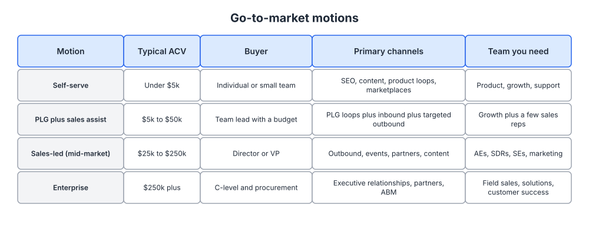
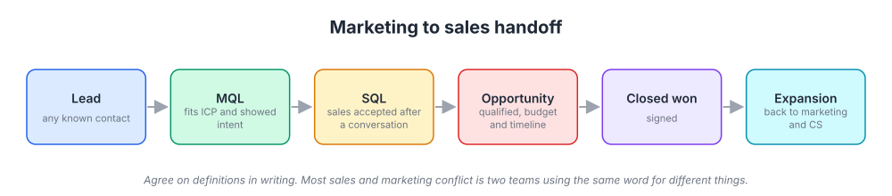
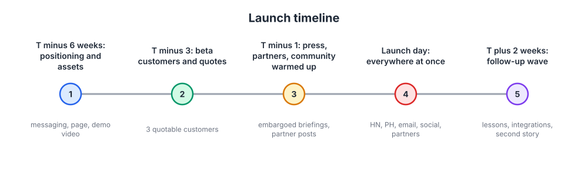

# Week 21: Go-to-market strategy, launches and sales alignment

> By the end of this week you will have chosen a go-to-market motion that matches your price point, written lead definitions that sales and marketing both sign, and planned a launch on a six-week timeline.

**Time budget:** reading about 3 hours, videos about 2.5 hours, exercise 2 to 4 hours.

## What this week covers and why it matters for a founder

You have spent twenty weeks building parts: an ICP, positioning, messaging, a narrative, channel hypotheses, a growth loop, a metrics tree, a pricing page. This week assembles those parts into a motion. Go-to-market (GTM) is the answer to one question: how does a person who has never heard of you become a paying customer, and who does what along the way?

Most founders answer that question by accident. They copy the motion of a company they admire without checking whether the price point supports it. A founder selling a $30 a month tool hires two sales reps because the enterprise company down the street did. A founder selling a $200k platform builds a self-serve signup flow and wonders why nobody who signs up can approve a purchase. The motion has to follow the economics, not the role models.

The second mistake is treating launches as events. A launch is a campaign with a start date, a set of assets, and a follow-up plan. The companies whose launches you remember (Slack, Superhuman, Notion, Linear) planned them for weeks and built the waitlist or the beta before anything went public.

The third mistake is the marketing versus sales feud. It starts the day you hire your first salesperson and it is almost always a vocabulary problem: two people using the word "lead" to mean different things. You will fix it this week by writing the definitions down before anyone has a reason to argue.

Concrete outputs for the week: a one-page GTM document naming your motion and why, a written lead definition ladder from contact to closed won, a launch plan on the six-week timeline, and a minimal sales enablement kit (one-pager, deck outline, battlecard).

## Core concepts

### 1. GTM motions follow the price, not the founder's preference

There are four common motions for software, and the annual contract value (ACV) largely picks the one you can afford. Self-serve works under roughly $5k a year: the buyer is an individual or a small team, the channels are search, content, product loops and marketplaces, and nobody talks to a human. PLG plus sales assist covers roughly $5k to $50k: the product still sells itself to users, but a team lead with a budget needs someone to answer procurement questions and consolidate seats. Sales-led mid-market runs from about $25k to $250k, with outbound, events, partners and content feeding account executives. Enterprise above that is executive relationships, partners and account-based marketing with field sales, solutions engineers and customer success.



*Read across a row: the ACV determines who buys, which sets the channels, which sets the team you have to fund. Pick the row that matches your pricing from week 20.*

The mechanism is arithmetic. A salesperson costs money whether or not they close. If your ACV is $2k, a rep needs more closed deals a year than a human can have conversations. If your ACV is $150k, a handful of wins covers the rep, but then marketing must produce a small number of very qualified conversations rather than a flood of signups. The motion also sets the time-to-value your product must deliver: self-serve products must show value in minutes, because nobody is there to help.

Atlassian is the standard example of a self-serve motion held to a strict discipline. For most of its history the company sold Jira and Confluence with no traditional sales force, priced low enough that a team could expense it, and relied on product quality, documentation and a marketplace to carry the load. Snowflake is the opposite pole: an enterprise motion built on a direct sales force, consumption pricing that grows with the account, and a marketing function whose job is to feed and support those sellers. Both work. Neither would work with the other company's price list.

The common failure mode is running two motions at once with one person's worth of resources. The self-serve funnel gets half-built, the sales process gets half-built, and neither produces enough to learn from. Start with one row and be honest about whether you can fund it.

The Business Model Canvas is a useful one-page check here, because the channels and customer relationships boxes force you to state the motion explicitly next to your cost structure and revenue streams. If the boxes disagree with each other, your motion is wrong.


*Look at the channels, customer relationships and cost structure boxes together: a sales-led motion in the middle with a self-serve price on the right is a canvas that does not balance. Source: [Wikimedia Commons](https://commons.wikimedia.org/wiki/File:Business_Model_Canvas.png)*

### 2. Founder-led sales is the best market research you will ever run

Whatever motion you choose, the first twenty to fifty customers should be sold by a founder. This is not because founders are great salespeople. It is because every sales conversation is a research interview with money attached, and you are the only person who can change the product, the price and the positioning in response.

Pete Kazanjy's Founding Sales lays out the mechanics: build a list from your week 3 ICP, lead outreach with the customer's problem, run a discovery call that is mostly questions, and demo only what answers what you heard. The discipline is to record what happens. Which objection came up in every call? Which feature made people lean in? Which title said yes and which title said "let me check with my boss"? Those notes feed straight back into your week 4 positioning and week 5 objection map.

Stripe's early days are the cleanest example. The Collison brothers did not hand developers a signup link; they asked for the laptop and installed Stripe on the spot, which Paul Graham describes in "Do Things That Don't Scale." That was sales, but it was also the fastest possible feedback on where the integration was confusing. The friction they saw in person became the documentation that later carried the self-serve motion.

The HBR piece "The Sales Learning Curve" gives the reason to resist hiring reps too early: learning how customers buy is expensive to do through people who cannot change the product. Hire sellers once you can hand them a repeatable process: a target title, a pitch that works, an objection list with answers, and a realistic cycle length. Before that, reps burn money learning things a founder could learn in a week.

The failure mode is the founder who treats every call as a pitch and never asks a question. Use the interview skills from week 2. The demo is the last ten minutes, and it should show only what the questions surfaced.

### 3. Lead definitions and the handoff

The moment you have someone selling and someone marketing, you need a shared vocabulary. Write it down before you need it. A lead is any known contact. A marketing qualified lead (MQL) fits the ICP and has shown intent, such as requesting a demo, visiting pricing repeatedly, or activating a trial. A sales qualified lead (SQL) is one that sales has accepted after a conversation. An opportunity has a confirmed need, budget and timeline. Closed won is a signature. Expansion goes back to marketing and customer success, which is where week 17's expansion revenue thinking reconnects.



*Every stage needs a written entry rule and an owner; the conflict starts when the MQL box has no definition and sales rejects half of what marketing sends.*

The HBR article "Ending the War Between Sales and Marketing" is old and still exactly right about the cause: the two functions are measured differently, they see the funnel from different ends, and they blame each other for a leaky middle. The fix they propose is a service-level agreement in both directions. Marketing commits to a volume and quality of MQLs; sales commits to following up within a set time and recording why leads were rejected. The rejection reasons are the gold. If a third of MQLs are rejected as "wrong company size," your ICP scoring from week 3 is wrong or your forms are not capturing it.

Use the same definitions in your CRM stages and your week 18 metrics tree so the dashboard and the pipeline agree. In a PLG motion the equivalent of an MQL is a product qualified lead (PQL): an account that hit an activation milestone plus a firmographic signal such as five seats or a company email domain. Define it with the same rigor, and put the ladder in your wiki with the date it was agreed, because a definition that lives in one person's head leaves with that person.

### 4. The launch playbook

A launch is a concentrated spike of attention aimed at a story. It works when the story is ready, the assets are ready, the first customers are already quotable, and the amplifiers (press, partners, community) have been warmed up before launch day. It fails when someone decides on Monday to launch on Thursday.



*Notice that launch day is step four of five; most of the work is before it, and the follow-up wave is what turns a spike into a plateau.*

Work backward from launch day. Six weeks out: settle positioning and messaging, build the page, record a demo video, brief your team. Three weeks out: get three beta customers to a point where they will give a quote and ideally a short case study (week 8's template). One week out: embargoed briefings for any press or newsletter writers who cover your space, partner posts scheduled, your community told what is coming. Launch day: everything at once. Hacker News (read the Show HN guidelines first; the community punishes marketing-speak), Product Hunt, an email to your list, founder posts where your ICP lives, partner amplification. Two weeks later: a second story with lessons learned, a new integration, or customer results.

Not everything gets the full treatment. A tier one launch (new product, new category claim, major pricing change) gets the six-week plan. A tier two launch (significant feature) gets a blog post, an email and social. A tier three launch is a changelog line; Linear's public changelog shows tier three done so consistently that it became a marketing asset in its own right.

Slack opened a preview release in 2013 to a waitlist that filled with thousands of teams in the first day, then let people in gradually so each cohort had a good experience and talked about it. Superhuman ran a waitlist for years and onboarded people one at a time on calls, turning scarcity and a great first session into referral fuel. Linear started invite-only in 2019, which meant that when it opened up, a pool of enthusiastic users already existed to post about it. Notion's 2.0 release in 2018 became one of Product Hunt's most upvoted launches, and it worked because the product was already loved by a small group who showed up on the day. Apple's keynotes are the extreme case: months of preparation for a single narrative moment.

Salesforce's launch stunt in 2000 is the reminder that a launch can be a story: Marc Benioff staged a fake protest outside a Siebel conference in San Francisco with "no software" placards, and the press wrote about the category claim rather than the feature list. Figma's Config conference plays a similar role now, an annual moment where announcements concentrate and the community amplifies them.

The founder version of launch failure is launching to an empty room because no list, no community and no beta customers existed. If that is you, the launch is in eight weeks, not two.

### 5. Category creation versus entering a category, and crossing the chasm in GTM terms

Back in week 4 you chose a market category strategy: compete head-to-head, be a big fish in a small pond, or create a new game. In GTM terms this choice sets how much of your budget goes to education versus capture. Entering an existing category means buyers already search for the thing, comparisons pages work, and paid search on category terms converts. Creating a category means you have to teach the market a new frame before anyone will search for it, which is slower, more expensive and, if it works, more defensible.

Drift's "conversational marketing" and Gong's "revenue intelligence" are recent category creation plays. Both companies spent years producing content, talks and books to make the phrase mean something, and both eventually saw competitors adopt the language, which is how you know a category took. HubSpot's "inbound" is the older template. The cost is real: for years the category name generated no search demand and every deal required explanation. Most founders should enter a category and win a segment of it before trying to name one. Naming a category is a multi-year commitment that only makes sense when the existing category name actively hurts you.


*Your first motion is built for the left side of this curve; expanding into the early majority usually means changing the motion, not just the messaging. Source: [Wikimedia Commons](https://commons.wikimedia.org/wiki/File:Technology-Adoption-Lifecycle.png)*

The chasm from week 3 reappears here with a GTM angle. Early adopters buy from a founder on a call, tolerate rough edges, and do not need references. The early majority wants references from people like them, a complete product, and a buying process that fits their procurement. Geoffrey Moore's advice is to pick one beachhead segment on the far side, win it completely with a whole product, then move to the adjacent segment. Shopify started with small merchants and only later built a motion for large brands, which required a different price, sales team and partners.

The failure mode is expanding into a new segment with the old motion. A self-serve product that starts attracting mid-market interest needs a sales-assist path, security documentation, and a pricing tier that procurement can sign, or those buyers leave. Larger buyers also involve many stakeholders, so your marketing has to arm the internal champion to sell on your behalf when you are not in the room.

### 6. Sales enablement: the minimum kit

Sales enablement is the set of materials that lets someone who is not you sell your product consistently. Build it even with no sales team; you will use it on calls and your first hire will need it on day one.

The minimum is four items. A one-pager: positioning in one paragraph, three pillars with proof (straight from your week 5 messaging document), pricing summary, and logos or quotes. A deck: your week 8 strategic narrative in six to ten slides, with a demo slot in the middle. A demo script: the path through the product that answers the three most common jobs from your week 2 research, timed at ten minutes. Competitive battlecards: one page per competitor with where they win, where you win, the questions to ask that surface your advantage, and the traps to avoid.

The battlecard is where founders fabricate. Do not write what you wish were true about a competitor. Pull from real lost-deal notes and public reviews, update quarterly, and mark anything unverified. A rep who repeats a false claim about a competitor loses the deal and your credibility.

## Videos

- [Founding Sales, Pete Kazanjy (talk)](https://www.youtube.com/results?search_query=pete+kazanjy+founding+sales+talk) (YouTube search)
  Why watch: the clearest walkthrough of how a technical founder should run early sales as a learning process rather than a pitch, about 45 minutes depending on the version you pick.
- [From $1M to $10M ARR, Jason Lemkin (SaaStr)](https://www.youtube.com/results?search_query=jason+lemkin+saastr+1m+to+10m+arr) (YouTube search)
  Why watch: blunt on when to hire your first reps, what they cost, and the difference between founder-led and rep-led selling, roughly 30 to 45 minutes.
- [The Sales Acceleration Formula, Mark Roberge (talk)](https://www.youtube.com/results?search_query=mark+roberge+sales+acceleration+formula+talk) (YouTube search)
  Why watch: the HubSpot sales leader on defining lead stages with numbers and building a sales process an engineer would recognize, around 40 minutes.
- [The single biggest reason why start-ups succeed, Bill Gross (TED, 2015)](https://www.ted.com/talks/bill_gross_the_single_biggest_reason_why_start_ups_succeed)
  Why watch: six minutes on timing; it reframes launch decisions as market readiness questions rather than product readiness questions.
- [How to Get Your First Customers, Michael Seibel (Y Combinator)](https://www.youtube.com/results?search_query=y+combinator+michael+seibel+how+to+get+your+first+customers) (YouTube search)
  Why watch: practical and short (about 20 minutes) on founder-led outreach, charging early, and not hiding behind a website.

## Recommended reading

- Book: Founding Sales, Pete Kazanjy, the chapters on prospecting, discovery and demos ([free online edition](https://www.foundingsales.com/)). What to take from it: the outreach and call structures you will use on every early deal; treat it as a manual, not a read-through.
- [Ending the War Between Sales and Marketing, Kotler, Rackham and Krishnaswamy (HBR, 2006)](https://hbr.org/2006/07/ending-the-war-between-sales-and-marketing). What to take from it: the service-level agreement in both directions and why shared definitions end most fights.
- [The Sales Learning Curve, Leslie and Holloway (HBR, 2006)](https://hbr.org/2006/07/the-sales-learning-curve). What to take from it: why hiring reps before the process is repeatable wastes money, and the three phases of a sales force.
- [Why Most Product Launches Fail, Schneider and Hall (HBR, 2011)](https://hbr.org/2011/04/why-most-product-launches-fail). What to take from it: a checklist of launch failure causes to run against your own plan.
- [How to Sell New Products, Steenburgh and Ahearne (HBR, 2018)](https://hbr.org/2018/11/how-to-sell-new-products). What to take from it: selling something new is a different skill from selling an established product, and your enablement kit must support the longer conversation.
- [Making the Consensus Sale, Karen Dillon and others (HBR, 2015)](https://hbr.org/2015/03/making-the-consensus-sale). What to take from it: how to arm an internal champion when many stakeholders must agree, which matters as you move upmarket.
- [Show HN guidelines (Hacker News)](https://news.ycombinator.com/showhn.html). What to take from it: the rules and norms before you post; a launch that reads as an ad gets buried.
- Book: Crossing the Chasm, Geoffrey Moore, chapters 3 to 6 on the beachhead and the whole product ([overview](https://en.wikipedia.org/wiki/Crossing_the_Chasm)). What to take from it: how to pick and win one segment before expanding, and what a "whole product" means for your motion.

## Hands-on exercise (2 to 4 hours)

**Deliverable:** a GTM document in your wiki with four sections: chosen motion and rationale, lead definition ladder, launch plan on the six-week timeline, and a minimum enablement kit outline.

**Steps:**
1. (20 minutes) Pull up your week 20 pricing and your week 3 ICP. Find your row in the GTM motions table. Write three sentences on why that row fits, and one on what you cannot yet afford that the row requires.
2. (20 minutes) Fill in a Business Model Canvas for your platform. Check that channels, customer relationships and cost structure agree with the motion you chose. Fix whichever one is out of line.
3. (30 minutes) Write the lead ladder: lead, MQL (or PQL), SQL, opportunity, closed won, expansion. For each, one entry rule that could be checked by a machine, and one owner.
4. (30 minutes) Pick your next launch. Assign it a tier. If tier one, fill the six-week timeline with dated tasks. If nothing launch-worthy is coming, plan the launch of your positioning itself: new homepage, narrative, three customer quotes.
5. (20 minutes) List the amplifiers you can warm up: newsletter writers in your space, partners with integrations, your own community, three customers who would post. Put a name and a date next to each.
6. (30 minutes) Outline the enablement kit. Draft the one-pager from your week 5 messaging document. List the slides of the deck from your week 8 narrative. Write the ten-minute demo path.
7. (20 minutes) Start one battlecard for your most common competitive alternative using real notes from calls, reviews and lost deals. Mark anything you have not verified.
8. (10 minutes) Read the whole document as a new sales hire would. Rewrite anything they could not act on.

**Template:**

```
GTM DOCUMENT (one page plus appendices)

Motion: [self-serve | PLG plus sales assist | sales-led | enterprise]
Why this motion: ACV of [x], buyer is [title], time to value is [minutes/days/weeks]
What this motion requires that we lack today: [list]

Lead ladder
| Stage       | Entry rule (checkable)                       | Owner     |
|-------------|----------------------------------------------|-----------|
| Lead        | any known contact with email                 | marketing |
| MQL / PQL   | fits ICP score >= [n] AND [intent signal]    | marketing |
| SQL         | accepted after discovery call                | sales     |
| Opportunity | need, budget, timeline confirmed             | sales     |
| Closed won  | signed                                       | sales     |
| Expansion   | [usage or seat trigger]                      | CS + mktg |

Launch plan: [name], tier [1/2/3], launch date [date]
T-6 weeks: positioning final, page built, demo video recorded
T-3 weeks: 3 beta customers quotable
T-1 week: briefings sent, partner posts scheduled, community told
Launch day: HN, Product Hunt, email, founder posts, partners
T+2 weeks: follow-up story: [what]

Enablement kit
One-pager: [link]   Deck: [link]   Demo script: [link]   Battlecards: [links]
```

**How to know it is good:**
- The motion, the price point and the buyer title all point to the same row of the table, and you can say what the motion costs to run.
- Every stage of the lead ladder has a rule that two people would apply the same way without discussing it.
- The launch plan has dated tasks before launch day and a follow-up after it, and at least three customers are named as quotable.
- The battlecard contains nothing you could not defend to the competitor's face.

## Self-check

Answer these without looking back. If you cannot, reread the relevant section.

1. What determines which GTM motion a company can afford, and what happens when the price and the motion disagree?
2. Why should a founder sell the first fifty customers personally, even if they are a poor salesperson?
3. Define MQL and SQL in one sentence each, and name the document that keeps sales and marketing from fighting about them.
4. List the five steps of the launch timeline and say what must be true three weeks before launch day.
5. What did Slack, Superhuman and Linear each have in place before their public launch that most founders skip?
6. When does creating a category make sense, and what does it cost that entering one does not?
7. Why does a self-serve product that starts attracting mid-market buyers usually need a new motion rather than new messaging?
8. What are the four items in the minimum enablement kit, and what is the one rule for writing battlecards?

**You are done with this week when:**
- [ ] Your GTM document names one motion with a rationale tied to your pricing and buyer.
- [ ] The lead ladder is written, dated, and mirrored in your CRM stages and metrics tree.
- [ ] A launch is on the calendar with a tier and dated tasks on the six-week timeline.
- [ ] The one-pager and demo script exist and could be handed to a new hire.

## Next week

You now have a motion, a launch and a handoff. Week 22 turns the pile of tactics into a plan: a one-page annual plan, quarterly bets, a weekly dashboard, a budget you can defend, and the operating cadence that keeps all of it moving when you only have a few hours a week.
