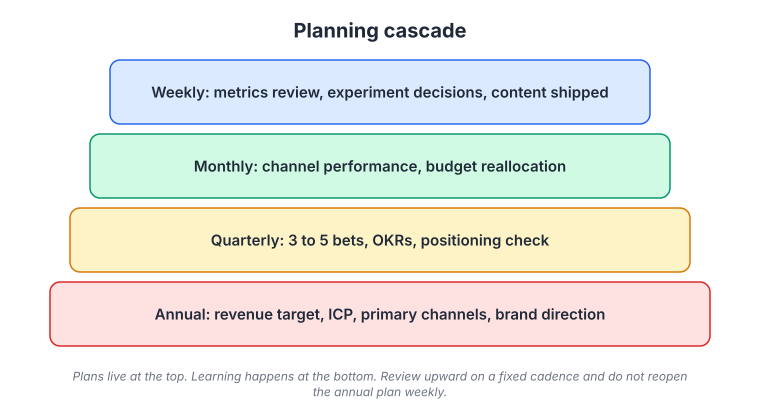
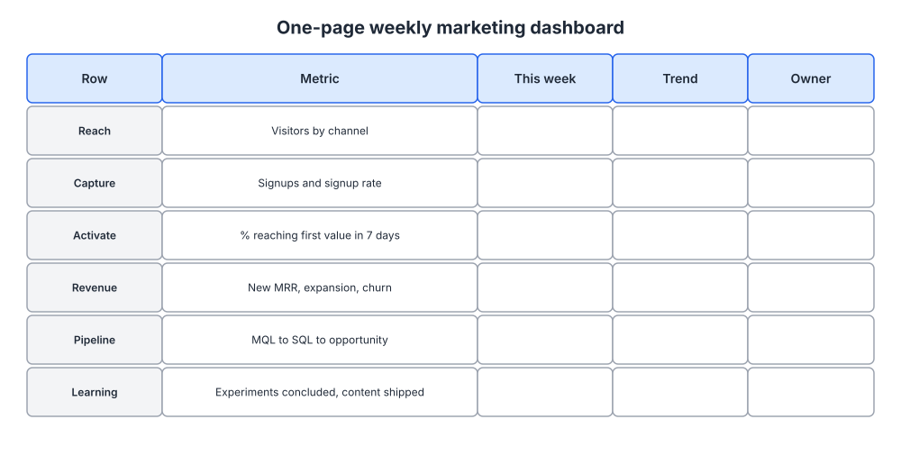
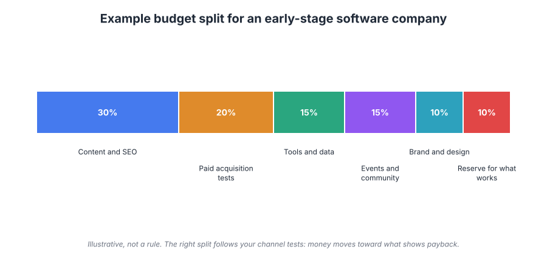

# Week 22: The marketing plan, budget and operating cadence

> By the end of this week you will have a one-page annual marketing plan, three quarterly bets with measurable key results, a weekly dashboard, and a budget with written rules for moving money.

**Time budget:** reading about 3 hours, videos about 2 hours, exercise 2 to 4 hours.

## What this week covers and why it matters for a founder

Everything before this week was a component. This week is the operating system. A plan is not a document you write once in January; it is the set of decisions you have already made so that each week you do not have to make them again. Which channels get attention, what a good week looks like, when money moves, when you stop an experiment: decide once, then run.

Founders without a plan do not do nothing. They do whatever came up. A competitor posts something, so they post something. A paid campaign gets clicks, so they double the budget. Each action is defensible alone, and together they add up to a year in which nothing compounded because nothing was sustained. Tactic hopping from week 1 is a planning failure, not a discipline failure.

The other failure is the opposite: a forty-page plan built in a spreadsheet with monthly targets for eleven channels, abandoned by February because reality diverged from the model. The plan has to be short enough to remember and loose enough to survive contact with data. The fix is layers: the annual plan sets targets and constraints, quarters carry bets, weeks carry decisions.

This is also where the founder's calendar gets honest. If you have five hours a week for marketing, the plan must fit in five hours a week. Companies that run well at scale (Amazon, HubSpot, Basecamp, Linear) all have an explicit cadence, and the cadence matters more than the framework they use.

Outputs for the week: the one-page annual plan, a quarterly bets document with OKRs, a weekly dashboard you can fill in fifteen minutes, and a budget with reallocation rules.

## Core concepts

### 1. The planning cascade: one page at the top, decisions at the bottom

A working plan has four layers, and each one answers a different question at a different frequency. Annual: what is the revenue target, who is the ICP, what is the positioning, which one or two channels are primary, what is the brand direction, and what is the budget. Quarterly: which three to five bets do we make against that plan, with what key results, and does the positioning still hold. Monthly: how did each channel perform against its payback expectation, and where does money move. Weekly: what do the numbers say, which experiments start or stop, what content ships.



*Read it bottom-up for learning and top-down for constraints; the annual layer changes once a year, the weekly layer changes every week, and the mistake is reopening the top layer on a Tuesday because one number moved.*

The annual layer fits on one page or it is not a plan, it is a report. The one page states: the number (new ARR or revenue), the ICP in two lines (from week 3), the positioning in one paragraph (week 4), the primary and secondary channels (week 9 hypotheses updated with what your tests showed), the loops you are building (week 16), the budget total and split, and two or three big bets that would change the trajectory if they worked. That is it. Every other plan in the company should be derivable from it.

HubSpot has long been explicit about planning in layers: a company-level set of priorities, team-level goals that map to them, and weekly metrics reviews that surface deviations. Jim Collins's flywheel is the useful mental model for the annual page. Write your flywheel (for many software companies it is something like: useful content attracts the ICP, the product delivers value fast, happy users invite colleagues and post about it, that attention makes the content rank and spread) and check that every big bet pushes on a specific part of the wheel. A bet that does not touch the flywheel is a distraction with a budget.

The failure mode is the plan written for investors rather than for the person running the week. If the annual page cannot tell you what to do on Monday, add constraints (which channels, which budget, which bets) until Monday is obvious.

### 2. Quarterly bets and OKRs for marketing, including the ways they go wrong

Objectives and key results are a simple tool that gets misused constantly. An objective is a qualitative statement of what you want to be true at the end of the quarter. Key results are the two to four numbers that would prove it. John Doerr's version, borrowed from Andy Grove at Intel, is about focus: few objectives, measurable results, reviewed in the open. For a marketing function the objective might be "self-serve signups become a reliable source of paying teams," with key results such as "organic signups reach x per week," "signup-to-activation rate reaches y percent," and "z paying teams originate from organic."

The anti-patterns matter more than the template. First, activity disguised as a result: "publish 12 blog posts" is a task, not a key result; the result is what the posts cause. Second, too many objectives: three is plenty for a company, one or two for a solo marketer. Third, key results nobody can influence in a quarter: brand awareness in a market you have not entered is a hope. Fourth, sandbagging, where every key result is hit at 100 percent because they were set to be hit; Doerr's rule of thumb is that a good OKR set lands around 70 percent. Fifth, turning OKRs into performance reviews, which guarantees sandbagging; founders trigger this by accident when they tie a marketer's bonus to a number the market controls.

A quarterly bet is bigger than an experiment and smaller than a strategy. "Build a comparison-page cluster for our three main alternatives and get it ranking" is a bet. "Test whether newsletter sponsorships pay back within six months" is a bet. "Launch the partner program" is a bet. Each gets an owner, a key result, and a kill condition. Three to five per quarter, and when you are alone, two.

Amazon's Working Backwards practice is the strongest tool for choosing bets: before committing, write the press release and FAQ for the finished bet as if it had already worked. If you cannot write a convincing press release, the bet is not worth a quarter. The HBR piece "Bringing Science to the Art of Strategy" reframes the same idea: state what would have to be true for the bet to be right, then test the most doubtful condition first.

The failure mode is quarterly planning that takes the whole first month of the quarter. Timebox it to a half day: review last quarter's results, pick the bets, write the OKRs, done. Basecamp's six-week cycles with a cool-down week are an alternative rhythm that some marketing teams prefer, because six weeks is long enough to ship something real and short enough to stay honest.

### 3. The weekly cadence and the one-page dashboard

The week is where the plan meets reality. A good weekly marketing cadence for a founder takes about ninety minutes: fifteen minutes to fill and read the dashboard, thirty minutes deciding on experiments (start, continue, stop), thirty minutes reviewing what content or campaign ships this week, and fifteen minutes writing three lines of notes for next week. If you have a team, this is one meeting with a fixed agenda and no slides.



*Six rows, one page, every week; the trend column matters more than the number, and the learning row is what most dashboards forget.*

The dashboard should be the top of your week 18 metrics tree, no more. Reach: visitors by channel. Capture: signups and signup rate. Activate: the share of new accounts reaching first value within seven days (your week 17 activation definition). Revenue: new MRR, expansion, churn. Pipeline: MQL to SQL to opportunity, using your week 21 definitions. Learning: experiments concluded and content shipped. Each row has an owner even if every owner is you.

Two rules keep the dashboard useful. First, look at trends, not points: one bad week of signups is noise, four declining weeks is a signal. Second, every number must connect to an action you would take if it moved. If no decision depends on a number, delete the row. Amazon's weekly business review is the well-known large-company version: a fixed deck of input and output metrics reviewed in the same order every week, with anomalies discussed and everything else skipped. The discipline is the sameness. You spot deviations because the frame never changes.

Andy Grove's High Output Management gives the principle behind all of this: a manager's output is the output of the systems under their influence, and the highest-leverage activities are the ones that set direction for many future actions. A ninety-minute weekly review that redirects the next forty hours of work is high leverage. Reacting to each notification is not.

The failure mode is the dashboard that takes four hours to build every week, so it stops being built. Automate the pull (week 23 covers the tooling) or reduce the rows until fifteen minutes is enough. A dashboard you actually look at beats a perfect one you do not.

### 4. Budget: how to split money and when to move it

Early-stage marketing budgets are small and the temptation is to spread them thinly across everything. Resist it. The budget should reflect the channel decisions from week 9 and the payback data from week 12, and it should keep a reserve for the thing that starts working.



*This is an illustration, not a rule; the reserve slice is the important one, because it is what lets you feed a channel the moment it shows payback.*

A reasonable starting split for a content-led self-serve company might be something like 30 percent content and SEO, 20 percent paid acquisition tests, 15 percent tools and data, 15 percent events and community, 10 percent brand and design, and 10 percent held in reserve. A sales-led company would shift toward events, partners and enablement. The numbers matter less than the rules attached to them.

Write three reallocation rules and follow them. Rule one: a channel that shows payback within your target window (from week 12's unit economics) gets more money next month, taken from the reserve first and then from the weakest channel. Rule two: a channel that misses its payback target for two consecutive months gets cut to a maintenance level or zero, and the money goes to the reserve. Rule three: no new channel gets budget without a four-week test plan and a written verdict, the format you built in week 9. The rules exist so that budget decisions are not arguments; they are the output of the dashboard.

Treat founder time as a budget line with the same rules. HBR's "A Refresher on Marketing ROI" is worth reading for the caveats on measuring return: attribution is imperfect, brand effects lag, and a channel that looks unprofitable on last-click might be feeding the ones that look profitable. Use payback rules for paid channels where the measurement is decent, and use judgment plus self-reported attribution (week 18) for content, community and brand.

The failure mode is cutting whatever is hard to measure. Content, community and brand always look worse on a spreadsheet than paid search does, because their effects arrive late and through other channels. Cut them on evidence of failure, not on absence of evidence of success.

### 5. Operating loops: PDCA, OODA and the retro

Underneath the cadence sit two old loops that describe how any adaptive system runs. Plan-Do-Check-Act (PDCA), from Deming and the quality movement, is the loop behind your experiment process: plan a change, do it on a small scale, check the result against the prediction, act by standardizing what worked or discarding it. Your week 19 experiment log is a PDCA record.


*The check step is the one marketers skip; if you do not write down the prediction before the do step, you cannot check anything. Source: [Wikimedia Commons](https://commons.wikimedia.org/wiki/File:PDCA_Cycle.svg)*

OODA (observe, orient, decide, act) comes from military strategist John Boyd and describes how to move faster than a competitor by cycling through observation and decision more quickly and, critically, by orienting well. Orientation is the step where you interpret what you saw through your model of the market. In marketing terms the dashboard is observe, the metrics tree and your positioning are orient, the weekly meeting is decide, and the week's shipping is act. Boyd's point is that a faster loop with a good orientation beats a slower loop with more resources, which is the honest reason a small company can out-market a large one in a narrow segment.


*Orientation is the largest box for a reason: what you observe only helps if your model of the customer and the market is accurate, which is what weeks 2 to 4 were for. Source: [Wikimedia Commons](https://commons.wikimedia.org/wiki/File:OODA.Boyd.svg)*

The retro closes the loop at the quarter. Thirty minutes, three questions: what did we predict, what happened, what do we change. Write it down in the same document as the bets. The point is not blame. It is to update the orientation step so next quarter's observations are read more accurately. Intercom's growth organization has described its planning as a mix of quantitative bets and qualitative learning from customers reviewed together; the retro is where the two meet.

The failure mode is loops that never close: experiments start and are forgotten, bets are set and never reviewed, the dashboard is read and nobody decides anything. The fix is to put the missing step on the calendar.

### 6. Capacity: what one founder can do in five hours a week

Most of the plan will be executed by you. Five hours a week is a realistic marketing budget for a founder who is also building product and selling. Here is what fits. One hour: the weekly review described above. Two hours: one piece of content written by you, because founder-written content outperforms outsourced content for early companies (week 10). One hour: distribution, meaning posting, replying, and sending the content to the people and communities from week 14 and 15. One hour: customer conversations or reading support and sales notes, which keeps the orientation step fresh.

That is a full plan. It excludes paid campaigns, which need a freelancer or a dedicated block, and big launches, which need the week 21 timeline scheduled as a project. Fit those into the same five hours and everything gets done badly.

Linear's approach to product work is a useful analogy: small team, fixed cycles, a public changelog, and a refusal to do things that are not on the cycle. Apply the same rule to marketing. Things not on the quarterly bets list do not get done unless a bet is removed. Basecamp's cool-down week between cycles is worth copying too: one week a quarter with no planned marketing output, used for the retro, cleanup and reading.

The failure mode is the founder who plans for the marketing team they hope to have. Plan for the hours you actually have this quarter. When you hire (week 23), the plan grows with the capacity.

## Videos

- [Why the secret to success is setting the right goals, John Doerr (TED, 2018)](https://www.ted.com/talks/john_doerr_why_the_secret_to_success_is_setting_the_right_goals)
  Why watch: twelve minutes on OKRs from the person who brought them from Intel to Google, including the difference between an objective and a key result.
- [How to Set KPIs and Goals, Adora Cheung (Y Combinator)](https://www.youtube.com/watch?v=lL6GdUHIBsM)
  Why watch: about 25 minutes on picking one primary metric, setting weekly targets, and not fooling yourself with vanity numbers; pairs well with the dashboard exercise.
- [High Output Management, Ben Horowitz on Andy Grove (interview)](https://www.youtube.com/watch?v=SqdcyBGaPlQ)
  Why watch: Horowitz explains why Grove's book is the best management text for founders, especially the ideas of leverage and output that underpin the weekly cadence; length varies by version, usually 20 to 45 minutes.
- [Amazon Working Backwards and the PR FAQ explained (talk)](https://www.youtube.com/watch?v=hmg3hcHj4c8)
  Why watch: a walkthrough of writing the press release before the project, which is the best filter for quarterly bets; pick a version around 15 to 30 minutes.

## Recommended reading

- Book: Measure What Matters, John Doerr, chapters on the four superpowers of OKRs ([author site](https://www.whatmatters.com/)). What to take from it: focus, alignment, tracking and stretching, plus the Google and Intel case studies that show OKRs done well.
- [Objectives and key results (Wikipedia)](https://en.wikipedia.org/wiki/Objectives_and_key_results). What to take from it: the plain definition and the criticisms, which are as useful as the method.
- [The Ultimate Marketing Machine, de Swaan Arons, van den Driest and Weed (HBR, 2014)](https://hbr.org/2014/07/the-ultimate-marketing-machine). What to take from it: how high-performing marketing organizations connect strategy to operating structure; scale it down to a team of one.
- [A Refresher on Marketing ROI, Amy Gallo (HBR, 2017)](https://hbr.org/2017/07/a-refresher-on-marketing-roi). What to take from it: the formula, and more importantly the measurement caveats that should shape your reallocation rules.
- Book: High Output Management, Andy Grove, chapters on leverage and on meetings ([overview of the author](https://en.wikipedia.org/wiki/Andrew_Grove)). What to take from it: output is the measure of a manager, and the weekly review is a high-leverage activity if it changes what happens next.
- [The Flywheel, Jim Collins](https://www.jimcollins.com/concepts/the-flywheel.html). What to take from it: write your own flywheel and check that every big bet pushes on it.
- [What's a Startup? First Principles, Steve Blank](https://steveblank.com/2010/01/25/whats-a-startup-first-principles/). What to take from it: a startup is searching for a repeatable model, so the plan should fund search until the model is found and then fund execution.
- [Bringing Science to the Art of Strategy, Lafley, Martin, Rivkin and Siggelkow (HBR, 2012)](https://hbr.org/2012/09/bringing-science-to-the-art-of-strategy). What to take from it: state what would have to be true for a bet to work, then test the shakiest condition first.

## Hands-on exercise (2 to 4 hours)

**Deliverable:** a marketing operating document in your wiki containing the one-page annual plan, this quarter's bets with OKRs, the weekly dashboard template, and the budget with reallocation rules.

**Steps:**
1. (30 minutes) Write the one-page annual plan. Pull the ICP from week 3, positioning from week 4, channel verdicts from week 9 and 12, the loop from week 16, and your revenue target. Add two or three big bets. Stop at one page.
2. (15 minutes) Draw your flywheel in four to six boxes. Check each big bet against it. Remove any bet that does not push on the wheel.
3. (30 minutes) Choose this quarter's bets (two if you are alone, up to five with a team). For each, write a two-paragraph press release as if it had worked. Kill any bet whose press release is unconvincing.
4. (20 minutes) Write one objective and two to four key results for the quarter. Check each key result against the anti-patterns: outcome not activity, influenceable in a quarter, not sandbagged.
5. (20 minutes) Build the weekly dashboard from the template below using your week 18 metrics tree. Fill it in for the last four weeks so you can see trends immediately.
6. (20 minutes) Write the budget split and the three reallocation rules. Include founder hours as a line.
7. (15 minutes) Put the cadence on your calendar: a fixed ninety-minute weekly slot, a monthly budget review, a half-day quarterly planning session, and a cool-down week.
8. (10 minutes) Read the whole document as if it were next Monday morning. If it does not tell you what to do, add the missing constraint.

**Template:**

```
ONE-PAGE MARKETING PLAN, [year]

Target: [new ARR or revenue] by [date]
ICP: [two lines, from week 3]
Positioning: [one paragraph, from week 4]
Primary channel: [channel], expected payback [months]
Secondary channel: [channel]
Loop we are building: [from week 16]
Budget: [total]; split: content/SEO __%, paid __%, tools __%, events/community __%, brand __%, reserve __%
Founder hours per week: [n]
Big bets: 1. [bet]  2. [bet]  3. [bet]

QUARTER [Qn] BETS AND OKRs
Objective: [qualitative statement]
KR1: [metric] from [baseline] to [target]
KR2: ...
Bets: [bet], owner, key result, kill condition

WEEKLY DASHBOARD (fill every Monday, 15 minutes)
| Row      | Metric                              | This week | 4-week trend | Owner |
|----------|-------------------------------------|-----------|--------------|-------|
| Reach    | visitors by channel                 |           |              |       |
| Capture  | signups, signup rate                |           |              |       |
| Activate | % reaching first value in 7 days    |           |              |       |
| Revenue  | new MRR, expansion, churn           |           |              |       |
| Pipeline | MQL > SQL > opportunity             |           |              |       |
| Learning | experiments concluded, content shipped |        |              |       |

REALLOCATION RULES
1. Payback within [n] months: add budget next month from reserve, then from weakest channel.
2. Two months over payback target: cut to maintenance; money returns to reserve.
3. No new channel without a 4-week test plan and a written verdict.
```

**How to know it is good:**
- The annual plan fits on one page and someone new could name your ICP, positioning and primary channel from it in a minute.
- Every key result is an outcome you could plausibly move this quarter, and at least one would be a stretch.
- The dashboard can be filled in fifteen minutes from data you already collect, and every row connects to a decision.
- The reallocation rules would let you move budget without a debate.
- The cadence is on the calendar, including the cool-down week.

## Self-check

Answer these without looking back. If you cannot, reread the relevant section.

1. Name the four layers of the planning cascade and what question each one answers.
2. What belongs on the one-page annual plan, and what is the test for whether it is complete?
3. Give an example of an activity disguised as a key result, and rewrite it as a real one.
4. Why should a good set of OKRs land at roughly 70 percent, and what happens when you tie them to compensation?
5. What are the six rows of the weekly dashboard, and which earlier weeks' work feeds each?
6. State your three budget reallocation rules and explain why the reserve slice exists.
7. Why should content, community and brand not be cut simply because they measure badly?
8. Map observe, orient, decide and act onto your own weekly cadence.
9. What does a founder with five hours a week do with them, and what does not fit?

**You are done with this week when:**
- [ ] The one-page annual plan is written and links to your week 3, 4, 9, 16 and 18 outputs.
- [ ] This quarter's bets have press releases, owners, key results and kill conditions.
- [ ] The weekly dashboard has four weeks of history filled in.
- [ ] The weekly, monthly and quarterly slots are on your calendar.

## Next week

The cadence only holds if the tools do the boring work for you. Week 23 covers a lean marketing stack, automation that saves founder hours, where AI genuinely helps and where it damages your marketing, and how to make your first marketing hire without hiring the wrong role.
