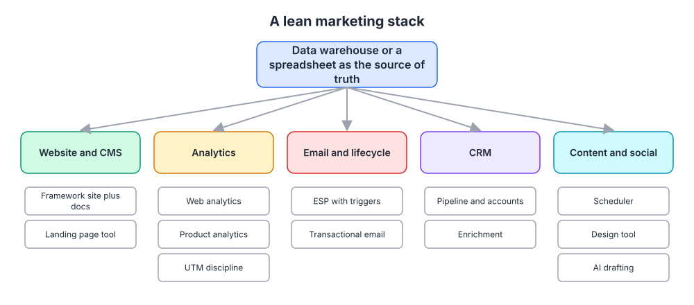
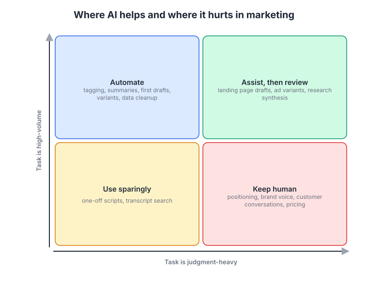
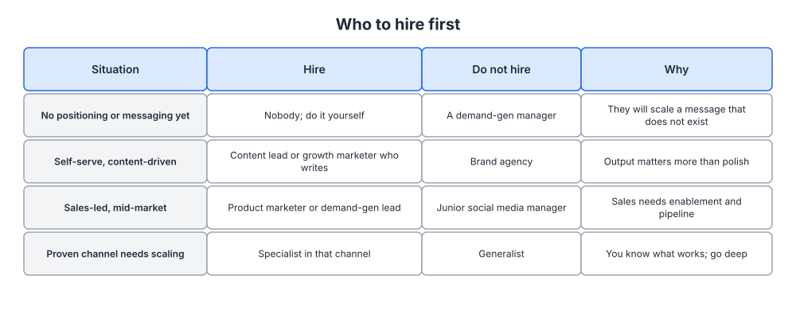

# Week 23: Tooling, automation, AI and your first marketing hires

> By the end of this week you will have a lean marketing stack with no redundant tools, three automations that give you hours back, written rules for using AI in your marketing, and a hiring plan that names the right first role.

**Time budget:** reading about 2.5 hours, videos about 2 hours, exercise 2 to 4 hours.

## What this week covers and why it matters for a founder

You are a technical founder, so tools are the part of marketing that feels like home. That is exactly the danger. It is easy to spend a month wiring together an impressive stack and still have no positioning that a customer could repeat back. Tools do not create demand. They reduce the cost of executing a plan that already exists, which is why this week comes after the plan (week 22).

The second thing that feels like home is AI. You can generate fifty landing page variants in an afternoon. Whether any of them should exist is a different question, and the answer depends on the messaging document you wrote in week 5 and the brand voice from week 7. AI is now part of every marketing stack, and used well it removes real drudgery. Used badly it produces a website that reads like everyone else's website and a blog that search engines have learned to ignore.

The third topic is people. At some point the five hours a week from week 22 are not enough and you hire. Founders routinely hire the wrong first marketer: a demand generation specialist when there is nothing yet to generate demand for, a brand agency when the company needs someone who writes, a junior social media manager when sales needs enablement. The right first hire depends on your motion (week 21) and your maturity, and this week gives you a way to decide.

Underneath all three is a discipline: write down how things are done. A playbook is what lets a freelancer, a new hire, or a future version of you execute the system without reinventing it.

Outputs: a stack inventory with one tool per job, three automations built or specified, an AI usage policy for your marketing, a first playbook, and a one-page hiring plan.

## Core concepts

### 1. A lean stack: one tool per job, one source of truth

A marketing stack has six jobs: website and content management, analytics, email and lifecycle, CRM, content and social production, and a place where the data comes together. Every tool you add should fill exactly one of these jobs. If two tools do the same job, one is redundant and the data in both will disagree within a month.



*The box at the top is the point: every other tool feeds one place where the numbers are reconciled, whether that is a warehouse or a spreadsheet.*

Website and CMS: for most technical founders a framework site with docs alongside it, plus a landing page tool for campaign pages if marketing needs to ship pages without an engineer. Analytics: one web analytics tool, one product analytics tool, and UTM discipline (week 18) so the two can be joined. Email: an email service provider with behavior triggers, and a separate transactional sender so deliverability problems in one do not sink the other (week 13). CRM: pipeline and accounts, with enrichment so forms can stay short. Content and social: a scheduler, a design tool, and an AI drafting tool. Source of truth: a warehouse if you have the engineering appetite, a spreadsheet if you do not. The spreadsheet is fine longer than you think.

HubSpot is the reference point for what an all-in-one looks like: CMS, CRM, email, analytics and automation in one product, which is convenient and which also means that its data model becomes your data model. The trade is speed now against flexibility later. Segment, PostHog and similar tools represent the other approach: instrument once, send events everywhere. The right choice depends on whether you expect to swap tools. Most early companies do, so keep the identity layer (who is this user, which account, which company) in something you control.

Two rules. Buy the cheapest tool that does the job for the next twelve months, not the one you would need at ten times your size. And before adding a tool, name the job it does and the tool it replaces; if it fills no job on the list, it is a toy.

The failure mode is the stack that grows by subscription. Each tool cost $50 a month and seemed reasonable; eighteen months later there are twenty-two of them, four collect signups, and nobody knows which count is right. Audit quarterly and cancel without sentiment.

### 2. Automation that gives a founder hours back

Automation in marketing is not a strategy. It is the removal of repeated manual steps so that the cadence from week 22 fits in the hours you have. The test for any automation is simple: does it save at least an hour a week, or does it prevent an error that costs a customer?

The high-value automations for an early software company are unglamorous. New signup: enrich the company, score against your week 3 ICP, route to the right lifecycle sequence, and above a threshold notify you so a founder email goes out the same day. Activation: when an account hits the week 17 milestone, switch it from onboarding to engagement emails; when it stalls for three days, send the one nudge your research says helps. Pipeline: when a known account views pricing three times, update the CRM record and post it to a channel you actually read. Dashboard: pull the six weekly rows automatically every Monday. Content: when a post is published, push it to your scheduler and newsletter draft.

Zapier and Make are the standard connectors for this work, and both let you build the above without an engineer, which matters because the founder's engineering time should go into the product. When something needs to be reliable at scale, move it to a proper integration, but start with the connector so you learn what the workflow should be before you harden it.

The failure mode is automating something that should not happen at all. A badly written onboarding sequence sent automatically is worse than no sequence, because it now reaches everyone. Automate only what you have done by hand at least ten times and know works. The second failure mode is silent breakage: a connector fails, nobody notices, and three weeks of signups never got an email. Every automation needs a weekly check, which can itself be a row on the dashboard.

### 3. Where AI helps, where it hurts, and the guardrails

The useful way to think about AI in marketing is by task type on two axes: how high-volume the task is and how much judgment it needs. High volume and low judgment is where you automate fully: tagging support tickets and interview notes by theme, summarizing call transcripts, cleaning data, producing first drafts of routine pages, generating ad and subject line variants for testing. High volume and high judgment is where AI assists and a human reviews: landing page drafts built from your messaging document, research synthesis across fifty interviews, competitive summaries. Low volume and low judgment is one-off scripts and transcript search, useful but not worth systematizing. Low volume and high judgment stays human: positioning, brand voice, customer conversations and pricing.



*The bottom-right box is the one to defend; positioning and customer conversations are where the founder's insight lives, and delegating them removes the one advantage you have.*

The mechanism behind the "keep human" box is that models produce the average of what has been written before. Positioning is by definition a claim that is not the average. Brand voice is a set of choices about what you will not say. Customer conversations are where you learn things that have not been written down yet. A model can help you organize all three after the fact; it cannot originate them, and if you let it, your company will sound like every other company that used the same tool.

Guardrails belong in a written policy. Accuracy: every factual claim, number, customer name and product capability in generated text is checked by a person against a source before publication, without exception. Sameness: generated drafts are rewritten in your voice chart from week 7 before they go out, and you run a test on yourself by reading the draft next to a competitor's page. Search quality: Google's guidance on helpful, people-first content is explicit that content made primarily to rank rather than to help is the problem, regardless of how it was produced; a thousand thin generated pages will eventually hurt the domain that hosts the good ones. Disclosure: decide in advance where you disclose generated content, and never let a model impersonate a person in a conversation with a customer. Data: do not paste customer data or unreleased plans into tools whose terms you have not read.

Where AI is genuinely strong for a founder is research synthesis. In week 2 you tagged interview quotes by hand; at fifty interviews that needs help. A model can cluster themes, pull representative quotes, and surface the "switch" stories you would have missed, and then you read the source quotes to confirm. This produces better positioning inputs; it does not produce the positioning.

The failure mode is volume as a strategy: publishing ten generated posts a week because you can. Search engines and readers both punish it, and it drains the brand you built in week 7. The second failure mode is the opposite, refusing to use these tools for drudgery on principle and burning founder hours on tagging tickets. Use the grid.

### 4. Playbooks: writing down how the work is done

A playbook is a document that lets someone other than its author execute a recurring marketing task to the same standard. The launch timeline from week 21 is a playbook. The weekly dashboard procedure from week 22 is a playbook. So is "how we publish a blog post," "how we run a four-week channel test," and "how we onboard a new customer for a case study."

PostHog's public handbook is the model worth studying: the company documents how marketing, sales, engineering and hiring work in the open, from how blog posts are reviewed to what the brand should never do. You do not need to publish yours, but you need it to exist. The structure of a good playbook is short: purpose, trigger (when does this run), steps with owners and time estimates, the template or checklist, and the definition of done. If it is longer than two pages, it is two playbooks.


*A board like this is the simplest content and campaign pipeline: columns for idea, brief, draft, review, scheduled and published, with a work-in-progress limit on the draft column. Source: [Wikimedia Commons](https://commons.wikimedia.org/wiki/File:Kanban_board_example.jpg)*

A kanban board is the operational companion to the playbooks. Content, launches and experiments move across columns, each card links to its playbook, and a work-in-progress limit stops the pattern where fifteen drafts are started and none is finished. Linear runs product work with this kind of discipline, and applied to marketing it is how a company of a few dozen people looks much larger from the outside.

Playbooks pay off when you hand work to a freelancer, when you make your first hire, and when you return to a task after three months. The failure mode is writing them before the process is stable. Document the third time you do something, not the first.

### 5. Your first marketing hire

The first hire depends on where you are, and the table below is the decision. If you have no positioning or messaging yet, hire nobody: do weeks 2 to 5 yourself, because a demand generation manager will scale a message that does not exist. If your motion is self-serve and content-driven, hire a content lead or a growth marketer who writes, not a brand agency; output matters more than polish at this stage. If your motion is sales-led mid-market, hire a product marketer or a demand generation lead who can build enablement and pipeline, not a junior social media manager. If one channel is proven and needs scaling, hire a specialist in that channel and go deep.



*Find your row by motion and maturity; the "do not hire" column exists because each of these is a common and expensive mistake.*

The examples support the pattern. Notion's first marketing leader came from running First Round Review's editorial operation, and its early marketing leaned on community, storytelling and templates rather than paid spend, which matched a self-serve product loved by a small group. Vercel built its marketing around developer relations, hiring engineers who could write and teach, because developers trust demonstrations over ads. Superhuman kept marketing founder-led for a long time, with the founder personally running the product-market fit survey and the waitlist. Linear stayed small deliberately and let product quality and a public changelog do work that would otherwise require a team.

A freelancer is right for a defined, repeated task with a playbook: paid campaign management, design, editing. An agency is right for a project with a clear brief and an end, such as a site rebuild, and wrong for strategy, because the strategy has to live in your head. A full-time hire is right when the work is continuous and needs context you cannot write down yet. Emily Kramer's advice at MKT1 is consistent on this: the first full-time marketer should be a generalist who can write, prioritize and ship, and who is comfortable being the whole team.

Interviewing marketers as a technical founder is hard because you cannot evaluate the craft directly. Three things work. Ask for things they shipped and what the numbers did afterward, then what they would do differently; vague answers are disqualifying. Give a take-home built from your real materials: here is our positioning document, rewrite our homepage hero and say how you would test it. And ask them to critique your current marketing; good marketers cannot help themselves, and you will learn whether they see what you see.

What good looks like in ninety days: they have read all of your week 2 research and talked to five customers themselves, they have shipped something measurable in the primary channel, the dashboard is being filled without you, and they have told you at least one thing you were wrong about. What bad looks like: a strategy deck, a request for a bigger budget, and no shipped work.

The failure mode is hiring for the company you want to be. A head of marketing with a large-team background will build a large team. If you need someone to write and ship, hire someone who writes and ships.

### 6. Hype cycles and tool churn

Every year brings a new category of marketing tool, and each follows a familiar path: inflated expectations, a trough when results disappoint, and eventually a plateau where the tool does a specific job well for the companies that need it.


*Buy on the plateau, experiment cheaply on the slope, and ignore the peak unless your ICP is literally the people at the peak. Source: [Wikimedia Commons](https://commons.wikimedia.org/wiki/File:Gartner_Hype_Cycle.svg)*

For a founder, the rule is to buy on the plateau and experiment on the slope. The tools that made it to the plateau (email, CRM, web analytics, search tools) are boring and reliable. The tools at the peak generate more content about themselves than results for their customers. Marketing automation went through this a decade ago; conversational marketing did; account-based marketing platforms did; AI content tools are on the curve now. None of those categories were worthless. All of them were oversold at the peak.

Tool churn has a cost beyond subscriptions: every migration loses data and breaks automations. Set a rule that a tool stays for at least a year unless it is failing at its job. The failure mode is the founder who treats the stack as a hobby. The stack is plumbing. Get it working, then go talk to customers.

## Videos

- [First marketing hires, Emily Kramer of MKT1 (interview)](https://www.youtube.com/watch?v=kWG-KvZaM8o)
  Why watch: the most practical guidance available on sequencing early marketing hires and what to expect from each, usually 45 to 60 minutes.
- [B2B brand and marketing, Dave Gerhardt (Exit Five)](https://www.youtube.com/watch?v=UB8ZJ01N3bk)
  Why watch: a former Drift and Privy marketing leader on running lean marketing teams and what founders should expect from a first marketer, roughly 30 to 45 minutes.
- [How to Improve Conversion Rates, Kevin Hale (Y Combinator)](https://www.youtube.com/watch?v=PGqX9fpweyc)
  Why watch: a reminder, before you automate or generate anything, that conversion comes from clarity and speed; about 25 minutes.
- [Tobi Lütke on Shopify and starting small (How I Built This)](https://www.youtube.com/watch?v=WxIO08ETcXQ)
  Why watch: a technical founder on building a company where tools serve merchants rather than the other way around, and on keeping the team small relative to its reach; length varies, usually about an hour.

## Recommended reading

- [MKT1 newsletter, Emily Kramer](https://newsletter.mkt1.co/). What to take from it: the posts on first marketing hires, marketing team structures and how to run marketing with a small team; read the archive on hiring before writing your plan.
- [Exit Five, Dave Gerhardt](https://www.exitfive.com/). What to take from it: a B2B marketing community where practitioners share what actually works in small teams; useful for calibrating what "good" looks like in a hire.
- [PostHog handbook](https://posthog.com/handbook). What to take from it: the marketing and brand sections as a template for your own playbooks, and the general principle of writing things down.
- [How to build a growth team, Andrew Chen](https://andrewchen.com/how-to-build-a-growth-team/). What to take from it: what a growth function is for, and why most early companies should not build one yet.
- [Growth Hacker is the new VP Marketing, Andrew Chen](https://andrewchen.com/how-to-be-a-growth-hacker-an-airbnbcraigslist-case-study/). What to take from it: the argument that early marketers need to be technical enough to build, which shapes what you look for in a first hire.
- [Startup Handbook, Julian Shapiro](https://www.julian.com/guide/startup/intro). What to take from it: a complete, opinionated view of a lean growth process you can hand to a first hire as shared vocabulary.
- [Creating helpful, reliable, people-first content (Google Search Central)](https://developers.google.com/search/docs/fundamentals/creating-helpful-content). What to take from it: the guardrail for any generated content; read the self-assessment questions and apply them to every draft.

## Hands-on exercise (2 to 4 hours)

**Deliverable:** a "how marketing runs here" page in your wiki with four parts: stack inventory, automations, AI policy, and a hiring plan, plus one complete playbook.

**Steps:**
1. (20 minutes) List every marketing tool you pay for or use. For each, write the job it does from the six-job list and the tool it replaces. Cancel anything that has no job or duplicates another tool.
2. (15 minutes) Draw your stack against the lean stack diagram and name your source of truth. If two tools disagree on signups today, decide which one wins.
3. (30 minutes) Pick three automations from the list in concept 2 that would save you the most time. Specify each as trigger, steps, output and the weekly check. Build at least one now with a connector tool.
4. (20 minutes) Write your AI policy on one page using the two-by-two: what is automated, what is assisted and reviewed, what stays human, plus the five guardrails (accuracy, sameness, search quality, disclosure, data).
5. (30 minutes) Write one playbook for a task you have done at least three times. Use the structure: purpose, trigger, steps with owners and time, template, definition of done. Set up a kanban board with the pipeline columns.
6. (20 minutes) Find your row in the first-hire table. Write the one-page hiring plan: role, why now or why not yet, freelancer versus full-time, the take-home exercise, and the ninety-day definition of good.
7. (15 minutes) Write the three interview questions you will ask, including the critique question.
8. (10 minutes) Set a quarterly reminder to audit the stack and cancel what is unused.

**Template:**

```
HOW MARKETING RUNS HERE

Stack (one tool per job)
| Job                 | Tool        | Replaces | Cost/month | Owner |
|---------------------|-------------|----------|------------|-------|
| Website and CMS     |             |          |            |       |
| Web analytics       |             |          |            |       |
| Product analytics   |             |          |            |       |
| Email and lifecycle |             |          |            |       |
| Transactional email |             |          |            |       |
| CRM and enrichment  |             |          |            |       |
| Content and social  |             |          |            |       |
| Source of truth     |             |          |            |       |

Automations
| Name          | Trigger            | Steps        | Output            | Weekly check |
|---------------|--------------------|--------------|-------------------|--------------|
| ICP routing   | new signup         |              |                   |              |
| Activation    | milestone reached  |              |                   |              |
| Dashboard     | Monday 8am         |              |                   |              |

AI policy
Automate: [tasks]      Assist then review: [tasks]      Keep human: [tasks]
Guardrails: accuracy (every claim checked), sameness (rewritten in voice chart),
search quality (people-first test), disclosure (where), data (what never goes in)

Hiring plan
Situation: [row from table]    First role: [role]    Not yet: [role]
Freelancer / agency / full-time: [choice and why]
Take-home: [task built from real materials]
Good at 90 days: [four observable outcomes]

PLAYBOOK: [name]
Purpose:  Trigger:  Steps (owner, time):  Template:  Done when:
```

**How to know it is good:**
- No two tools do the same job, and you can name the source of truth for signups and revenue.
- Each automation has a weekly check, and at least one is live.
- The AI policy names specific tasks in each box and someone else could apply it without asking you.
- The playbook could be followed by a freelancer tomorrow without a call.
- The hiring plan names a role, a reason, and a ninety-day definition of good, or states clearly why you are not hiring yet.

## Self-check

Answer these without looking back. If you cannot, reread the relevant section.

1. Name the six jobs in a marketing stack and the rule for adding a tool.
2. What is the test for whether an automation is worth building, and what must be true before you automate a sequence?
3. Describe the two axes of the AI grid and give one task for each of the four boxes.
4. Why does positioning belong in the "keep human" box? Explain the mechanism, not just the rule.
5. List the five guardrails for generated content.
6. What are the five parts of a playbook, and when should you write one?
7. For your motion and maturity, what is the right first hire and what is the tempting wrong one?
8. State the rule for buying tools relative to the hype cycle.

**You are done with this week when:**
- [ ] The stack inventory shows one tool per job and at least one cancellation.
- [ ] One automation is live with a weekly check, and two more are specified.
- [ ] The AI policy and one playbook are in the wiki.
- [ ] The hiring plan names a role and a ninety-day definition of good, or a dated decision not to hire yet.

## Next week

Week 24 is the capstone. You will assemble everything from weeks 1 to 23 into a single repeatable marketing system, audit each output, place yourself on a maturity model, diagnose your biggest problem with a fishbone diagram, and write the 90-day plan you will actually run.
