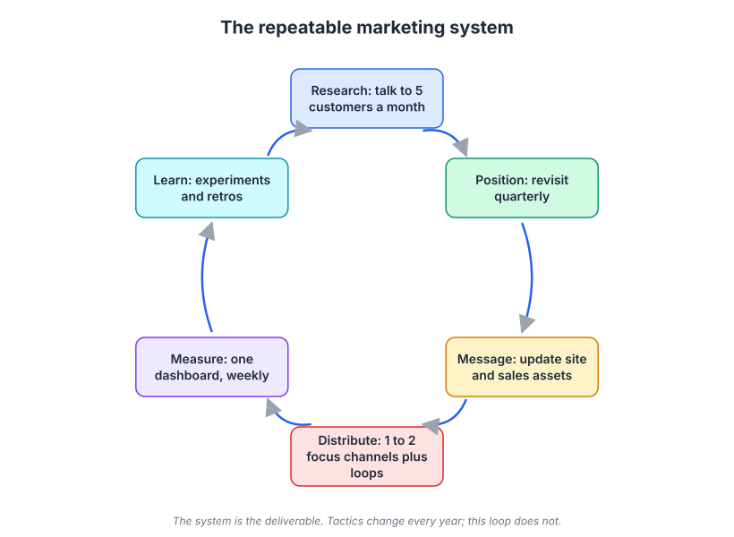
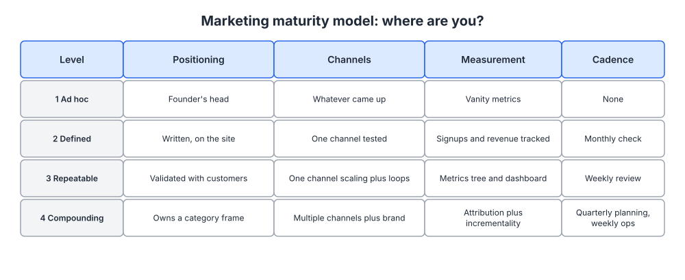
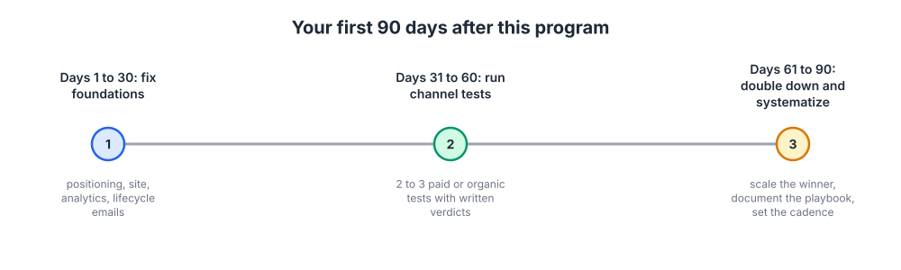

# Week 24: Capstone: your repeatable marketing system and 90-day plan

> By the end of this week you will have audited every artifact you produced in weeks 1 to 23, scored your marketing maturity honestly, diagnosed your biggest constraint, and written a 90-day plan you can start on Monday.

**Time budget:** reading about 2.5 hours, videos about 2 hours, exercise 3 to 4 hours.

## What this week covers and why it matters for a founder

Twenty-three weeks ago you could ship software and could not explain who your product was for in a sentence a stranger would repeat back. Since then you have interviewed customers, written an ICP, positioned the product, rewritten the site, picked channels, built a loop, instrumented the funnel, priced the thing, and set a cadence. You have a pile of documents. A pile of documents is not a marketing function.

This week turns the pile into a system. A system has a loop, an owner, a frequency and a measurement, and it keeps running while you are distracted by a production incident or a fundraise. Tactics rot: channels get more expensive, algorithms change, a competitor copies your comparison page. The loop that produced the tactic is what survives, which is why the real deliverable of this program was never "a landing page" but the ability to produce the right landing page again next quarter.

Most founders finish a program like this and change nothing, because the gap between knowing and operating is a scheduling problem rather than a knowledge problem. It looks like this: the positioning document is excellent and the website still says what it said two years ago, because nobody put "make the site match the positioning" on a calendar with a date and an owner. The audit below exists to catch that gap, output by output.

This week also teaches you to diagnose. When revenue is flat, founders reach for a tactic ("we should do more LinkedIn"). An experienced marketer asks which stage is broken first, because the fix for a traffic problem and the fix for an activation problem have nothing in common, and picking wrong costs a quarter.

Outputs: an audit of all 23 prior artifacts with a keep, fix or kill verdict on each, a maturity score across four dimensions, a cause and effect diagram for your biggest constraint, and a 90-day plan with owners and dates.

## Core concepts

### 1. The marketing system loop: research, position, message, distribute, measure, learn

Everything in this program fits into six activities that feed each other. Research tells you who has the problem and in what words they describe it. Positioning decides which market you compete in and why you win it. Messaging turns that into language. Distribution puts the language in front of people through channels and loops. Measurement tells you what happened. Learning feeds back into research, and the loop turns again.



*The loop, not any single stage, is what this program was building; note the frequency written beside each stage, because a stage with no frequency is a stage that silently stops.*

The stages run at different speeds. Research runs monthly, and five customer conversations a month is enough to keep your model of the market accurate; it is the habit founders drop first. Positioning is reviewed quarterly and changed rarely, because positioning that changes every quarter was never validated. Messaging updates when positioning changes or when the same objection appears three times in sales calls. Distribution, measurement and experiment verdicts run weekly. The full retro runs quarterly.

Each stage has a failure mode that surfaces downstream and gets misdiagnosed. Skip research and your messaging becomes a description of your feature list, which converts badly and gets blamed on the landing page. Skip positioning and every channel underperforms, because you pay to reach people who compare you against the wrong alternatives. Skip measurement and you keep funding the channel that feels good. Skip learning and you run the same experiment three times in eighteen months.

Basecamp shows the loop running slowly and well: positioning held for years, messaging in a voice nobody else uses, distribution mostly through the founders' own writing, and a refusal to chase channels. Notion shows it running fast on distribution while positioning stayed still: the all-in-one workspace frame did not move while template galleries, ambassadors and community distribution were built on top of it. What does not work is changing the positioning every time distribution disappoints.

The test for whether you have a loop: name the date of your last customer conversation, the date positioning was last reviewed, the date the dashboard was last filled in, and the date of your last written experiment verdict. If any is more than a quarter old, that stage is not running, whatever the document says.

### 2. Maturity: an honest self-assessment on four dimensions

Knowing where you are stops you doing the wrong good thing. Attribution modeling is real work and it is the wrong work for a company whose positioning still lives in the founder's head. Four dimensions matter for a software company, and you can sit at different levels on each.



*Score each row separately and be strict; most companies are a level lower than the founder thinks, because the founder grades the document rather than what a new employee would find.*

Level 1, ad hoc: positioning lives in your head and shifts with the audience, channels are whatever came up, metrics are visits and followers, there is no cadence. Level 2, defined: positioning is written and on the site, one channel has had a proper test, signups and revenue are tracked, someone looks monthly. Level 3, repeatable: positioning is validated by customers who repeat it back, one channel is scaling with a loop feeding it, there is a metrics tree and a weekly dashboard, and the weekly review happens. Level 4, compounding: you own a category frame in your buyers' language, several channels plus brand work together, you measure attribution and incrementality, and quarterly planning sits above weekly operations.

The rule is to lift your lowest dimension before advancing your highest. A company at level 3 on channels and level 1 on positioning is spending efficiently on the wrong message, and every extra dollar makes the mismatch more expensive. Superhuman is the clean example of fixing the lowest dimension first: before scaling distribution, the team built a survey and a process to find who the product was genuinely essential for, narrowed product and message to those people, and only then opened the funnel.

Two honest tests. For positioning, ask three recent customers what your product does and who it is for; three different answers means level 1 or 2 whatever the document says. For cadence, open your calendar and look for the recurring slot; no slot means you are not level 3.

Be suspicious of level 4 ambitions at small scale. Incrementality tests, brand tracking and multi-touch attribution need volume to produce signal. Below a few thousand conversions a year they produce expensive noise, and the honest substitutes are the self-reported attribution question on your signup form and a holdout if you can build one.

### 3. The audit: what weeks 1 to 23 produced and the verdict on each

An audit is not a check that you did the homework. It checks whether each artifact is current, true and in use. Three verdicts only: keep (accurate and used), fix (right idea, out of date or never implemented), kill (wrong, or something you will never actually run).

Go in order. Week 1 produced the diagnosis of what was broken; reread it, because seeing which problems you actually solved is the most useful half hour of this week. Week 2 produced five interviews and an insight summary, and the test is the date, since research older than six months describes a market that has moved. Week 3 produced the ICP and target list; check it against who actually paid, because revenue is a better ICP source than a workshop. Week 4 produced the positioning document; check that customers repeat it and the homepage matches it.

Weeks 5 to 8 produced the messaging document and objection map, the rewritten hero and landing page, the brand guide with a voice chart, and the strategic narrative with a case study. The failure here is drift: the messaging document, the site, the deck and the onboarding emails each say something slightly different. Read them side by side and make one match the other.

Weeks 9 to 15 produced the channel hypothesis doc, the content strategy and calendar, the keyword map and technical checklist, the paid unit economics model and test plan, the lifecycle map and onboarding sequence, the point-of-view doc and posting plan, and the community or partnership plan. Audit these on evidence, not intent. For each channel: did it get a real test, what was the written verdict, is it running now? Channels with no written verdict are the biggest source of wasted years, because they get retried on feel.

Weeks 16 to 19 produced the growth loop with measured throughput, the activation definition and retention curves, the metrics tree and dashboard, and the ICE-scored experiment backlog. Weeks 20 and 21 produced the value metric and three-tier packaging, and the GTM motion, launch plan and lead definitions. Weeks 22 and 23 produced the annual plan with quarterly bets and cadence, and the stack decision, automation list and hiring plan. Test each one: does the loop still run at the throughput you measured, has the retention curve flattened, was the dashboard filled in last week, did the packaging ship, did the calendar slots survive a busy month?

The output is not a report. It is a list of fix items with owners and dates, which becomes the raw material for the 90-day plan. Anything marked fix that gets no date should be honestly re-marked kill.

### 4. Diagnosis: find the constraint, then decide whether to experiment or follow a playbook

When a number is bad, the useful question is not "what should we try" but "which causes could produce this effect, and which one is present." The Ishikawa or fishbone diagram is the simplest tool: effect at the head, cause categories hanging off the spine, evidence gathered on each bone before you touch a tactic.


*The value is in the categories, which force you to consider causes outside the area you were already thinking about. Source: [Wikimedia Commons](https://commons.wikimedia.org/wiki/File:Ishikawa_Fishbone_Diagram.svg)*

Six bones cover nearly everything in software marketing: audience (wrong people arriving), message (right people, unclear or unbelievable claim), product (people arrive, try, never reach value), channel (the reach mechanism is broken or too expensive), pricing and packaging (value understood, price or tier structure blocks the purchase), and measurement (the number is wrong and nothing is broken). Keep measurement on the list, because a surprising share of emergencies are tracking regressions. Before the war room, check whether the tag fired.

Take a common case: signups up, paid conversions flat. Audience: has the traffic mix shifted outside the week 3 ICP? Message: did the page change, and does self-reported attribution show people arriving with a different expectation? Product: has the week 17 activation rate moved for recent cohorts? Channel: is a new source sending high-volume, low-intent traffic? Pricing: did a competitor move, or did a new tier make staying free comfortable? Measurement: did an experiment, a consent banner or a domain change break events? Fix one bone at a time, or you learn nothing. Week 18's warning about Simpson's paradox applies: an aggregate can fall while every segment inside it rises, purely from mix.

Once you know the constraint, decide what kind of problem it is. Founders waste effort running creative experiments on problems solved years ago, and equally waste effort copying playbooks for problems nobody has solved in their market.


*Different domains need different responses: best practice in the clear domain, expertise in the complicated domain, small probes in the complex domain. Source: [Wikimedia Commons](https://commons.wikimedia.org/wiki/File:Cynefin_as_of_1st_June_2014.png)*

Complicated problems have known answers that require expertise to apply. Technical SEO is complicated: crawlability, canonical tags, internal linking and speed have documented right answers. Email deliverability is complicated: authenticate the domain, honor unsubscribes, warm up sending, follow the bulk sender rules. Most signup friction is complicated, because the usability literature answered it. Read the manual, buy the expertise, spend your creativity elsewhere.

Complex problems have no reliable answer in advance, because the outcome depends on your market, product and moment. Which message resonates with your ICP is complex. Which channel pays back durably for your product is complex. Whether a free tier expands or cannibalizes paid is complex. Here you probe: small, cheap, time-boxed tests with a cap on spend, and you let the answer emerge. Before starting any work, ask whether a competent practitioner would already know the answer. If yes, find the playbook. If no, design the smallest test that would change your mind.

Both errors cost the same. Treating a complicated problem as complex means A/B testing your way to something Google documented. Treating a complex problem as complicated means copying a growth playbook from a company with a different product, price and buyer, then concluding that marketing does not work. Much of what is sold as a playbook is a complex answer dressed as a complicated one: Airbnb's founders photographing listings by hand is a lesson about unscalable work, not a channel you can copy.

### 5. The 90-day plan: fix, test, then systematize

Ninety days is the right unit because it is long enough to see a channel test through and short enough that you cannot defer everything to the end. Run three blocks in sequence, not in parallel.



*The order matters more than the content: fixing foundations first means the tests in month two are testing a channel rather than testing a bad landing page.*

Days 1 to 30, fix foundations. Take the fix items everything else depends on: make the homepage match the positioning document, repair tracking so the dashboard is trustworthy, ship the week 13 onboarding sequence, close the week 17 activation gap. These are unglamorous and they multiply the value of everything after them.

Days 31 to 60, run channel tests. Pick two channels from your week 9 hypotheses and write each test plan before starting: budget or hours, duration, the deciding metric, and the threshold that counts as a pass. Four weeks is usually the minimum for anything with a sales cycle, so start both on day 31 rather than staging them. Keep everything else at maintenance level; a test month is not a reason to stop publishing or stop talking to customers.

Days 61 to 90, double down and systematize. Write the verdicts. Move budget to whatever passed, using the week 22 reallocation rules. Then write the playbook for the winning channel: steps, frequency, templates, owner, and the metric that says it is healthy. Founders skip this step, and it is the one that makes next quarter cheaper and lets a first hire or a freelancer produce the same output without your attention.

Set constraints at the start. Cap active initiatives at three. Name one owner each, even when the owner is always you. Put the weekly review in the calendar for all thirteen weeks before the quarter begins. Write one sentence per block stating what you will have learned by its end, because the plan exists to produce decisions rather than activity. The failure mode is a wish list with no dates; the fix is to write it as thirteen weeks, each with what ships and what gets decided.

## Videos

- [How to Succeed with a Startup, Sam Altman (Y Combinator, 2018)](https://www.youtube.com/watch?v=0lJKucu6HJc)
  Why watch: about 20 minutes on what separates companies that work from ones that do not, a useful calibration before planning a quarter.
- [The single biggest reason why start-ups succeed, Bill Gross (TED, 2015)](https://www.ted.com/talks/bill_gross_the_single_biggest_reason_why_start_ups_succeed)
  Why watch: six minutes arguing that timing dominates the other factors, a counterweight to the belief that execution alone decides outcomes.
- [Trial, error and the God complex, Tim Harford (TED, 2011)](https://www.ted.com/talks/tim_harford_trial_error_and_the_god_complex)
  Why watch: about 18 minutes on why complex problems yield to iteration rather than expert certainty, which is the argument behind concept 4.
- [The riddle of experience vs. memory, Daniel Kahneman (TED, 2010)](https://www.ted.com/talks/daniel_kahneman_the_riddle_of_experience_vs_memory)
  Why watch: 20 minutes on the gap between what people experience and what they remember and report, which is why survey answers and usage data disagree.
- [Steve Jobs, 1997 internal talk on marketing and values](https://www.youtube.com/watch?v=keCwRdbwNQY)
  Why watch: seven minutes on deciding what your company stands for before deciding what to say, and the clearest short case for clarity over feature lists.

## Recommended reading

- [Do Things That Don't Scale, Paul Graham](https://paulgraham.com/ds.html). What to take from it: reread it now that you have a system, because the manual, unscalable work is what feeds the system with real customer knowledge.
- [The only thing that matters, Marc Andreessen](https://pmarchive.com/guide_to_startups_part4.html). What to take from it: market pull dominates, and no marketing system rescues a product nobody wants.
- [Traction vs Growth, Brian Balfour](https://brianbalfour.com/essays/traction-vs-growth). What to take from it: the difference between a first burst of users and something that compounds, which is the move your 90-day plan has to make.
- [Building Your Company's Vision, Collins and Porras (HBR, 1996)](https://hbr.org/1996/09/building-your-companys-vision). What to take from it: separating what you hold constant from what changes constantly, the same split as loop versus tactic.
- [1,000 True Fans, Kevin Kelly](https://kk.org/thetechnium/1000-true-fans/). What to take from it: the math showing a modest number of committed customers can carry a real business, which should shape how narrowly you aim.
- [Lenny's Newsletter](https://www.lennysnewsletter.com/). What to take from it: benchmarks, teardowns and practitioner interviews; use it for calibration rather than instructions.
- [Growth Unhinged, Kyle Poyar](https://www.growthunhinged.com/). What to take from it: current data on product-led growth, pricing and go-to-market motions, with enough numbers to sanity check your own.
- [First Round Review](https://review.firstround.com/). What to take from it: long operational interviews with people who have run the function you are building; read by topic when you hit a specific problem.

## How to keep learning after this program

Marketing changes at the surface and stays stable underneath. Buying behavior, attention and trust work roughly as they did twenty years ago; channels, tools and formats churn constantly. Split your learning the same way: most of your time on the durable layer, and sample the surface layer only when you are about to act on it.

Weekly, three or four sources are enough. [Lenny's Newsletter](https://www.lennysnewsletter.com/) for benchmarks, [MKT1](https://newsletter.mkt1.co/) for how marketing teams are built and run, [Growth Unhinged](https://www.growthunhinged.com/) for pricing and go-to-market data, and [Marketing Examples](https://marketingexamples.com/) for short copy teardowns that keep your eye trained. Treat [Brian Balfour's essays](https://brianbalfour.com/essays) and [Andrew Chen's essays](https://andrewchen.com/) as archives to mine, not feeds to follow.

Pick one community where the members do your job: [Exit Five](https://www.exitfive.com/) for B2B marketing, [Indie Hackers](https://www.indiehackers.com/) for small software businesses, [CMX](https://www.cmxhub.com/) if community is your channel, [Heavybit's library](https://www.heavybit.com/library/) if you sell to developers. One active community beats five you lurk in.

Take courses when you need a specific competence, not as general study. [Reforge](https://www.reforge.com/) for growth and product marketing depth, [CXL Institute](https://cxl.com/institute/) for conversion and experimentation rigor, [Y Combinator Startup School](https://www.startupschool.org/) and the [YC Library](https://www.ycombinator.com/library) for founder fundamentals, [Wharton's Introduction to Marketing](https://www.coursera.org/learn/wharton-marketing) for the academic frame, and the free vendor academies for tool skill: [HubSpot Academy](https://academy.hubspot.com/courses/inbound-marketing), [Ahrefs Academy](https://ahrefs.com/academy) and [Google Skillshop](https://skillshop.withgoogle.com/).

Read books by problem, not by list. Positioning: [April Dunford](https://www.aprildunford.com/), [Crossing the Chasm](https://en.wikipedia.org/wiki/Crossing_the_Chasm) and [Positioning](https://en.wikipedia.org/wiki/Positioning_(marketing)). Research: [The Mom Test](https://www.momtestbook.com/) and [Know Your Customers' Jobs to Be Done](https://hbr.org/2016/09/know-your-customers-jobs-to-be-done). Messaging: [Made to Stick](https://heathbrothers.com/books/made-to-stick/) and [Building a StoryBrand](https://storybrand.com/). Brand: [Ehrenberg-Bass research](https://www.marketingscience.info/) and [The Brand Gap](https://www.slideshare.net/coolstuff/the-brand-gap). Growth and analytics: [Lean Analytics](https://leananalyticsbook.com/) and [Trustworthy Online Controlled Experiments](https://experimentguide.com/). Product-led growth: [Product-Led Growth](https://productled.com/). Sales: [Founding Sales](https://www.foundingsales.com/) and [Predictable Revenue](https://predictablerevenue.com/). Persuasion: [Influence](https://www.influenceatwork.com/) and [Hooked](https://www.nirandfar.com/hooked/).

Two habits matter more than any source. Read one primary source a month instead of ten summaries, because summaries copy each other and drop the conditions under which the advice held. And write up what you learn in your own words applied to your own company; the note is worth more than the article.

## Hands-on exercise (3 to 4 hours)

**Deliverable:** one document in your wiki called "Marketing System" containing the audit table for weeks 1 to 23, your maturity scores, a fishbone for your top constraint, and a 90-day plan broken into thirteen weeks.

**Steps:**
1. (45 minutes) Fill in the audit table below for all 23 artifacts: where it lives, when it was last updated, a keep, fix or kill verdict, and one line of reasoning. Do not fix anything yet.
2. (15 minutes) Score yourself 1 to 4 on positioning, channels, measurement and cadence. Write one sentence of evidence per score and name your lowest dimension.
3. (20 minutes) Run the two honest tests: ask three recent customers what the product does and who it is for, and check whether the weekly review slot exists and was kept in the last four weeks.
4. (30 minutes) State your biggest constraint as an effect ("trials do not convert"). Draw the six-bone fishbone, write the evidence for or against each cause, and finish with one named constraint plus what would confirm it.
5. (10 minutes) Classify your next three pieces of work as complicated (find the playbook, write down where it is) or complex (write the test and its spend cap).
6. (45 minutes) Write the 90-day plan in three blocks: foundations, two channel tests with pass thresholds, then verdicts, budget moves and one written playbook. Maximum three active initiatives at a time.
7. (20 minutes) Break it into thirteen rows, one per week, each with what ships and what gets decided. Rescope anything that does not fit the hours you actually have.
8. (15 minutes) Put every recurring slot in the calendar for the whole quarter, then pick your three learning sources and unsubscribe from the rest.

**Template:**

```
MARKETING SYSTEM, [company], [date]

AUDIT
| Week | Artifact                                   | Location | Last updated | Verdict | Note |
|------|--------------------------------------------|----------|--------------|---------|------|
| 1    | Marketing diagnosis                        |          |              |         |      |
| 2    | Customer interviews + insight summary      |          |              |         |      |
| 3    | ICP + target list                          |          |              |         |      |
| 4    | Positioning document                       |          |              |         |      |
| 5    | Messaging doc + objection map              |          |              |         |      |
| 6    | Homepage hero + landing page               |          |              |         |      |
| 7    | Brand guide + voice chart                  |          |              |         |      |
| 8    | Strategic narrative + case study           |          |              |         |      |
| 9    | Channel hypothesis doc + scheduled tests   |          |              |         |      |
| 10   | Content strategy + 12-week calendar        |          |              |         |      |
| 11   | Keyword map + technical checklist          |          |              |         |      |
| 12   | Unit economics model + paid test plan      |          |              |         |      |
| 13   | Lifecycle map + onboarding sequence        |          |              |         |      |
| 14   | Point-of-view doc + posting plan           |          |              |         |      |
| 15   | Community or partnership plan              |          |              |         |      |
| 16   | Growth loop + measured throughput          |          |              |         |      |
| 17   | Activation definition + retention curves   |          |              |         |      |
| 18   | Metrics tree + weekly dashboard            |          |              |         |      |
| 19   | ICE-scored experiment backlog + first test |          |              |         |      |
| 20   | Value metric + three-tier packaging        |          |              |         |      |
| 21   | GTM motion + launch plan + lead definitions|          |              |         |      |
| 22   | Annual plan + quarterly bets + cadence     |          |              |         |      |
| 23   | Stack decision + automations + hiring plan |          |              |         |      |

MATURITY (1 ad hoc, 2 defined, 3 repeatable, 4 compounding)
Positioning: __  Channels: __  Measurement: __  Cadence: __
Evidence for each: ...
Lowest dimension to lift this quarter: ...

DIAGNOSIS
Effect: ...
Audience: ...  Message: ...  Product: ...
Channel: ...   Pricing: ...  Measurement: ...
Named constraint: ...  Confirming evidence: ...
Complicated (playbook) or complex (experiment): ...

90-DAY PLAN
Days 1 to 30, fix foundations: [3 items, owner, date]
Days 31 to 60, channel tests: [2 tests, budget/hours, duration, pass threshold]
Days 61 to 90, double down: [verdicts, budget moves, playbook to write]
Week by week: W1 ... W13 (what ships / what gets decided)
Calendar: weekly review [day/time], monthly budget review, 5 customer calls/month, day 90 retro
```

**How to know it is good:**
- Every one of the 23 artifacts has a verdict and a location, and every "fix" appears in the plan with a date and an owner.
- Your maturity scores are backed by evidence a skeptical person would accept, not by the existence of a document.
- The fishbone ends with one named constraint and confirming evidence, not six things to try.
- The plan has at most three active initiatives at a time and fits the hours you actually have.
- Someone else could read the document and run next quarter's marketing without asking you a question.

## Self-check

Answer these without looking back. If you cannot, reread the relevant section.

1. Name the six stages of the marketing system loop and the frequency each should run at.
2. What happens downstream when you skip the research stage, and how does the symptom usually get misdiagnosed?
3. Describe the four maturity levels for positioning, and state the rule about which dimension to work on first.
4. What are the two honest tests for whether you are really at level 3?
5. Name the six cause categories on the marketing fishbone, and explain why measurement belongs on the list.
6. Give an example of a complicated marketing problem and a complex one, and say how the response differs.
7. Why must the foundation fixes come before the channel tests in a 90-day plan?
8. Which of your 23 artifacts is most out of date, and what does leaving it that way cost you?

**You are done with this week when:**
- [ ] All 23 artifacts are audited with a verdict and a location.
- [ ] Maturity is scored on four dimensions with written evidence and a named lowest dimension.
- [ ] Your top constraint is diagnosed with a fishbone and confirmed with evidence.
- [ ] The 90-day plan is written week by week and every recurring slot is on the calendar.

## What actually mattered

Twenty years in, here is the short list of what held up. It is shorter than you would expect.

Talking to customers was the highest return activity in every company, every year. Not surveys, not dashboards, conversations. Every positioning decision that worked, every headline that converted, every pricing change that stuck came from something a customer said in their own words. Founders who kept doing this after it stopped being novel had a permanent advantage over the ones who delegated it.

Narrowing worked and it always felt wrong. Every time a company picked a narrower audience, revenue went up, and every time the decision was argued about first because it looked like shrinking the market. You cannot be interesting to everyone on the budget you have.

Clarity beat cleverness by a wide margin. Plain sentences saying what the product does, who it is for, and what changes. The clever headline gets compliments from other marketers; the plain one gets signups. If a smart outsider cannot repeat what you do after ten seconds on your homepage, nothing else on the page matters.

Consistency over years beat intensity over weeks. The companies that won attention published steadily through the quarters when nobody was watching. The big swing usually produced a spike and nothing else. Compounding is slow and boring and it is the only mechanism that ends with a channel you own rather than rent.

Almost nothing worked the first time. The first landing page, ad set, email sequence and webinar were all mediocre. What separated companies was how fast they reached the second and third version, and whether they wrote down what they learned in between.

Distribution deserved as much thought as the product. Technical founders underinvest here and then conclude marketing does not work for their product. Nothing sells itself; the products that looked like they did had distribution designed into them deliberately, which is what week 16 was about.

Most metrics were noise. A few mattered: activation, retention by cohort, payback period, revenue. If a number would not change a decision, stop reporting it.

Brand was real, slow, and showed up as things being easier: lower acquisition cost, shorter sales cycles, people already knowing who you were. You cannot attribute it cleanly and you can feel it. Do not cut it because a spreadsheet cannot see it, and do not spend on it before you have positioning worth remembering.

Saying no separated good marketers from busy ones. The conference booth, the rebrand, the fourth channel, the podcast: each defensible alone, together a quarter with nothing finished.

And the people who got good at this wrote things down. Predictions before tests, verdicts after them, what the customer said in their own words, why a decision was made. Memory reshapes what happened to fit what you now believe. The written record is what turns twenty years of activity into twenty years of experience, and it is the difference between a founder who has run marketing for five years and one who has run year one five times.

## Next week

There is no week 25. From here you run the loop: research monthly, review positioning quarterly, distribute and measure weekly, hold the retro at day 90, then write the next 90-day plan the week after this one ends. Audit the artifacts again in two quarters, and reread your week 1 diagnosis once a year to see how much of it you actually fixed.
